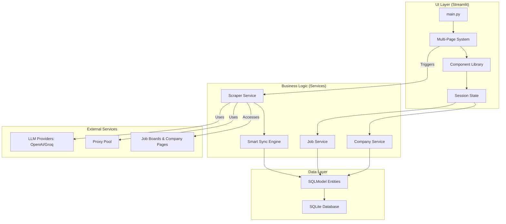

# 🕵️‍♂️ AI Job Scraper: Your Modern, Privacy-First Job Hunting Co-Pilot


[](https://choosealicense.com/licenses/mit/)
[](https://github.com/BjornMelin)
[](https://www.linkedin.com/in/bjorn-melin/)

AI Job Scraper is a modern, open-source Python application designed to automate and streamline your job search for roles in the AI and Machine Learning industry. It automatically scrapes job postings from top AI companies, filters for relevant roles, and provides a powerful, interactive Streamlit dashboard to track and manage your applications—all while ensuring your data remains private and stored locally.

## ✨ Key Features

* **🤖 Agentic & Hybrid Scraping:** Utilizes `ScrapeGraphAI` and `LangGraph` for intelligent, prompt-based scraping of company career pages and `JobSpy` for high-speed scraping of major job boards.

* **⚡ High-Performance Backend:** Employs a library-first approach with `SQLModel` for the database, a `SmartSyncEngine` to prevent data loss, and optimized background tasks for a non-blocking UI.

* **🎨 Modern, Interactive UI:** A fully-featured Streamlit dashboard with real-time progress updates, advanced filtering, application status tracking, and a responsive, card-based job browser.

* **🏢 Dynamic Company Management:** Easily add, edit, and toggle companies for scraping directly from the UI.

* **🛡️ Robust & Resilient:** Built-in proxy rotation, user-agent randomization, and automatic retries to handle bot detection and network errors gracefully.

* **🐳 Docker Ready:** Comes with a multi-stage `Dockerfile` and `docker-compose.yml` for easy, secure, and repeatable deployments.

* **🔒 Privacy-First:** All your data, notes, and application statuses are stored in a local SQLite database. No personal data ever leaves your machine.

## 🏗️ Architecture

The application is built on a modern, component-based architecture that separates concerns for maintainability and scalability.



## 🚀 Getting Started

### Prerequisites

* Python 3.12+

* `uv` (or `pip`) Python package manager

* (Optional) Docker for containerized deployment

* (Optional) OpenAI or Groq API key for LLM-powered scraping

### Installation & Running

1. **Clone the repository:**

    ```bash
    git clone https://github.com/BjornMelin/ai-job-scraper.git
    cd ai-job-scraper
    ```

2. **Install dependencies with `uv`:**

    ```bash
    uv sync
    ```

3. **Set up your environment:**
    Copy the `.env.example` file to `.env` and add your API keys.

    ```bash
    cp .env.example .env
    # nano .env
    ```

4. **Initialize and seed the database:**
    This creates the `jobs.db` file and populates it with a curated list of top AI companies.

    ```bash
    uv run python -m src.seed seed
    ```

5. **Run the Streamlit application:**

    ```bash
    streamlit run src/main.py
    ```

6. **Open your browser** and navigate to `http://localhost:8501`.

For more detailed instructions, including Docker deployment, see the full **[Getting Started Guide](./docs/user/getting-started.md)**.

## 📚 Documentation Hub

* **[User Guide](./docs/user/user-guide.md):** Learn how to use all the features of the application.

* **[Developer Guide](./docs/developers/developer-guide.md):** Understand the architecture and how to contribute.

* **[Deployment Guide](./docs/developers/deployment.md):** Instructions for deploying the app to production.

## 🙌 Contributing

Contributions are welcome! Please fork the repository, create a feature branch, and open a pull request. See the [Developer Guide](./docs/developers/developer-guide.md) for more details on setting up your environment and our coding standards.

## 📃 License

This project is licensed under the MIT License - see the [LICENSE](LICENSE) file for details.
