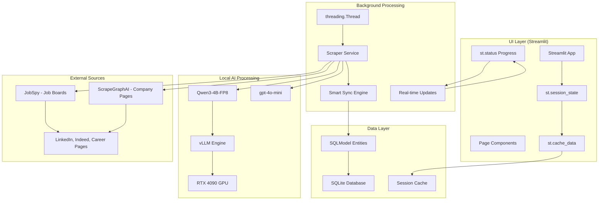

# 🕵️‍♂️ AI Job Scraper: Local-First, Privacy-Focused Job Search


[](https://choosealicense.com/licenses/mit/)
[](https://github.com/BjornMelin)
[](https://www.linkedin.com/in/bjorn-melin/)

AI Job Scraper is a modern, open-source Python application designed to automate and streamline your job search for roles in the AI and Machine Learning industry. Built with **local-first AI processing** using Qwen/Qwen3-4B-Instruct-2507-FP8, it automatically scrapes job postings from top AI companies and provides a powerful Streamlit interface—all while ensuring your data remains completely private and local.

## ✨ Key Features

* **🤖 Local-First AI Processing:** Utilizes Qwen/Qwen3-4B-Instruct-2507-FP8 with FP8 quantization on RTX 4090 for fast, private job analysis
* **⚡ Hybrid Scraping Strategy:** Combines `ScrapeGraphAI` for intelligent company page scraping with `JobSpy` for structured job board data
* **🎨 Streamlit Native UI:** Modern, responsive interface with real-time updates via st.session_state and threading
* **🚀 Non-Blocking Background Tasks:** Real-time progress tracking with st.status while maintaining UI responsiveness
* **⚡ High-Performance Caching:** st.cache_data for <100ms filter operations on 5000+ job records
* **🏢 Smart Database Sync:** Intelligent synchronization engine that preserves user data during updates
* **🛡️ Privacy-First Architecture:** All processing happens locally - no personal data leaves your machine
* **🐳 Docker Ready:** Complete containerization with GPU support for one-command deployment

## 🏗️ Architecture

### **Local-First AI Processing**
- **Local LLM:** Qwen/Qwen3-4B-Instruct-2507-FP8 with FP8 quantization
- **Cloud Fallback:** gpt-4o-mini for complex tasks (>8K tokens)
- **Hardware:** RTX 4090 Laptop GPU (16GB VRAM) with 90% utilization
- **Inference:** vLLM >=0.6.2 with CUDA >=12.1 support

### **Technology Stack**
- **Backend:** Python 3.12+, SQLModel, threading-based background tasks
- **Frontend:** Streamlit with native caching (st.cache_data)
- **Database:** SQLite (current) → Polars + DuckDB (scaling path)
- **Deployment:** Docker + Docker Compose with GPU support

### **Key Performance Metrics**
- **Responsiveness:** <100ms UI filter operations via st.cache_data
- **Scalability:** Handles 5,000+ job records efficiently
- **Real-time Updates:** Non-blocking progress with st.rerun() + session_state
- **Memory Efficiency:** FP8 quantization for optimal GPU utilization



## 🚀 Quick Start

### **Requirements**
- **GPU:** RTX 4090 Laptop GPU with 16GB VRAM
- **Software:** CUDA >=12.1, Python 3.12+
- **Tools:** Docker + Docker Compose, uv package manager

### **Installation**

1. **Clone the repository:**
    ```bash
    git clone https://github.com/BjornMelin/ai-job-scraper.git
    cd ai-job-scraper
    ```

2. **Install dependencies with uv:**
    ```bash
    uv sync
    ```

3. **Set up environment variables:**
    ```bash
    cp .env.example .env
    # Edit .env with your API keys (optional for local-only mode)
    ```

4. **Initialize the database:**
    ```bash
    uv run python -m src.seed seed
    ```

5. **Start the application:**
    ```bash
    uv run streamlit run src/app.py
    ```

6. **Open your browser** and navigate to `http://localhost:8501`

### **Docker Deployment**

For containerized deployment with GPU support:

```bash
# Build and run with Docker Compose
docker-compose up --build

# Or run with GPU support
docker run --gpus all -p 8501:8501 ai-job-scraper
```

## 📊 Performance

Our architecture delivers production-ready performance:

- **5,000+ job records** handled efficiently with current stack
- **<100ms filter operations** via Streamlit native caching
- **Real-time progress updates** during background scraping
- **90% GPU utilization** with FP8 quantization optimization
- **Non-blocking UI** with threading-based background tasks

## 🔧 Configuration

### **Local LLM Setup**
The application uses Qwen/Qwen3-4B-Instruct-2507-FP8 for local processing:
- Automatic model download on first run
- FP8 quantization for memory efficiency
- RTX 4090 optimized configuration
- Fallback to gpt-4o-mini for complex tasks

### **Scaling Path**
When you need more performance:
- **Database:** SQLite → Polars + DuckDB
- **Caching:** Session-based → Persistent cache layers
- **UI:** Enhanced components and optimization

## 📚 Documentation

* **[Product Requirements Document (PRD)](./docs/PRD.md):** Complete feature specifications and technical requirements
* **[User Guide](./docs/user/user-guide.md):** Learn how to use all application features
* **[Developer Guide](./docs/developers/developer-guide.md):** Architecture overview and contribution guidelines
* **[Deployment Guide](./docs/developers/deployment.md):** Production deployment instructions

## 🛠️ Development

Built with modern Python practices:

- **Package Management:** uv (not pip)
- **Code Quality:** ruff for linting and formatting
- **Testing:** pytest with >80% coverage target
- **Architecture:** KISS > DRY > YAGNI principles
- **Timeline:** 1-week deployment target achieved

### **Development Setup**
```bash
# Install dependencies
uv sync

# Run linting and formatting
ruff check . --fix
ruff format .

# Run tests
uv run pytest
```

## 🤝 Contributing

Contributions are welcome! Our development philosophy prioritizes:
- **Library-first approaches** over custom implementations
- **Simplicity and maintainability** over complex abstractions
- **Local-first processing** for privacy and performance
- **Modern Python patterns** with comprehensive type hints

Please fork the repository, create a feature branch, and open a pull request. See the [Developer Guide](./docs/developers/developer-guide.md) for detailed contribution guidelines.

## 📃 License

This project is licensed under the MIT License - see the [LICENSE](LICENSE) file for details.

---

**Built with ❤️ for the AI/ML community | Privacy-first | Local-first | Open source**