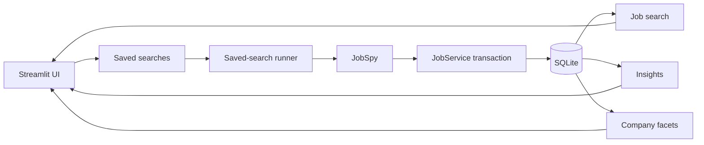

# Job Tracker

Job Tracker is a local-first workspace for collecting, reviewing, and tracking job opportunities. The repository is named `ai-job-scraper`, but the product uses the shorter Job Tracker name.

The application keeps one SQLite database and one Streamlit interface. Saved searches define every collection run. Companies appear as read-only facets after jobs are collected.

## Product workflow

The interface has three top-level pages:

- **Jobs**: review jobs and move them through `Inbox`, `Saved`, `Applied`, `Interviews`, or `Closed`
- **Searches**: create repeatable searches and run each one on demand
- **Insights**: inspect workflow counts, listing trends, salary data, and company facets

Each job also supports an independent starred marker and private notes. A repeated scrape updates provider-owned fields without replacing your stage, star, or notes. If a provider omits details that were collected earlier, Job Tracker keeps the richer stored values.

## Architecture

Job Tracker uses one data boundary:


```mermaid
flowchart LR
    UI[Streamlit UI] --> Saved[Saved searches]
    Saved --> Runner[Saved-search runner]
    Runner --> JobSpy[JobSpy]
    JobSpy --> Jobs[JobService transaction]
    Jobs --> DB[(SQLite)]
    DB --> Search[Job search]
    DB --> Analytics[Insights]
    DB --> Companies[Company facets]
    Search --> UI
    Analytics --> UI
    Companies --> UI
```

The main dependencies are:

- Python 3.12
- Streamlit for the web interface
- SQLModel and SQLAlchemy for persistence
- Alembic for schema migrations
- JobSpy for job-board collection

See [How the application is structured](docs/developers/architecture-overview.md) for component ownership and transaction rules.

## Run locally

Install [uv](https://docs.astral.sh/uv/), then clone and configure the repository:

```bash
git clone https://github.com/BjornMelin/ai-job-scraper.git
cd ai-job-scraper
uv sync --locked
cp .env.example .env
```

Apply the database migrations:

```bash
uv run --locked alembic upgrade head
```

You can add the starter saved searches:

```bash
uv run --locked ai-job-seed
```

Start Job Tracker:

```bash
uv run --locked ai-job-scraper
```

Open `http://localhost:8501`. Create or review a saved search under **Searches**, then select **Run now**.

## Configure the runtime

The application reads settings from `.env`. The default database URL is `sqlite:///jobs.db`.

```env
DB_URL=sqlite:///jobs.db
SCRAPER_LOG_LEVEL=INFO
```

Keep machine-specific configuration in `.env`, not in the web interface.

## Run with Docker

Build and start the container:

```bash
docker compose up --build
```

The container serves Job Tracker on port `8501`.

## Verify changes

Run formatting, static checks, migrations, and tests before opening a pull request:

```bash
uv run --locked ruff format --check .
uv run --locked ruff check .
uv run --locked alembic check
uv run --locked pytest -q
```

## Documentation

- [Get started](docs/user/getting-started.md)
- [Use Job Tracker](docs/user/user-guide.md)
- [Troubleshoot Job Tracker](docs/user/troubleshooting.md)
- [Understand the architecture](docs/developers/architecture-overview.md)
- [Develop and test](docs/developers/developer-guide.md)

## License

Job Tracker is available under the [MIT License](LICENSE).
