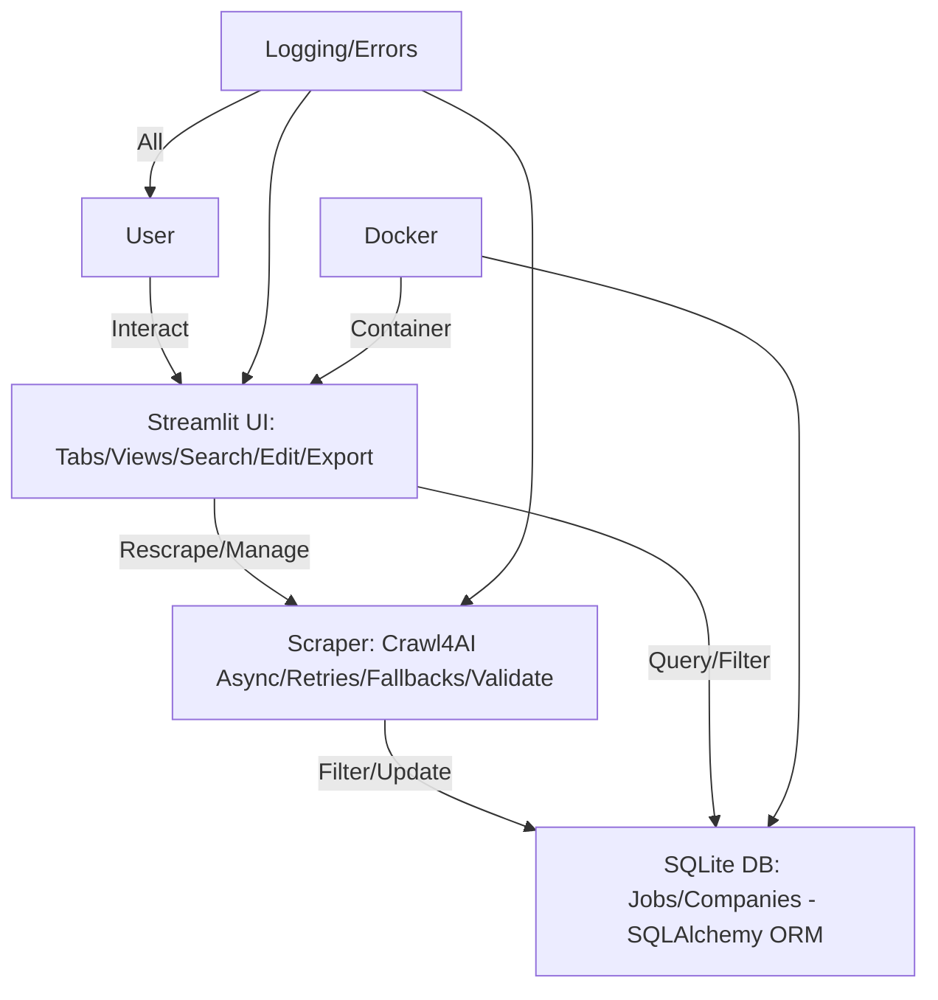

# 📚 AI Job Scraper Documentation

Welcome to the comprehensive documentation for AI Job Scraper - your privacy-focused tool for tracking AI/ML job opportunities.

## 🚀 Quick Navigation

### 👥 **For Users**

Start here if you want to **use** the AI Job Scraper application:

- **[📋 Getting Started](./user/getting-started.md)** - Complete setup guide (5-minute quickstart)

- **[🎯 User Guide](./user/user-guide.md)** - Feature walkthrough and usage tips  

- **[🔧 Troubleshooting](./user/troubleshooting.md)** - Common issues and solutions

### 💻 **For Developers**

Start here if you want to **extend** or **contribute** to the AI Job Scraper:

- **[🛠️ Developer Guide](./developers/developer-guide.md)** - Technical architecture and extension guide

- **[📖 API Reference](./developers/api-reference.md)** - Database schema, functions, and technical reference

- **[🚀 Deployment Guide](./developers/deployment.md)** - Production deployment strategies

### 📋 **Project Documentation**

Core project management and architectural decisions:

- **[📋 Product Requirements (PRD)](./PRD.md)** - Project scope, goals, and requirements

- **[✅ TODO & Roadmap](./TODO.md)** - Current status and future enhancements

- **[🏗️ Architecture Decision Records (ADRs)](./adrs/)** - Technical decisions and rationale

- **[📦 Archived Documentation](./archived/)** - Previous versions and deprecated docs

## 🎯 What is AI Job Scraper?

AI Job Scraper is an **open-source Python application** that automatically:

- **🕸️ Scrapes** job postings from top AI companies (Anthropic, OpenAI, NVIDIA, etc.)

- **🎯 Filters** for relevant AI/ML engineering roles  

- **💾 Stores** locally in SQLite with intelligent caching (90% speed improvement)

- **📊 Manages** through an interactive Streamlit dashboard

- **🔒 Protects** your privacy with local-only processing

## ✨ Key Features

- **⚡ High Performance:** Intelligent caching achieving 90% speed improvement and 50% cost reduction

- **🎨 Interactive UI:** Tabs, filtering, card/list views, inline editing, CSV export

- **🏢 Company Management:** Add/remove/activate companies via UI

- **📈 Session Metrics:** Track cache efficiency and processing performance

- **🛡️ Robust:** Enhanced validation, retries, fallbacks, and comprehensive logging

- **🐳 Docker Ready:** Containerized deployment support

- **🔒 Privacy-First:** Local processing with optional OpenAI integration

## 🚀 Quick Start

1. **Install dependencies:**

   ```bash
   git clone https://github.com/BjornMelin/ai-job-scraper.git
   cd ai-job-scraper
   uv sync
   ```

2. **Initialize database:**

   ```bash
   uv run python seed.py
   ```

3. **Run the application:**

   ```bash
   uv run streamlit run app.py
   ```

4. **Access dashboard:** <http://localhost:8501>

For detailed setup instructions, see the **[Getting Started Guide](./user/getting-started.md)**.

## 🏗️ Architecture Overview



## 🤝 Contributing

We welcome contributions! Please see the **[Developer Guide](./developers/developer-guide.md)** for:

- Development environment setup

- Code style guidelines  

- Testing procedures

- Contribution workflow

## 📄 License

MIT License - see [LICENSE](../LICENSE) for details.

---

<div align="center">

**Built by [Bjorn Melin](https://bjornmelin.io)**

[](https://github.com/BjornMelin)
[](https://www.linkedin.com/in/bjorn-melin/)

</div>
