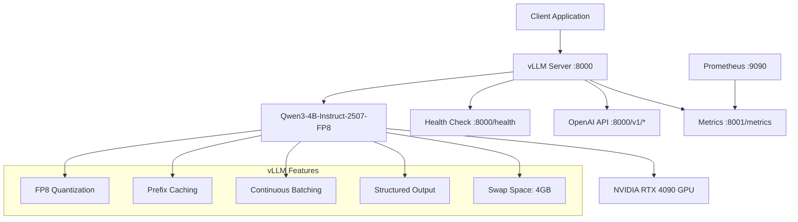

# vLLM Server Deployment Guide

## Overview

This guide provides complete instructions for deploying the vLLM server infrastructure for the AI Job Scraper application. The deployment uses Qwen/Qwen3-4B-Instruct-2507-FP8 with FP8 quantization for optimal performance on NVIDIA RTX 4090 hardware.

## Architecture



## Hardware Requirements

### Minimum Requirements

- **GPU**: NVIDIA RTX 4090 (24GB VRAM) with Ada Lovelace architecture (Compute Capability 8.9)
- **System RAM**: 20GB (16GB for model + 4GB swap space)
- **Storage**: 10GB free space for model caching
- **CUDA**: Version 12.1 or higher
- **Docker**: With NVIDIA runtime support

### Optimal Configuration

- **GPU Memory Utilization**: 90% (21.6GB out of 24GB)
- **Swap Space**: 4GB CPU memory for overflow handling
- **Host RAM**: 20GB total allocation
- **PCIe**: 16x slot for optimal bandwidth

## Quick Start

### 1. Prerequisites Check

```bash
# Verify GPU availability
nvidia-smi

# Check CUDA version (should be 12.1+)
nvcc --version

# Verify Docker with NVIDIA support
docker run --rm --gpus all nvidia/cuda:12.1-base-ubuntu20.04 nvidia-smi
```

### 2. Environment Setup

```bash
# Set API key (recommended)
export VLLM_API_KEY="your-secure-api-key-here"

# Verify project structure
ls -la docker-compose.vllm.yml scripts/start_vllm.sh
```

### 3. Start vLLM Server

```bash
# Using the startup script (recommended)
./scripts/start_vllm.sh

# Or directly with Docker Compose
docker-compose -f docker-compose.vllm.yml up -d
```

### 4. Validate Deployment

```bash
# Run comprehensive validation
python scripts/validate_vllm.py

# Quick health check
curl http://localhost:8000/health
```

## Configuration

### Docker Compose Configuration

The `docker-compose.vllm.yml` file contains the complete server configuration:

```yaml
services:
  vllm-server:
    image: vllm/vllm-openai:latest
    command: >
      --model Qwen/Qwen3-4B-Instruct-2507-FP8
      --quantization fp8
      --max-model-len 8192
      --gpu-memory-utilization 0.9
      --swap-space 4
      --enable-prefix-caching
      --max-num-seqs 128
```

### Model Configuration

- **Model**: `Qwen/Qwen3-4B-Instruct-2507-FP8`
- **Quantization**: FP8 for optimal RTX 4090 performance
- **Context Length**: 8192 tokens
- **Batch Size**: 128 sequences maximum
- **Memory Usage**: 90% GPU utilization + 4GB swap

### Performance Settings

| Parameter | Value | Description |
|-----------|-------|-------------|
| `gpu_memory_utilization` | 0.9 | 90% GPU memory usage |
| `swap_space` | 4 | 4GB CPU memory for overflow |
| `max_model_len` | 8192 | Maximum context window |
| `max_num_seqs` | 128 | Concurrent request limit |
| `enable_prefix_caching` | true | Optimize repeated patterns |
| `enable_chunked_prefill` | true | Improve batching efficiency |

## API Endpoints

### Health Check

```bash
curl http://localhost:8000/health
```

### Models List

```bash
curl -H "Authorization: Bearer $VLLM_API_KEY" \
     http://localhost:8000/v1/models
```

### Chat Completion

```bash
curl -X POST http://localhost:8000/v1/chat/completions \
  -H "Authorization: Bearer $VLLM_API_KEY" \
  -H "Content-Type: application/json" \
  -d '{
    "model": "Qwen3-4B-Instruct-2507-FP8",
    "messages": [
      {"role": "user", "content": "Hello, world!"}
    ],
    "max_tokens": 100
  }'
```

### Structured Output

```bash
curl -X POST http://localhost:8000/v1/chat/completions \
  -H "Authorization: Bearer $VLLM_API_KEY" \
  -H "Content-Type: application/json" \
  -d '{
    "model": "Qwen3-4B-Instruct-2507-FP8",
    "messages": [
      {"role": "user", "content": "Extract job info: Software Engineer at TechCorp"}
    ],
    "extra_body": {
      "guided_json": {
        "type": "object",
        "properties": {
          "title": {"type": "string"},
          "company": {"type": "string"}
        }
      }
    }
  }'
```

## Monitoring

### Prometheus Metrics

The server exposes metrics on port 8001:

```bash
# View available metrics
curl http://localhost:8001/metrics

# Start Prometheus monitoring (optional)
docker-compose -f docker-compose.vllm.yml --profile monitoring up -d
```

### Key Metrics to Monitor

- **Request Latency**: P95 < 2000ms for typical requests
- **GPU Memory Usage**: Should stay around 90%
- **Swap Space Usage**: Monitor for overflow situations
- **Request Queue Depth**: Track concurrent request handling
- **Error Rate**: Should be < 1%

### Container Logs

```bash
# Follow real-time logs
docker-compose -f docker-compose.vllm.yml logs -f vllm-server

# View recent logs
docker-compose -f docker-compose.vllm.yml logs --tail=100 vllm-server
```

## Integration with LiteLLM

The vLLM server is designed to work with LiteLLM as specified in SPEC-002. Configure LiteLLM to use the vLLM server:

```yaml
# config/litellm.yaml
model_list:
  - model_name: local-qwen
    litellm_params:
      model: Qwen3-4B-Instruct-2507-FP8
      api_base: http://localhost:8000/v1
      api_key: ${VLLM_API_KEY}
      timeout: 30
```

## Troubleshooting

### Common Issues

#### 1. GPU Not Available

**Error**: `RuntimeError: No GPU available`

**Solutions**:

```bash
# Check NVIDIA Docker runtime
docker info | grep nvidia

# Install nvidia-container-toolkit if missing
sudo apt install nvidia-container-toolkit
sudo systemctl restart docker
```

#### 2. Out of Memory

**Error**: `CUDA out of memory`

**Solutions**:

- Reduce `gpu_memory_utilization` to 0.8
- Increase `swap_space` to 8GB
- Reduce `max_num_seqs` to 64

#### 3. Model Download Issues

**Error**: `Failed to download model`

**Solutions**:

```bash
# Pre-download model
docker run --rm -v ~/.cache/huggingface:/root/.cache/huggingface \
  vllm/vllm-openai:latest \
  --model Qwen/Qwen3-4B-Instruct-2507-FP8 --download-dir /root/.cache/huggingface
```

#### 4. Port Conflicts

**Error**: `Port 8000 already in use`

**Solutions**:

- Stop conflicting services: `sudo lsof -i :8000`
- Change port in docker-compose.yml: `8001:8000`

#### 5. Slow Model Loading

**Symptoms**: Server takes >5 minutes to start

**Solutions**:

- Ensure SSD storage for model cache
- Increase Docker memory limits
- Check available system RAM

### Validation Failures

#### Health Check Fails

```bash
# Check container status
docker-compose -f docker-compose.vllm.yml ps

# Inspect container logs
docker-compose -f docker-compose.vllm.yml logs vllm-server

# Verify GPU access
docker exec -it ai-job-scraper-vllm nvidia-smi
```

#### API Requests Fail

```bash
# Test without authentication
curl http://localhost:8000/health

# Verify API key
echo $VLLM_API_KEY

# Check model loading status
curl -H "Authorization: Bearer $VLLM_API_KEY" \
     http://localhost:8000/v1/models
```

#### Performance Issues

```bash
# Monitor GPU utilization
nvidia-smi -l 1

# Check system resources
htop

# Monitor request latency
python scripts/validate_vllm.py --timeout 120
```

### Log Analysis

#### Key Log Messages

**Successful startup**:

```
INFO: Started server process
INFO: Waiting for application startup.
INFO: Application startup complete.
```

**GPU initialization**:

```
INFO: Initializing an LLM engine (v0.6.2) with config:
INFO: Loading model weights took 2.34 GB GPU memory
```

**Request processing**:

```
INFO: Request received. Request ID: abc123
INFO: Request completed. Request ID: abc123
```

#### Error Patterns

**Memory issues**:

```
ERROR: CUDA out of memory
ERROR: Failed to allocate memory
```

**Model loading issues**:

```
ERROR: Failed to load model
ERROR: Model not found in cache
```

## Performance Optimization

### Memory Optimization

1. **Adjust GPU memory utilization**:

   ```yaml
   command: >
     --gpu-memory-utilization 0.85  # Reduce from 0.9 if needed
   ```

2. **Optimize swap space**:

   ```yaml
   command: >
     --swap-space 8  # Increase for better handling of large requests
   ```

3. **Tune batch size**:

   ```yaml
   command: >
     --max-num-seqs 64  # Reduce for memory-constrained environments
   ```

### Request Optimization

1. **Enable all caching**:

   ```yaml
   command: >
     --enable-prefix-caching
     --enable-chunked-prefill
   ```

2. **Optimize batching**:

   ```yaml
   command: >
     --max-num-batched-tokens 4096
     --scheduler-delay-factor 0.0
   ```

3. **Request routing**:
   - Route short requests (<2K tokens) first
   - Batch similar request types
   - Use structured output for reliable parsing

## Security

### API Key Management

```bash
# Generate secure API key
export VLLM_API_KEY=$(openssl rand -hex 32)

# Store in .env file
echo "VLLM_API_KEY=$VLLM_API_KEY" >> .env
```

### Network Security

- vLLM server binds to `0.0.0.0:8000` inside container
- Only expose necessary ports
- Consider using reverse proxy for production
- Implement rate limiting if needed

### Container Security

```yaml
# Add security options to docker-compose.yml
security_opt:
  - no-new-privileges:true
user: "1000:1000"
read_only: true
tmpfs:
  - /tmp
```

## Production Deployment

### High Availability

1. **Multiple replicas** with load balancer
2. **Health check monitoring** with auto-restart
3. **Resource monitoring** with alerts
4. **Backup model caching** for faster recovery

### Scaling Considerations

- **Vertical scaling**: Increase GPU memory and CPU cores
- **Horizontal scaling**: Multiple vLLM instances with load balancer
- **Request routing**: Distribute based on context length
- **Model variants**: Different quantization levels for different needs

### Monitoring Setup

```bash
# Enable Prometheus monitoring
docker-compose -f docker-compose.vllm.yml --profile monitoring up -d

# Access metrics
curl http://localhost:9090  # Prometheus UI
```

## Maintenance

### Regular Tasks

1. **Update vLLM image**:

   ```bash
   docker-compose -f docker-compose.vllm.yml pull
   docker-compose -f docker-compose.vllm.yml up -d
   ```

2. **Clean up logs**:

   ```bash
   docker-compose -f docker-compose.vllm.yml logs --tail=0 vllm-server
   ```

3. **Monitor disk space**:

   ```bash
   du -sh ~/.cache/huggingface
   df -h
   ```

4. **Validate performance**:

   ```bash
   python scripts/validate_vllm.py --timeout 300
   ```

### Backup and Recovery

1. **Model cache backup**:

   ```bash
   tar -czf vllm-models-backup.tar.gz ~/.cache/huggingface
   ```

2. **Configuration backup**:

   ```bash
   cp -r config/ logs/ scripts/ vllm-config-backup/
   ```

3. **Recovery procedure**:

   ```bash
   # Restore model cache
   tar -xzf vllm-models-backup.tar.gz -C ~/
   
   # Restart service
   ./scripts/stop_vllm.sh
   ./scripts/start_vllm.sh
   ```

## Support

### Getting Help

1. **Check logs first**:

   ```bash
   docker-compose -f docker-compose.vllm.yml logs vllm-server
   ```

2. **Run validation**:

   ```bash
   python scripts/validate_vllm.py --timeout 120
   ```

3. **Check system resources**:

   ```bash
   nvidia-smi
   free -h
   df -h
   ```

### Useful Commands

```bash
# Complete restart
./scripts/stop_vllm.sh && ./scripts/start_vllm.sh

# Force cleanup
docker-compose -f docker-compose.vllm.yml down -v --remove-orphans

# Resource monitoring
watch -n 1 'nvidia-smi && free -h'

# Request testing
curl -X POST http://localhost:8000/v1/chat/completions \
  -H "Authorization: Bearer $VLLM_API_KEY" \
  -H "Content-Type: application/json" \
  -d '{"model": "Qwen3-4B-Instruct-2507-FP8", "messages": [{"role": "user", "content": "Test"}]}'
```

---

## Conclusion

This vLLM deployment provides a production-ready local AI inference server optimized for the RTX 4090 GPU with FP8 quantization. The setup includes comprehensive monitoring, validation, and troubleshooting tools to ensure reliable operation.

For additional support or questions, refer to the project documentation or check the vLLM official documentation at [docs.vllm.ai](https://docs.vllm.ai/).
