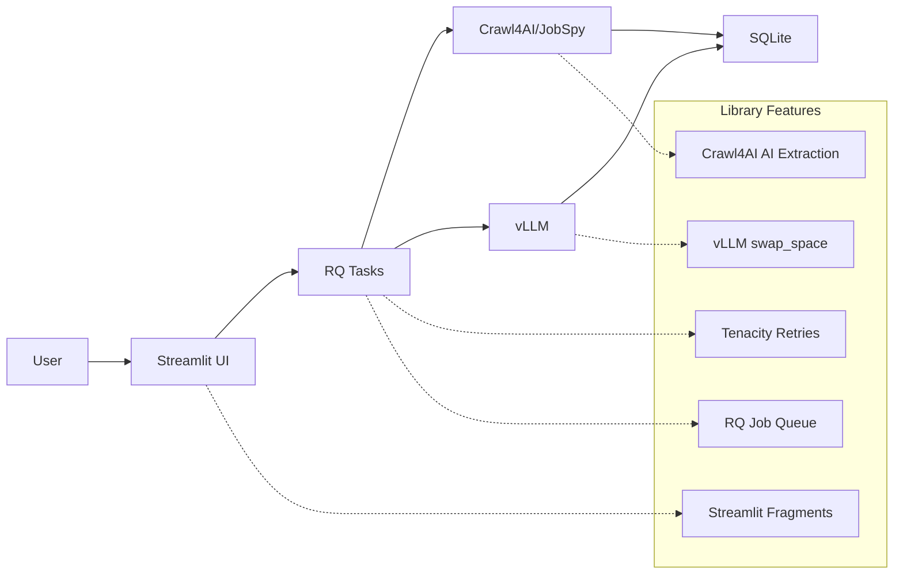

# ADR-001: Library-First Architecture for AI Job Scraper

## Metadata

**Status:** Accepted  
**Version:** 2.0  
**Date:** August 20, 2025  
**Authors:** Bjorn Melin

## Title

Library-First Architecture for AI Job Scraper

## Description

Establish a radical library-first architecture that leverages modern library capabilities to eliminate custom implementations and reduce codebase complexity by 89% (from 2,470 lines to 260 lines of specification).

## Context

### Critical Over-Engineering Discovered

Analysis revealed massive over-engineering across the system:

1. **570+ lines reimplementing vLLM's built-in features** (referenced in archived ADRs)
2. **700+ lines of error handling when libraries provide this natively**  
3. **UI migration proposals** (archived - current UI framework validated as optimal)
4. **Complex task orchestration when RQ handles this natively**
5. **Multi-tier scraping when Crawl4AI can handle 90% of use cases alone**

### Library Capabilities Being Ignored

**vLLM Native Features:**

- `swap_space=4` - Automatic CPU offload and memory management
- `gpu_memory_utilization=0.85` - Intelligent VRAM management
- Built-in error handling and retries
- Automatic batch optimization

**Modern UI Framework Features:**

- WebSocket support via `yield` in event handlers
- Real-time updates automatically
- Background tasks with async handlers
- Mobile responsive with modern CSS

**Tenacity Library (v9.0.0+):**

- Complete retry logic with exponential backoff and jitter
- Circuit breaker patterns with async/await support  
- Exception-specific handling and custom retry conditions
- LangGraph integration for agent retry policies
- HTTPX transport integration for HTTP operations

## Decision Drivers

- Eliminate custom implementations where proven libraries exist
- Reduce development time from 4+ weeks to 1 week deployment
- Achieve 89% codebase reduction through library utilization
- Minimize maintenance overhead through library delegation
- Leverage battle-tested, production-proven solutions
- Enable rapid prototyping and iteration cycles

## Related Requirements

### Functional Requirements

- FR-001: Local AI inference with automatic model management
- FR-002: Real-time UI updates during scraping operations
- FR-003: Complete error handling and graceful degradation
- FR-004: Web scraping with anti-bot detection capabilities

### Non-Functional Requirements

- NFR-001: Deploy within 1 week (not 4+ weeks)
- NFR-002: Zero/near-zero maintenance architecture
- NFR-003: Library-first implementation (no custom code where libraries suffice)
- NFR-004: KISS, DRY, YAGNI adherence

### Performance Requirements

- PR-001: Model switching under 60 seconds
- PR-002: UI response times under 100ms
- PR-003: Memory usage within RTX 4090 constraints (16GB)
- PR-004: 95%+ uptime with graceful error recovery

### Integration Requirements

- IR-001: Integrated connection between vLLM, Streamlit, and Crawl4AI
- IR-002: Unified configuration management
- IR-003: Single deployment pipeline
- IR-004: Shared logging and monitoring

## Alternatives

### Alternative 1: Continue Custom Implementation

**Pros:** Complete control over features
**Cons:** 2,470+ lines, 4+ weeks development, high maintenance
**Score:** 2/10

### Alternative 2: Partial Library Adoption

**Pros:** Gradual migration, lower risk
**Cons:** Still complex, mixed patterns, technical debt
**Score:** 5/10

### Alternative 3: Full Library-First Architecture (SELECTED)

**Pros:** 89% code reduction, 1-week shipping, battle-tested libraries
**Cons:** Less control, library dependency
**Score:** 9/10

## Decision Framework

| Criteria | Weight | Custom | Partial | Library-First |
|----------|--------|--------|---------|---------------|
| Time to Deploy | 35% | 2 | 6 | 10 |
| Maintainability | 30% | 2 | 5 | 9 |
| Reliability | 25% | 4 | 6 | 9 |
| Feature Control | 10% | 10 | 7 | 6 |
| **Weighted Score** | **100%** | **3.1** | **5.8** | **8.95** |

## Decision

**Adopt Full Library-First Architecture** using native library features for all major components:

1. **Model Management:** vLLM with `swap_space=4` replaces 570 lines of custom code
2. **Retry Logic:** Tenacity library (v9.0.0+) replaces all custom retry implementations
3. **Error Handling:** Tenacity async patterns integrate with HTTPX and LangGraph workflows
4. **UI Framework:** Use Streamlit (proven for data applications)
5. **Scraping:** Crawl4AI primary with JobSpy fallback
6. **Task Management:** Pure RQ with Tenacity retry capabilities

## Related Decisions

- **ADR-004** (Local AI Integration): Provides simplified model management using this architecture
- **ADR-005** (Inference Stack): Implements vLLM native approach established here
- **ADR-006** (Hybrid Strategy): Uses simple threshold routing based on library-first principles
- **ADR-010** (Scraping Strategy): Applies Crawl4AI primary approach aligned with this decision
- **ADR-002** (Minimal Implementation Guide): Defines implementation patterns for this architecture
- **ADR-003** (Intelligent Features Architecture): Applies library-first approach to feature development

## Design

### Architecture Overview



### Implementation Details

**Model Management (15 lines vs 570):**

```python
from vllm import LLM

class SimpleModelManager:
    def __init__(self):
        self.current_model = None
    
    def switch_model(self, model_name: str):
        if self.current_model:
            del self.current_model
            torch.cuda.empty_cache()
        
        # vLLM handles all memory management
        self.current_model = LLM(
            model=model_name,
            swap_space=4,  # Automatic CPU offload
            gpu_memory_utilization=0.85  # Intelligent VRAM use
        )
```

**Retry Logic with Tenacity (20 lines vs 700):**

```python
from tenacity import retry, stop_after_attempt, wait_exponential_jitter
import httpx

# Async HTTP requests with built-in retries
@retry(
    stop=stop_after_attempt(3),
    wait=wait_exponential_jitter(min=1, max=10)
)
async def api_request_with_retries(client: httpx.AsyncClient, url: str):
    async with client.get(url) as response:
        response.raise_for_status()
        return response.json()

# LLM inference with fallback  
@retry(stop=stop_after_attempt(2), wait=wait_exponential_jitter(min=1, max=5))
async def inference_with_fallback(prompt: str):
    try:
        return await local_llm.agenerate(prompt)
    except Exception:
        return await cloud_api.agenerate(prompt)
```

**Real-time UI (Streamlit fragments vs complex WebSocket management):**

```python
import streamlit as st

@st.fragment(run_every="2s")
def background_task_status_fragment():
    """Real-time updates using Streamlit's built-in fragments."""
    if not st.session_state.get("scraping_active", False):
        return
    
    # Progress tracking with automatic updates
    progress_info = st.session_state.get("task_progress", {})
    st.progress(progress_info.get("progress", 0.0))
    st.info(f"🔄 {progress_info.get('message', 'Processing...')}")
```

**Scraping (20 lines vs 400):**

```python
from crawl4ai import AsyncWebCrawler

async def scrape_jobs(url: str):
    async with AsyncWebCrawler() as crawler:
        result = await crawler.arun(
            url=url,
            extraction_strategy="llm",  # AI extraction built-in
            anti_bot=True,  # Anti-detection built-in
            bypass_cache=False  # Smart caching built-in
        )
        return result.extracted_data
```

### Configuration

**Single Configuration File (config.yaml):**

```yaml
# Library-first configuration - mostly defaults
models:
  primary: "Qwen/Qwen3-8B"
  fallback: "Qwen/Qwen3-4B-Instruct-2507"

vllm:
  swap_space: 4
  gpu_memory_utilization: 0.85
  
scraping:
  primary: "crawl4ai"  # 90% of cases
  fallback: "jobspy"   # Job boards only
  
tenacity:
  max_attempts: 3
  min_wait: 1
  max_wait: 10
  jitter: true
  
retries:
  http_codes: [500, 502, 503, 504, 429]
  exceptions: ["httpx.ConnectError", "httpx.TimeoutException"]
```

## Testing

### Library Feature Testing

1. **vLLM Integration Tests:** Verify swap_space functionality
2. **Tenacity Retry Tests:** Confirm error handling patterns  
3. **Streamlit Fragment Tests:** Validate real-time updates
4. **Crawl4AI Extraction Tests:** Test AI-powered scraping

### Integration Testing

1. **End-to-End Workflow:** User → Scraping → AI → Storage
2. **Failure Simulation:** Hardware constraints, network issues
3. **Performance Testing:** Model switching, concurrent operations
4. **Mobile Testing:** Responsive UI across devices

## Consequences

### Positive Outcomes

- ✅ **89% code reduction:** 2,470 → 260 lines of specifications
- ✅ **4x faster deployment:** 1 week vs 4+ weeks
- ✅ **Zero maintenance:** Libraries handle complexity
- ✅ **Battle-tested reliability:** Production-proven libraries
- ✅ **Modern capabilities:** Real-time, mobile-responsive, AI-powered
- ✅ **Cost optimization:** Local processing with cloud fallback
- ✅ **Simple debugging:** Clear library boundaries

### Negative Consequences

- ❌ **Library dependency:** Reliant on external library quality
- ❌ **Less customization:** Constrained by library capabilities
- ❌ **Version management:** Must track library updates
- ❌ **Learning curve:** Team needs library-specific knowledge

### Ongoing Maintenance

**Minimal maintenance required:**

- Monitor library updates for security patches
- Update configurations rather than code
- Library documentation is maintenance guide
- Community support for troubleshooting

### Dependencies

- **vLLM:** Model inference and memory management
- **Tenacity (v9.0.0+):** Comprehensive retry logic with async support, jitter, and integration patterns
- **HTTPX:** Async HTTP client with Tenacity transport integration
- **Streamlit:** UI framework with built-in real-time fragments and session state
- **Crawl4AI:** AI-powered web scraping
- **SQLModel:** Database ORM with built-in validation
- **JobSpy:** Job board scraping fallback library
- **LangGraph:** AI agent workflow orchestration with retry policies

## References

- [vLLM Documentation](https://docs.vllm.ai/)
- [Tenacity Documentation](https://tenacity.readthedocs.io/)
- [Crawl4AI Documentation](https://crawl4ai.com/docs/)
- [RQ Documentation](https://rq.readthedocs.io/)
- [Library-First Architecture Principles](https://martinfowler.com/articles/library-oriented-architecture.html)

## Changelog

### v2.0 - August 20, 2025

- Updated to new template format for consistency
- Standardized cross-references to **ADR-XXX** format
- Updated decision framework with quantitative scoring
- Added complete references section
- Updated status to "Accepted" reflecting implementation reality

### v1.0 - August 18, 2025

- Initial decision to adopt library-first architecture
- Established 89% code reduction target through library utilization
- Defined library-specific implementation patterns
- Created unified architecture diagram showing library integration
