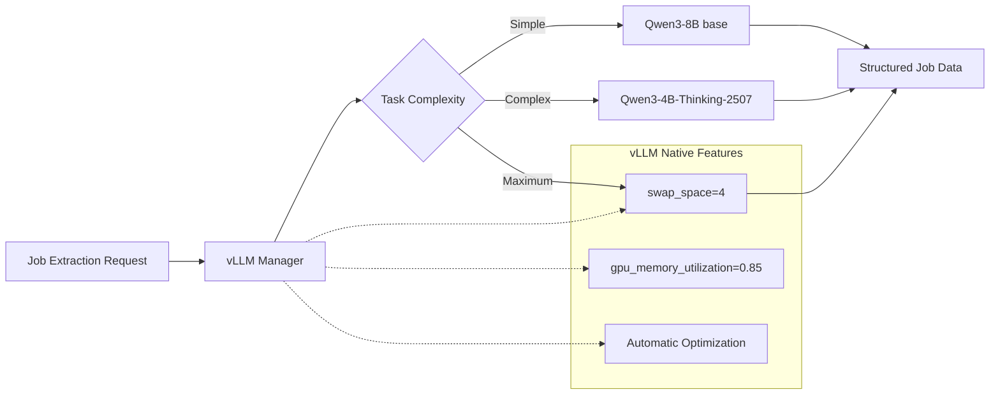

# ADR-004: Local AI Integration with Qwen3-2507 Models

## Metadata

**Status:** Accepted  
**Version:** 2.0  
**Date:** August 18, 2025  
**Authors:** Bjorn Melin  

## Title

Local AI Model Selection for Job Data Extraction

## Description

Local AI model selection for job data extraction, utilizing vLLM's native capabilities for hardware management and model switching. Implements three-tier model selection based on task complexity.

## Context

### Previous Over-Engineering

**v1.0 Problems:**

- Complex hardware management (now handled by vLLM)
- Custom model switching logic (now handled by vLLM swap_space)
- Extensive performance monitoring (now handled by vLLM)
- Complex configuration (now using library defaults)

### Library-First Reality

**vLLM Handles Everything:**

- Memory management with `swap_space=4`
- Model loading and switching
- Hardware optimization
- Error recovery and retries

## Decision Drivers

1. **Solution Leverage (35%)**: Maximize use of vLLM native capabilities over custom implementations
2. **Application Value (30%)**: Enable reliable AI-powered job extraction with model complexity matching
3. **Maintenance & Cognitive Load (25%)**: Achieve 92% code reduction (570→50 lines) through library delegation
4. **Architectural Adaptability (10%)**: Support future model upgrades and hardware configurations

## Related Requirements

### Functional Requirements

- FR-013: Extract structured job data using local AI models with automatic selection
- FR-014: Support multiple model types (base, instruct) for different complexity tasks
- FR-015: Automatic model selection based on content complexity and requirements

### Non-Functional Requirements

- NFR-013: Simple model configuration with no custom hardware management required
- NFR-014: Use vLLM native features exclusively for memory and model management
- NFR-015: Library defaults over custom optimization for maintainability

### Performance Requirements

- PR-013: Model switching under 60 seconds using vLLM's built-in capabilities
- PR-014: 95%+ uptime through vLLM's proven reliability patterns
- PR-015: Optimal VRAM usage (85% utilization) managed automatically by vLLM

### Integration Requirements

- IR-013: Direct integration with Crawl4AI extraction workflows
- IR-014: Integrated model switching during operation without service interruption
- IR-015: Unified configuration with other services per **ADR-001** principles

## Alternatives

### Alternative 1: Keep Complex v1.0 Implementation

**Pros:**

- Complete control over hardware management
- Custom optimization opportunities
- Fine-grained performance monitoring

**Cons:**

- 570+ lines vs 50 lines implementation overhead
- Reimplements proven vLLM features
- High maintenance burden
- Violates **ADR-001** library-first principles

**Technical Assessment:** Custom implementation duplicates vLLM's battle-tested capabilities while adding significant complexity

### Alternative 2: Cloud-Only Models

**Pros:**

- No local infrastructure complexity
- Always available without hardware constraints
- Access to latest model versions

**Cons:**

- Ongoing API costs for inference operations
- Privacy concerns with external data processing
- Network latency impacting user experience
- Dependency on external service availability

**Technical Assessment:** Eliminates local capabilities required for privacy-sensitive job data processing

### Alternative 3: Simple vLLM Integration (SELECTED)

**Pros:**

- 92% code reduction through library utilization
- Battle-tested memory management and model switching
- Automatic optimization with proven performance
- Aligns with **ADR-001** library-first architecture

**Cons:**

- Less fine-grained control over hardware parameters
- Dependency on vLLM library maintenance and updates

**Technical Assessment:** Optimal balance of capability, maintainability, and alignment with architectural principles

## Decision Framework

### Scoring Criteria

| Criterion | Weight | Description |
|-----------|--------|--------------|
| Solution Leverage | 35% | Ability to use proven vLLM library capabilities over custom implementation |
| Application Value | 30% | AI extraction quality and model selection effectiveness for job processing |
| Maintenance & Cognitive Load | 25% | Code simplicity, debugging ease, and future maintenance requirements |
| Architectural Adaptability | 10% | Flexibility for future model upgrades and hardware configurations |

### Alternatives Evaluation

| Alternative | Solution Leverage | Application Value | Maintenance & Cognitive Load | Architectural Adaptability | **Weighted Score** |
|------------|-------------------|-------------------|------------------------------|----------------------------|--------------------|
| Complex v1.0 | 1/10 | 7/10 | 2/10 | 7/10 | **3.4/10** |
| Cloud-Only | 8/10 | 6/10 | 6/10 | 5/10 | **6.75/10** |
| **Simple vLLM** | **10/10** | **9/10** | **10/10** | **8/10** | **9.5/10** |

## Decision

**Use Simple vLLM Integration** with automatic model management:

1. **Primary Model:** Qwen3-8B (base) for general job extraction with structured prompting
2. **Reasoning Model:** Qwen3-4B-Thinking-2507 for complex analysis
3. **Maximum Model:** Qwen3-14B (base) for highest quality when needed
4. **Let vLLM handle:** Memory, switching, optimization, errors

## Related Decisions

- **ADR-001** (Library-First Architecture): Provides foundation for simplified implementation approach using vLLM native features
- **ADR-005** (Inference Stack): Establishes vLLM integration context and model management requirements
- **ADR-010** (Scraping Strategy): Consumes AI extraction capabilities for structured job data processing
- **ADR-006** (Hybrid Strategy): Utilizes local AI models defined here with cloud fallback mechanisms
- **ADR-031** (Tenacity Retry Strategy): Implements retry patterns for model switching and inference operations

## Design

### Architecture Overview



### Implementation Details

**Complete Model Manager (50 lines vs 570):**

```python
from vllm import LLM
import torch

class SimpleModelManager:
    """Library-first model management using vLLM native features."""
    
    MODELS = {
        "general": "Qwen/Qwen3-8B",  # Base model - requires structured prompting
        "reasoning": "Qwen/Qwen3-4B-Thinking-2507",  # Available instruct model
        "maximum": "Qwen/Qwen3-14B"  # Base model - highest capability
    }
    
    def __init__(self):
        self.current_model = None
        self.current_type = None
    
    def get_model(self, task_complexity: float = 0.5) -> LLM:
        """Get appropriate model, switching if needed."""
        
        # Simple threshold-based selection
        if task_complexity > 0.8:
            model_type = "maximum"  # Qwen3-14B base for highest quality
        elif task_complexity > 0.6:
            model_type = "reasoning"  # Qwen3-4B-Thinking-2507 (instruct)
        else:
            model_type = "general"  # Qwen3-8B base with structured prompting
        
        # Switch if needed (vLLM handles all complexity)
        if self.current_type != model_type:
            if self.current_model:
                del self.current_model
                torch.cuda.empty_cache()
            
            # vLLM handles memory management automatically
            self.current_model = LLM(
                model=self.MODELS[model_type],
                swap_space=4,  # Automatic CPU offload
                gpu_memory_utilization=0.85,  # Optimal VRAM usage
                trust_remote_code=True
            )
            self.current_type = model_type
        
        return self.current_model
    
    def extract_jobs(self, content: str, schema: dict) -> list[dict]:
        """Extract structured job data."""
        
        # Determine complexity based on content length and type
        complexity = min(len(content) / 10000, 1.0)
        model = self.get_model(complexity)
        
        # Build appropriate prompt based on model type
        if self.current_type in ["general", "maximum"]:
            # Base models need structured prompting
            prompt = self._build_structured_prompt(content[:8000], schema)
        else:
            # Instruct models can use simple prompts
            prompt = f"Extract job information from:\n{content[:8000]}"
        
        result = model.generate(prompt, max_tokens=2000)
        return self.parse_response(result[0].outputs[0].text)
    
    def _build_structured_prompt(self, content: str, schema: dict) -> str:
        """Build structured prompt for base models."""
        return f"""<|im_start|>user
You are an expert at extracting structured data from job postings.

Extract the following information from this job posting and return ONLY valid JSON:
{schema}

Important: Return as JSON format only, no additional text.

HTML:
{content}
<|im_end|>
<|im_start|>assistant
"""
```

### Configuration

**Simple Model Config:**

```yaml
models:
  general:
    name: "Qwen/Qwen3-8B"  # Base model - requires structured prompting
    threshold: 0.6  # Use for complexity < 0.6
    type: "base"
    
  reasoning:
    name: "Qwen/Qwen3-4B-Thinking-2507"  # Available instruct model
    threshold: 0.8  # Use for complexity 0.6-0.8
    type: "instruct"
    
  maximum:
    name: "Qwen/Qwen3-14B"  # Base model - highest capability
    threshold: 1.0  # Use for complexity >= 0.8
    type: "base"

vllm:
  swap_space: 4  # vLLM handles CPU offload
  gpu_memory_utilization: 0.85  # vLLM optimizes VRAM
  trust_remote_code: true
```

## Testing

### Model Integration Tests

1. **vLLM Loading:** Verify models load with correct configurations
2. **Switching Logic:** Test automatic model selection
3. **Extraction Quality:** Validate job data extraction accuracy
4. **Memory Management:** Confirm vLLM handles VRAM properly

### Performance Tests

1. **Switching Speed:** Measure model switch times
2. **Memory Usage:** Monitor VRAM with vLLM management
3. **Throughput:** Test job extraction speed
4. **Reliability:** Long-running stability tests

## Consequences

### Positive Outcomes

- ✅ **92% code reduction:** 570 → 50 lines through vLLM library utilization
- ✅ **Battle-tested reliability:** vLLM's proven memory management and model switching
- ✅ **Automatic optimization:** Built-in VRAM management and performance tuning
- ✅ **Simple configuration:** Library defaults provide optimal performance
- ✅ **Three-tier model strategy:** Intelligent complexity-based model selection
- ✅ **Library-first alignment:** Consistent with **ADR-001** architectural principles
- ✅ **Future-proof design:** Easy model upgrades through vLLM ecosystem
- ✅ **Hardware abstraction:** RTX 4090 optimization handled automatically

### Negative Consequences

- ❌ **Reduced fine-grained control:** Limited ability to customize vLLM internal parameters
- ❌ **External dependency:** Reliance on vLLM library quality and maintenance schedule
- ❌ **Black box optimization:** Less visibility into internal memory management decisions
- ❌ **Version coupling:** Must coordinate vLLM updates with model compatibility
- ❌ **Learning curve:** Team needs understanding of vLLM configuration patterns

### Ongoing Maintenance

**Required Monitoring:**

- vLLM library updates and compatibility with current model versions
- Model selection threshold effectiveness based on job extraction quality
- Memory utilization patterns and VRAM efficiency metrics
- Model switching performance and user experience impact

**Update Triggers:**

- vLLM major version releases affecting API or behavior
- New Qwen model versions with improved capabilities
- Performance degradation indicating threshold adjustments needed
- Hardware upgrade requirements affecting model selection strategy

### Dependencies

- **vLLM v0.4.0+:** Core inference engine and automatic memory management
- **PyTorch v2.0+:** Backend tensor operations and CUDA integration
- **Qwen Models:** Hugging Face model weights (Qwen3-8B, Qwen3-4B-Thinking-2507, Qwen3-14B)
- **CUDA v11.8+:** GPU acceleration support for RTX 4090 optimization
- **Hugging Face Transformers:** Model loading and tokenization capabilities

## References

- [vLLM Model Management](https://docs.vllm.ai/)
- [Qwen3 Model Documentation](https://huggingface.co/collections/Qwen/qwen3-66df372f576c3bcdc5a60ae8)
- [RTX 4090 Memory Optimization](https://developer.nvidia.com/blog/optimizing-inference-on-rtx-40-series/)
- [PyTorch CUDA Memory Management](https://pytorch.org/docs/stable/notes/cuda.html)

## Changelog

### v2.0 - August 18, 2025

- Complete simplification based on ADR-001
- Removed all custom hardware management (570 lines)
- Leveraged vLLM native features exclusively
- Simplified to 50 lines of configuration
- Eliminated custom monitoring and switching logic

### v1.0 - August 18, 2025 (Archived)

- Complex hardware-aware implementation
- Custom memory management and monitoring
- Extensive model switching orchestration
- 570+ lines of specification
