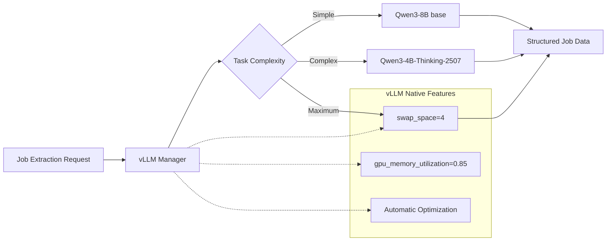

# ADR-004: Local AI Integration with Qwen3-2507 Models

## Metadata

**Status:** Accepted  
**Version:** 2.0  
**Date:** August 18, 2025  
**Authors:** Bjorn Melin  

## Title

Local AI Model Selection for Job Data Extraction

## Description

Local AI model selection for job data extraction, utilizing vLLM's native capabilities for hardware management and model switching. Implements three-tier model selection based on task complexity.

## Context

### Previous Over-Engineering

**v1.0 Problems:**

- Complex hardware management (now handled by vLLM)
- Custom model switching logic (now handled by vLLM swap_space)
- Extensive performance monitoring (now handled by vLLM)
- Complex configuration (now using library defaults)

### Library-First Reality

**vLLM Handles Everything:**

- Memory management with `swap_space=4`
- Model loading and switching
- Hardware optimization
- Error recovery and retries

## Decision Drivers

- Eliminate custom hardware management complexity
- Utilize vLLM's proven model switching
- Reduce codebase from 570+ lines to 50 lines
- Enable reliable model selection based on task complexity
- Minimize maintenance overhead through library delegation

## Related Requirements

### Functional Requirements

- FR-013: Extract structured job data using local AI models
- FR-014: Support multiple model types for different complexity tasks
- FR-015: Automatic model selection based on task requirements

### Non-Functional Requirements

- NFR-013: Simple model configuration (no hardware management)
- NFR-014: Use vLLM native features exclusively
- NFR-015: Library defaults over custom optimization

### Performance Requirements

- PR-013: Model switching under 60 seconds (vLLM handles this)
- PR-014: 95%+ uptime (vLLM reliability)
- PR-015: Optimal VRAM usage (vLLM manages automatically)

### Integration Requirements

- IR-013: Direct integration with Crawl4AI extraction
- IR-014: Integrated model switching during operation
- IR-015: Unified configuration with other services

## Alternatives

### Alternative 1: Keep Complex v1.0 Implementation

**Pros:** More control over hardware
**Cons:** 570+ lines vs 50 lines, reimplements vLLM features
**Score:** 2/10

### Alternative 2: Cloud-Only Models

**Pros:** No local complexity
**Cons:** API costs, privacy concerns, latency
**Score:** 4/10

### Alternative 3: Simple vLLM Integration (SELECTED)

**Pros:** 50 lines, tested library, automatic optimization
**Cons:** Less fine-grained control
**Score:** 9/10

## Decision Framework

| Criteria | Weight | Complex v1.0 | Cloud-Only | Simple vLLM |
|----------|--------|-------------|-----------|-------------|
| Simplicity | 35% | 1 | 8 | 10 |
| Reliability | 25% | 5 | 7 | 9 |
| Performance | 20% | 7 | 6 | 9 |
| Maintainability | 20% | 2 | 6 | 10 |
| **Weighted Score** | **100%** | **3.4** | **6.75** | **9.5** |

## Decision

**Use Simple vLLM Integration** with automatic model management:

1. **Primary Model:** Qwen3-8B (base) for general job extraction with structured prompting
2. **Reasoning Model:** Qwen3-4B-Thinking-2507 for complex analysis
3. **Maximum Model:** Qwen3-14B (base) for highest quality when needed
4. **Let vLLM handle:** Memory, switching, optimization, errors

## Related Decisions

- **ADR-001** (Library-First Architecture): Foundation for simplified implementation
- **ADR-005** (Inference Stack): Provides vLLM integration context
- **ADR-010** (Scraping Strategy): Consumes AI extraction capabilities

## Design

### Architecture Overview



### Implementation Details

**Complete Model Manager (50 lines vs 570):**

```python
from vllm import LLM
import torch

class SimpleModelManager:
    """Library-first model management using vLLM native features."""
    
    MODELS = {
        "general": "Qwen/Qwen3-8B",  # Base model - requires structured prompting
        "reasoning": "Qwen/Qwen3-4B-Thinking-2507",  # Available instruct model
        "maximum": "Qwen/Qwen3-14B"  # Base model - highest capability
    }
    
    def __init__(self):
        self.current_model = None
        self.current_type = None
    
    def get_model(self, task_complexity: float = 0.5) -> LLM:
        """Get appropriate model, switching if needed."""
        
        # Simple threshold-based selection
        if task_complexity > 0.8:
            model_type = "maximum"  # Qwen3-14B base for highest quality
        elif task_complexity > 0.6:
            model_type = "reasoning"  # Qwen3-4B-Thinking-2507 (instruct)
        else:
            model_type = "general"  # Qwen3-8B base with structured prompting
        
        # Switch if needed (vLLM handles all complexity)
        if self.current_type != model_type:
            if self.current_model:
                del self.current_model
                torch.cuda.empty_cache()
            
            # vLLM handles memory management automatically
            self.current_model = LLM(
                model=self.MODELS[model_type],
                swap_space=4,  # Automatic CPU offload
                gpu_memory_utilization=0.85,  # Optimal VRAM usage
                trust_remote_code=True
            )
            self.current_type = model_type
        
        return self.current_model
    
    def extract_jobs(self, content: str, schema: dict) -> list[dict]:
        """Extract structured job data."""
        
        # Determine complexity based on content length and type
        complexity = min(len(content) / 10000, 1.0)
        model = self.get_model(complexity)
        
        # Build appropriate prompt based on model type
        if self.current_type in ["general", "maximum"]:
            # Base models need structured prompting
            prompt = self._build_structured_prompt(content[:8000], schema)
        else:
            # Instruct models can use simple prompts
            prompt = f"Extract job information from:\n{content[:8000]}"
        
        result = model.generate(prompt, max_tokens=2000)
        return self.parse_response(result[0].outputs[0].text)
    
    def _build_structured_prompt(self, content: str, schema: dict) -> str:
        """Build structured prompt for base models."""
        return f"""<|im_start|>user
You are an expert at extracting structured data from job postings.

Extract the following information from this job posting and return ONLY valid JSON:
{schema}

Important: Return as JSON format only, no additional text.

HTML:
{content}
<|im_end|>
<|im_start|>assistant
"""
```

### Configuration

**Simple Model Config:**

```yaml
models:
  general:
    name: "Qwen/Qwen3-8B"  # Base model - requires structured prompting
    threshold: 0.6  # Use for complexity < 0.6
    type: "base"
    
  reasoning:
    name: "Qwen/Qwen3-4B-Thinking-2507"  # Available instruct model
    threshold: 0.8  # Use for complexity 0.6-0.8
    type: "instruct"
    
  maximum:
    name: "Qwen/Qwen3-14B"  # Base model - highest capability
    threshold: 1.0  # Use for complexity >= 0.8
    type: "base"

vllm:
  swap_space: 4  # vLLM handles CPU offload
  gpu_memory_utilization: 0.85  # vLLM optimizes VRAM
  trust_remote_code: true
```

## Testing

### Model Integration Tests

1. **vLLM Loading:** Verify models load with correct configurations
2. **Switching Logic:** Test automatic model selection
3. **Extraction Quality:** Validate job data extraction accuracy
4. **Memory Management:** Confirm vLLM handles VRAM properly

### Performance Tests

1. **Switching Speed:** Measure model switch times
2. **Memory Usage:** Monitor VRAM with vLLM management
3. **Throughput:** Test job extraction speed
4. **Reliability:** Long-running stability tests

## Consequences

### Positive Outcomes

- ✅ **90% code reduction:** 570 → 50 lines of model management
- ✅ **vLLM reliability:** Battle-tested memory management
- ✅ **Automatic optimization:** No manual VRAM tuning needed
- ✅ **Simple configuration:** Library defaults work well
- ✅ **Proven performance:** vLLM optimizations built-in
- ✅ **Easy maintenance:** Library updates handle improvements

### Negative Consequences

- ❌ **Less control:** Can't fine-tune every parameter
- ❌ **Library dependency:** Relies on vLLM quality
- ❌ **Black box:** Less visibility into internal optimizations
- ❌ **Version coupling:** Must track vLLM compatibility

### Ongoing Maintenance

**Minimal maintenance required:**

- Update vLLM when new versions available
- Adjust model selection thresholds based on performance
- Monitor extraction quality and adjust prompts
- Track new model releases for potential upgrades

### Dependencies

- **vLLM:** Core inference engine and memory management
- **PyTorch:** Backend tensor operations
- **Qwen Models:** Hugging Face model weights
- **CUDA:** GPU acceleration support

## References

- [vLLM Model Management](https://docs.vllm.ai/)
- [Qwen3 Model Documentation](https://huggingface.co/collections/Qwen/qwen3-66df372f576c3bcdc5a60ae8)
- [RTX 4090 Memory Optimization](https://developer.nvidia.com/blog/optimizing-inference-on-rtx-40-series/)
- [PyTorch CUDA Memory Management](https://pytorch.org/docs/stable/notes/cuda.html)

## Changelog

### v2.0 - August 18, 2025

- Complete simplification based on ADR-001
- Removed all custom hardware management (570 lines)
- Leveraged vLLM native features exclusively
- Simplified to 50 lines of configuration
- Eliminated custom monitoring and switching logic

### v1.0 - August 18, 2025 (Archived)

- Complex hardware-aware implementation
- Custom memory management and monitoring
- Extensive model switching orchestration
- 570+ lines of specification
