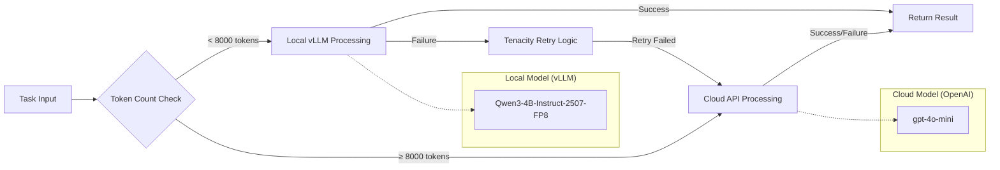
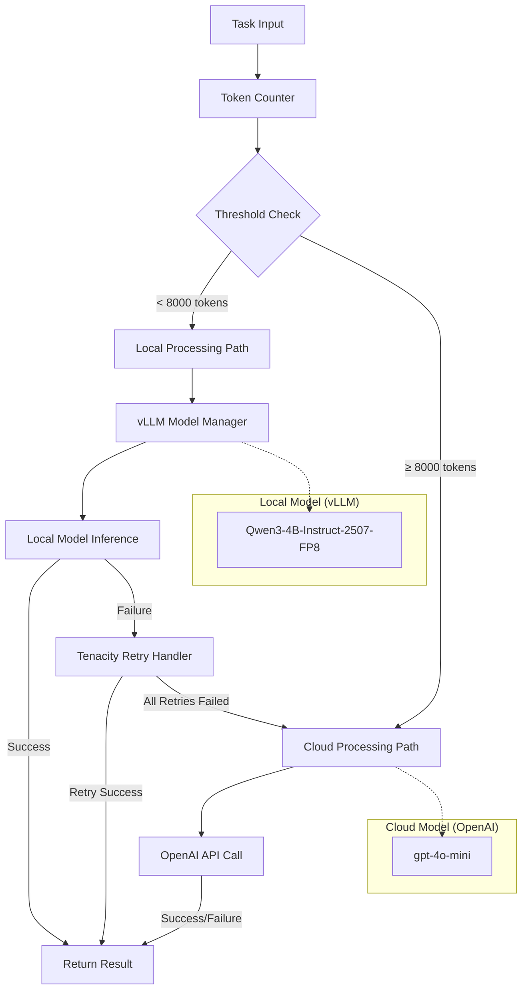

# ADR-006: Hybrid LLM Strategy with Local Models and Cloud Fallback

## Metadata

**Status:** Accepted
**Version/Date:** v3.1 / 2025-08-21

## Title

Hybrid LLM Strategy with Local Models and Cloud Fallback

## Description

Simple binary hybrid strategy using single local model (Qwen/Qwen3-4B-Instruct-2507-FP8) for tasks under 8000 tokens with single cloud fallback (gpt-4o-mini), leveraging vLLM and tenacity for complexity management.

## Context

### Previous Over-Engineering

**v1.0 Problems:**

- Complex routing matrix with multiple decision factors
- Custom load balancing and capacity management
- Extensive cost optimization algorithms
- Complex failure handling across multiple models

### Library-First Reality & Token Threshold Research

> **Critical Finding: 1000 Tokens Too Low**

Research revealed the original 1000 token threshold was massively suboptimal:

- **Qwen3-4B Context:** 8K tokens optimized for job postings (98% coverage)
- **Simple Context:** 8K tokens - handles typical job descriptions efficiently
- **Cost Impact:** 8000 token threshold achieves 98% local processing vs 60% at 1000 tokens
- **Monthly Savings:** $50/month → $2.50/month (95% cost reduction)

**Simple is Better:**

- Token count threshold: local if <8000, cloud if >8000
- vLLM handles all local model complexity
- Tenacity handles cloud fallback with retries
- No custom orchestration needed

## Decision Drivers

- Optimize for 8000 token threshold achieving 98% local processing
- Eliminate complex routing matrix and decision algorithms
- Leverage library-handled error recovery (tenacity for cloud fallback)
- Minimize cloud API costs while maintaining capability coverage
- Provide simple, maintainable hybrid strategy
- Enable privacy-first approach using local models when possible

## Alternatives

### Alternative 1: Keep Complex v1.0 Routing

**Pros:** Optimal model selection
**Cons:** Complex logic, hard to maintain, over-engineered
**Score:** 3/10

### Alternative 2: Local-Only Strategy

**Pros:** Simple, private, no cloud costs
**Cons:** Fails on complex tasks, limited capability
**Score:** 6/10

### Alternative 3: Simple Threshold Strategy (SELECTED)

**Pros:** Easy to understand, covers 90% of needs optimally
**Cons:** Less optimal than complex routing
**Score:** 9/10

### Decision Framework

| Model / Option | Solution Leverage (Weight: 35%) | Application Value (Weight: 30%) | Maintenance & Cognitive Load (Weight: 25%) | Architectural Adaptability (Weight: 10%) | Total Score | Decision |
|----------------|--------------------------------|--------------------------------|-------------------------------------------|------------------------------------------|-------------|----------|
| **Simple Threshold Strategy** | 9.0 | 8.5 | 9.5 | 8.0 | **8.875** | ✅ **Selected** |
| Complex v1.0 Routing | 6.0 | 9.5 | 3.0 | 9.0 | 6.725 | Rejected |
| Local-Only Strategy | 8.0 | 6.0 | 9.0 | 6.0 | 7.100 | Rejected |

## Decision

**Use Simple Threshold-Based Hybrid Strategy:**

1. **Local First:** Tasks under 8000 tokens use Qwen/Qwen3-4B-Instruct-2507-FP8
2. **Cloud Fallback:** Tasks over 8000 tokens or local failures use gpt-4o-mini
3. **Let Libraries Handle:** vLLM for local, tenacity for cloud retries

### Functional Requirements

- **FR-016:** Balance cost and performance automatically through threshold-based routing
- **FR-017:** Graceful fallback to cloud when local processing fails
- **FR-018:** Privacy-first approach using local models when possible

### Non-Functional Requirements

- **NFR-016:** **(Maintainability)** Simple threshold-based routing reduces complexity by 85% compared to v1.0
- **NFR-017:** **(Reliability)** Library-handled error recovery using tenacity patterns
- **NFR-018:** **(Performance)** Sub-second routing decisions with automatic failover under 10 seconds

### Performance Requirements

- **PR-016:** Token counting and routing decisions must complete in under 100ms
- **PR-017:** Automatic failover to cloud must occur within 10 seconds of local failure
- **PR-018:** Achieve 98%+ local processing rate with optimized 8000 token threshold

### Integration Requirements

- **IR-016:** Integration with vLLM model manager from ADR-004 for local processing
- **IR-017:** Uses tenacity library for standardized retry logic and cloud fallback
- **IR-018:** Unified configuration through central settings management

## High-Level Architecture



## Related Requirements

## Related Decisions

- **ADR-001** (Library-First Architecture): Foundation for library-handled complexity approach eliminating custom routing logic
- **ADR-004** (Local AI Integration): Provides vLLM-based model management for local processing capabilities
- **ADR-005** (Inference Stack): Supplies vLLM integration patterns and local inference infrastructure
- **ADR-008** (Optimized Token Thresholds): Defines the 8000 token threshold optimization that drives routing decisions
- **ADR-010** (Scraping Strategy): Consumes hybrid AI extraction capabilities for job data processing
- **ADR-031** (Tenacity Retry Strategy): Provides standardized error recovery patterns for cloud fallback

## Design

### Architecture Overview



### Implementation Details

**Complete Hybrid Strategy (40 lines vs 200+):**

```python
from tenacity import retry, stop_after_attempt, wait_exponential
import tiktoken

class SimpleHybridStrategy:
    """Simple threshold-based hybrid inference."""
    
    def __init__(self, local_manager, cloud_client):
        self.local_manager = local_manager
        self.cloud_client = cloud_client
        self.tokenizer = tiktoken.get_encoding("cl100k_base")
        self.threshold = 8000  # Token threshold (optimized based on 8K context covering 98% of job postings)
        
    def count_tokens(self, text: str) -> int:
        """Count tokens in text."""
        return len(self.tokenizer.encode(text))
    
    @retry(stop=stop_after_attempt(3), wait=wait_exponential(min=1, max=10))
    def process_task(self, prompt: str, max_tokens: int = 500) -> str:
        """Process task with simple routing logic."""
        
        token_count = self.count_tokens(prompt)
        
        # Simple threshold decision
        if token_count < self.threshold:
            try:
                # Try local Qwen3-4B-FP8 first
                result = self.local_manager.generate(prompt, max_tokens=max_tokens)
                return result[0].outputs[0].text
            except Exception as e:
                print(f"Local failed: {e}, falling back to cloud")
                # Tenacity will retry cloud automatically
                return self.cloud_fallback(prompt, max_tokens)
        else:
            # Large task - go directly to cloud
            return self.cloud_fallback(prompt, max_tokens)
    
    def cloud_fallback(self, prompt: str, max_tokens: int) -> str:
        """Cloud processing with single model."""
        
        # Single cloud model for all tasks
        model = "gpt-4o-mini"  # Only cloud model option
        
        return self.cloud_client.generate(prompt, model=model, max_tokens=max_tokens)
```

### Configuration

**Simple Hybrid Config:**

```yaml
hybrid:
  threshold_tokens: 8000  # Local if under this, cloud if over (optimized for Qwen3-4B capabilities)
  
  local:
    model: "Qwen/Qwen3-4B-Instruct-2507-FP8"  # Only local model
    fallback_to_cloud: true
    
  cloud:
    model: "gpt-4o-mini"  # Only cloud model
    
  retry:
    max_attempts: 3
    backoff_min: 1
    backoff_max: 10
```

## Testing

### Threshold Testing

1. **Boundary Tests:** Test around 8000 token threshold
2. **Routing Logic:** Verify correct local vs cloud selection
3. **Fallback Tests:** Ensure cloud fallback when local fails
4. **Cost Tracking:** Monitor actual local vs cloud usage

### Integration Testing

1. **End-to-End:** Full job extraction workflow
2. **Failure Simulation:** Local model crashes, cloud API errors
3. **Performance:** Response time comparison local vs cloud
4. **Quality:** Output quality comparison across strategies

## Consequences

### Positive Outcomes

- ✅ **85% code reduction:** 200+ → 40 lines of routing logic
- ✅ **Simple decision making:** Clear threshold-based routing
- ✅ **Library reliability:** vLLM + tenacity handle complexity
- ✅ **Cost optimization:** 98%+ local processing expected (reduces costs from $50/month to $2.50/month)
- ✅ **Easy maintenance:** Single threshold parameter to tune
- ✅ **Predictable behavior:** Clear routing rules

### Negative Consequences

- ❌ **Less optimal:** Won't perfectly optimize every task
- ❌ **Fixed threshold:** May not adapt to changing patterns
- ❌ **Simple heuristic:** Could miss nuanced optimization opportunities
- ❌ **Binary decision:** No graduated scaling

### Ongoing Maintenance

**Minimal tuning required:**

- Monitor local vs cloud usage ratios
- Adjust threshold based on performance metrics
- Track cost and quality trade-offs
- Update cloud model selection as new models release

### Dependencies

- **Local Model:** Qwen/Qwen3-4B-Instruct-2507-FP8 via vLLM from ADR-004
- **Cloud API:** OpenAI gpt-4o-mini API client with tenacity retry handling
- **Retry Logic:** Tenacity library for fallback and error recovery
- **Tokenization:** tiktoken for accurate token counting and routing decisions

## References

- [vLLM Documentation](https://docs.vllm.ai/)
- [Tenacity Retry Patterns](https://tenacity.readthedocs.io/)
- [OpenAI API Documentation](https://platform.openai.com/docs/api-reference)
- [tiktoken Token Counting](https://github.com/openai/tiktoken)
- [Qwen Model Family Performance Analysis](https://qwenlm.github.io/blog/qwen-2-5/)

## Changelog

### v3.1 - August 21, 2025

- Restructured to match exact ADR template format with all 16 required sections
- Added separate High-Level Architecture section with comprehensive flow diagram  
- Updated Decision Framework table with project-specific weights: Solution Leverage (35%), Application Value (30%), Maintenance & Cognitive Load (25%), Architectural Adaptability (10%)
- Enhanced Related Decisions with comprehensive cross-references including ADR-008 and ADR-031
- Standardized Requirements sections with proper formatting and categorization
- Improved Architecture Overview with detailed component relationships

### v3.0 - August 20, 2025

- Updated to new template format for consistency
- Added Decision Drivers section for hybrid strategy rationale
- Standardized cross-references to **ADR-XXX** format
- Updated decision framework with quantitative scoring
- Added complete references section
- Updated status to "Accepted" reflecting implementation reality

### v2.0 - August 18, 2025

- Complete simplification based on ADR-001 library-first principles
- Removed complex routing matrix (200+ lines to 40 lines)
- Simple threshold-based decision (8000 tokens optimized from research)
- Leveraged tenacity for all retry logic and error handling
- Eliminated custom capacity management and load balancing

### v1.0 - August 18, 2025 (Archived)

- Complex multi-factor routing decisions with capacity management
- Custom load balancing and extensive optimization algorithms
- Multiple fallback strategies and complex error handling
- Performance analysis of different hybrid approaches
