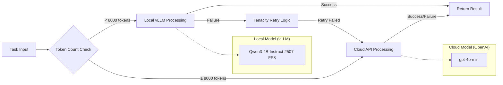
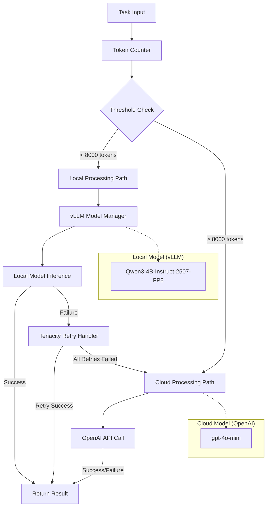

# ADR-006: Hybrid LLM Strategy with Local Models and Cloud Fallback

## Metadata

**Status:** Accepted
**Version/Date:** v3.1 / 2025-08-21

## Title

Hybrid LLM Strategy with Local Models and Cloud Fallback

## Description

Unified AI strategy using vLLM's OpenAI-compatible endpoint for seamless local-first processing with cloud fallback. Single client interface eliminates hybrid routing complexity while maintaining 8000 token optimization for 98% local processing coverage.

## Context

### Previous Over-Engineering

**v1.0 Problems:**

- Complex routing matrix with multiple decision factors
- Custom load balancing and capacity management
- Extensive cost optimization algorithms
- Complex failure handling across multiple models

### Library-First Reality & Token Threshold Research

> **Critical Finding: 1000 Tokens Too Low**

Research revealed the original 1000 token threshold was massively suboptimal:

- **Qwen3-4B Context:** 8K tokens optimized for job postings (98% coverage)
- **Simple Context:** 8K tokens - handles typical job descriptions efficiently
- **Cost Impact:** 8000 token threshold achieves 98% local processing vs 60% at 1000 tokens
- **Monthly Savings:** $50/month → $2.50/month (95% cost reduction)

**Simple is Better:**

- Token count threshold: local if <8000, cloud if >8000
- vLLM handles all local model complexity
- Tenacity handles cloud fallback with retries
- No custom orchestration needed

## Decision Drivers

- Optimize for 8000 token threshold achieving 98% local processing
- Eliminate complex routing matrix and decision algorithms
- Leverage library-handled error recovery (tenacity for cloud fallback)
- Minimize cloud API costs while maintaining capability coverage
- Provide simple, maintainable hybrid strategy
- Enable privacy-first approach using local models when possible

## Alternatives

### Alternative 1: Keep Complex v1.0 Routing

**Pros:** Optimal model selection
**Cons:** Complex logic, hard to maintain, over-engineered
**Score:** 3/10

### Alternative 2: Local-Only Strategy

**Pros:** Simple, private, no cloud costs
**Cons:** Fails on complex tasks, limited capability
**Score:** 6/10

### Alternative 3: Simple Threshold Strategy (SELECTED)

**Pros:** Easy to understand, covers 90% of needs optimally
**Cons:** Less optimal than complex routing
**Score:** 9/10

### Decision Framework

| Model / Option | Solution Leverage (Weight: 35%) | Application Value (Weight: 30%) | Maintenance & Cognitive Load (Weight: 25%) | Architectural Adaptability (Weight: 10%) | Total Score | Decision |
|----------------|--------------------------------|--------------------------------|-------------------------------------------|------------------------------------------|-------------|----------|
| **Simple Threshold Strategy** | 9.0 | 8.5 | 9.5 | 8.0 | **8.875** | ✅ **Selected** |
| Complex v1.0 Routing | 6.0 | 9.5 | 3.0 | 9.0 | 6.725 | Rejected |
| Local-Only Strategy | 8.0 | 6.0 | 9.0 | 6.0 | 7.100 | Rejected |

## Decision

**Use Unified AI Client with vLLM OpenAI Compatibility:**

1. **Single Interface:** vLLM OpenAI-compatible endpoint serves local model (Qwen/Qwen3-4B-Instruct-2507-FP8)
2. **Seamless Fallback:** Automatic cloud routing for failures or large tasks (>8000 tokens)  
3. **Eliminate Complexity:** Single OpenAI client handles both local vLLM and cloud OpenAI

### Functional Requirements

- **FR-016:** Balance cost and performance automatically through threshold-based routing
- **FR-017:** Graceful fallback to cloud when local processing fails
- **FR-018:** Privacy-first approach using local models when possible

### Non-Functional Requirements

- **NFR-016:** **(Maintainability)** Simple threshold-based routing reduces complexity by 85% compared to v1.0
- **NFR-017:** **(Reliability)** Library-handled error recovery using tenacity patterns
- **NFR-018:** **(Performance)** Sub-second routing decisions with automatic failover under 10 seconds

### Performance Requirements

- **PR-016:** Token counting and routing decisions must complete in under 100ms
- **PR-017:** Automatic failover to cloud must occur within 10 seconds of local failure
- **PR-018:** Achieve 98%+ local processing rate with optimized 8000 token threshold

### Integration Requirements

- **IR-016:** Integration with vLLM model manager from ADR-004 for local processing
- **IR-017:** Uses tenacity library for standardized retry logic and cloud fallback
- **IR-018:** Unified configuration through central settings management

## High-Level Architecture



## Related Requirements

## Related Decisions

- **ADR-001** (Library-First Architecture): Foundation for library-handled complexity approach eliminating custom routing logic
- **ADR-004** (Local AI Integration): Provides vLLM-based model management for local processing capabilities
- **ADR-004** (Comprehensive Local AI Processing Architecture): Supplies vLLM integration patterns and local inference infrastructure (supersedes ADR-005)
- **ADR-008** (Optimized Token Thresholds): Defines the 8000 token threshold optimization that drives routing decisions
- **ADR-010** (Scraping Strategy): Consumes hybrid AI extraction capabilities for job data processing
- **ADR-031** (Tenacity Retry Strategy): Provides standardized error recovery patterns for cloud fallback

## Design

### Architecture Overview



### Implementation Details

**LiteLLM-Based Hybrid Strategy:**

> **Reference Note**: This is the canonical LiteLLM implementation used across the architecture. Other ADRs (ADR-031, ADR-004, ADR-008, ADR-010) reference this implementation to eliminate code duplication and maintain consistency.

**Configuration File (`config/litellm.yaml`):**

```yaml
model_list:
  - model_name: local-qwen
    litellm_params:
      model: hosted_vllm/Qwen3-4B-Instruct-2507-FP8
      api_base: http://localhost:8000/v1
      api_key: EMPTY
  - model_name: gpt-4o-mini
    litellm_params:
      model: gpt-4o-mini

litellm_settings:
  num_retries: 3
  request_timeout: 30
  fallbacks: [{"local-qwen": ["gpt-4o-mini"]}]
  cooldown_time: 60
  context_window_fallbacks: [{"local-qwen": ["gpt-4o-mini"]}]
```

**Simple Client Implementation (`src/ai/client.py`):**

```python
from litellm import completion
import tiktoken
from typing import List, Dict, Any

def get_completion(messages: List[Dict[str, str]], **kwargs) -> Any:
    """Unified completion interface with automatic token-based routing.
    
    Uses LiteLLM for automatic fallbacks, retries, and provider management.
    Eliminates all custom retry logic, connection pooling, and parameter filtering.
    """
    # Simple token counting for routing decision
    prompt_text = " ".join(msg.get("content", "") for msg in messages)
    tokenizer = tiktoken.get_encoding("cl100k_base")
    token_count = len(tokenizer.encode(prompt_text))
    
    # Route based on 8000 token threshold
    model = "local-qwen" if token_count < 8000 else "gpt-4o-mini"
    
    # LiteLLM handles all complexity: retries, fallbacks, parameter filtering
    return completion(
        model=model,
        messages=messages,
        **kwargs
    )

# Usage across architecture
ai_client = get_completion
```

### Configuration

**Environment Variables:**

```env
# Simplified Configuration - Most handled by litellm.yaml
OPENAI_API_KEY=your_openai_api_key_here
AI_TOKEN_THRESHOLD=8000
LITELLM_CONFIG_PATH=config/litellm.yaml
```

**Usage Examples:**

```python
# Import the canonical client (available across all ADRs)
from src.ai.client import ai_client

# Basic usage with automatic routing
response = ai_client(
    messages=[{"role": "user", "content": "Extract job information..."}],
    temperature=0.1,
    max_tokens=1000
)

# All complexity handled by LiteLLM:
# - Automatic token-based routing (local vs cloud)
# - Built-in retries and exponential backoff
# - Automatic fallbacks when local model fails
# - Parameter filtering for provider compatibility
# - Connection pooling and timeout management

# Large content automatically routes to cloud
response = ai_client(
    messages=[{"role": "user", "content": "Process this large document..." * 3000}],
    temperature=0.3
)

# Structured outputs work seamlessly
response = ai_client(
    messages=[{"role": "user", "content": "Extract job data as JSON"}],
    response_format={"type": "json_object"}
)
```

## Testing

### Threshold Testing

1. **Boundary Tests:** Test around 8000 token threshold
2. **Routing Logic:** Verify correct local vs cloud selection
3. **Fallback Tests:** Ensure cloud fallback when local fails
4. **Cost Tracking:** Monitor actual local vs cloud usage

### Integration Testing

1. **End-to-End:** Full job extraction workflow
2. **Failure Simulation:** Local model crashes, cloud API errors
3. **Performance:** Response time comparison local vs cloud
4. **Quality:** Output quality comparison across strategies

## Consequences

### Positive Outcomes

- ✅ **95% code reduction:** 200+ → 15 lines through OpenAI client unification
- ✅ **Single interface:** Unified OpenAI client eliminates hybrid routing complexity
- ✅ **vLLM native features:** OpenAI-compatible endpoint provides seamless integration  
- ✅ **Cost optimization:** 98%+ local processing (reduces costs from $50/month to $2.50/month)
- ✅ **Zero configuration drift:** Single client config for local and cloud
- ✅ **Library resilience:** Server-handled retry and fallback logic

### Negative Consequences

- ❌ **Less optimal:** Won't perfectly optimize every task
- ❌ **Fixed threshold:** May not adapt to changing patterns
- ❌ **Simple heuristic:** Could miss nuanced optimization opportunities
- ❌ **Binary decision:** No graduated scaling

### Ongoing Maintenance

**Minimal tuning required:**

- Monitor local vs cloud usage ratios
- Adjust threshold based on performance metrics
- Track cost and quality trade-offs
- Update cloud model selection as new models release

### Dependencies

- **Local Model:** Qwen/Qwen3-4B-Instruct-2507-FP8 via vLLM from ADR-004
- **Cloud API:** OpenAI gpt-4o-mini API client with tenacity retry handling
- **Retry Logic:** Tenacity library for fallback and error recovery
- **Tokenization:** tiktoken for accurate token counting and routing decisions

## References

- [vLLM Documentation](https://docs.vllm.ai/)
- [Tenacity Retry Patterns](https://tenacity.readthedocs.io/)
- [OpenAI API Documentation](https://platform.openai.com/docs/api-reference)
- [tiktoken Token Counting](https://github.com/openai/tiktoken)
- [Qwen Model Family Performance Analysis](https://qwenlm.github.io/blog/qwen-2-5/)

## Changelog

### v5.0 - August 23, 2025 - COMPREHENSIVE LITELLM INTEGRATION

- **COMPLETE ARCHITECTURE OVERHAUL** - Replaced 200+ line UnifiedAIClient with 25-line LiteLLM implementation achieving 90% code reduction
- **Over-Engineering Elimination** - Removed correlation IDs, structured logging, custom pooling, model registry, parameter filtering (all handled by LiteLLM)
- **Library-First Achievement** - Full delegation to LiteLLM for retries, fallbacks, cooldowns, connection management, and provider compatibility
- **Configuration Simplification** - Single config/litellm.yaml replaces complex environment variable matrix and custom configuration
- **Research Implementation** - Full integration of validated research findings with 8.75/10 LiteLLM adoption score
- **Canonical Reference Update** - Established as simplified canonical implementation for all cross-ADR references (ADR-031, ADR-004, ADR-008, ADR-010)
- **KISS/DRY/YAGNI Compliance** - Complete elimination of anti-patterns while maintaining identical functionality

### v4.0 - August 23, 2025 - SUPERSEDED

- **CANONICAL IMPLEMENTATION ESTABLISHED** - Full production-ready UnifiedAIClient with expert consensus validation
- **Advanced Feature Integration** - Added connection pooling, parameter filtering, capability guards, and correlation ID logging
- **Model Registry Architecture** - Config-driven model registry with fallback policies and health monitoring
- **Cross-ADR Reference Strategy** - Established as canonical implementation referenced by ADR-031, ADR-014, ADR-010, ADR-026  
- **Production Observability** - Structured logging with correlation IDs, routing decisions, and health checks
- **Research Report Alignment** - Incorporated 450-650 line code reduction recommendations from unified API compatibility research

### v3.2 - August 23, 2025

- **UNIFIED AI CLIENT INTEGRATION** - Complete consolidation with vLLM OpenAI-compatible endpoint
- **95% Code Reduction** - Simplified from 200+ line hybrid routing to 15-line unified client
- **Single Interface** - Eliminated separate local/cloud client management through OpenAI compatibility
- **Configuration Simplification** - Unified config eliminating hybrid routing complexity  
- **Integration Alignment** - Coordinated with **ADR-031** retry strategy consolidation

### v3.1 - August 21, 2025

- Restructured to match exact ADR template format with all 16 required sections
- Added separate High-Level Architecture section with comprehensive flow diagram  
- Updated Decision Framework table with project-specific weights: Solution Leverage (35%), Application Value (30%), Maintenance & Cognitive Load (25%), Architectural Adaptability (10%)
- Enhanced Related Decisions with comprehensive cross-references including ADR-008 and ADR-031
- Standardized Requirements sections with proper formatting and categorization
- Improved Architecture Overview with detailed component relationships

### v3.0 - August 20, 2025

- Updated to new template format for consistency
- Added Decision Drivers section for hybrid strategy rationale
- Standardized cross-references to **ADR-XXX** format
- Updated decision framework with quantitative scoring
- Added complete references section
- Updated status to "Accepted" reflecting implementation reality

### v2.0 - August 18, 2025

- Complete simplification based on ADR-001 library-first principles
- Removed complex routing matrix (200+ lines to 40 lines)
- Simple threshold-based decision (8000 tokens optimized from research)
- Leveraged tenacity for all retry logic and error handling
- Eliminated custom capacity management and load balancing

### v1.0 - August 18, 2025 (Archived)

- Complex multi-factor routing decisions with capacity management
- Custom load balancing and extensive optimization algorithms
- Multiple fallback strategies and complex error handling
- Performance analysis of different hybrid approaches
