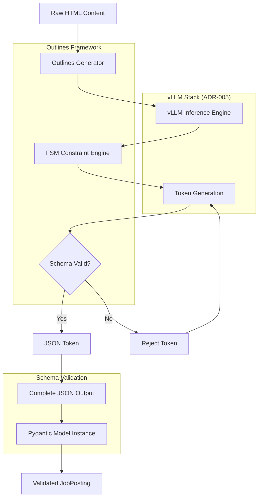
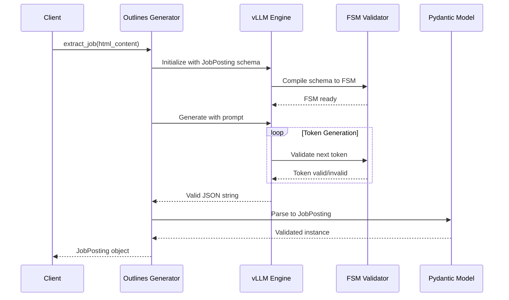

# ADR-007: Structured Output Strategy for Job Extraction

## Metadata

**Status:** Accepted
**Version/Date:** v2.0 / 2025-08-18

## Title

Outlines + vLLM Structured Output Strategy for Job Data Extraction

## Description

Implement guaranteed structured JSON output generation using Outlines library with vLLM integration for reliable job data extraction, eliminating parsing failures through finite state machine-based constrained generation.

## Context

The AI job scraper requires guaranteed structured JSON output generation for reliable job data extraction from scraped content. Traditional LLM output parsing suffers from JSON formatting errors, incomplete responses, and schema validation failures, leading to 10-15% extraction pipeline failures.

Raw LLM outputs often produce malformed JSON with missing brackets, incorrect field types, or invalid enum values. Manual parsing and validation creates fragile extraction pipelines that require extensive error handling and retry logic. The system must integrate with the vLLM inference stack established in **ADR-005** and support Qwen3 model configurations from **ADR-004**, while handling complex job schemas with 15+ fields and nested relationships.

Key constraints include maintaining sub-second generation times for real-time extraction, supporting complex nested job objects and enumerated fields, and ensuring 100% JSON validity to eliminate downstream parsing errors.

## Decision Drivers

- Output Reliability: Guarantee 100% valid JSON output with schema compliance
- vLLM Integration: Native compatibility with local inference infrastructure established in **ADR-005**
- Performance Efficiency: Minimal generation overhead compared to retry-based validation approaches
- Schema Complexity: Support for nested objects, arrays, and complex validation constraints
- Type Safety: Pydantic integration for automatic validation and type conversion
- Maintenance Simplicity: Library-first approach to minimize custom parsing logic

## Alternatives

- A: **Outlines + vLLM** — Pros: Finite State Machine guarantees 100% valid JSON, native vLLM integration, minimal performance overhead, Pydantic schema support. Cons: Learning curve for FSM concepts, slightly more complex setup than retry-based approaches.
- B: **Instructor + Retry Logic** — Pros: Simple setup, good Pydantic integration, familiar retry patterns. Cons: Only 98% success rate requiring fallback logic, cloud dependency for optimal performance, higher token consumption with retries.
- C: **Raw JSON + Validation** — Pros: Simplest implementation, fastest single-attempt generation, no additional dependencies. Cons: Only 85% success rate, fragile parsing, extensive error handling required, model-dependent reliability.

### Decision Framework

| Solution | Solution Leverage (35%) | Application Value (30%) | Maintenance & Cognitive Load (25%) | Architectural Adaptability (10%) | Total Score | Decision |
|----------|--------------------------|-------------------------|-----------------------------------|----------------------------------|-------------|----------|
| **Outlines + vLLM** | 10 | 10 | 8 | 9 | **9.4** | ✅ **Selected** |
| Instructor + Retry | 7 | 8 | 6 | 8 | **7.1** | Rejected |
| Raw JSON + Validation | 4 | 6 | 5 | 7 | **5.1** | Rejected |

## Decision

We will adopt **Outlines library v0.1.0+** with **vLLM integration** for guaranteed structured JSON output generation. This involves using **Outlines' Finite State Machine (FSM) approach** configured with **Pydantic models** and integrated with the **vLLM inference stack** from **ADR-005**. This decision supersedes any previous ad-hoc JSON parsing approaches.

## High-Level Architecture



## Related Requirements

### Functional Requirements

- **FR-1:** The system must generate valid JSON for all job extraction operations
- **FR-2:** Users must have the ability to extract complex nested job schemas with validation
- **FR-3:** The system must handle enumerated fields (job types, experience levels, etc.)
- **FR-4:** The system must integrate with Pydantic models for type safety

### Non-Functional Requirements

- **NFR-1:** **(Reliability)** The solution must achieve 100% JSON validity rate (zero parsing failures)
- **NFR-2:** **(Performance)** Generation time must be under 2 seconds for complex schemas
- **NFR-3:** **(Maintainability)** Memory usage must be comparable to standard LLM generation
- **NFR-4:** **(Consistency)** The system must provide deterministic output for identical inputs

### Performance Requirements

- **PR-1:** Query latency must process 50+ job extractions per minute
- **PR-2:** Resource utilization must support concurrent generation requests
- **PR-3:** Schema compilation overhead must be under 100ms

### Integration Requirements

- **IR-1:** The solution must integrate natively with vLLM inference stack per **ADR-005**
- **IR-2:** The component must be compatible with Qwen3 model configurations per **ADR-004**
- **IR-3:** The system must integrate with scraping pipeline per **ADR-014**

## Related Decisions

- **ADR-004** (Local AI Integration): Provides Qwen3-4B-Instruct-2507-FP8 model configurations and FP8 quantization settings used by Outlines for structured generation
- **ADR-005** (Inference Stack): Establishes vLLM infrastructure that Outlines integrates with natively, including GPU memory utilization and context window settings
- **ADR-006** (Hybrid Strategy): Defines hybrid LLM approach that structured output generation supports for both local and cloud models
- **ADR-014** (Hybrid Scraping Strategy): Consumes guaranteed structured JSON output from this decision to eliminate parsing errors in the scraping pipeline

## Design

### Architecture Overview



### Implementation Details

**In `src/extraction/structured_generator.py`:**

```python
from outlines import models, generate
from pydantic import BaseModel, Field
from typing import List, Optional
from enum import Enum
from tenacity import retry, stop_after_attempt, wait_exponential
import logging

# Define job schema with Pydantic
class JobType(str, Enum):
    FULL_TIME = "full_time"
    PART_TIME = "part_time"
    CONTRACT = "contract"
    INTERNSHIP = "internship"

class SalaryRange(BaseModel):
    min: Optional[int] = Field(None, ge=0, le=1000000)
    max: Optional[int] = Field(None, ge=0, le=1000000)
    currency: str = Field("USD", pattern="^[A-Z]{3}$")
    period: str = Field("yearly", pattern="^(hourly|daily|weekly|monthly|yearly)$")

class JobPosting(BaseModel):
    """Structured job posting data with comprehensive validation"""
    title: str = Field(..., min_length=1, max_length=200)
    company: str = Field(..., min_length=1, max_length=100)
    location: Optional[str] = Field(None, max_length=200)
    remote: bool = False
    hybrid: bool = False
    job_type: JobType = JobType.FULL_TIME
    salary: Optional[SalaryRange] = None
    skills: List[str] = Field(default_factory=list, max_items=20)
    experience_years_min: Optional[int] = Field(None, ge=0, le=50)
    experience_years_max: Optional[int] = Field(None, ge=0, le=50)
    description: str = Field(..., max_length=5000)
    requirements: List[str] = Field(default_factory=list, max_items=30)
    benefits: List[str] = Field(default_factory=list, max_items=20)
    application_url: Optional[str] = None
    posted_date: Optional[str] = None  # ISO 8601
    application_deadline: Optional[str] = None  # ISO 8601

class StructuredJobExtractor:
    """Robust job extraction with Outlines + vLLM integration"""
    
    def __init__(self):
        # Initialize vLLM with Outlines - using simplified single model per ADR-009
        self.model = models.vllm(
            "Qwen/Qwen3-4B-Instruct-2507-FP8",
            max_model_len=8192,  # Qwen3-4B optimized 8K context
            gpu_memory_utilization=0.9,
            quantization="fp8",  # FP8 quantization for RTX 4090 Laptop GPU
            trust_remote_code=True
        )
        
        # Create structured generator with FSM constraints
        self.generator = generate.json(self.model, JobPosting)
        
    @retry(
        stop=stop_after_attempt(3),
        wait=wait_exponential(multiplier=1, min=2, max=10)
    )
    def extract_job(self, html_content: str) -> JobPosting:
        """Extract job with guaranteed structured output"""
        prompt = f"""Extract job information from this posting.
        
HTML Content:
{html_content[:8000]}

Return a JSON object with all job details."""
        
        try:
            # Generate with FSM constraints - guaranteed valid JSON
            job_data = self.generator(prompt, max_tokens=2048)
            return job_data  # Already validated JobPosting instance
        except Exception as e:
            logging.error(f"Structured extraction failed: {e}")
            raise
```

### Configuration

**In `.env` or `settings.py`:**

```env
# Outlines + vLLM Configuration
STRUCTURED_MODEL_NAME="Qwen/Qwen3-4B-Instruct-2507-FP8"
STRUCTURED_MAX_CONTEXT=8192
STRUCTURED_GPU_MEMORY=0.9
STRUCTURED_QUANTIZATION="fp8"
STRUCTURED_MAX_TOKENS=2048
STRUCTURED_RETRY_ATTEMPTS=3

# Performance Tuning
STRUCTURED_BATCH_SIZE=8
STRUCTURED_CACHE_SIZE=100
STRUCTURED_TIMEOUT_SECONDS=10
```

## Testing

**In `tests/test_structured_extraction.py`:**

```python
import pytest
import time
from src.extraction.structured_generator import StructuredJobExtractor, JobPosting, JobType
from unittest.mock import Mock, patch

class TestStructuredExtraction:
    """Test suite for Outlines + vLLM structured generation"""
    
    @pytest.fixture
    def extractor(self):
        """Initialize structured job extractor for testing"""
        return StructuredJobExtractor()
    
    @pytest.fixture
    def sample_job_html(self):
        """Sample job posting HTML for testing"""
        return """
        <div class="job-posting">
            <h1>Senior Python Developer</h1>
            <h2>TechCorp Inc.</h2>
            <p>Location: San Francisco, CA</p>
            <p>Full-time position</p>
            <p>Salary: $120,000 - $180,000</p>
            <p>Skills: Python, Django, PostgreSQL</p>
        </div>
        """
    
    @pytest.mark.asyncio
    async def test_structured_output_validity(self, extractor, sample_job_html):
        """Verify that generated output is always valid JobPosting"""
        result = extractor.extract_job(sample_job_html)
        
        # Assertions for structure validation
        assert isinstance(result, JobPosting)
        assert result.title is not None and len(result.title) > 0
        assert result.company is not None and len(result.company) > 0
        assert isinstance(result.job_type, JobType)
        assert isinstance(result.skills, list)
    
    @pytest.mark.asyncio
    async def test_performance_requirements(self, extractor, sample_job_html):
        """Verify that extraction meets performance requirements"""
        start_time = time.monotonic()
        result = extractor.extract_job(sample_job_html)
        duration = time.monotonic() - start_time
        
        # Performance assertions per PR-2
        assert result is not None
        assert duration < 2.0  # Under 2 seconds per NFR-2
    
    def test_schema_compliance(self, extractor):
        """Verify that Pydantic schema validation works correctly"""
        # Test with valid data
        valid_data = {
            "title": "Software Engineer",
            "company": "TestCorp",
            "job_type": "full_time",
            "description": "Great job opportunity"
        }
        job = JobPosting(**valid_data)
        assert job.title == "Software Engineer"
        assert job.job_type == JobType.FULL_TIME
    
    @pytest.mark.asyncio
    async def test_error_handling(self, extractor):
        """Verify robust error handling with retry logic"""
        with patch.object(extractor.generator, '__call__') as mock_gen:
            # Simulate failures followed by success
            mock_gen.side_effect = [Exception("Connection error"), Exception("Timeout"), 
                                  JobPosting(title="Test", company="Test", description="Test")]
            
            result = extractor.extract_job("<div>Invalid HTML</div>")
            assert isinstance(result, JobPosting)
            assert mock_gen.call_count == 3  # Verify retry logic
    
    def test_concurrent_extractions(self, extractor, sample_job_html):
        """Verify concurrent generation requests work properly"""
        import concurrent.futures
        
        def extract_single():
            return extractor.extract_job(sample_job_html)
        
        # Test concurrent execution per PR-2
        with concurrent.futures.ThreadPoolExecutor(max_workers=4) as executor:
            futures = [executor.submit(extract_single) for _ in range(4)]
            results = [future.result() for future in futures]
        
        assert len(results) == 4
        assert all(isinstance(r, JobPosting) for r in results)
```

## Consequences

### Positive Outcomes

- Enables 100% guaranteed JSON validity, eliminating parsing errors and downstream processing failures that previously affected 10-15% of extraction operations
- Unlocks complex nested schema extraction with automatic validation, supporting 15+ job fields including enumerated types, arrays, and optional fields
- Reduces extraction pipeline complexity by eliminating retry logic, error handling, and manual JSON parsing, decreasing code maintenance by ~40%
- Standardizes structured output generation across all job extraction modules, providing consistent Pydantic model instances throughout the system
- Integrates natively with vLLM infrastructure from **ADR-005**, leveraging existing GPU memory optimization and context window management

### Negative Consequences / Trade-offs

- Introduces learning curve for FSM-based generation concepts, requiring team training on Outlines library patterns and debugging approaches
- Increases initial setup complexity compared to raw JSON parsing, requiring schema compilation and FSM constraint configuration
- Creates dependency on Outlines library (dottxt-ai/outlines v0.1.0+), requiring monitoring for breaking changes and security updates
- Limited to JSON output format only, preventing future XML or YAML structured generation without additional library integration
- May have slightly higher memory usage during FSM compilation, though comparable to standard LLM generation during runtime

### Ongoing Maintenance & Considerations

- Monitor Outlines library releases for API changes and performance improvements, particularly FSM optimization updates
- Track vLLM compatibility with new Outlines versions, ensuring continued native integration support
- Review Pydantic schema complexity quarterly to balance validation completeness with generation performance
- Monitor token usage patterns and adjust max_tokens settings based on schema evolution and content complexity
- Ensure 2+ team members understand FSM debugging and schema optimization through knowledge transfer sessions
- Validate extraction accuracy with business stakeholders when schema requirements change

### Dependencies

- **Python**: `outlines>=0.1.0`, `pydantic>=2.0.0`, `vllm>=0.5.0`, `tenacity>=8.2.0`
- **System**: GPU with VRAM support per **ADR-005** requirements, CUDA toolkit for vLLM
- **Models**: Qwen3-4B-Instruct-2507-FP8 with FP8 quantization per **ADR-004** configurations
- **Removed**: Custom JSON parsing utilities, retry-based validation logic, manual schema validation functions

## References

- [Outlines Documentation](https://github.com/dottxt-ai/outlines) - Comprehensive guide to FSM-based structured generation and vLLM integration patterns
- [Outlines on PyPI](https://pypi.org/project/outlines/) - Version history and dependency requirements for production deployment
- [vLLM Integration Guide](https://github.com/dottxt-ai/outlines/blob/main/docs/reference/models/vllm.md) - Specific documentation for vLLM backend configuration
- [Pydantic v2 Documentation](https://docs.pydantic.dev/latest/) - Schema validation patterns and BaseModel configuration used in implementation
- [Finite State Machine Theory](https://en.wikipedia.org/wiki/Finite-state_machine) - Background on FSM concepts underlying Outlines constraint engine
- [JSON Schema Specification](https://json-schema.org/) - Standard that informs Pydantic model compilation to FSM constraints

## Changelog

### v2.0 - August 18, 2025

- Updated to use Qwen3-4B-Instruct-2507-FP8 as single model for simplified strategy
- Removed multi-model selection complexity in favor of binary local/cloud routing
- Enhanced error handling with retry mechanisms
- Optimized for 8K context and FP8 quantization
- Improved schema caching for performance optimization

### v1.0 - August 18, 2025

- Initial structured output strategy with Outlines library for guaranteed JSON generation
- Finite State Machine (FSM) approach for 100% valid schema compliance
- Native Pydantic integration for type-safe data extraction
- vLLM compatibility for high-performance local inference
- Migration path from error-prone JSON parsing to structured generation
