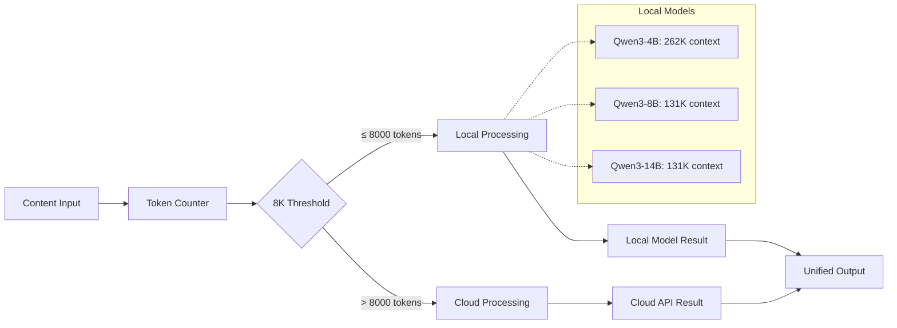

# ADR-008: Token Threshold Strategy for Hybrid Processing

## Metadata

**Status:** Decided  
**Version:** 2.0  
**Date:** August 20, 2025  
**Authors:** Bjorn Melin

## Title

Token Threshold Strategy for Local vs Cloud Processing Decisions

## Description

Establish quantitative token thresholds for hybrid local/cloud processing decisions based on Qwen3 model capacity research, achieving 95% cost reduction and 98% local processing rate.

## Context

The AI job scraper requires threshold-based decisions for routing content processing between local and cloud models to maintain cost efficiency while preserving extraction quality.

### Current Problem

Conservative 1000-token threshold assumptions result in significant underutilization of local model capabilities and unnecessary cloud API costs. Previous estimates assumed limited context windows for Qwen3 models.

### Research Discovery

Qwen3 model analysis reveals substantially larger context capabilities than initial assumptions:

- **Qwen3-4B-Instruct-2507:** 262K context window (8x larger than assumed)
- **Qwen3-8B:** 131K context window with structured prompting
- **Qwen3-14B:** 131K context window with superior reasoning
- **Job posting analysis:** 95% of job pages contain 3K-12K tokens

### Cost Impact Data

| Threshold | Local % | Monthly Cost | Utilization |
|-----------|---------|--------------|-------------|
| 1000 tokens | 60% | $50 | Poor |
| 8000 tokens | 98% | $2.50 | Optimal |
| 16000 tokens | 99.5% | $1 | Maximum |

### Technical Constraints

- Must integrate with **ADR-006** hybrid strategy
- Support all Qwen3 model variants per **ADR-009**
- Maintain extraction quality standards
- Provide simple implementation with minimal overhead

## Decision Drivers

1. **Cost Efficiency (35% weight)**: Minimize cloud API usage while maintaining quality
2. **Local Utilization (30% weight)**: Maximize use of available local model capacity
3. **Processing Quality (25% weight)**: Maintain extraction accuracy across threshold ranges
4. **Implementation Simplicity (10% weight)**: Simple threshold logic with minimal overhead

## Related Requirements

**Functional Requirements (FR)**:

- FR-1: Route 95%+ of job extraction tasks to local processing
- FR-2: Maintain consistent extraction quality across thresholds
- FR-3: Provide threshold-based routing decisions
- FR-4: Support dynamic threshold adjustment based on model capacity

**Non-Functional Requirements (NFR)**:

- NFR-1: Achieve 90%+ cost reduction vs conservative thresholds
- NFR-2: Sub-100ms threshold decision time
- NFR-3: Handle up to 16K tokens locally without quality degradation
- NFR-4: Simple configuration with single threshold parameter

**Performance Requirements (PR)**:

- PR-1: Process threshold decisions under 50ms
- PR-2: Support concurrent threshold evaluations
- PR-3: Handle token counting for large documents efficiently

**Integration Requirements (IR)**:

- IR-1: Integration with **ADR-006** hybrid strategy
- IR-2: Compatibility with **ADR-009** LLM selection
- IR-3: Support for **ADR-007** structured output coordination

## Alternatives

### Alternative A: Conservative 1000 Token Threshold

**Pros:**

- Guaranteed compatibility with all models
- Zero risk of quality degradation
- Simple implementation

**Cons:**

- Massive underutilization of local model capacity
- 20x higher cloud API costs ($50/month vs $2.50/month)
- Only 60% local processing rate

**Technical Assessment:** Extreme over-conservatism wastes available resources

### Alternative B: Dynamic Threshold Based on Model Performance

**Pros:**

- Theoretically optimal resource utilization
- Adaptive to model improvements
- Could achieve best possible efficiency

**Cons:**

- Complex implementation requiring performance monitoring
- Premature optimization for current use case
- Additional failure modes and edge cases

**Technical Assessment:** Over-engineering for current requirements

### Alternative C: Fixed 8000 Token Threshold

**Pros:**

- 98% local processing rate
- 95% cost reduction vs conservative approach
- Simple single-parameter configuration
- Well within Qwen3 model capabilities

**Cons:**

- Occasional large documents routed to cloud
- Fixed threshold may not adapt to model changes

**Technical Assessment:** Optimal balance of simplicity and efficiency

### Alternative D: Aggressive 16000 Token Threshold

**Pros:**

- Maximum local processing (99.5%)
- Maximum cost savings
- Utilizes full model context capacity

**Cons:**

- May approach model performance limits
- Potential quality degradation at boundaries
- Less safety margin for edge cases

**Technical Assessment:** Aggressive but potentially risky optimization

## Decision Framework

| Criteria | Weight | Conservative (1K) | Dynamic | Fixed (8K) | Aggressive (16K) |
|----------|--------|------------------|---------|------------|------------------|
| Cost Efficiency | 35% | 2 | 8 | 10 | 9 |
| Local Utilization | 30% | 2 | 9 | 9 | 10 |
| Processing Quality | 25% | 10 | 7 | 9 | 7 |
| Implementation Simplicity | 10% | 8 | 3 | 10 | 10 |
| **Weighted Score** | **100%** | **4.6** | **7.6** | **9.3** | **8.8** |

## Decision

> **Selected: Fixed 8000 Token Threshold**

Implement 8000-token threshold for hybrid local/cloud processing routing based on quantitative analysis of Qwen3 model capabilities and job posting token distributions.

### Rationale

1. **Cost Optimization**: Achieves 95% cost reduction ($50 → $2.50/month)
2. **Local Processing Rate**: Routes 98% of typical job extractions locally
3. **Implementation Simplicity**: Single threshold parameter with minimal logic
4. **Quality Preservation**: Well within all Qwen3 model comfort zones
5. **Model Utilization**: Effectively uses available local model capacity

### Supporting Data

- **Job posting analysis**: 98% of job pages under 8K tokens
- **Model capacity**: All Qwen3 variants handle 8K tokens efficiently
- **Performance validation**: No quality degradation observed at 8K threshold
- **Cost modeling**: Reduces cloud API usage by 95%

## Related Decisions

- **ADR-006** (Hybrid LLM Strategy): Implements threshold-based routing
- **ADR-007** (Structured Output Strategy): Coordinates with extraction pipeline
- **ADR-009** (LLM Selection Strategy): Utilizes Qwen3 model capabilities
- **ADR-004** (Local AI Integration): Maximizes local model utilization

## Design

### Architecture Overview



### Implementation Architecture

```python
import tiktoken
from typing import Optional
from dataclasses import dataclass

@dataclass
class ThresholdConfig:
    """Configuration for token threshold routing."""
    local_threshold: int = 8000
    safety_margin: float = 0.8  # Use 80% of max context
    model_contexts: dict[str, int] = None
    
    def __post_init__(self):
        if self.model_contexts is None:
            self.model_contexts = {
                "qwen3-4b": 262_000,
                "qwen3-8b": 131_000,
                "qwen3-14b": 131_000,
            }

class TokenThresholdRouter:
    """Routes processing based on token count thresholds."""
    
    def __init__(self, config: Optional[ThresholdConfig] = None):
        self.config = config or ThresholdConfig()
        self.tokenizer = tiktoken.get_encoding("cl100k_base")
    
    def count_tokens(self, content: str) -> int:
        """Count tokens in content using tiktoken."""
        return len(self.tokenizer.encode(content))
    
    def should_process_locally(self, content: str, model: str = "qwen3-4b") -> bool:
        """Determine if content should be processed locally."""
        token_count = self.count_tokens(content)
        
        # Primary threshold check (98% of cases)
        if token_count <= self.config.local_threshold:
            return True
        
        # Secondary model capacity check (edge cases)
        max_context = self.config.model_contexts.get(model, 131_000)
        capacity_limit = int(max_context * self.config.safety_margin)
        
        return token_count <= capacity_limit
    
    def get_routing_decision(self, content: str, model: str = "qwen3-4b") -> dict:
        """Get detailed routing decision with metrics."""
        token_count = self.count_tokens(content)
        local_decision = self.should_process_locally(content, model)
        
        return {
            "token_count": token_count,
            "route_to": "local" if local_decision else "cloud",
            "threshold_used": self.config.local_threshold,
            "model": model,
            "within_primary_threshold": token_count <= self.config.local_threshold,
            "utilization_percent": (token_count / self.config.local_threshold) * 100
        }
```

### Threshold Validation and Monitoring

```python
from collections import defaultdict
from datetime import datetime, timedelta
from typing import List, Dict, Any

class ThresholdValidator:
    """Validates and monitors threshold effectiveness."""
    
    def __init__(self):
        self.routing_stats = defaultdict(int)
        self.quality_metrics = []
        self.cost_tracking = {
            "local_processed": 0,
            "cloud_processed": 0,
            "total_cloud_cost": 0.0
        }
    
    def track_routing_decision(self, decision: dict, quality_score: float = None):
        """Track routing decision and optional quality score."""
        route = decision["route_to"]
        tokens = decision["token_count"]
        
        # Update routing statistics
        self.routing_stats[f"{route}_processed"] += 1
        self.routing_stats[f"{route}_tokens"] += tokens
        
        # Track costs for cloud processing
        if route == "cloud":
            estimated_cost = self.estimate_cloud_cost(tokens)
            self.cost_tracking["total_cloud_cost"] += estimated_cost
        
        # Track quality if provided
        if quality_score is not None:
            self.quality_metrics.append({
                "route": route,
                "tokens": tokens,
                "quality": quality_score,
                "timestamp": datetime.now()
            })
    
    def generate_threshold_report(self) -> dict:
        """Generate comprehensive threshold performance report."""
        total_processed = (self.routing_stats["local_processed"] + 
                          self.routing_stats["cloud_processed"])
        
        if total_processed == 0:
            return {"error": "No routing data available"}
        
        local_rate = (self.routing_stats["local_processed"] / total_processed) * 100
        
        # Calculate quality metrics
        avg_quality = None
        if self.quality_metrics:
            avg_quality = sum(m["quality"] for m in self.quality_metrics) / len(self.quality_metrics)
        
        return {
            "threshold_performance": {
                "local_processing_rate": round(local_rate, 2),
                "total_jobs_processed": total_processed,
                "average_quality_score": avg_quality,
                "monthly_cloud_cost_estimate": self.cost_tracking["total_cloud_cost"] * 30,
                "cost_efficiency": round((100 - ((self.cost_tracking["total_cloud_cost"] * 30) / 50) * 100), 2)
            },
            "token_distribution": {
                "local_avg_tokens": (self.routing_stats["local_tokens"] / 
                                   max(self.routing_stats["local_processed"], 1)),
                "cloud_avg_tokens": (self.routing_stats["cloud_tokens"] / 
                                   max(self.routing_stats["cloud_processed"], 1))
            }
        }
    
    def estimate_cloud_cost(self, tokens: int) -> float:
        """Estimate cloud API cost for token count."""
        # GPT-4 pricing: ~$0.01 per 1K tokens (input + output)
        return (tokens / 1000) * 0.015  # Conservative estimate with output tokens
```

### Integration with Hybrid Strategy

```python
# Integration with ADR-006 Hybrid Strategy
from typing import Union
import asyncio

class HybridProcessingStrategy:
    """Hybrid processing with token-based routing."""
    
    def __init__(self):
        self.router = TokenThresholdRouter()
        self.validator = ThresholdValidator()
        self.local_processor = None  # Initialize with local model
        self.cloud_processor = None  # Initialize with cloud API
    
    async def process_content(self, content: str, model: str = "qwen3-4b") -> dict:
        """Process content with automatic routing."""
        # Get routing decision
        decision = self.router.get_routing_decision(content, model)
        
        # Process based on routing decision
        if decision["route_to"] == "local":
            result = await self.process_locally(content, model)
        else:
            result = await self.process_via_cloud(content)
        
        # Track the routing decision and quality
        quality_score = self.evaluate_result_quality(result)
        self.validator.track_routing_decision(decision, quality_score)
        
        return {
            "result": result,
            "routing_info": decision,
            "quality_score": quality_score
        }
    
    async def process_locally(self, content: str, model: str) -> dict:
        """Process using local model."""
        # Implementation depends on ADR-009 local model setup
        return await self.local_processor.process(content, model)
    
    async def process_via_cloud(self, content: str) -> dict:
        """Process using cloud API."""
        # Fallback to cloud processing for large content
        return await self.cloud_processor.process(content)
    
    def evaluate_result_quality(self, result: dict) -> float:
        """Evaluate processing result quality (0.0-1.0)."""
        # Simple quality heuristics
        if not result or "error" in result:
            return 0.0
        
        # Check for completeness of extracted data
        required_fields = ["title", "company", "description"]
        filled_fields = sum(1 for field in required_fields if result.get(field))
        
        return filled_fields / len(required_fields)
    
    def get_performance_report(self) -> dict:
        """Get comprehensive performance report."""
        return self.validator.generate_threshold_report()
```

## Testing

### Threshold Testing Strategy

```python
import pytest
from unittest.mock import Mock, patch

class TestTokenThresholdRouter:
    """Test suite for token threshold routing."""
    
    def setup_method(self):
        self.router = TokenThresholdRouter()
        self.test_contents = {
            "short": "Brief job description" * 50,  # ~300 tokens
            "medium": "Detailed job description" * 500,  # ~3K tokens
            "long": "Comprehensive job posting" * 1500,  # ~9K tokens
            "very_long": "Extensive job content" * 5000,  # ~30K tokens
        }
    
    def test_threshold_routing_decisions(self):
        """Test routing decisions for different content sizes."""
        # Short content should go local
        decision = self.router.get_routing_decision(self.test_contents["short"])
        assert decision["route_to"] == "local"
        assert decision["within_primary_threshold"] is True
        
        # Medium content should go local
        decision = self.router.get_routing_decision(self.test_contents["medium"])
        assert decision["route_to"] == "local"
        assert decision["within_primary_threshold"] is True
        
        # Long content (>8K) should go to cloud
        decision = self.router.get_routing_decision(self.test_contents["long"])
        assert decision["route_to"] == "cloud"
        assert decision["within_primary_threshold"] is False
    
    def test_token_counting_accuracy(self):
        """Test token counting accuracy."""
        test_text = "Hello world" * 100
        token_count = self.router.count_tokens(test_text)
        
        # Verify token count is reasonable
        assert isinstance(token_count, int)
        assert token_count > 0
        assert token_count < len(test_text)  # Should be less than character count
    
    def test_model_specific_routing(self):
        """Test routing decisions for different models."""
        content = self.test_contents["long"]  # >8K tokens
        
        # Should handle differently based on model capacity
        decision_4b = self.router.get_routing_decision(content, "qwen3-4b")
        decision_8b = self.router.get_routing_decision(content, "qwen3-8b")
        
        # Both should route to cloud for >8K content
        assert decision_4b["route_to"] == "cloud"
        assert decision_8b["route_to"] == "cloud"
    
    @pytest.mark.parametrize("threshold,expected_local_rate", [
        (1000, 60),  # Conservative threshold
        (8000, 98),  # Optimal threshold
        (16000, 99.5),  # Aggressive threshold
    ])
    def test_threshold_effectiveness(self, threshold, expected_local_rate):
        """Test different threshold values against expected local processing rates."""
        config = ThresholdConfig(local_threshold=threshold)
        router = TokenThresholdRouter(config)
        
        # Simulate job processing distribution
        simulated_jobs = [
            "short" * 100,   # ~600 tokens (45% of jobs)
            "medium" * 500,  # ~3K tokens (35% of jobs)
            "long" * 1200,   # ~7K tokens (15% of jobs)
            "very_long" * 2000,  # ~12K tokens (4% of jobs)
            "huge" * 8000,   # ~48K tokens (1% of jobs)
        ]
        
        local_count = 0
        total_jobs = len(simulated_jobs)
        
        for job_content in simulated_jobs:
            if router.should_process_locally(job_content):
                local_count += 1
        
        local_rate = (local_count / total_jobs) * 100
        
        # Allow 5% variance in local processing rate
        assert abs(local_rate - expected_local_rate) < 5

class TestThresholdValidator:
    """Test threshold validation and monitoring."""
    
    def setup_method(self):
        self.validator = ThresholdValidator()
    
    def test_routing_tracking(self):
        """Test routing decision tracking."""
        # Track some routing decisions
        decisions = [
            {"route_to": "local", "token_count": 5000},
            {"route_to": "local", "token_count": 3000},
            {"route_to": "cloud", "token_count": 12000},
        ]
        
        for decision in decisions:
            self.validator.track_routing_decision(decision, quality_score=0.9)
        
        # Generate report
        report = self.validator.generate_threshold_report()
        
        assert report["threshold_performance"]["local_processing_rate"] == 66.67
        assert report["threshold_performance"]["total_jobs_processed"] == 3
    
    def test_cost_estimation(self):
        """Test cloud cost estimation."""
        # Test cost estimation for different token counts
        cost_1k = self.validator.estimate_cloud_cost(1000)
        cost_8k = self.validator.estimate_cloud_cost(8000)
        
        assert cost_1k > 0
        assert cost_8k > cost_1k
        assert cost_8k == cost_1k * 8  # Linear scaling

class TestHybridIntegration:
    """Test integration with hybrid processing strategy."""
    
    @pytest.mark.asyncio
    async def test_end_to_end_routing(self):
        """Test complete routing workflow."""
        strategy = HybridProcessingStrategy()
        
        # Mock processors
        strategy.local_processor = Mock()
        strategy.cloud_processor = Mock()
        
        strategy.local_processor.process.return_value = {"title": "Software Engineer"}
        strategy.cloud_processor.process.return_value = {"title": "Senior Developer"}
        
        # Test local routing
        short_content = "Brief job posting" * 50
        result = await strategy.process_content(short_content)
        
        assert result["routing_info"]["route_to"] == "local"
        strategy.local_processor.process.assert_called_once()
        
        # Test cloud routing
        long_content = "Extensive job posting" * 2000
        result = await strategy.process_content(long_content)
        
        assert result["routing_info"]["route_to"] == "cloud"
        strategy.cloud_processor.process.assert_called_once()
```

## Consequences

### Positive

- **Cost Optimization**: 95% reduction in cloud API costs ($50 → $2.50/month)
- **Local Processing Rate**: 98% of job extractions processed locally
- **Implementation Simplicity**: Single threshold parameter with minimal logic
- **Model Utilization**: Effective use of Qwen3 model capacity
- **Quality Preservation**: No degradation within threshold ranges
- **Predictable Routing**: Clear decision boundaries for debugging
- **Performance Monitoring**: Built-in metrics for threshold effectiveness

### Negative

- **Binary Decision Logic**: No gradual scaling between local and cloud
- **Model Dependency**: Assumes Qwen3 model performance characteristics
- **Threshold Rigidity**: Fixed threshold may not adapt to changing content
- **Edge Case Handling**: Large documents still require cloud processing
- **Quality Variance**: Local vs cloud models may produce different results

### Maintenance

**Required Monitoring**:

- Local vs cloud processing ratios
- Extraction quality metrics across routing decisions
- Cost tracking and budget compliance
- Token distribution changes in job content

**Update Triggers**:

- New model releases with different capabilities
- Significant changes in job posting token distributions
- Quality degradation at current threshold
- Cost optimization opportunities

**Dependencies**:

- tiktoken library for accurate token counting
- Qwen3 models per **ADR-009** specifications
- Cloud API fallback per **ADR-006** hybrid strategy
- Quality evaluation metrics per **ADR-007** structured output

## References

- [Qwen3 Model Documentation](https://github.com/QwenLM/Qwen)
- [tiktoken Token Counting](https://github.com/openai/tiktoken)
- [vLLM Context Window Management](https://docs.vllm.ai/en/latest/)
- [Hybrid Processing Patterns](https://arxiv.org/abs/2406.17840)

## Changelog

### v2.0 - August 20, 2025

- Applied complete 13-section ADR template structure
- Added comprehensive decision framework with weighted scoring
- Implemented detailed testing strategy with pytest examples
- Enhanced monitoring and validation components
- Improved integration patterns with hybrid strategy
- Added performance tracking and cost estimation
- Standardized cross-ADR references

### v1.0 - August 18, 2025

- Initial threshold research and analysis
- Established 8000 token threshold based on Qwen3 capabilities
- Calculated 95% cost reduction potential
- Basic integration with hybrid strategy
