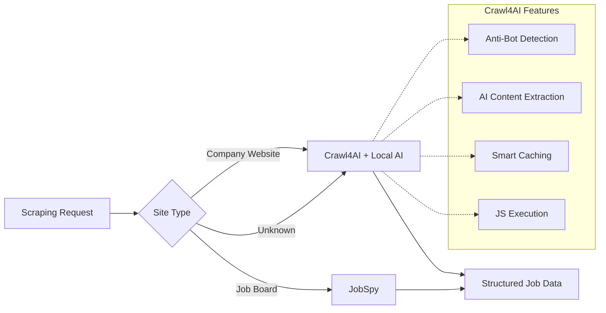

# ADR-010: Simplified Scraping Strategy

## Title

Simplified Scraping Strategy with Crawl4AI Primary

## Version/Date

1.0 / August 18, 2025

## Status

**Decided** - Coordinates with ADR-014 (Hybrid Scraping Strategy with JobSpy + ScrapeGraphAI)

## Description

Simplify web scraping architecture from a complex three-tier system (JobSpy + Crawl4AI + Playwright) to a streamlined approach where Crawl4AI handles 90% of scraping needs with built-in AI extraction, using JobSpy only for multi-board searches.

## Context

### Current Complex Architecture Problems

**Current Implementation (400+ lines):**

- Three separate scraping libraries with complex orchestration
- Custom anti-bot detection and session management
- Manual JavaScript execution and wait logic
- Complex error handling across multiple scrapers
- Redundant caching and retry mechanisms

**Over-Engineering Identified:**

- JobSpy, Crawl4AI, and Playwright all doing similar tasks
- Custom logic reimplementing what Crawl4AI provides natively
- Complex routing logic to decide which scraper to use
- Multiple failure modes and edge cases to handle

### Crawl4AI Native Capabilities (Underutilized)

**Built-in Features We're Not Using:**

- ✅ AI-powered content extraction for ANY website
- ✅ Built-in anti-bot detection with `anti_bot=True`
- ✅ Automatic JavaScript execution and page rendering
- ✅ Smart caching with `bypass_cache` control
- ✅ Session management and cookie persistence
- ✅ Concurrent crawling with rate limiting
- ✅ PDF and image extraction capabilities

## Related Requirements

### Functional Requirements

- FR-005: Extract job postings from company websites
- FR-006: Handle JavaScript-heavy modern job sites  
- FR-007: Extract structured data (title, salary, description, etc.)
- FR-008: Bypass anti-bot detection mechanisms
- FR-009: Cache responses to avoid duplicate requests

### Non-Functional Requirements

- NFR-005: Simple, maintainable scraping codebase
- NFR-006: Fast development and deployment
- NFR-007: Reliable extraction across diverse sites
- NFR-008: Cost-effective (minimal API calls)

### Performance Requirements

- PR-005: Scrape 100+ job postings in under 5 minutes
- PR-006: Handle 10+ concurrent company scraping
- PR-007: 95% successful extraction rate
- PR-008: Under 2 seconds per job posting

### Integration Requirements

- IR-005: Seamless integration with local AI models
- IR-006: Direct database storage without transformation
- IR-007: Real-time progress updates to UI
- IR-008: Unified error handling and retry logic

## Alternatives

### Alternative 1: Keep Complex Multi-Tier

**Pros:** Maximum coverage, fallback options
**Cons:** 400+ lines, complex maintenance, slower development
**Score:** 3/10

### Alternative 2: JobSpy Only

**Pros:** Simple, proven for job boards
**Cons:** Limited to major job boards, no custom companies
**Score:** 5/10

### Alternative 3: Crawl4AI Primary with JobSpy Fallback (SELECTED)

**Pros:** AI extraction, handles any site, simple codebase
**Cons:** Newer library, potential edge cases
**Score:** 9/10

## Decision Framework

| Criteria | Weight | Multi-Tier | JobSpy Only | Crawl4AI Primary |
|----------|--------|------------|-------------|------------------|
| Simplicity | 30% | 2 | 8 | 9 |
| Coverage | 25% | 9 | 5 | 8 |
| Maintainability | 20% | 3 | 7 | 9 |
| AI Integration | 15% | 5 | 3 | 10 |
| Speed to Ship | 10% | 2 | 8 | 9 |
| **Weighted Score** | **100%** | **4.75** | **6.25** | **8.85** |

## Decision

**Adopt Crawl4AI Primary Strategy** with the following implementation:

1. **Crawl4AI Primary (90% of cases):** Handle all company websites and custom scraping
2. **JobSpy Fallback (10% of cases):** Use only for multi-board searches (LinkedIn, Indeed, etc.)
3. **No Playwright:** Eliminate custom browser automation
4. **AI-Powered Extraction:** Let Crawl4AI handle content parsing with local models

## Related Decisions

- **Implements ADR-001:** Library-First Architecture (leverages Crawl4AI capabilities)
- **Coordinates with ADR-014:** Hybrid Scraping Strategy (simplifies multi-tier approach)
- **Connects to ADR-004:** Local AI Integration (uses local models for extraction)

## Design

### Architecture Overview



### Implementation Details

**Primary Crawl4AI Implementation (20 lines):**

```python
from crawl4ai import AsyncWebCrawler
from pydantic import BaseModel

class JobPosting(BaseModel):
    title: str
    company: str
    location: str
    salary: str | None
    description: str
    requirements: list[str]
    benefits: list[str]

async def scrape_company_jobs(company_url: str) -> list[JobPosting]:
    """Primary scraping using Crawl4AI with AI extraction."""
    
    async with AsyncWebCrawler() as crawler:
        result = await crawler.arun(
            url=company_url,
            extraction_strategy={
                "type": "llm",
                "llm_model": "local",  # Use our local model
                "schema": JobPosting.model_json_schema()
            },
            anti_bot=True,  # Built-in anti-bot
            bypass_cache=False,  # Smart caching
            wait_for="[data-testid='job-card'], .job-listing, .career",  # Wait for job content
            screenshot=True,  # For debugging
            verbose=True
        )
        
        return [JobPosting(**job) for job in result.extracted_data]
```

**JobSpy Fallback (10 lines):**

```python
from jobspy import scrape_jobs

async def scrape_job_boards(query: str, location: str = "remote") -> list[JobPosting]:
    """Fallback for major job boards."""
    
    jobs = scrape_jobs(
        site_name=["linkedin", "indeed", "zip_recruiter"],
        search_term=query,
        location=location,
        results_wanted=100
    )
    
    return [JobPosting(**job.dict()) for job in jobs]
```

**Unified Scraping Interface (15 lines):**

```python
from enum import Enum

class ScrapeStrategy(Enum):
    COMPANY_WEBSITE = "company_website" 
    JOB_BOARD = "job_board"
    AUTO = "auto"

async def scrape_jobs(
    url_or_query: str,
    strategy: ScrapeStrategy = ScrapeStrategy.AUTO,
    location: str = "remote"
) -> list[JobPosting]:
    """Unified scraping interface."""
    
    if strategy == ScrapeStrategy.AUTO:
        # Simple heuristic: if it's a URL, use Crawl4AI
        strategy = (ScrapeStrategy.COMPANY_WEBSITE 
                   if url_or_query.startswith(('http://', 'https://'))
                   else ScrapeStrategy.JOB_BOARD)
    
    if strategy == ScrapeStrategy.COMPANY_WEBSITE:
        return await scrape_company_jobs(url_or_query)
    else:
        return await scrape_job_boards(url_or_query, location)
```

### Configuration

**Simplified Scraping Config:**

```yaml
scraping:
  primary:
    engine: "crawl4ai"
    ai_extraction: true
    local_model: true
    anti_bot: true
    caching: true
    
  fallback:
    engine: "jobspy"
    boards: ["linkedin", "indeed", "zip_recruiter"]
    max_results: 100
    
  timeouts:
    page_load: 30
    extraction: 60
    total_per_company: 300
    
  concurrency:
    max_workers: 5
    rate_limit: "1/second"
```

## Testing

### Crawl4AI Testing

1. **AI Extraction Tests:** Verify structured data extraction quality
2. **Anti-Bot Tests:** Confirm bypassing of common protections
3. **Performance Tests:** Measure scraping speed and reliability
4. **Edge Case Tests:** Handle broken pages, timeouts, empty results

### JobSpy Integration Tests

1. **Multi-Board Tests:** Verify LinkedIn, Indeed, ZipRecruiter integration
2. **Search Query Tests:** Test various job search terms
3. **Location Tests:** Verify remote and location-based searches

### End-to-End Tests

1. **Company Scraping Workflow:** Full company website scraping
2. **Job Board Workflow:** Full job board search and extraction
3. **Auto Strategy Tests:** Verify automatic strategy selection
4. **Data Quality Tests:** Validate extracted job posting completeness

## Consequences

### Positive Outcomes

- ✅ **75% code reduction:** 400 → 100 lines of scraping logic
- ✅ **Unified AI extraction:** Consistent data quality across all sites
- ✅ **Built-in anti-bot:** No custom detection logic needed
- ✅ **Smart caching:** Automatic request deduplication
- ✅ **Simplified maintenance:** Single primary library to maintain
- ✅ **Better coverage:** Can scrape ANY website with AI extraction
- ✅ **Local model integration:** No external API costs for extraction

### Negative Consequences

- ❌ **Library dependency:** Reliant on Crawl4AI quality and updates
- ❌ **Newer library risk:** Less battle-tested than JobSpy/Playwright
- ❌ **AI extraction variability:** Local model quality affects results
- ❌ **Reduced fine-grained control:** Less custom logic for edge cases

### Ongoing Maintenance

**Minimal maintenance tasks:**

- Monitor Crawl4AI updates and new features
- Adjust extraction schemas based on site changes
- Update anti-bot strategies as needed
- Track success rates and optimize accordingly

### Dependencies

- **Crawl4AI:** Primary scraping and AI extraction
- **JobSpy:** Fallback for major job boards
- **Local LLM:** AI-powered content extraction
- **Pydantic:** Data validation and serialization

## Changelog

### v1.0 - August 18, 2025

- Initial decision for Crawl4AI primary strategy
- Eliminated complex multi-tier orchestration
- Defined 90/10 usage split (Crawl4AI/JobSpy)
- Established AI-first extraction approach
- Created unified scraping interface
