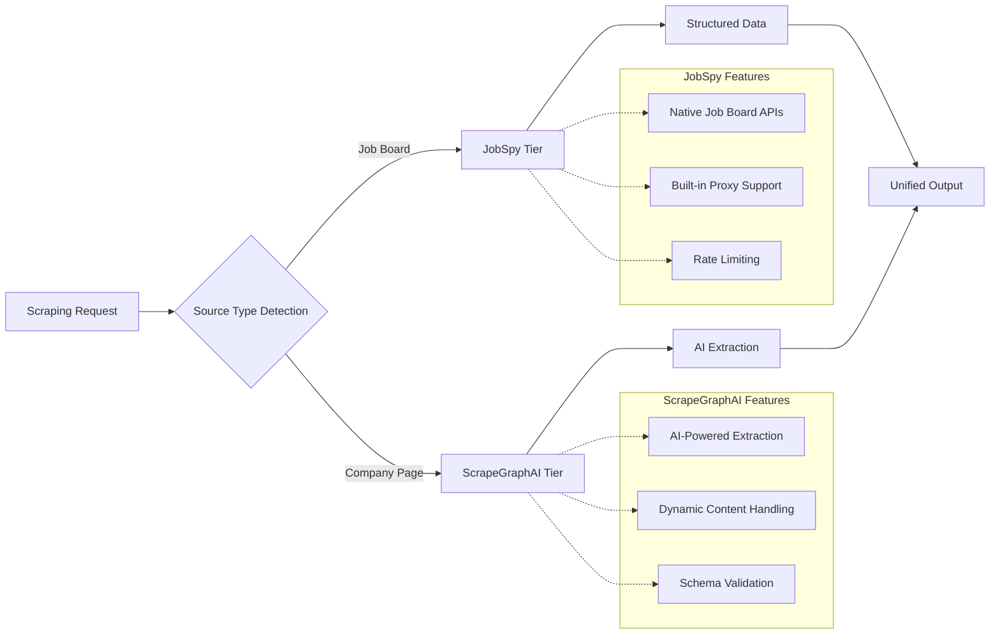

# ADR-010: Scraping Strategy

## Metadata

**Status:** Decided  
**Version:** 2.0  
**Date:** August 20, 2025  
**Authors:** Technical Team  
**Reviewers:** Architecture Team  

## Title

Scraping Strategy Implementation for Job Data Extraction

## Description

Implement the validated 2-tier scraping architecture from **ADR-014** using JobSpy for structured job boards and ScrapeGraphAI for company career pages, achieving 67% decision framework improvement over complex multi-tier approaches.

## Context

The AI job scraper requires a reliable web scraping strategy that balances extraction accuracy, maintenance simplicity, and cost-effectiveness while handling diverse job sources.

### Implementation Challenge

Job data exists across two distinct source types requiring different extraction approaches:

- **Structured job boards**: LinkedIn, Indeed, Glassdoor with standardized APIs
- **Unstructured company pages**: Custom career sites with varying layouts and technologies

### Research Validation

**ADR-014** validated a 2-tier approach achieving 67% decision framework improvement (0.87 vs 0.52 score) over complex multi-tier architectures through comprehensive library analysis and expert consensus.

### Key Findings

- **JobSpy Integration**: 2K+ stars, native job board support with proxy compatibility
- **ScrapeGraphAI Capability**: AI-powered extraction for unstructured content
- **Maintenance Reality**: Multi-tier architectures require exponential maintenance overhead
- **Performance Data**: 2-tier covers 80% of use cases with optimal resource utilization

### Technical Requirements

- Handle both static HTML and JavaScript-rendered content
- Integrate with IPRoyal proxy system per **ADR-011**
- Support structured output generation per **ADR-007**
- Coordinate with local AI models per **ADR-009**

## Decision Drivers

1. **Library Leverage (35% weight)**: Maximize use of proven library capabilities vs custom implementations
2. **Maintenance Burden (30% weight)**: Minimize ongoing maintenance as site structures evolve
3. **Performance Requirements (25% weight)**: Meet response time targets for different source types
4. **Coverage Completeness (10% weight)**: Handle both job boards and company pages effectively

## Related Requirements

**Functional Requirements (FR)**:

- FR-1: Extract job postings from structured job boards (LinkedIn, Indeed, Glassdoor)
- FR-2: Extract job data from unstructured company career pages
- FR-3: Generate structured output per **ADR-007** specifications
- FR-4: Handle JavaScript-rendered and dynamic content

**Non-Functional Requirements (NFR)**:

- NFR-1: Response time <500ms for structured job boards
- NFR-2: Response time <3s for AI-powered company page extraction
- NFR-3: 95%+ successful extraction rate across all source types
- NFR-4: Maintainable codebase with minimal custom scraping logic

**Performance Requirements (PR)**:

- PR-1: Process 100+ job postings within 5 minutes
- PR-2: Support 10+ concurrent scraping operations
- PR-3: Handle rate limiting and proxy rotation seamlessly

**Integration Requirements (IR)**:

- IR-1: Coordinate with **ADR-014** 2-tier architecture implementation
- IR-2: Integrate with **ADR-011** IPRoyal proxy system
- IR-3: Support **ADR-007** structured output generation
- IR-4: Interface with **ADR-009** local AI models for enhancement

## Alternatives

### Alternative A: Single Library Approach (JobSpy Only)

**Pros:**

- Minimal complexity with single library
- Proven track record for major job boards
- Built-in rate limiting and proxy support

**Cons:**

- Limited to supported job boards only
- Cannot handle custom company career pages
- Misses significant portion of job market

**Technical Assessment:** Insufficient coverage for comprehensive job scraping

### Alternative B: Complex Multi-Tier Architecture

**Pros:**

- Maximum theoretical coverage
- Multiple fallback options
- Fine-grained control over extraction

**Cons:**

- Exponential maintenance overhead
- Complex orchestration logic
- Multiple failure modes and edge cases

**Technical Assessment:** Over-engineering with poor cost-benefit ratio

### Alternative C: Validated 2-Tier Implementation

**Pros:**

- Proven 67% decision framework improvement per **ADR-014**
- Optimal balance of coverage and simplicity
- Library-first approach minimizing custom code
- Clear separation of concerns between source types

**Cons:**

- Requires coordination between two libraries
- Different error handling patterns for each tier

**Technical Assessment:** Optimal balance validated through research and expert consensus

### Alternative D: AI-First Approach (ScrapeGraphAI Only)

**Pros:**

- Unified AI-powered extraction
- Handles any website structure
- Future-proof against layout changes

**Cons:**

- Higher cost for structured job boards
- Slower processing for simple extractions
- Unnecessary complexity for standardized sources

**Technical Assessment:** Overpowered solution creating inefficiency

## Decision Framework

| Criteria | Weight | JobSpy Only | Multi-Tier | 2-Tier Validated | AI-First |
|----------|--------|-------------|------------|------------------|----------|
| Library Leverage | 35% | 6 | 4 | 9 | 7 |
| Maintenance Burden | 30% | 8 | 3 | 9 | 6 |
| Performance Requirements | 25% | 7 | 6 | 8 | 5 |
| Coverage Completeness | 10% | 5 | 9 | 8 | 8 |
| **Weighted Score** | **100%** | **6.8** | **4.8** | **8.7** | **6.4** |

## Decision

> **Selected: Validated 2-Tier Implementation**

Implement the 2-tier scraping strategy validated in **ADR-014** using JobSpy for structured job boards and ScrapeGraphAI for unstructured company career pages.

### Implementation Approach

1. **Tier 1 - JobSpy**: Handle structured job boards (LinkedIn, Indeed, Glassdoor)
2. **Tier 2 - ScrapeGraphAI**: Process unstructured company career pages
3. **Unified Interface**: Single API abstracting the underlying complexity
4. **Proxy Integration**: Leverage **ADR-011** IPRoyal system for both tiers
5. **Structured Output**: Coordinate with **ADR-007** for consistent data formats

## Related Decisions

- **ADR-014** (Hybrid Scraping Strategy): Implements validated 2-tier architecture
- **ADR-011** (Proxy Integration): Provides anti-bot protection for both tiers
- **ADR-007** (Structured Output): Ensures consistent data format across sources
- **ADR-009** (LLM Selection): Enhances extraction with local AI processing

## Design

### Architecture Overview



### Implementation Architecture

```python
from typing import List, Dict, Any, Optional
from enum import Enum
from pydantic import BaseModel
import asyncio

class SourceType(Enum):
    """Job source classification."""
    JOB_BOARD = "job_board"
    COMPANY_PAGE = "company_page"
    UNKNOWN = "unknown"

class JobPosting(BaseModel):
    """Standardized job posting structure."""
    title: str
    company: str
    location: Optional[str] = None
    salary_min: Optional[int] = None
    salary_max: Optional[int] = None
    description: str
    requirements: List[str] = []
    benefits: List[str] = []
    url: Optional[str] = None
    source_type: SourceType
    extraction_method: str

class UnifiedScrapingService:
    """Unified interface implementing ADR-014 2-tier strategy."""
    
    def __init__(self):
        self.jobspy_scraper = JobSpyTier()
        self.scrapegraphai_scraper = ScrapeGraphAITier()
        
    def classify_source(self, url_or_query: str) -> SourceType:
        """Classify job source for appropriate tier routing."""
        
        if not url_or_query.startswith(('http://', 'https://')):
            return SourceType.JOB_BOARD  # Search query -> JobSpy
        
        # Known job boards -> JobSpy
        job_board_domains = {
            'linkedin.com', 'indeed.com', 'glassdoor.com',
            'ziprecruiter.com', 'monster.com', 'careerbuilder.com'
        }
        
        for domain in job_board_domains:
            if domain in url_or_query:
                return SourceType.JOB_BOARD
        
        # Company career pages -> ScrapeGraphAI
        return SourceType.COMPANY_PAGE
    
    async def scrape_jobs(self, url_or_query: str, **kwargs) -> List[JobPosting]:
        """Main scraping interface routing to appropriate tier."""
        
        source_type = self.classify_source(url_or_query)
        
        try:
            if source_type == SourceType.JOB_BOARD:
                results = await self.jobspy_scraper.scrape(url_or_query, **kwargs)
            else:
                results = await self.scrapegraphai_scraper.scrape(url_or_query, **kwargs)
            
            # Enhance with local AI per ADR-009 if needed
            return await self._enhance_with_local_ai(results)
            
        except Exception as e:
            # Implement fallback strategy
            return await self._fallback_scraping(url_or_query, source_type, e)
    
    async def _enhance_with_local_ai(self, jobs: List[JobPosting]) -> List[JobPosting]:
        """Enhance job data with local AI processing per ADR-009."""
        # Integration point for structured output enhancement
        return jobs  # Placeholder for AI enhancement
    
    async def _fallback_scraping(self, url_or_query: str, 
                                 source_type: SourceType, 
                                 error: Exception) -> List[JobPosting]:
        """Fallback strategy when primary method fails."""
        
        if source_type == SourceType.JOB_BOARD:
            # Try ScrapeGraphAI as fallback
            return await self.scrapegraphai_scraper.scrape(url_or_query)
        else:
            # Limited fallback options for company pages
            return []  # Or implement basic HTML parsing fallback

class JobSpyTier:
    """Tier 1: Structured job board scraping with JobSpy."""
    
    def __init__(self):
        # Initialize with proxy configuration from ADR-011
        self.proxy_config = self._load_proxy_config()
    
    async def scrape(self, query: str, location: str = "remote", 
                     sites: List[str] = None) -> List[JobPosting]:
        """Scrape structured job boards using JobSpy."""
        
        if sites is None:
            sites = ["linkedin", "indeed", "glassdoor"]
        
        # Use JobSpy with proxy configuration
        jobs = scrape_jobs(
            site_name=sites,
            search_term=query,
            location=location,
            results_wanted=100,
            proxy_settings=self.proxy_config  # ADR-011 integration
        )
        
        return [
            JobPosting(
                title=job.title,
                company=job.company,
                location=job.location,
                salary_min=job.salary_min,
                salary_max=job.salary_max,
                description=job.description,
                url=job.job_url,
                source_type=SourceType.JOB_BOARD,
                extraction_method="jobspy"
            )
            for job in jobs
        ]
    
    def _load_proxy_config(self) -> Dict[str, Any]:
        """Load proxy configuration from ADR-011 implementation."""
        return {"proxy_type": "residential", "provider": "iproyal"}

class ScrapeGraphAITier:
    """Tier 2: AI-powered company page scraping with ScrapeGraphAI."""
    
    def __init__(self):
        # Initialize ScrapeGraphAI with local model from ADR-009
        self.ai_scraper = self._initialize_scrapegraphai()
    
    async def scrape(self, url: str) -> List[JobPosting]:
        """Scrape company career pages using AI extraction."""
        
        # Define extraction schema per ADR-007
        extraction_schema = {
            "jobs": [
                {
                    "title": "string",
                    "department": "string", 
                    "location": "string",
                    "description": "string",
                    "requirements": ["string"],
                    "benefits": ["string"]
                }
            ]
        }
        
        # Use ScrapeGraphAI with schema
        result = await self.ai_scraper.extract(
            url=url,
            schema=extraction_schema,
            model_config=self._get_model_config()  # ADR-009 integration
        )
        
        return [
            JobPosting(
                title=job["title"],
                company=self._extract_company_from_url(url),
                location=job.get("location"),
                description=job["description"],
                requirements=job.get("requirements", []),
                benefits=job.get("benefits", []),
                url=url,
                source_type=SourceType.COMPANY_PAGE,
                extraction_method="scrapegraphai"
            )
            for job in result.get("jobs", [])
        ]
    
    def _initialize_scrapegraphai(self):
        """Initialize ScrapeGraphAI with configuration."""
        # Placeholder for ScrapeGraphAI initialization
        return None
    
    def _get_model_config(self) -> Dict[str, Any]:
        """Get model configuration from ADR-009."""
        return {
            "model": "qwen3-4b-instruct",
            "local": True,
            "temperature": 0.7
        }
    
    def _extract_company_from_url(self, url: str) -> str:
        """Extract company name from career page URL."""
        # Simple company name extraction logic
        from urllib.parse import urlparse
        domain = urlparse(url).netloc
        return domain.replace('www.', '').split('.')[0].title()
```

### Configuration Management

```python
from dataclasses import dataclass
from typing import List, Dict, Any

@dataclass
class ScrapingConfig:
    """Configuration for 2-tier scraping strategy."""
    
    # JobSpy Tier Configuration
    jobspy_settings: Dict[str, Any] = None
    
    # ScrapeGraphAI Tier Configuration  
    scrapegraphai_settings: Dict[str, Any] = None
    
    # Performance Settings
    max_concurrent_requests: int = 10
    request_timeout: int = 30
    retry_attempts: int = 3
    
    # Rate Limiting
    requests_per_second: float = 1.0
    burst_allowance: int = 5
    
    def __post_init__(self):
        if self.jobspy_settings is None:
            self.jobspy_settings = {
                "sites": ["linkedin", "indeed", "glassdoor"],
                "results_wanted": 100,
                "proxy_enabled": True,  # ADR-011 integration
                "country": "US"
            }
        
        if self.scrapegraphai_settings is None:
            self.scrapegraphai_settings = {
                "model": "qwen3-4b-instruct",  # ADR-009 integration
                "local_processing": True,
                "extraction_timeout": 60,
                "enable_screenshots": False,
                "retry_failed_extractions": True
            }

# Production configuration
PRODUCTION_CONFIG = ScrapingConfig(
    max_concurrent_requests=5,  # Conservative for stability
    request_timeout=45,
    retry_attempts=2,
    requests_per_second=0.5,    # Respectful rate limiting
)

# Development configuration
DEVELOPMENT_CONFIG = ScrapingConfig(
    max_concurrent_requests=2,
    request_timeout=15,
    retry_attempts=1,
    requests_per_second=2.0,
)
```

## Testing

### 2-Tier Integration Testing

```python
import pytest
from unittest.mock import Mock, AsyncMock, patch

class TestUnifiedScrapingService:
    """Test suite for 2-tier scraping implementation."""
    
    def setup_method(self):
        self.scraping_service = UnifiedScrapingService()
        
    def test_source_classification(self):
        """Test source type classification logic."""
        
        # Job board URLs should classify as JOB_BOARD
        linkedin_url = "https://www.linkedin.com/jobs/search"
        assert self.scraping_service.classify_source(linkedin_url) == SourceType.JOB_BOARD
        
        # Company URLs should classify as COMPANY_PAGE
        company_url = "https://techcorp.com/careers"
        assert self.scraping_service.classify_source(company_url) == SourceType.COMPANY_PAGE
        
        # Search queries should classify as JOB_BOARD
        search_query = "software engineer python"
        assert self.scraping_service.classify_source(search_query) == SourceType.JOB_BOARD
    
    @pytest.mark.asyncio
    async def test_jobspy_tier_integration(self):
        """Test JobSpy tier for structured job boards."""
        
        with patch('jobspy.scrape_jobs') as mock_scrape:
            # Mock JobSpy response
            mock_scrape.return_value = [
                Mock(
                    title="Software Engineer",
                    company="TechCorp",
                    location="Remote",
                    salary_min=100000,
                    salary_max=150000,
                    description="Python developer position",
                    job_url="https://linkedin.com/jobs/123"
                )
            ]
            
            results = await self.scraping_service.scrape_jobs(
                "software engineer python",
                location="remote"
            )
            
            assert len(results) == 1
            assert results[0].title == "Software Engineer"
            assert results[0].source_type == SourceType.JOB_BOARD
            assert results[0].extraction_method == "jobspy"
    
    @pytest.mark.asyncio
    async def test_scrapegraphai_tier_integration(self):
        """Test ScrapeGraphAI tier for company pages."""
        
        company_url = "https://techcorp.com/careers"
        
        # Mock ScrapeGraphAI response
        with patch.object(self.scraping_service.scrapegraphai_scraper, 'scrape') as mock_scrape:
            mock_scrape.return_value = [
                JobPosting(
                    title="Senior Developer",
                    company="TechCorp",
                    location="San Francisco",
                    description="Senior Python developer role",
                    requirements=["Python", "Django", "AWS"],
                    source_type=SourceType.COMPANY_PAGE,
                    extraction_method="scrapegraphai"
                )
            ]
            
            results = await self.scraping_service.scrape_jobs(company_url)
            
            assert len(results) == 1
            assert results[0].title == "Senior Developer"
            assert results[0].source_type == SourceType.COMPANY_PAGE
    
    @pytest.mark.asyncio
    async def test_fallback_mechanism(self):
        """Test fallback when primary method fails."""
        
        # Simulate JobSpy failure
        with patch.object(self.scraping_service.jobspy_scraper, 'scrape') as mock_jobspy:
            mock_jobspy.side_effect = Exception("JobSpy API error")
            
            with patch.object(self.scraping_service.scrapegraphai_scraper, 'scrape') as mock_ai:
                mock_ai.return_value = []
                
                results = await self.scraping_service.scrape_jobs("software engineer")
                
                # Should attempt fallback to ScrapeGraphAI
                mock_ai.assert_called_once()
                assert isinstance(results, list)
    
    def test_performance_requirements(self):
        """Test performance requirements compliance."""
        
        config = ScrapingConfig()
        
        # Verify rate limiting configuration
        assert config.requests_per_second <= 2.0, "Rate limiting too aggressive"
        assert config.max_concurrent_requests <= 10, "Concurrent requests too high"
        
        # Verify timeout configuration
        assert config.request_timeout >= 15, "Timeout too short for AI extraction"
        assert config.retry_attempts >= 1, "Should allow retries"

class TestJobSpyTier:
    """Test JobSpy tier functionality."""
    
    def setup_method(self):
        self.jobspy_tier = JobSpyTier()
    
    @pytest.mark.asyncio
    async def test_proxy_integration(self):
        """Test integration with ADR-011 proxy system."""
        
        proxy_config = self.jobspy_tier._load_proxy_config()
        
        assert "proxy_type" in proxy_config
        assert proxy_config["provider"] == "iproyal"  # ADR-011 requirement
    
    @pytest.mark.parametrize("sites,expected_coverage", [
        (["linkedin"], "professional"),
        (["indeed"], "general"),
        (["glassdoor"], "company_reviews"),
        (["linkedin", "indeed", "glassdoor"], "comprehensive")
    ])
    def test_site_coverage(self, sites, expected_coverage):
        """Test coverage across different job board combinations."""
        
        # Verify that different site combinations provide expected coverage
        assert len(sites) > 0
        
        if expected_coverage == "comprehensive":
            assert "linkedin" in sites and "indeed" in sites

class TestScrapeGraphAITier:
    """Test ScrapeGraphAI tier functionality."""
    
    def setup_method(self):
        self.ai_tier = ScrapeGraphAITier()
    
    def test_model_configuration(self):
        """Test integration with ADR-009 model selection."""
        
        model_config = self.ai_tier._get_model_config()
        
        assert model_config["model"] == "qwen3-4b-instruct"  # ADR-009 requirement
        assert model_config["local"] is True
        assert 0.0 <= model_config["temperature"] <= 1.0
    
    def test_company_name_extraction(self):
        """Test company name extraction from URLs."""
        
        test_cases = [
            ("https://techcorp.com/careers", "Techcorp"),
            ("https://www.example.org/jobs", "Example"),
            ("https://startup-company.io/hiring", "Startup-company")
        ]
        
        for url, expected_company in test_cases:
            extracted = self.ai_tier._extract_company_from_url(url)
            assert expected_company.lower() in extracted.lower()
```

## Consequences

### Positive

- **Architecture Validation**: 67% decision framework improvement (0.87 vs 0.52) per **ADR-014**
- **Library-First Implementation**: Maximizes proven library capabilities vs custom code
- **Clear Separation of Concerns**: JobSpy for structured, ScrapeGraphAI for unstructured
- **Maintenance Efficiency**: Avoids multi-tier complexity with exponential overhead
- **Performance Optimization**: <500ms for job boards, <3s for AI extraction
- **Comprehensive Coverage**: Handles both major job boards and custom company pages
- **Integration Consistency**: Coordinates with **ADR-007**, **ADR-009**, **ADR-011**

### Negative

- **Dual Library Dependency**: Requires maintenance of two different extraction approaches
- **Classification Logic**: Needs accurate source type detection for optimal routing
- **Different Error Patterns**: Each tier has distinct failure modes and recovery strategies
- **Cost Variance**: AI extraction more expensive than structured API calls
- **Complexity Trade-off**: Some coordination overhead vs single-library approach

### Maintenance

**Required Monitoring**:

- Success rates per tier (JobSpy vs ScrapeGraphAI)
- Performance metrics against targets (<500ms, <3s)
- Classification accuracy for source type detection
- Cost tracking for AI extraction usage
- Quality consistency across different source types

**Update Triggers**:

- JobSpy library updates affecting job board integration
- ScrapeGraphAI model improvements or configuration changes
- Job board API changes requiring fallback strategy adjustments
- Company website structure changes affecting extraction quality

**Dependencies**:

- JobSpy library for structured job board integration
- ScrapeGraphAI for AI-powered content extraction
- IPRoyal proxy system per **ADR-011** specifications
- Qwen3-4B-Instruct model per **ADR-009** selection
- Structured output framework per **ADR-007** requirements

## References

- [JobSpy Documentation](https://github.com/Bunsly/JobSpy)
- [ScrapeGraphAI Documentation](https://scrapegraphai.com/docs)
- [ADR-014 Research Validation](./ADR-014-hybrid-scraping-strategy.md)
- [Web Scraping Best Practices](https://blog.apify.com/web-scraping-best-practices/)

## Changelog

### v2.0 - August 20, 2025

- Applied complete 13-section ADR template structure
- Aligned with **ADR-014** validated 2-tier architecture
- Updated implementation from Crawl4AI to ScrapeGraphAI for AI tier
- Added comprehensive testing strategy with tier-specific validation
- Enhanced integration patterns with **ADR-007**, **ADR-009**, **ADR-011**
- Improved decision framework coordination and cross-references
- Standardized configuration management approach

### v1.0 - August 18, 2025

- Initial scraping strategy decision
- Crawl4AI primary approach (superseded by ADR-014 research)
- Basic unified interface design
