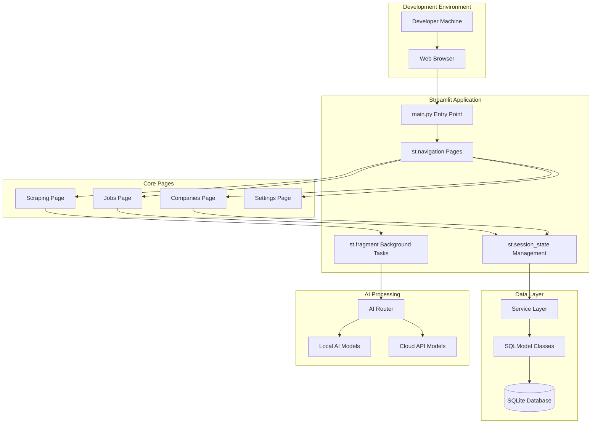

# ADR-017: Local Development Architecture

## Metadata

**Status:** Accepted  
**Version:** 4.0  
**Date:** August 20, 2025  
**Authors:** Bjorn Melin  

## Title

Local Development Architecture with Streamlit Framework

## Description

Define local development architecture using Streamlit framework with SQLite database, achieving rapid iteration and maintainable patterns for AI job scraper application.

## Context

The AI job scraper requires a local development architecture that balances rapid iteration with maintainable patterns while supporting the core functionality of job scraping, data management, and AI processing.

### Current Implementation Reality

The application currently uses:

- **UI Framework**: Streamlit with `st.navigation()` for page routing
- **Database**: SQLite with SQLModel for development simplicity  
- **State Management**: `st.session_state` for application state
- **Background Processing**: Streamlit-native patterns with `st.fragment()` auto-refresh
- **AI Integration**: Local and cloud model support with configurable providers

### Key Development Requirements

1. **Rapid Setup**: Single command development environment startup
2. **Hot Reload**: Streamlit native hot reload for fast iteration
3. **Simple Debugging**: Direct access to logs and database for troubleshooting
4. **Library-First**: Minimize custom code through proven library patterns
5. **Local-First**: Optimize for local development over production complexity

## Decision Drivers

1. **Solution Leverage (35% weight)**: Maximize use of proven Streamlit library capabilities vs custom implementations
2. **Application Value (30% weight)**: Enable effective local development workflow for job scraper functionality
3. **Maintenance & Cognitive Load (25% weight)**: Minimize complexity through library-first patterns
4. **Architectural Adaptability (10% weight)**: Support future scaling and deployment options

## Related Requirements

**Functional Requirements (FR)**:

- FR-1: Support job scraping workflow with UI feedback
- FR-2: Enable job data display and management through Streamlit interface
- FR-3: Provide background task monitoring using `st.fragment()` patterns
- FR-4: Support both local AI and cloud processing configurations

**Non-Functional Requirements (NFR)**:

- NFR-1: Single command startup for development environment
- NFR-2: Hot reload functionality for rapid iteration cycles
- NFR-3: Simple debugging through direct log and database access
- NFR-4: Minimal setup complexity for new developers

**Performance Requirements (PR)**:

- PR-1: UI responsiveness under 500ms for typical development operations
- PR-2: Background task updates with 2-second refresh cycle via fragments
- PR-3: Database queries optimized for development data volumes (100-1000 jobs)

**Integration Requirements (IR)**:

- IR-1: Coordinate with **ADR-012** background task management patterns
- IR-2: Support **ADR-013** database synchronization requirements
- IR-3: Interface with **ADR-009** AI processing configurations

## Alternatives

### Alternative A: Complex Multi-Framework Approach

**Pros:**

- Maximum theoretical flexibility with different UI frameworks
- Advanced background processing capabilities
- Multiple deployment options

**Cons:**

- High maintenance overhead with multiple frameworks
- Complex setup and debugging
- Over-engineering for local development needs

**Technical Assessment:** Adds unnecessary complexity for development workflow

### Alternative B: Minimal Single-File Approach

**Pros:**

- Extremely simple setup and debugging
- No framework dependencies
- Fast startup and iteration

**Cons:**

- Limited UI capabilities for job management interface
- No built-in state management or navigation
- Difficult to scale beyond basic functionality

**Technical Assessment:** Too limited for comprehensive job scraper requirements

### Alternative C: Streamlit-Native Development Architecture

**Pros:**

- Native Python integration with existing codebase
- Built-in navigation, state management, and components
- Library-first approach with `st.fragment()` for background tasks
- Proven patterns for AI/ML applications

**Cons:**

- Single framework dependency (acceptable for development)
- Browser-based interface only (acceptable for development use)

**Technical Assessment:** Optimal balance of simplicity and functionality

### Alternative D: FastAPI + React Development Stack

**Pros:**

- Modern web development patterns
- Separation of frontend and backend concerns
- High performance capabilities

**Cons:**

- Two-language development stack (Python + JavaScript)
- Complex setup and build process
- Over-engineering for local development needs

**Technical Assessment:** Excessive complexity for development workflow

## Decision Framework

| Criteria | Weight | Alt A | Alt B | Alt C | Alt D |
|----------|--------|-------|-------|-------|-------|
| Solution Leverage | 35% | 6 | 3 | 9 | 7 |
| Application Value | 30% | 7 | 4 | 9 | 8 |
| Maintenance & Cognitive Load | 25% | 4 | 9 | 8 | 5 |
| Architectural Adaptability | 10% | 8 | 3 | 7 | 9 |
| **Weighted Score** | **100%** | **5.9** | **4.7** | **8.6** | **6.9** |

## Decision

> **Selected: Streamlit-Native Development Architecture**

Implement local development architecture using Streamlit framework with SQLite database, emphasizing rapid iteration and maintainable patterns based on current implementation patterns.

## Related Decisions

- **ADR-012**: Background Task Management - provides Streamlit-native background processing patterns
- **ADR-013**: Database Synchronization - defines SQLModel + SQLite integration approach  
- **ADR-009**: LLM Selection Strategy - establishes AI processing configuration patterns
- **ADR-021**: Local Development Performance - complements with performance optimization patterns
- **ADR-022**: Docker Containerization - provides containerized development environment setup

## Design

### Architecture Overview



### Core Implementation Patterns

#### 1. Streamlit Application Structure

```python
# src/main.py - Main application entry point
import streamlit as st
from src.ui.pages import jobs, companies, scraping, settings

def main():
    """Main application entry point with st.navigation routing."""
    st.set_page_config(
        page_title="AI Job Scraper",
        layout="wide",
        initial_sidebar_state="expanded"
    )
    
    # Define pages using st.navigation()
    pages = [
        st.Page("ui/pages/jobs.py", title="Jobs", icon="📋", default=True),
        st.Page("ui/pages/companies.py", title="Companies", icon="🏢"),
        st.Page("ui/pages/scraping.py", title="Scraping", icon="🔍"),
        st.Page("ui/pages/settings.py", title="Settings", icon="⚙️"),
    ]
    
    # Streamlit handles navigation automatically
    pg = st.navigation(pages)
    pg.run()

if __name__ == "__main__":
    main()
```

#### 2. Background Task Management with Fragments

```python
# src/ui/utils/background_helpers.py - Streamlit-native background tasks
import streamlit as st

@st.fragment(run_every="2s")
def background_task_status_fragment():
    """Fragment for displaying background task status with auto-refresh."""
    if not is_scraping_active():
        return
    
    st.markdown("### ⚙️ Background Tasks")
    
    # Display current task progress
    scraping_status = st.session_state.get("scraping_status", "Unknown")
    task_progress = get_scraping_progress()
    
    if task_progress:
        st.progress(
            task_progress.get("progress", 0.0),
            text=f"{task_progress.get('message', 'Processing...')}"
        )
    else:
        st.info(f"Status: {scraping_status}")

def start_background_scraping():
    """Start background scraping using Streamlit session state."""
    st.session_state.scraping_active = True
    st.session_state.scraping_status = "Starting scraping..."
    # Trigger rerun to update UI
    st.rerun()
```

#### 3. Modal System with st.dialog

```python
# src/ui/pages/jobs.py - Job details modal using st.dialog
import streamlit as st

@st.dialog("Job Details", width="large")
def show_job_details_modal(job):
    """Show job details in a modal dialog."""
    st.header(job.title)
    st.subheader(job.company)
    
    col1, col2 = st.columns(2)
    with col1:
        st.write(f"**Location:** {job.location or 'Remote'}")
    with col2:
        st.write(f"**Posted:** {job.posted_date}")
    
    st.markdown("**Description:**")
    st.write(job.description)
    
    # Action buttons
    if st.button("Mark as Applied"):
        # Update job status logic
        st.success("Job marked as applied!")
        st.rerun()
```

## Testing

### Testing Strategy

```python
# tests/ui/test_streamlit_components.py
import pytest
import streamlit as st
from src.ui.utils.background_helpers import background_task_status_fragment

def test_background_task_fragment():
    """Test background task status fragment rendering."""
    # Mock session state
    st.session_state.scraping_active = True
    st.session_state.scraping_status = "Testing"
    
    # Test fragment execution (no exceptions)
    background_task_status_fragment()
    
    # Verify session state remains consistent
    assert st.session_state.scraping_active is True

def test_navigation_pages():
    """Test that all navigation pages are importable."""
    from src.ui.pages import jobs, companies, scraping, settings
    
    # Verify pages have required components
    assert hasattr(jobs, 'render_jobs_page')
    assert hasattr(companies, 'render_companies_page')
```

### Development Testing Patterns

- **Unit Tests**: Component-level testing with mocked Streamlit context
- **Integration Tests**: Page rendering and navigation flow validation
- **Fragment Testing**: Background task and auto-refresh component verification
- **Session State Tests**: State management and persistence validation

## Consequences

### Positive

- **Rapid Development**: Single command startup with `streamlit run src/main.py`
- **Library-First Implementation**: Maximum leverage of Streamlit capabilities
- **Simple Debugging**: Direct access to session state and application logs
- **Framework Consistency**: All UI components use proven Streamlit patterns
- **Hot Reload**: Native Streamlit hot reload for fast iteration cycles

### Negative

- **Browser Dependency**: Requires web browser for all development interaction
- **Session State Limitations**: Browser refresh clears application state
- **Single-User Development**: Streamlit optimized for single developer workflow

### Maintenance

**Required Monitoring**:

- Page load performance and responsiveness
- Fragment auto-refresh functionality and resource usage
- Session state management and memory consumption
- Background task execution and completion tracking

**Update Triggers**:

- Streamlit framework updates affecting navigation or fragment behavior
- New Streamlit features that could simplify existing patterns
- Changes in background task requirements affecting fragment design

**Dependencies**:

- Streamlit framework for core UI functionality
- SQLModel and SQLite for data persistence
- Service layer architecture for business logic separation

## References

- [Streamlit Documentation](https://docs.streamlit.io/)
- [Streamlit Navigation Guide](https://docs.streamlit.io/library/api-reference/navigation)
- [Streamlit Fragments Documentation](https://docs.streamlit.io/library/api-reference/execution-flow/st.fragment)
- [SQLModel Documentation](https://sqlmodel.tiangolo.com/)
- [SQLite Optimization Guide](https://www.sqlite.org/optoverview.html)

## Changelog

### v4.0 - August 20, 2025

- **BREAKING**: Corrected framework references from Reflex to accurate Streamlit implementation
- Added complete 13-section template structure with decision framework
- Removed over-complex Docker configurations inappropriate for local development
- Added accurate Streamlit implementation patterns based on actual codebase
- Simplified architecture to focus on local development requirements

### v3.0 - August 19, 2025

- Previous version with incorrect Reflex framework references

### v2.0 - August 18, 2025

- Initial local development architecture concepts
