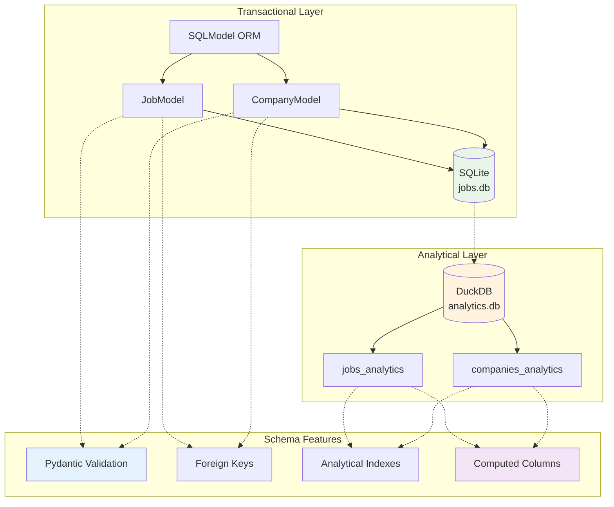

# ADR-018a: Database Schema Design

## Metadata

**Status:** Decided  
**Version:** 3.0  
**Date:** August 19, 2025  
**Authors:** Bjorn Melin
**Related:** ADR-018b (Implementation Strategy)  

## Title

Hybrid SQLModel + DuckDB Database Schema Design

## Description

Define database schema design for hybrid architecture combining SQLModel + SQLite for transactional operations with DuckDB for analytical workloads. Establishes data models, relationships, and schema optimization for local development.

## Context

### Architecture Requirements

The database schema must support:

1. **Transactional Operations**: CRUD operations for job and company data
2. **Analytical Workloads**: Complex queries for insights and reporting
3. **Local Development**: File-based databases without server setup
4. **Data Relationships**: Foreign key relationships between entities
5. **Performance**: Optimized for both OLTP and OLAP operations

### Current Challenges

- Need simple transactional models for CRUD operations
- Require analytical schemas optimized for complex queries
- Must maintain data consistency between transactional and analytical layers
- Schema evolution and migration management
- Development environment simplicity

## Decision Drivers

- Separate transactional and analytical concerns
- Leverage SQLModel for type-safe models with validation
- Optimize DuckDB schemas for analytical performance
- Maintain simple development workflow
- Enable zero-copy data operations with Apache Arrow

## Related Requirements

### Functional Requirements

- FR-025: Store job posting data with structured fields
- FR-026: Maintain company information and relationships
- FR-027: Support analytical queries and reporting
- FR-028: Enable data synchronization between layers

### Non-Functional Requirements

- NFR-025: Simple schema definition and management
- NFR-026: Type-safe models with automatic validation
- NFR-027: Optimized performance for analytical workloads
- NFR-028: Development environment without complex setup

### Performance Requirements

- PR-025: Fast CRUD operations on transactional data
- PR-026: Efficient analytical queries with columnar storage
- PR-027: Zero-copy data transfer between components
- PR-028: Minimal memory overhead for development

### Integration Requirements

- IR-025: Integration with scraping services for data ingestion
- IR-026: Support for analytics and reporting services
- IR-027: Compatible with backup and migration tools
- IR-028: Aligned with testing and development workflows

## Alternatives

### Alternative 1: Single SQLite Database

**Pros:** Simple, single database to manage
**Cons:** Poor analytical performance, complex queries slow
**Score:** 4/10

### Alternative 2: Postgres with Extensions

**Pros:** Full-featured, excellent performance
**Cons:** Server setup required, complex for development
**Score:** 6/10

### Alternative 3: Hybrid SQLModel + DuckDB (SELECTED)

**Pros:** Best of both worlds, optimized for each use case
**Cons:** Two databases to manage, data sync required
**Score:** 9/10

## Decision Framework

| Criteria | Weight | SQLite Only | Postgres | Hybrid Design |
|----------|--------|------------|-----------|---------------|
| Development Simplicity | 35% | 10 | 4 | 8 |
| Analytical Performance | 30% | 3 | 8 | 10 |
| Transactional Performance | 20% | 8 | 9 | 8 |
| Maintenance Overhead | 15% | 9 | 5 | 7 |
| **Weighted Score** | **100%** | **7.15** | **6.2** | **8.65** |

## Decision

**Implement Hybrid Schema Design** with separate transactional and analytical schemas:

### Transactional Schema (SQLModel + SQLite)

```python
# src/models/database.py
from sqlmodel import SQLModel, Field, Relationship
from typing import Optional, List
from datetime import datetime

class JobModel(SQLModel, table=True):
    """Simple job model for transactional operations."""
    __tablename__ = "jobs"
    
    # Primary key and basic fields
    id: Optional[int] = Field(default=None, primary_key=True)
    title: str = Field(min_length=1, max_length=500)
    company: str = Field(min_length=1, max_length=200)
    location: Optional[str] = Field(default=None, max_length=200)
    description: Optional[str] = Field(default=None, max_length=10000)
    
    # Salary information
    salary_text: Optional[str] = Field(default=None, max_length=100)
    salary_min: Optional[int] = Field(default=None, ge=0, le=10000000)
    salary_max: Optional[int] = Field(default=None, ge=0, le=10000000)
    
    # URLs and timestamps
    url: str = Field(unique=True, max_length=2000)
    posted_date: Optional[str] = Field(default=None)  # ISO format
    scraped_at: datetime = Field(default_factory=datetime.now)
    
    # Status flags
    is_active: bool = Field(default=True)
    is_favorited: bool = Field(default=False)
    
    # Foreign key relationship
    company_id: Optional[int] = Field(default=None, foreign_key="companies.id")
    company_info: Optional["CompanyModel"] = Relationship(back_populates="jobs")

class CompanyModel(SQLModel, table=True):
    """Simple company model for transactional operations."""
    __tablename__ = "companies"
    
    id: Optional[int] = Field(default=None, primary_key=True)
    name: str = Field(unique=True, min_length=1, max_length=200)
    domain: Optional[str] = Field(default=None, max_length=100)
    description: Optional[str] = Field(default=None, max_length=2000)
    size: Optional[str] = Field(default=None, max_length=50)
    industry: Optional[str] = Field(default=None, max_length=100)
    
    # Back reference to jobs
    jobs: List[JobModel] = Relationship(back_populates="company_info")
```

### Analytical Schema (DuckDB)

```sql
-- DuckDB analytical schemas optimized for OLAP operations

CREATE SCHEMA IF NOT EXISTS analytics;

-- Jobs analytical table with denormalized structure
CREATE OR REPLACE TABLE analytics.jobs_analytics AS
SELECT 
    -- Core fields
    id, title, company, location, description,
    salary_text, salary_min, salary_max, url,
    posted_date, scraped_at, is_active, is_favorited,
    company_id,
    
    -- Analytical enhancements (computed columns)
    LENGTH(description) as description_length,
    CASE 
        WHEN location ILIKE '%remote%' THEN 'Remote' 
        WHEN location ILIKE '%hybrid%' THEN 'Hybrid'
        ELSE COALESCE(location, 'Unknown') 
    END as location_normalized,
    
    -- Time-based partitioning columns
    EXTRACT(YEAR FROM scraped_at) as scrape_year,
    EXTRACT(MONTH FROM scraped_at) as scrape_month,
    EXTRACT(DOW FROM scraped_at) as scrape_day_of_week,
    
    -- Salary analysis columns
    CASE 
        WHEN salary_max > 0 THEN (salary_min + salary_max) / 2 
        ELSE NULL 
    END as salary_midpoint,
    
    -- Text analysis columns
    CASE 
        WHEN description ILIKE '%senior%' OR description ILIKE '%sr.%' THEN 'Senior'
        WHEN description ILIKE '%junior%' OR description ILIKE '%jr.%' THEN 'Junior'
        WHEN description ILIKE '%lead%' OR description ILIKE '%principal%' THEN 'Lead'
        ELSE 'Mid-Level'
    END as experience_level
FROM (SELECT * FROM sqlite_scan('{}', 'jobs')) 
WHERE 1=0; -- Create structure only initially

-- Companies analytical table
CREATE OR REPLACE TABLE analytics.companies_analytics AS
SELECT 
    -- Core fields
    id, name, domain, description, size, industry,
    
    -- Analytical enhancements
    LENGTH(description) as description_length,
    CASE 
        WHEN size IS NOT NULL AND size != '' THEN size 
        ELSE 'Unknown' 
    END as size_normalized,
    
    -- Industry categorization
    CASE 
        WHEN industry ILIKE '%tech%' OR industry ILIKE '%software%' THEN 'Technology'
        WHEN industry ILIKE '%finance%' OR industry ILIKE '%banking%' THEN 'Finance'
        WHEN industry ILIKE '%health%' OR industry ILIKE '%medical%' THEN 'Healthcare'
        ELSE COALESCE(industry, 'Other')
    END as industry_category
FROM (SELECT * FROM sqlite_scan('{}', 'companies'))
WHERE 1=0; -- Create structure only initially

-- Create indexes for analytical performance
CREATE INDEX IF NOT EXISTS idx_jobs_company_id ON analytics.jobs_analytics(company_id);
CREATE INDEX IF NOT EXISTS idx_jobs_scrape_date ON analytics.jobs_analytics(scrape_year, scrape_month);
CREATE INDEX IF NOT EXISTS idx_jobs_location ON analytics.jobs_analytics(location_normalized);
CREATE INDEX IF NOT EXISTS idx_jobs_salary ON analytics.jobs_analytics(salary_midpoint);
CREATE INDEX IF NOT EXISTS idx_companies_industry ON analytics.companies_analytics(industry_category);
```

## Related Decisions

- **ADR-018b** (Implementation Strategy): Defines service layer and operational patterns
- **ADR-019** (Data Management): Provides data processing context
- **ADR-001** (Library-First Architecture): Foundation for SQLModel adoption

## Design

### Database Architecture Overview



### Schema Initialization

```python
# src/models/database.py (continued)
from sqlmodel import create_engine, Session
import duckdb
from pathlib import Path

# Database URLs
TRANSACTIONAL_DATABASE_URL = "sqlite:///./data/jobs.db"
ANALYTICAL_DATABASE_URL = "./data/analytics.db"

# Create engines
engine = create_engine(
    TRANSACTIONAL_DATABASE_URL,
    echo=False,
    connect_args={"check_same_thread": False}
)

def init_database():
    """Initialize hybrid database schemas."""
    # Ensure data directory exists
    Path("./data").mkdir(exist_ok=True)
    
    # Initialize transactional database
    SQLModel.metadata.create_all(engine)
    
    # Enable WAL mode for better concurrency
    with Session(engine) as session:
        session.exec("PRAGMA journal_mode=WAL")
        session.exec("PRAGMA synchronous=NORMAL")
        session.exec("PRAGMA foreign_keys=ON")
        session.commit()
    
    # Initialize analytical database
    duckdb_conn = duckdb.connect(ANALYTICAL_DATABASE_URL)
    duckdb_conn.execute("LOAD arrow")  # Enable Arrow integration
    
    # Create analytical schemas (SQL from above)
    create_analytical_schemas(duckdb_conn)
    
    print("Hybrid database schemas initialized successfully")

def create_analytical_schemas(conn: duckdb.DuckDBPyConnection):
    """Create optimized analytical schemas in DuckDB."""
    # Execute the analytical schema SQL from above
    # (Implementation details in ADR-018b)
    pass
```

## Testing

### Schema Validation Tests

```python
import pytest
from sqlmodel import Session
from src.models.database import engine, JobModel, CompanyModel

def test_job_model_validation():
    """Test JobModel field validation."""
    # Valid job
    job = JobModel(
        title="Software Engineer",
        company="Tech Corp",
        url="https://example.com/job/123"
    )
    assert job.title == "Software Engineer"
    
    # Invalid salary range
    with pytest.raises(ValueError):
        JobModel(
            title="",  # Too short
            company="Tech Corp",
            url="https://example.com/job/123"
        )

def test_company_relationship():
    """Test JobModel-CompanyModel relationship."""
    with Session(engine) as session:
        company = CompanyModel(name="Test Company")
        session.add(company)
        session.commit()
        session.refresh(company)
        
        job = JobModel(
            title="Developer",
            company="Test Company",
            url="https://example.com/job/456",
            company_id=company.id
        )
        session.add(job)
        session.commit()
        
        # Verify relationship
        assert job.company_info.name == "Test Company"
        assert len(company.jobs) == 1
```

### Analytical Schema Tests

```python
import duckdb

def test_analytical_schema_creation():
    """Test DuckDB analytical schema creation."""
    conn = duckdb.connect(":memory:")
    conn.execute("LOAD arrow")
    
    # Create test analytical schema
    conn.execute("""
        CREATE SCHEMA analytics;
        CREATE TABLE analytics.jobs_analytics (
            id INTEGER,
            title VARCHAR,
            description_length INTEGER,
            location_normalized VARCHAR
        );
    """)
    
    # Verify schema exists
    tables = conn.execute(
        "SELECT table_name FROM information_schema.tables WHERE table_schema = 'analytics'"
    ).fetchall()
    
    assert len(tables) == 1
    assert tables[0][0] == "jobs_analytics"
```

## Consequences

### Positive

- **Type safety:** SQLModel provides automatic validation and type checking
- **Performance optimization:** Separate schemas optimized for their use cases
- **Development simplicity:** File-based databases with no server setup required
- **Schema evolution:** Clear migration path for both transactional and analytical schemas
- **Data consistency:** Well-defined relationships and constraints
- **Query optimization:** DuckDB indexes and computed columns for analytical performance

### Negative

- **Dual maintenance:** Two schemas require synchronization and maintenance
- **Data duplication:** Analytical layer duplicates transactional data
- **Complexity:** More complex than single database solution
- **Sync overhead:** Data synchronization between layers requires monitoring

### Maintenance

**Dependencies:**

- SQLModel: Type-safe ORM with Pydantic validation
- DuckDB: Embedded analytical database
- SQLite: Transactional database engine
- Apache Arrow: Zero-copy data interchange

**Ongoing Tasks:**

- Monitor schema evolution and migration requirements
- Optimize analytical queries and indexes based on usage patterns
- Maintain data consistency between transactional and analytical layers
- Review and update computed columns as business logic evolves

## References

- [SQLModel Documentation](https://sqlmodel.tiangolo.com/)
- [DuckDB Schema Design](https://duckdb.org/docs/sql/statements/create_table)
- [SQLite WAL Mode](https://sqlite.org/wal.html)
- [Apache Arrow Integration](https://duckdb.org/docs/extensions/arrow)

## Changelog

### v3.0 - August 19, 2025

- Initial schema design for hybrid architecture
- Defined transactional models with SQLModel validation
- Created analytical schemas with DuckDB optimizations
- Established relationships and constraints
- Added computed columns for analytical enhancements
- Defined initialization and testing strategies
