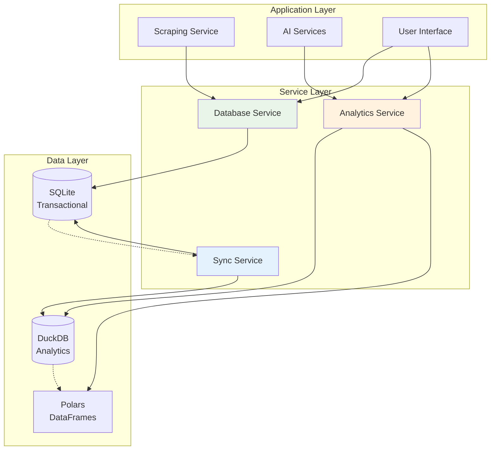

# ADR-018b: Database Implementation Strategy

## Metadata

**Status:** Decided  
**Version:** 3.0  
**Date:** August 19, 2025  
**Authors:** Bjorn Melin
**Related:** ADR-018a (Schema Design)  

## Title

Hybrid Database Implementation Strategy with Analytics Service

## Description

Implementation strategy for hybrid database architecture combining transactional CRUD operations with high-performance analytical services. Defines service layer, data synchronization, and operational patterns for local development.

## Context

### Implementation Requirements

Based on ADR-018a schema design, the implementation must provide:

1. **Service Layer**: Clean abstraction over database operations
2. **Data Synchronization**: Automated sync between transactional and analytical layers
3. **Analytics Service**: High-performance analytical operations using Polars + DuckDB
4. **Error Handling**: Robust error handling and recovery patterns
5. **Performance**: Optimized for both CRUD and analytical workloads

### Technical Constraints

- Local development environment (file-based databases)
- Zero-copy data operations where possible
- Minimal configuration and setup overhead
- Integration with existing scraping and AI services
- Support for concurrent operations

## Decision Drivers

- Leverage library-first approach with Polars and DuckDB
- Implement clean service layer separation
- Optimize for analytical performance with minimal overhead
- Provide robust error handling and monitoring
- Enable seamless integration with application services

## Related Requirements

### Functional Requirements

- FR-029: Provide service layer for database operations
- FR-030: Implement data synchronization between layers
- FR-031: Support analytical queries and reporting
- FR-032: Handle concurrent access and transactions

### Non-Functional Requirements

- NFR-029: Minimal configuration and setup complexity
- NFR-030: High-performance analytical operations
- NFR-031: Robust error handling and recovery
- NFR-032: Integration with existing service architecture

### Performance Requirements

- PR-029: Sub-second analytical query response times
- PR-030: Efficient data synchronization with minimal overhead
- PR-031: Support for concurrent CRUD operations
- PR-032: Memory-efficient operations for large datasets

### Integration Requirements

- IR-029: Integration with scraping services for data ingestion
- IR-030: Support for AI services consuming analytical data
- IR-031: Compatible with monitoring and logging systems
- IR-032: Aligned with testing and deployment workflows

## Alternatives

### Alternative 1: Direct Database Access

**Pros:** Simple, direct control over operations
**Cons:** No abstraction, duplicated logic, poor testability
**Score:** 3/10

### Alternative 2: Generic ORM Service Layer

**Pros:** Standard patterns, good abstraction
**Cons:** Not optimized for analytical workloads, complex for hybrid setup
**Score:** 6/10

### Alternative 3: Specialized Hybrid Service Layer (SELECTED)

**Pros:** Optimized for use case, clean abstraction, high performance
**Cons:** More complex than simple approaches
**Score:** 9/10

## Decision Framework

| Criteria | Weight | Direct Access | Generic ORM | Hybrid Service |
|----------|--------|---------------|-------------|----------------|
| Performance | 35% | 5 | 6 | 10 |
| Maintainability | 30% | 3 | 8 | 9 |
| Testability | 20% | 4 | 9 | 9 |
| Integration | 15% | 6 | 7 | 9 |
| **Weighted Score** | **100%** | **4.5** | **7.15** | **9.45** |

## Decision

**Implement Specialized Hybrid Service Layer** with separate transactional and analytical services:

### Database Service (Transactional Operations)

```python
# src/services/database_service.py
from sqlmodel import Session, select
from src.models.database import engine, JobModel, CompanyModel
from typing import List, Optional, Dict, Any
import logging

logger = logging.getLogger(__name__)

class DatabaseService:
    """Service layer for transactional database operations."""
    
    def create_job(self, job_data: Dict[str, Any]) -> JobModel:
        """Create a new job record with duplicate checking."""
        with Session(engine) as session:
            # Check for existing job by URL
            existing = session.exec(
                select(JobModel).where(JobModel.url == job_data["url"])
            ).first()
            
            if existing:
                logger.info(f"Job already exists, updating: {job_data['url']}")
                return self.update_job(existing.id, job_data)
            
            # Create new job
            job = JobModel(**job_data)
            session.add(job)
            session.commit()
            session.refresh(job)
            logger.info(f"Created new job: {job.title} at {job.company}")
            return job
    
    def update_job(self, job_id: int, job_data: Dict[str, Any]) -> Optional[JobModel]:
        """Update existing job record."""
        with Session(engine) as session:
            job = session.get(JobModel, job_id)
            if not job:
                logger.warning(f"Job not found for update: {job_id}")
                return None
            
            # Update fields
            for key, value in job_data.items():
                if hasattr(job, key):
                    setattr(job, key, value)
            
            session.add(job)
            session.commit()
            session.refresh(job)
            logger.info(f"Updated job: {job.title}")
            return job
    
    def get_job(self, job_id: int) -> Optional[JobModel]:
        """Get job by ID with company information."""
        with Session(engine) as session:
            return session.exec(
                select(JobModel).where(JobModel.id == job_id)
            ).first()
    
    def get_jobs(
        self, 
        company: Optional[str] = None,
        is_active: bool = True,
        limit: int = 100,
        offset: int = 0
    ) -> List[JobModel]:
        """Get jobs with optional filtering."""
        with Session(engine) as session:
            query = select(JobModel).where(JobModel.is_active == is_active)
            
            if company:
                query = query.where(JobModel.company.ilike(f"%{company}%"))
            
            query = query.offset(offset).limit(limit)
            return list(session.exec(query))
    
    def create_company(self, company_data: Dict[str, Any]) -> CompanyModel:
        """Create or get company record."""
        with Session(engine) as session:
            # Check for existing company by name
            existing = session.exec(
                select(CompanyModel).where(CompanyModel.name == company_data["name"])
            ).first()
            
            if existing:
                logger.info(f"Company already exists: {company_data['name']}")
                return existing
            
            # Create new company
            company = CompanyModel(**company_data)
            session.add(company)
            session.commit()
            session.refresh(company)
            logger.info(f"Created new company: {company.name}")
            return company
    
    def get_company_jobs(self, company_name: str) -> List[JobModel]:
        """Get all jobs for a company."""
        with Session(engine) as session:
            return list(session.exec(
                select(JobModel).where(JobModel.company.ilike(f"%{company_name}%"))
            ))

# Global database service instance
db_service = DatabaseService()
```

### Analytics Service (High-Performance Operations)

```python
# src/services/analytics_service.py
import duckdb
import polars as pl
from src.models.database import get_duckdb_connection, TRANSACTIONAL_DATABASE_URL
from typing import Dict, Any, List, Optional
import logging
from datetime import datetime, timedelta

logger = logging.getLogger(__name__)

class AnalyticsService:
    """High-performance analytics using Polars + DuckDB integration."""
    
    def __init__(self):
        self.duckdb_conn = get_duckdb_connection()
        self._last_sync: Optional[datetime] = None
    
    def sync_transactional_to_analytical(self) -> Dict[str, int]:
        """Sync data from SQLite transactional DB to DuckDB analytics."""
        try:
            # Use DuckDB's sqlite_scan for zero-copy import
            sync_result = self.duckdb_conn.execute(f"""
                -- Clear and repopulate analytics tables
                DELETE FROM analytics.jobs_analytics;
                DELETE FROM analytics.companies_analytics;
                
                -- Sync jobs data with analytical enhancements
                INSERT INTO analytics.jobs_analytics 
                SELECT 
                    id, title, company, location, description,
                    salary_text, salary_min, salary_max, url,
                    posted_date, scraped_at, is_active, is_favorited,
                    company_id,
                    -- Analytical enhancements
                    LENGTH(description) as description_length,
                    CASE WHEN location ILIKE '%remote%' THEN 'Remote' 
                         ELSE COALESCE(location, 'Unknown') END as location_normalized,
                    EXTRACT(YEAR FROM scraped_at) as scrape_year,
                    EXTRACT(MONTH FROM scraped_at) as scrape_month,
                    CASE 
                        WHEN salary_max > 0 THEN (salary_min + salary_max) / 2 
                        ELSE NULL 
                    END as salary_midpoint,
                    CASE 
                        WHEN description ILIKE '%senior%' OR description ILIKE '%sr.%' THEN 'Senior'
                        WHEN description ILIKE '%junior%' OR description ILIKE '%jr.%' THEN 'Junior'
                        WHEN description ILIKE '%lead%' OR description ILIKE '%principal%' THEN 'Lead'
                        ELSE 'Mid-Level'
                    END as experience_level
                FROM sqlite_scan('{TRANSACTIONAL_DATABASE_URL.replace('sqlite:///', '')}', 'jobs');
                
                -- Sync companies data  
                INSERT INTO analytics.companies_analytics
                SELECT 
                    id, name, domain, description, size, industry,
                    LENGTH(description) as description_length,
                    CASE WHEN size IS NOT NULL THEN size ELSE 'Unknown' END as size_normalized,
                    CASE 
                        WHEN industry ILIKE '%tech%' OR industry ILIKE '%software%' THEN 'Technology'
                        WHEN industry ILIKE '%finance%' OR industry ILIKE '%banking%' THEN 'Finance'
                        WHEN industry ILIKE '%health%' OR industry ILIKE '%medical%' THEN 'Healthcare'
                        ELSE COALESCE(industry, 'Other')
                    END as industry_category
                FROM sqlite_scan('{TRANSACTIONAL_DATABASE_URL.replace('sqlite:///', '')}', 'companies');
            """).fetchall()
            
            # Get sync statistics
            jobs_count = self.duckdb_conn.execute(
                "SELECT COUNT(*) FROM analytics.jobs_analytics"
            ).fetchone()[0]
            
            companies_count = self.duckdb_conn.execute(
                "SELECT COUNT(*) FROM analytics.companies_analytics"
            ).fetchone()[0]
            
            self._last_sync = datetime.now()
            
            logger.info(f"Sync completed: {jobs_count} jobs, {companies_count} companies")
            
            return {
                "jobs_synced": jobs_count,
                "companies_synced": companies_count,
                "sync_timestamp": self._last_sync.isoformat()
            }
            
        except Exception as e:
            logger.error(f"Sync failed: {e}")
            return {
                "jobs_synced": 0,
                "companies_synced": 0,
                "error": str(e),
                "sync_timestamp": datetime.now().isoformat()
            }
    
    def get_job_market_insights(self, days_back: int = 30) -> Dict[str, Any]:
        """Get comprehensive job market insights using DuckDB + Polars."""
        try:
            # Ensure data is fresh
            if not self._last_sync or datetime.now() - self._last_sync > timedelta(minutes=5):
                self.sync_transactional_to_analytical()
            
            # Complex analytical query using DuckDB
            market_data = self.duckdb_conn.execute(f"""
                WITH job_trends AS (
                    SELECT 
                        scrape_year,
                        scrape_month,
                        location_normalized,
                        experience_level,
                        COUNT(*) as job_count,
                        AVG(salary_midpoint) as avg_salary,
                        COUNT(DISTINCT company_id) as unique_companies
                    FROM analytics.jobs_analytics 
                    WHERE scraped_at >= CURRENT_DATE - INTERVAL '{days_back}' DAYS
                        AND is_active = true
                    GROUP BY scrape_year, scrape_month, location_normalized, experience_level
                ),
                company_activity AS (
                    SELECT 
                        c.name,
                        c.industry_category,
                        c.size_normalized,
                        COUNT(j.id) as active_jobs,
                        AVG(j.salary_midpoint) as avg_offered_salary,
                        MIN(j.scraped_at) as first_job_posted,
                        MAX(j.scraped_at) as latest_job_posted
                    FROM analytics.companies_analytics c
                    JOIN analytics.jobs_analytics j ON c.id = j.company_id
                    WHERE j.scraped_at >= CURRENT_DATE - INTERVAL '{days_back}' DAYS
                        AND j.is_active = true
                    GROUP BY c.id, c.name, c.industry_category, c.size_normalized
                    HAVING COUNT(j.id) > 0
                )
                SELECT 
                    'market_summary' as analysis_type,
                    COUNT(DISTINCT j.id) as total_active_jobs,
                    COUNT(DISTINCT j.company_id) as total_active_companies,
                    AVG(j.salary_midpoint) as overall_avg_salary,
                    COUNT(CASE WHEN j.location_normalized = 'Remote' THEN 1 END) as remote_jobs,
                    COUNT(CASE WHEN j.experience_level = 'Senior' THEN 1 END) as senior_jobs
                FROM analytics.jobs_analytics j
                WHERE j.scraped_at >= CURRENT_DATE - INTERVAL '{days_back}' DAYS
                    AND j.is_active = true
            """).pl()  # Convert directly to Polars DataFrame
            
            # Use Polars for advanced data processing
            processed_insights = market_data.with_columns([
                (pl.col("remote_jobs") / pl.col("total_active_jobs") * 100).alias("remote_percentage"),
                (pl.col("senior_jobs") / pl.col("total_active_jobs") * 100).alias("senior_percentage")
            ])
            
            # Get location insights
            location_insights = self.duckdb_conn.execute(f"""
                SELECT 
                    location_normalized,
                    COUNT(*) as job_count,
                    AVG(salary_midpoint) as avg_salary,
                    COUNT(DISTINCT company_id) as unique_companies
                FROM analytics.jobs_analytics
                WHERE scraped_at >= CURRENT_DATE - INTERVAL '{days_back}' DAYS
                    AND is_active = true
                    AND location_normalized != 'Unknown'
                GROUP BY location_normalized
                ORDER BY job_count DESC
                LIMIT 10
            """).pl()
            
            return {
                "market_summary": processed_insights.to_dicts()[0],
                "top_locations": location_insights.to_dicts(),
                "analysis_period_days": days_back,
                "last_updated": self._last_sync.isoformat() if self._last_sync else None
            }
            
        except Exception as e:
            logger.error(f"Market insights analysis failed: {e}")
            return {
                "error": str(e),
                "market_summary": {},
                "top_locations": [],
                "analysis_period_days": days_back,
                "last_updated": None
            }
    
    def get_company_insights(self, company_name: Optional[str] = None) -> Dict[str, Any]:
        """Get company-specific insights using DuckDB analytics."""
        try:
            base_query = """
                SELECT 
                    c.name,
                    c.size_normalized,
                    c.industry_category,
                    COUNT(j.id) as total_jobs,
                    COUNT(CASE WHEN j.is_active THEN 1 END) as active_jobs,
                    AVG(j.salary_midpoint) as avg_salary,
                    COUNT(DISTINCT j.location_normalized) as locations_count,
                    string_agg(DISTINCT j.location_normalized, ', ') as locations,
                    AVG(j.description_length) as avg_job_description_length,
                    MIN(j.scraped_at) as first_job_date,
                    MAX(j.scraped_at) as latest_job_date
                FROM analytics.companies_analytics c
                LEFT JOIN analytics.jobs_analytics j ON c.id = j.company_id
            """
            
            if company_name:
                base_query += f" WHERE c.name ILIKE '%{company_name}%'"
            
            base_query += """
                GROUP BY c.id, c.name, c.size_normalized, c.industry_category
                HAVING COUNT(j.id) > 0
                ORDER BY active_jobs DESC, total_jobs DESC
            """
            
            if not company_name:
                base_query += " LIMIT 20"
            
            results = self.duckdb_conn.execute(base_query).pl()
            
            return {
                "companies": results.to_dicts(),
                "total_companies_analyzed": len(results),
                "analysis_timestamp": datetime.now().isoformat()
            }
            
        except Exception as e:
            logger.error(f"Company insights analysis failed: {e}")
            return {
                "error": str(e),
                "companies": [],
                "total_companies_analyzed": 0,
                "analysis_timestamp": datetime.now().isoformat()
            }

# Global analytics service instance
analytics_service = AnalyticsService()
```

## Related Decisions

- **ADR-018a** (Schema Design): Provides database schema foundation
- **ADR-001** (Library-First Architecture): Influences service design patterns
- **ADR-019** (Data Management): Extends data management capabilities

## Design

### Service Architecture Overview



### Error Handling and Monitoring

```python
# src/services/monitoring.py
import logging
from typing import Dict, Any
from datetime import datetime
import psutil

logger = logging.getLogger(__name__)

class DatabaseMonitor:
    """Monitor database service performance and health."""
    
    def __init__(self):
        self.metrics: Dict[str, Any] = {}
    
    def log_operation(self, operation: str, duration: float, success: bool):
        """Log database operation metrics."""
        if operation not in self.metrics:
            self.metrics[operation] = {
                "count": 0,
                "total_duration": 0.0,
                "failures": 0,
                "last_executed": None
            }
        
        self.metrics[operation]["count"] += 1
        self.metrics[operation]["total_duration"] += duration
        self.metrics[operation]["last_executed"] = datetime.now()
        
        if not success:
            self.metrics[operation]["failures"] += 1
        
        logger.info(
            f"DB Operation: {operation} | "
            f"Duration: {duration:.3f}s | "
            f"Success: {success}"
        )
    
    def get_performance_summary(self) -> Dict[str, Any]:
        """Get performance summary for all operations."""
        summary = {}
        
        for operation, stats in self.metrics.items():
            if stats["count"] > 0:
                avg_duration = stats["total_duration"] / stats["count"]
                failure_rate = (stats["failures"] / stats["count"]) * 100
                
                summary[operation] = {
                    "average_duration": avg_duration,
                    "total_executions": stats["count"],
                    "failure_rate": failure_rate,
                    "last_executed": stats["last_executed"].isoformat() if stats["last_executed"] else None
                }
        
        # Add system metrics
        summary["system"] = {
            "memory_usage": psutil.virtual_memory().percent,
            "disk_usage": psutil.disk_usage("./data").percent,
            "timestamp": datetime.now().isoformat()
        }
        
        return summary

# Global monitor instance
db_monitor = DatabaseMonitor()
```

## Testing

### Service Layer Tests

```python
import pytest
from unittest.mock import Mock, patch
from src.services.database_service import DatabaseService
from src.services.analytics_service import AnalyticsService

@pytest.fixture
def db_service():
    return DatabaseService()

@pytest.fixture
def analytics_service():
    return AnalyticsService()

def test_create_job_success(db_service):
    """Test successful job creation."""
    job_data = {
        "title": "Software Engineer",
        "company": "Tech Corp",
        "url": "https://example.com/job/123"
    }
    
    job = db_service.create_job(job_data)
    assert job.title == "Software Engineer"
    assert job.company == "Tech Corp"

def test_create_job_duplicate(db_service):
    """Test handling of duplicate job URLs."""
    job_data = {
        "title": "Software Engineer",
        "company": "Tech Corp",
        "url": "https://example.com/job/123"
    }
    
    # First creation
    job1 = db_service.create_job(job_data)
    
    # Second creation with same URL should update
    job_data["title"] = "Senior Software Engineer"
    job2 = db_service.create_job(job_data)
    
    assert job1.id == job2.id
    assert job2.title == "Senior Software Engineer"

def test_analytics_sync(analytics_service):
    """Test data synchronization between databases."""
    with patch.object(analytics_service, 'duckdb_conn') as mock_conn:
        mock_conn.execute.return_value.fetchone.return_value = [5]
        
        result = analytics_service.sync_transactional_to_analytical()
        
        assert result["jobs_synced"] == 5
        assert "sync_timestamp" in result
        mock_conn.execute.assert_called()

def test_market_insights_performance(analytics_service):
    """Test analytical query performance."""
    import time
    
    start_time = time.time()
    insights = analytics_service.get_job_market_insights(days_back=7)
    duration = time.time() - start_time
    
    # Should complete within reasonable time
    assert duration < 2.0  # 2 seconds max
    assert "market_summary" in insights
```

## Consequences

### Positive

- **Clean separation:** Distinct services for transactional and analytical operations
- **High performance:** Optimized analytical queries using DuckDB + Polars
- **Maintainable:** Clear service boundaries and error handling
- **Testable:** Well-defined interfaces enable comprehensive testing
- **Scalable:** Architecture supports future enhancements and optimizations
- **Monitoring:** Built-in performance monitoring and health checks

### Negative

- **Complexity:** More complex than direct database access
- **Sync overhead:** Data synchronization adds operational complexity
- **Memory usage:** Dual databases increase memory footprint
- **Learning curve:** Team needs familiarity with DuckDB and Polars

### Maintenance

**Dependencies:**

- Polars: High-performance DataFrame library
- DuckDB: Embedded analytical database
- SQLModel: Type-safe ORM
- psutil: System monitoring

**Ongoing Tasks:**

- Monitor sync performance and optimize as needed
- Track analytical query performance and add indexes
- Update service interfaces as business requirements evolve
- Maintain error handling and logging patterns

## References

- [Polars User Guide](https://pola-rs.github.io/polars-book/)
- [DuckDB Python API](https://duckdb.org/docs/api/python/overview)
- [SQLModel Service Patterns](https://sqlmodel.tiangolo.com/tutorial/)
- [Database Service Design Patterns](https://martinfowler.com/eaaCatalog/serviceLayer.html)

## Changelog

### v3.0 - August 19, 2025

- Initial implementation strategy for hybrid database architecture
- Defined service layer with DatabaseService and AnalyticsService
- Implemented data synchronization patterns
- Added performance monitoring and error handling
- Created comprehensive testing strategy for service operations
- Established patterns for analytical query optimization
