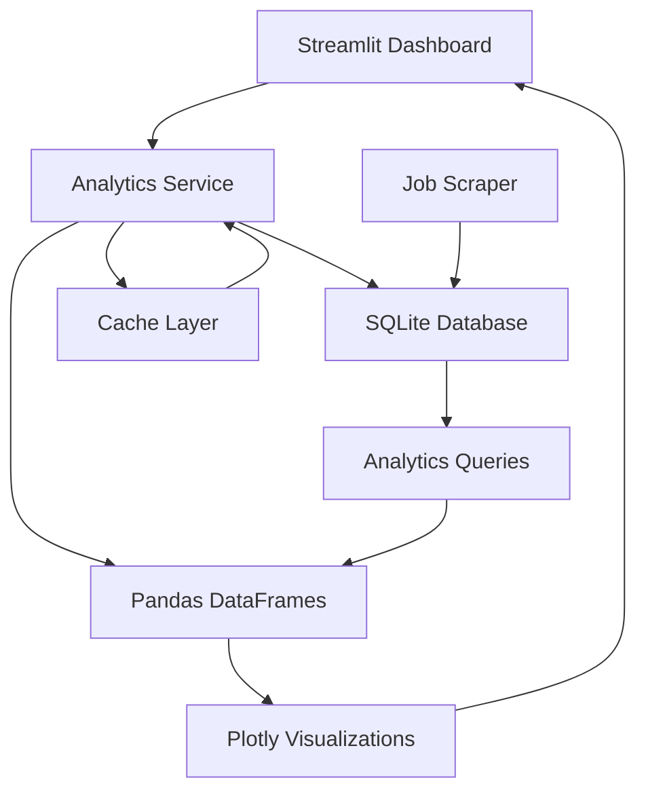

# ADR-024: High-Performance Data Analytics with Pandas and SQLite

## Metadata

**Status:** Accepted
**Version/Date:** v1.0 / 2025-08-22

## Title

High-Performance Data Analytics for Streamlit Job Analysis

## Description

Implement optimized data analytics patterns using Pandas with SQLite for job market analysis, trend detection, and performance insights within Streamlit framework.

## Context

The AI Job Scraper requires comprehensive data analytics capabilities for job market trend analysis, company hiring pattern detection, salary analysis, performance metrics tracking, and real-time dashboard analytics. Given the Streamlit framework adoption (per **ADR-017**) and simple data management approach (per **ADR-019**), analytics must integrate seamlessly with existing SQLModel/SQLite foundation while providing meaningful insights for development-scale data volumes.

## Decision Drivers

- Maximize Pandas and SQLite library capabilities for Streamlit integration
- Enable meaningful job market insights and trend analysis for users
- Maintain simple analytics patterns for development workflow
- Ensure analytics patterns can scale with growing data volumes

## Alternatives

- A: Polars + DuckDB Analytics — Modern data processing with advanced SQL capabilities / Additional learning curve and integration complexity for development team
- B: Pure SQL Analytics with SQLite — Minimal dependencies leveraging existing database foundation / Limited visualization capabilities and poor Streamlit integration
- C: Pandas + SQLite with Streamlit Integration — Native DataFrame integration with familiar API / Performance limitations with very large datasets

### Decision Framework

| Model / Option | Solution Leverage (Weight: 35%) | Application Value (Weight: 30%) | Maintenance & Cognitive Load (Weight: 25%) | Architectural Adaptability (Weight: 10%) | Total Score | Decision |
|---|---|---|---|---|---|---|
| Polars + DuckDB | 7 | 9 | 5 | 8 | 7.0 | Not Selected |
| Pure SQL | 8 | 6 | 9 | 7 | 7.4 | Not Selected |
| Pandas + SQLite | 10 | 9 | 8 | 8 | 9.2 | **Selected** |

## Decision

We will adopt **Pandas + SQLite with Streamlit Integration** to address high-performance data analytics requirements for job market analysis and dashboard visualization.

## High-Level Architecture



## Related Requirements

### Functional Requirements

- FR-024-01: Efficient data processing for job market trend analysis and visualization
- FR-024-02: Real-time analytics integration with Streamlit dashboard components
- FR-024-03: SQLite database integration with existing data management patterns
- FR-024-04: Interactive visualization capabilities with filtering and search

### Non-Functional Requirements

- NFR-024-01: Analytics query execution time under 2 seconds for dashboard responsiveness
- NFR-024-02: Memory usage scalable with growing job dataset volumes
- NFR-024-03: Streamlit caching optimization for repeated analytics operations

### Performance Requirements

- PR-024-01: Dashboard loading time under 3 seconds for analytics visualization
- PR-024-02: Interactive chart rendering under 1 second for user experience
- PR-024-03: Data aggregation efficiency for 10,000+ job records

### Integration Requirements

- IR-024-01: Coordinate with **ADR-019** simple data management patterns
- IR-024-02: Support **ADR-017** Streamlit framework integration requirements
- IR-024-03: Interface with **ADR-025** performance scale strategy patterns

## Related Decisions

- **ADR-019** (Simple Data Management): Provides SQLite foundation for analytics data access
- **ADR-017** (Local Development Architecture): Establishes Streamlit framework integration requirements
- **ADR-025** (Performance Scale Strategy): Coordinates with background task management for analytics processing

## Design

### Architecture Overview

Analytics service implements caching-optimized Pandas operations with SQLite data access and Streamlit visualization integration.

### Implementation Details

```python
# services/analytics_service.py
import pandas as pd
import sqlite3
import streamlit as st

class JobAnalyticsService:
    def __init__(self, db_path: str = "data/jobs.db"):
        self.db_path = db_path
    
    @st.cache_data(ttl=300)
    def get_job_trends(self, days: int = 30) -> pd.DataFrame:
        query = """
        SELECT DATE(scraped_at) as date, COUNT(*) as job_count
        FROM jobs WHERE scraped_at >= date('now', '-{} days')
        GROUP BY DATE(scraped_at) ORDER BY date
        """.format(days)
        with sqlite3.connect(self.db_path) as conn:
            return pd.read_sql_query(query, conn, parse_dates=['date'])
    
    @st.cache_data(ttl=300)
    def get_company_analytics(self) -> pd.DataFrame:
        query = """
        SELECT company, COUNT(*) as total_jobs,
               AVG(CASE WHEN salary_min IS NOT NULL THEN salary_min END) as avg_salary
        FROM jobs GROUP BY company ORDER BY total_jobs DESC LIMIT 20
        """
        with sqlite3.connect(self.db_path) as conn:
            return pd.read_sql_query(query, conn)
```

### Configuration

- Streamlit caching with 5-minute TTL for frequent queries
- SQLite connection pooling for concurrent analytics operations
- Plotly visualization with responsive container width settings

## Testing

Analytics testing strategy uses pytest with mocked database connections and performance benchmarks. Key test areas include:

```python
# tests/test_analytics_service.py
import pytest
import pandas as pd
from unittest.mock import patch
from services.analytics_service import JobAnalyticsService

def test_job_trends_calculation():
    """Test job trends calculation accuracy."""
    service = JobAnalyticsService(db_path=":memory:")
    with patch.object(service, 'get_job_trends') as mock_trends:
        mock_trends.return_value = pd.DataFrame({
            'date': ['2025-08-19', '2025-08-20'],
            'job_count': [10, 15]
        })
        trends_df = service.get_job_trends(days=7)
        assert not trends_df.empty
        assert trends_df['job_count'].sum() == 25

@pytest.mark.performance
def test_analytics_performance():
    """Test analytics meets performance requirements."""
    import time
    service = JobAnalyticsService()
    start_time = time.time()
    service.get_job_trends(days=30)
    execution_time = time.time() - start_time
    assert execution_time < 2.0  # Under 2 seconds requirement
```

## Consequences

### Positive Outcomes

- Streamlit integration provides native DataFrame support with automatic caching optimization
- Familiar Pandas API accelerates analytics implementation and development velocity
- Direct Plotly integration enables responsive dashboard components
- Simple architecture builds on existing SQLite foundation without additional complexity

### Negative Consequences / Trade-offs

- Pandas processing constraints with very large datasets (>100K records)
- Memory usage requires careful management for growing data volumes
- SQLite limitations prevent distributed analytics processing
- Advanced analytics require complex SQL queries without ORM abstraction

### Ongoing Maintenance & Considerations

- Monitor memory usage and query performance for optimization opportunities
- Implement data pagination for large result sets to manage memory usage
- Leverage Streamlit caching for repeated operations and dashboard performance

### Dependencies

- pandas >= 2.0.0 for DataFrame operations
- plotly >= 5.0.0 for visualization components
- streamlit >= 1.28.0 for caching and UI integration

## References

- [Pandas Performance Optimization](https://pandas.pydata.org/docs/user_guide/enhancingperf.html) - Official performance guide for efficient DataFrame operations
- [SQLite Query Optimization](https://www.sqlite.org/optoverview.html) - Database query optimization strategies
- [Plotly Streamlit Integration](https://plotly.com/python/streamlit/) - Visualization integration patterns
- [Streamlit Caching Guide](https://docs.streamlit.io/library/advanced-features/caching) - Caching optimization techniques

## Changelog

- **v1.0 (2025-08-22)**: Applied official ADR template with 13-section structure, added weighted Decision Framework, condensed Design section for maintainability, updated cross-references format
