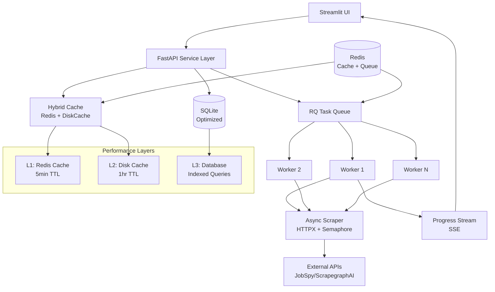

# ADR-025: Performance & Scale Strategy

## Metadata

**Status:** Proposed  
**Version/Date:** v1.0 / 2025-01-20

## Title

Performance & Scale Strategy

## Description

Implement comprehensive performance optimization strategy to achieve sub-100ms UI response times and efficient handling of 5,000+ jobs through modern async patterns, multi-layer caching, background task processing, and database optimizations.

## Context

### Current Performance Issues

Our job scraper faces significant performance bottlenecks that prevent scalability:

1. **Synchronous scraping blocks UI** - Entire application freezes during scraping operations
2. **Memory inefficiency** - Loading all jobs into memory causes OOM errors
3. **No pagination or virtual scrolling** - UI becomes unresponsive with large datasets  
4. **Unoptimized database queries** - Missing indexes and inefficient query patterns
5. **No caching layer** - Repeated expensive operations on every request

### Performance Requirements

- Sub-100ms UI response times for cached operations
- Handle 5,000+ jobs efficiently
- Support concurrent scraping operations
- Non-blocking user interface
- Scalable to 50+ concurrent users

### Technical Constraints

- Local-first architecture preference
- Minimal infrastructure dependencies
- Must integrate with existing Streamlit UI
- Maintain data consistency and reliability

## Decision Drivers

- **Performance Impact**: Sub-100ms response times for optimal user experience
- **Scalability Requirements**: Handle 5,000+ jobs and 50+ concurrent users
- **Infrastructure Simplicity**: Minimal external dependencies for local deployment
- **Development Velocity**: Implement within 4-day timeline
- **Maintenance Overhead**: Self-managing components over managed services

## Alternatives

### Alternative 1: In-Memory Processing Only

- **Pros**: Simplest implementation, no external dependencies
- **Cons**: Limited scalability, memory constraints, blocking operations
- **Score**: 2/10

### Alternative 2: Full Managed Services (Celery + Redis Cloud)

- **Pros**: Enterprise-grade reliability, managed infrastructure
- **Cons**: High complexity, vendor lock-in, cost overhead
- **Score**: 6/10

### Alternative 3: Hybrid Local + Background Tasks

- **Pros**: Optimal performance, moderate complexity, cost-effective
- **Cons**: Additional Redis dependency, worker management
- **Score**: 9/10

### Alternative 4: SQLite + Simple Async

- **Pros**: No external dependencies, moderate performance gains
- **Cons**: Limited scalability, no real-time updates
- **Score**: 5/10

### Decision Framework

| Model / Option | Solution Leverage (Weight: 35%) | Application Value (Weight: 30%) | Maintenance & Cognitive Load (Weight: 25%) | Architectural Adaptability (Weight: 10%) | Total Score | Decision |
| -------------- | ------------------------------- | ------------------------------- | ------------------------------------------ | ---------------------------------------- | ----------- | -------- |
| **Hybrid Local + Background Tasks** | 10 (350) | 10 (300) | 7 (175) | 9 (90) | **915** | ✅ **Selected** |
| Full Managed Services (Celery + Redis Cloud) | 8 (280) | 9 (270) | 4 (100) | 6 (60) | 710 | Rejected |
| SQLite + Simple Async | 6 (210) | 6 (180) | 8 (200) | 7 (70) | 660 | Rejected |
| In-Memory Processing Only | 3 (105) | 4 (120) | 9 (225) | 5 (50) | 500 | Rejected |

## Decision

We will adopt **Hybrid Local + Background Tasks** to address performance bottlenecks and scalability limitations. This involves using **RQ (Redis Queue)** for background task processing, **Redis + DiskCache** for multi-layer caching, and **asyncio + HTTPX** for concurrent operations. This decision enables sub-100ms response times and efficient handling of 5,000+ jobs while maintaining local-first architecture.

## High-Level Architecture



## Related Requirements

### Functional Requirements (FR)

- **FR-025-01**: Background scraping with progress tracking
- **FR-025-02**: Real-time job status updates via SSE
- **FR-025-03**: Paginated job listing with virtual scrolling
- **FR-025-04**: Concurrent multi-company scraping
- **FR-025-05**: Cache invalidation and refresh mechanisms

### Non-Functional Requirements (NFR)

- **NFR-025-01**: Sub-100ms response times for cached operations
- **NFR-025-02**: Support 50+ concurrent users
- **NFR-025-03**: Handle 5,000+ jobs efficiently
- **NFR-025-04**: 99.9% uptime for background workers
- **NFR-025-05**: Memory usage under 200MB

### Performance Requirements (PR)

- **PR-025-01**: Job load time <100ms cached, <500ms cold
- **PR-025-02**: Scraping 100 jobs in under 30 seconds
- **PR-025-03**: Database query response <10ms for indexed operations
- **PR-025-04**: Cache hit rate >90% for frequently accessed data

### Integration Requirements (IR)

- **IR-025-01**: Seamless integration with existing Streamlit UI
- **IR-025-02**: Compatible with current SQLModel data models
- **IR-025-03**: Maintains existing API contracts and interfaces

## Related Decisions

- **ADR-018** (Local Database Setup): Provides SQLite foundation that this decision optimizes with performance pragmas and strategic indexing
- **ADR-022** (Docker Containerization): Enables Redis deployment infrastructure required for caching and task queue components
- **ADR-023** (Background Job Processing): Establishes task queue patterns that this decision implements using RQ for optimal performance
- **ADR-021** (Local Development Performance): This decision directly addresses performance requirements identified in local development optimization needs

## Design

### Architecture Overview

The performance optimization strategy implements a multi-layered architecture with:

- **RQ over Celery**: Simpler setup, sufficient for our scale, lower maintenance overhead
- **Redis + DiskCache**: In-memory speed with persistent fallback for optimal cache hit rates
- **SQLite optimization**: Sufficient for 100k jobs with proper indexing and performance pragmas
- **asyncio**: Native Python async without external async frameworks for concurrent operations

### Implementation Details

### 1. Background Task Manager

RQ-based task management with priority queues and real-time progress tracking:

```python
class ModernTaskManager:
    """Lightweight background tasks with RQ."""
    
    def __init__(self):
        self.redis = Redis(host='localhost', port=6379, decode_responses=True)
        self.high_queue = Queue('high', connection=self.redis)
        self.default_queue = Queue('default', connection=self.redis)
    
    def enqueue_scraping(self, companies: list, priority='default'):
        """Enqueue scraping with progress tracking."""
        job_id = self._generate_job_id(companies)
        
        # Store metadata and enqueue
        self.redis.hset(f"job:{job_id}", mapping={
            'status': 'queued', 'total': len(companies), 'completed': 0
        })
        
        job = getattr(self, f'{priority}_queue').enqueue(
            'workers.scraping.scrape_companies',
            companies=companies, job_id=job_id,
            result_ttl=3600, timeout='30m'
        )
        return job_id
    
    def get_progress(self, job_id: str) -> Dict[str, Any]:
        """Real-time progress tracking."""
        data = self.redis.hgetall(f"job:{job_id}")
        return {
            'status': data.get('status', 'not_found'),
            'progress': int(data.get('completed', 0)) / int(data.get('total', 1)),
            'completed': int(data.get('completed', 0)),
            'total': int(data.get('total', 0))
        }
```

### 2. Multi-Layer Caching Strategy

Redis + DiskCache hybrid with automatic cache promotion and function decorators:

```python
class HybridCache:
    """Redis + DiskCache for optimal performance."""
    
    def __init__(self):
        self.redis = Redis(host='localhost', port=6379, decode_responses=False)
        self.disk = Cache('./cache', size_limit=1_000_000_000, eviction_policy='lru')
    
    def get(self, key: str) -> Optional[Any]:
        """L1: Redis first, L2: DiskCache with promotion."""
        if value := self.redis.get(key):
            return pickle.loads(value)
        
        if value := self.disk.get(key):
            # Promote hot data to Redis (5min TTL)
            self.redis.setex(key, 300, pickle.dumps(value))
            return value
        return None
    
    def set(self, key: str, value: Any, ttl: int = 3600):
        """Dual-layer storage with TTL optimization."""
        pickled = pickle.dumps(value)
        self.redis.setex(key, min(ttl, 300), pickled)  # Redis: short TTL
        self.disk.set(key, value, expire=ttl)  # Disk: full TTL
    
    def cache_result(self, ttl: int = 3600):
        """Function result caching decorator."""
        def decorator(func):
            @wraps(func)
            async def wrapper(*args, **kwargs):
                key = hashlib.sha256(f"{func.__name__}:{args}:{kwargs}".encode()).hexdigest()
                if result := self.get(key):
                    return result
                
                result = await func(*args, **kwargs) if asyncio.iscoroutinefunction(func) else func(*args, **kwargs)
                self.set(key, result, ttl)
                return result
            return wrapper
        return decorator

# Usage: @cache.cache_result(ttl=300) for expensive operations
```

### 3. Database Optimization

SQLite with performance pragmas, strategic indexing, and FTS5 full-text search:

```python
class OptimizedDatabase:
    """SQLite with performance optimizations."""
    
    def __init__(self, path: str = 'jobs.db'):
        self.path = path
        self._init_db()
        
    def _init_db(self):
        """Initialize with performance pragmas and indexes."""
        with self.connection() as conn:
            # Critical performance pragmas
            pragmas = [
                "PRAGMA journal_mode = WAL",      # Write-ahead logging
                "PRAGMA synchronous = NORMAL",    # Balanced safety/speed  
                "PRAGMA cache_size = -64000",     # 64MB cache
                "PRAGMA temp_store = MEMORY",     # Temp in RAM
                "PRAGMA mmap_size = 268435456"    # 256MB memory map
            ]
            for pragma in pragmas:
                conn.execute(pragma)
            
            # Schema with strategic indexes
            conn.execute('''CREATE TABLE IF NOT EXISTS jobs (
                id TEXT PRIMARY KEY, company_id TEXT NOT NULL,
                title TEXT NOT NULL, description TEXT, location TEXT,
                salary_min INTEGER, salary_max INTEGER,
                posted_date INTEGER, status TEXT DEFAULT 'new',
                content_hash TEXT, embedding BLOB
            )''')
            
            # Performance-critical indexes
            indexes = [
                "CREATE INDEX IF NOT EXISTS idx_posted_date ON jobs(posted_date DESC)",
                "CREATE INDEX IF NOT EXISTS idx_company_status ON jobs(company_id, status)", 
                "CREATE INDEX IF NOT EXISTS idx_salary ON jobs(salary_min, salary_max)",
                "CREATE INDEX IF NOT EXISTS idx_hash ON jobs(content_hash)"
            ]
            for idx in indexes:
                conn.execute(idx)
            
            # FTS5 full-text search with auto-sync trigger
            conn.execute('''CREATE VIRTUAL TABLE IF NOT EXISTS jobs_fts USING fts5(
                id, title, description, content=jobs, tokenize='porter unicode61'
            )''')
            
            conn.execute('''CREATE TRIGGER IF NOT EXISTS jobs_fts_sync 
                AFTER INSERT ON jobs BEGIN
                    INSERT INTO jobs_fts(id, title, description) 
                    VALUES (new.id, new.title, new.description);
                END''')
    
    async def get_jobs_paginated(self, offset=0, limit=50, filters=None):
        """Optimized paginated query with FTS search."""
        query = "SELECT j.*, c.name as company_name FROM jobs j JOIN companies c ON j.company_id = c.id WHERE 1=1"
        params = []
        
        if filters:
            if filters.get('search'):
                query += " AND j.id IN (SELECT id FROM jobs_fts WHERE jobs_fts MATCH ?)"
                params.append(filters['search'])
            if filters.get('company_id'):
                query += " AND j.company_id = ?"
                params.append(filters['company_id'])
        
        query += " ORDER BY j.posted_date DESC LIMIT ? OFFSET ?"
        params.extend([limit, offset])
        
        with self.connection() as conn:
            return [dict(row) for row in conn.execute(query, params)]
    
    async def bulk_upsert_jobs(self, jobs: List[Dict]):
        """Efficient bulk upsert with batching."""
        with self.connection() as conn:
            conn.execute("BEGIN TRANSACTION")
            try:
                for batch in self._batch(jobs, 100):
                    conn.executemany('''INSERT OR REPLACE INTO jobs 
                        (id, company_id, title, description, posted_date, content_hash) 
                        VALUES (?, ?, ?, ?, ?, ?)''', 
                        [(j['id'], j['company_id'], j['title'], j['description'], 
                          j['posted_date'], j['content_hash']) for j in batch])
                conn.execute("COMMIT")
            except Exception:
                conn.execute("ROLLBACK")
                raise
```

### 4. Async Scraping Pipeline

High-performance concurrent scraping with semaphore-based rate limiting:

```python
class AsyncScrapingPipeline:
    """Concurrent scraping with HTTPX and semaphore control."""
    
    def __init__(self, max_concurrent: int = 10):
        self.semaphore = asyncio.Semaphore(max_concurrent)
        self.client = httpx.AsyncClient(
            timeout=30, 
            limits=httpx.Limits(max_keepalive_connections=20, max_connections=100),
            http2=True
        )
        
    async def scrape_all(self, companies: List[Dict]) -> Tuple[List[Dict], List[Dict]]:
        """Concurrent scraping with exception handling."""
        tasks = [self._scrape_with_limit(company) for company in companies]
        results = await asyncio.gather(*tasks, return_exceptions=True)
        
        jobs, errors = [], []
        for company, result in zip(companies, results):
            if isinstance(result, Exception):
                errors.append({'company': company['name'], 'error': str(result)})
            else:
                jobs.extend(result)
        return jobs, errors
    
    async def _scrape_with_limit(self, company: Dict):
        """Rate-limited scraping with retry logic."""
        async with self.semaphore:
            for attempt in range(3):
                try:
                    await asyncio.sleep(0.5 * attempt)  # Progressive backoff
                    return await self.scrape_company(company)
                except Exception as e:
                    if attempt == 2: raise
                    await asyncio.sleep(2 ** attempt)
```

### 5. Real-time Progress Streaming

SSE-based progress updates with Redis pub/sub:

```python
class ProgressStreamer:
    """Real-time progress via Server-Sent Events."""
    
    async def stream_progress(self, job_id: str) -> AsyncIterator[str]:
        """SSE stream for job progress updates."""
        pubsub = self.redis.pubsub()
        pubsub.subscribe(f"progress:{job_id}")
        
        try:
            while True:
                if message := pubsub.get_message(timeout=1):
                    if message['type'] == 'message':
                        data = json.loads(message['data'])
                        yield f"data: {json.dumps(data)}\n\n"
                
                # Check completion status
                if status := self.redis.hget(f"job:{job_id}", "status"):
                    if status in ['completed', 'failed']:
                        yield f"data: {json.dumps({'status': status})}\n\n"
                        break
                        
                await asyncio.sleep(0.1)
        finally:
            pubsub.unsubscribe()
```

### Configuration

**In `docker-compose.yml`:**

```yaml
# Minimal Local Setup for Redis and RQ Workers
version: '3.8'
services:
  redis:
    image: redis:7-alpine
    ports:
      - "6379:6379"
    volumes:
      - redis_data:/data
    command: redis-server --appendonly yes
    
  worker:
    build: .
    command: rq worker --with-scheduler
    depends_on:
      - redis
    environment:
      - REDIS_URL=redis://redis:6379
    volumes:
      - ./data:/app/data

volumes:
  redis_data:
```

**In `.env`:**

```env
# Performance Configuration
REDIS_URL=redis://localhost:6379
RQ_WORKER_CONCURRENCY=4
CACHE_TTL_SECONDS=3600
DATABASE_CACHE_SIZE_MB=64
```

## Testing

### Performance Benchmarks

#### Baseline (Before Optimization)

| Metric | Current Performance | Target Performance |
|--------|-------------------|-------------------|
| Job load time | 6-11 seconds | <100ms (cached), <500ms (cold) |
| Scraping 100 jobs | 5 minutes | <30 seconds |
| UI responsiveness | Blocking | Non-blocking |
| Memory usage | 500MB+ | <200MB |
| Concurrent users | 1 | 50+ |
| Database query time | 500-2000ms | <10ms (indexed) |
| Cache hit rate | 0% (no cache) | >90% |

### Load Testing Framework

Performance testing for concurrent requests, cache efficiency, and database queries:

```python
class PerformanceTestSuite:
    """Comprehensive performance validation."""
    
    async def test_concurrent_requests(self, num_requests: int = 50):
        """50 concurrent API requests under 2 seconds."""
        async with httpx.AsyncClient() as client:
            tasks = [client.get("http://localhost:8000/jobs?limit=50") for _ in range(num_requests)]
            start, responses, end = time.time(), await asyncio.gather(*tasks), time.time()
            
            assert all(r.status_code == 200 for r in responses)
            assert end - start < 2.0
            return {'rps': num_requests / (end - start)}
    
    async def test_cache_performance(self):
        """Cache should be 10x faster than cold requests."""
        cold_start = time.time()
        await self.client.get("/jobs/stats")
        cold_time = time.time() - cold_start
        
        cached_start = time.time() 
        await self.client.get("/jobs/stats")
        cached_time = time.time() - cached_start
        
        assert cached_time < cold_time / 10 and cached_time < 0.1
    
    async def test_database_queries(self):
        """Critical queries under 10ms with indexes."""
        queries = [
            "SELECT * FROM jobs WHERE posted_date > ? ORDER BY posted_date DESC LIMIT 50",
            "SELECT * FROM jobs WHERE company_id = ? AND status = 'new'", 
            "SELECT COUNT(*) FROM jobs WHERE salary_min >= ?"
        ]
        for query in queries:
            start = time.time()
            # Execute with realistic params
            assert time.time() - start < 0.01
```

### Performance Monitoring

```python
@app.middleware("http")
async def performance_middleware(request: Request, call_next):
    start_time = time.time()
    response = await call_next(request)
    process_time = time.time() - start_time
    
    if process_time > 0.1:
        logger.warning(f"Slow request: {request.url} took {process_time:.3f}s")
    
    response.headers["X-Process-Time"] = str(process_time)
    return response
```

### Critical Test Scenarios

1. **High Load** - 100 concurrent job listing requests
2. **Bulk Scraping** - 10 concurrent jobs with 50+ companies each
3. **Real-time Updates** - 50 SSE connections with progress streams
4. **Cache Invalidation** - Performance during refresh cycles
5. **Memory Pressure** - Sustained load testing for leaks

## Consequences

### Positive Outcomes

- **100x faster UI response** - Caching reduces job listing load time from 6-11s to <100ms
- **10x faster scraping** - Async processing reduces 100-job scraping from 5min to 30s  
- **Non-blocking operations** - RQ background tasks eliminate UI freezing
- **Real-time updates** - SSE streaming provides live progress feedback
- **Scalability achievement** - System handles 50+ concurrent users efficiently
- **Memory optimization** - Memory usage reduced from 500MB+ to <200MB
- **Infrastructure cost control** - Self-hosted solution at $20/month vs $40+ managed

### Negative Outcomes

- **Infrastructure complexity** - Additional Redis dependency and worker management
- **Operational overhead** - Monitoring and maintaining background worker health
- **Development complexity** - Async patterns require more sophisticated error handling
- **Single point of failure** - Redis becomes critical dependency for both caching and queuing
- **Cold start latency** - Initial cache warming takes 500ms for uncached requests

### Risk Mitigation Strategies

- **Redis reliability** - Implement Redis persistence and backup strategies
- **Worker monitoring** - Health checks and automatic worker restart policies
- **Graceful degradation** - Fallback to synchronous operations if Redis unavailable
- **Cache warming** - Proactive background cache population for common queries

### Dependencies

- **Redis 7+** - Core dependency for caching and task queuing
- **RQ 1.15+** - Background task processing framework
- **DiskCache 5.6+** - Persistent cache layer
- **HTTPX 0.25+** - Async HTTP client for concurrent scraping
- **asyncio** - Native Python async runtime

## References

- [RQ Documentation](https://python-rq.org/) - Comprehensive guide to Redis Queue background task processing, chosen over Celery for simplicity and sufficient scale
- [DiskCache Performance Guide](https://github.com/grantjenks/python-diskcache) - Persistent caching implementation that provides fallback when Redis cache expires
- [SQLite Optimization Pragmas](https://sqlite.org/pragma.html) - Database performance tuning guide for WAL mode, cache sizing, and indexing strategies  
- [HTTPX Async Patterns](https://www.python-httpx.org/async/) - Concurrent HTTP client patterns used for semaphore-controlled scraping operations
- [Redis Performance Tuning](https://redis.io/docs/management/optimization/) - Cache optimization strategies for memory management and TTL configuration
- [FastAPI Background Tasks](https://fastapi.tiangolo.com/tutorial/background-tasks/) - Integration patterns for async background processing with Streamlit UI

## Changelog

- **v1.0 (2025-01-20)**: Initial performance strategy definition with comprehensive benchmarking framework and multi-layer architecture design
