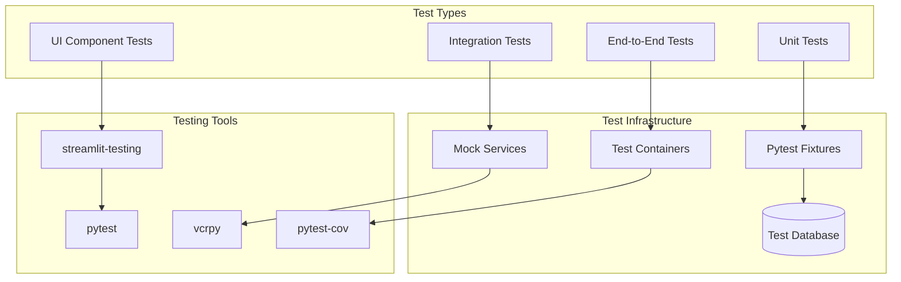

# ADR-029: Comprehensive Testing Strategy for Streamlit Application

## Title

Pytest-Based Testing Strategy with Streamlit Integration Patterns

## Version/Date

1.0 / August 20, 2025

## Status

Proposed - Supporting Quality Assurance Architecture

## Context

**Current State**: The application has comprehensive test coverage (80+ test files) but lacks standardized patterns for testing Streamlit-specific functionality, service layer integration, and background processing workflows.

**Research Findings**: Streamlit applications require specialized testing approaches for:
- Session state management and UI interactions
- Cached data and resource testing
- Background thread integration with Streamlit context
- Service layer testing independent of UI framework
- Integration testing of scraping workflows

**Quality Requirements**: Maintain >90% test coverage while ensuring reliable CI/CD pipeline execution.

## Related Requirements

### Functional Requirements
- FR-029-01: Comprehensive test coverage for all service layers
- FR-029-02: Streamlit-specific testing patterns for UI components  
- FR-029-03: Integration testing for complete scraping workflows
- FR-029-04: Performance testing for background processing patterns

### Non-Functional Requirements
- NFR-029-01: Test execution time <3 minutes for full test suite
- NFR-029-02: Reliable test execution in CI/CD environment
- NFR-029-03: Test isolation with proper cleanup between tests
- NFR-029-04: Mock strategies for external dependencies (APIs, proxies)

## Decision

**Implement Comprehensive Testing Strategy** with Streamlit-optimized patterns:

### Testing Architecture



## Core Testing Patterns

### 1. Service Layer Unit Testing

```python
# tests/services/test_job_service.py
import pytest
from unittest.mock import Mock, patch
from sqlmodel import Session, create_engine, SQLModel
from src.services.job_service import JobService
from src.models import Job, Company

class TestJobService:
    """Comprehensive unit tests for JobService."""
    
    @pytest.fixture
    def test_engine(self):
        """In-memory SQLite engine for testing."""
        engine = create_engine("sqlite:///:memory:")
        SQLModel.metadata.create_all(engine)
        return engine
    
    @pytest.fixture
    def test_session(self, test_engine):
        """Test database session with automatic rollback."""
        with Session(test_engine) as session:
            yield session
            session.rollback()
    
    @pytest.fixture
    def job_service(self, test_session):
        return JobService(session=test_session)
    
    @pytest.fixture
    def sample_jobs(self, test_session):
        """Create sample jobs for testing."""
        jobs = [
            Job(
                title="Software Engineer",
                company="Google",
                location="Mountain View, CA",
                description="Build amazing things",
                url="https://google.com/jobs/1",
                scraped_at="2025-08-20T10:00:00"
            ),
            Job(
                title="Product Manager", 
                company="Google",
                location="San Francisco, CA",
                description="Lead product development",
                url="https://google.com/jobs/2",
                scraped_at="2025-08-20T11:00:00"
            )
        ]
        
        for job in jobs:
            test_session.add(job)
        test_session.commit()
        
        return jobs
    
    def test_get_jobs_by_company_success(self, job_service, sample_jobs):
        """Test successful job retrieval by company."""
        result = job_service.get_jobs_by_company("Google", limit=10)
        
        assert result["success"] is True
        assert len(result["data"]) == 2
        assert all(job["company"] == "Google" for job in result["data"])
        assert "Found 2 jobs for Google" in result["message"]
    
    def test_get_jobs_by_company_not_found(self, job_service):
        """Test job retrieval for non-existent company."""
        result = job_service.get_jobs_by_company("NonExistent", limit=10)
        
        assert result["success"] is True
        assert len(result["data"]) == 0
        assert "Found 0 jobs for NonExistent" in result["message"]
    
    def test_bulk_insert_jobs_success(self, job_service):
        """Test successful bulk job insertion."""
        jobs_data = [
            {
                "title": "DevOps Engineer",
                "company": "Microsoft", 
                "location": "Seattle, WA",
                "description": "Manage cloud infrastructure",
                "url": "https://microsoft.com/jobs/1",
                "scraped_at": "2025-08-20T12:00:00"
            },
            {
                "title": "Data Scientist",
                "company": "Microsoft",
                "location": "Redmond, WA", 
                "description": "Analyze large datasets",
                "url": "https://microsoft.com/jobs/2",
                "scraped_at": "2025-08-20T13:00:00"
            }
        ]
        
        result = job_service.bulk_insert_jobs(jobs_data)
        
        assert result["success"] is True
        assert result["data"]["inserted_count"] == 2
        assert "Successfully inserted 2 jobs" in result["message"]
    
    def test_bulk_insert_jobs_duplicate_handling(self, job_service, sample_jobs):
        """Test bulk insertion with duplicate job handling."""
        # Try to insert job with same URL
        duplicate_job = {
            "title": "Software Engineer",
            "company": "Google",
            "location": "Mountain View, CA", 
            "description": "Build amazing things",
            "url": "https://google.com/jobs/1",  # Same URL as sample_jobs[0]
            "scraped_at": "2025-08-20T14:00:00"
        }
        
        result = job_service.bulk_insert_jobs([duplicate_job])
        
        # Should handle gracefully based on unique constraints
        assert result["success"] is True or "duplicate" in result["error"].lower()
    
    @patch('src.services.job_service.st.cache_data.clear')
    def test_cache_clearing_after_insert(self, mock_clear_cache, job_service):
        """Test that cache is cleared after successful insertion."""
        jobs_data = [{
            "title": "Test Job",
            "company": "Test Corp",
            "location": "Test City",
            "description": "Test description",
            "url": "https://test.com/job",
            "scraped_at": "2025-08-20T15:00:00"
        }]
        
        result = job_service.bulk_insert_jobs(jobs_data)
        
        assert result["success"] is True
        mock_clear_cache.assert_called_once()
```

### 2. Streamlit UI Component Testing

```python
# tests/ui/test_streamlit_components.py
import pytest
from unittest.mock import Mock, patch, MagicMock
import streamlit as st
from streamlit.testing.v1 import AppTest
import pandas as pd

class TestStreamlitComponents:
    """Test Streamlit UI components and interactions."""
    
    @pytest.fixture
    def mock_job_service(self):
        """Mock job service for UI testing."""
        service = Mock()
        service.get_recent_jobs.return_value = {
            "success": True,
            "data": [
                {
                    "id": 1,
                    "title": "Software Engineer",
                    "company": "Google",
                    "location": "Mountain View, CA",
                    "description": "Build great products",
                    "url": "https://google.com/jobs/1"
                }
            ],
            "message": "Found 1 recent jobs"
        }
        return service
    
    def test_jobs_page_renders_successfully(self, mock_job_service):
        """Test that jobs page renders without errors."""
        with patch('src.ui.pages.jobs.get_job_service', return_value=mock_job_service):
            # Create Streamlit app test
            at = AppTest.from_file("src/ui/pages/jobs.py")
            at.run()
            
            # Check for key elements
            assert not at.exception
            assert len(at.title) > 0  # Page has title
            assert len(at.dataframe) > 0 or len(at.table) > 0  # Shows data
    
    def test_company_filter_interaction(self, mock_job_service):
        """Test company filter dropdown interaction."""
        with patch('src.ui.pages.jobs.get_job_service', return_value=mock_job_service):
            at = AppTest.from_file("src/ui/pages/jobs.py")
            at.run()
            
            # Test filter interaction
            if at.selectbox:
                at.selectbox[0].select("Google")
                at.run()
                
                # Verify service called with filter
                mock_job_service.get_jobs_by_company.assert_called_with("Google", limit=100)
    
    @patch('streamlit.session_state')
    def test_session_state_management(self, mock_session_state):
        """Test session state management patterns."""
        # Mock session state
        mock_session_state.__contains__.return_value = False
        mock_session_state.__getitem__.side_effect = KeyError
        mock_session_state.__setitem__ = Mock()
        
        # Import and test session state initialization
        from src.ui.utils.service_helpers import initialize_session_services
        
        initialize_session_services()
        
        # Verify session state was set
        assert mock_session_state.__setitem__.call_count > 0
```

### 3. Integration Testing Patterns

```python
# tests/integration/test_scraping_workflow.py
import pytest
import asyncio
from unittest.mock import patch, Mock
from src.services.scraping_service import ScrapingService
from src.scraper import SimplifiedScraper
from sqlmodel import Session, create_engine, SQLModel

class TestScrapingWorkflow:
    """Integration tests for complete scraping workflow."""
    
    @pytest.fixture
    def integration_engine(self):
        """Integration test database."""
        engine = create_engine("sqlite:///:memory:")
        SQLModel.metadata.create_all(engine)
        return engine
    
    @pytest.fixture
    def integration_session(self, integration_engine):
        with Session(integration_engine) as session:
            yield session
    
    @pytest.fixture
    def scraping_service(self, integration_session):
        return ScrapingService(session=integration_session)
    
    @pytest.fixture
    def mock_scraper_response(self):
        """Mock successful scraper response."""
        return [
            {
                "title": "Senior Software Engineer",
                "company": "TestCorp",
                "location": "San Francisco, CA",
                "description": "Work on exciting projects",
                "url": "https://testcorp.com/jobs/1",
                "posted_date": "2025-08-20"
            },
            {
                "title": "Product Manager",
                "company": "TestCorp", 
                "location": "Remote",
                "description": "Lead product strategy",
                "url": "https://testcorp.com/jobs/2",
                "posted_date": "2025-08-19"
            }
        ]
    
    @patch('src.scraper.SimplifiedScraper.scrape_company')
    def test_complete_scraping_workflow(self, mock_scrape, scraping_service, mock_scraper_response):
        """Test complete workflow from scraping to database storage."""
        # Mock scraper success
        mock_scrape.return_value = mock_scraper_response
        
        # Track progress updates
        progress_updates = []
        def progress_callback(update):
            progress_updates.append(update)
        
        # Execute scraping workflow
        result = scraping_service.scrape_companies_async(
            company_names=["TestCorp"],
            progress_callback=progress_callback
        )
        
        # Wait for completion (since it's async)
        import time
        time.sleep(2)  # Allow background thread to complete
        
        # Verify results
        assert result["success"] is True
        assert "started in background" in result["message"]
        
        # Check progress updates received
        assert len(progress_updates) >= 2  # At least start and complete
        assert any(update.get("status") == "scraping" for update in progress_updates)
        assert any(update.get("status") == "completed" for update in progress_updates)
    
    @patch('src.scraper.SimplifiedScraper.scrape_company')
    def test_scraping_workflow_with_failures(self, mock_scrape, scraping_service):
        """Test workflow handles individual company failures gracefully."""
        # Mock mixed success/failure
        def side_effect(company):
            if company == "FailCorp":
                raise Exception("Scraping failed")
            return [{"title": "Test Job", "company": company, "url": "https://test.com"}]
        
        mock_scrape.side_effect = side_effect
        
        progress_updates = []
        def progress_callback(update):
            progress_updates.append(update)
        
        result = scraping_service.scrape_companies_async(
            company_names=["SuccessCorp", "FailCorp", "AnotherSuccessCorp"],
            progress_callback=progress_callback
        )
        
        import time
        time.sleep(3)
        
        # Should complete successfully despite individual failures
        assert result["success"] is True
        
        # Should have progress updates for all companies
        final_update = progress_updates[-1]
        assert final_update.get("companies_processed") >= 2  # At least successful ones
```

### 4. Mock Strategies for External Dependencies

```python
# tests/conftest.py - Global test configuration
import pytest
from unittest.mock import Mock, patch
import vcr
from sqlmodel import Session, create_engine, SQLModel

# VCR.py configuration for API call recording/playback
@pytest.fixture(scope="module")
def vcr_config():
    return {
        "filter_headers": ["authorization", "x-api-key"],
        "filter_query_parameters": ["api_key", "token"],
    }

@pytest.fixture
def mock_openai_client():
    """Mock OpenAI client for AI service testing."""
    with patch('openai.AsyncOpenAI') as mock_client_class:
        mock_client = Mock()
        mock_response = Mock()
        mock_response.choices = [Mock(message=Mock(content='{"title": "Test Job", "company": "Test Corp"}'))]
        mock_client.chat.completions.create.return_value = mock_response
        mock_client_class.return_value = mock_client
        yield mock_client

@pytest.fixture
def mock_jobspy():
    """Mock JobSpy for scraper testing."""
    with patch('jobspy.scrape_jobs') as mock_scrape:
        import pandas as pd
        mock_df = pd.DataFrame([
            {
                "title": "Software Engineer",
                "company": "Google",
                "location": "Mountain View, CA",
                "description": "Build great products",
                "job_url": "https://google.com/jobs/1",
                "date_posted": "2025-08-20"
            }
        ])
        mock_scrape.return_value = mock_df
        yield mock_scrape

@pytest.fixture
def mock_proxy_pool():
    """Mock proxy pool for testing."""
    return [
        "198.23.239.134:6540:user:pass",
        "207.244.217.165:6712:user:pass"
    ]

# Database fixtures
@pytest.fixture(scope="session")
def test_db_engine():
    """Session-scoped test database engine."""
    engine = create_engine("sqlite:///:memory:")
    SQLModel.metadata.create_all(engine)
    return engine

@pytest.fixture
def db_session(test_db_engine):
    """Function-scoped database session with rollback."""
    with Session(test_db_engine) as session:
        yield session
        session.rollback()
```

### 5. Performance and Load Testing

```python
# tests/performance/test_service_performance.py
import pytest
import time
import asyncio
from concurrent.futures import ThreadPoolExecutor
from src.services.job_service import JobService

class TestServicePerformance:
    """Performance testing for service layer operations."""
    
    @pytest.fixture
    def perf_job_service(self, db_session):
        return JobService(session=db_session)
    
    def test_bulk_insert_performance(self, perf_job_service):
        """Test bulk insert performance with large datasets."""
        # Create large dataset
        jobs_data = []
        for i in range(1000):
            jobs_data.append({
                "title": f"Job Title {i}",
                "company": f"Company {i % 100}",  # 100 different companies
                "location": "Test Location",
                "description": "Test description" * 10,  # Longer description
                "url": f"https://test.com/job/{i}",
                "scraped_at": "2025-08-20T10:00:00"
            })
        
        start_time = time.time()
        result = perf_job_service.bulk_insert_jobs(jobs_data)
        execution_time = time.time() - start_time
        
        assert result["success"] is True
        assert result["data"]["inserted_count"] == 1000
        assert execution_time < 5.0  # Should complete in under 5 seconds
        
        print(f"Bulk insert of 1000 jobs completed in {execution_time:.2f} seconds")
    
    def test_concurrent_service_operations(self, perf_job_service):
        """Test service performance under concurrent load."""
        def concurrent_operation(i):
            return perf_job_service.get_recent_jobs(hours=24, limit=50)
        
        start_time = time.time()
        
        with ThreadPoolExecutor(max_workers=10) as executor:
            futures = [executor.submit(concurrent_operation, i) for i in range(50)]
            results = [future.result() for future in futures]
        
        execution_time = time.time() - start_time
        
        # All operations should succeed
        assert all(result["success"] for result in results)
        assert execution_time < 10.0  # Should handle 50 concurrent operations in under 10 seconds
        
        print(f"50 concurrent operations completed in {execution_time:.2f} seconds")
```

## CI/CD Integration

### GitHub Actions Configuration

```yaml
# .github/workflows/test.yml
name: Test Suite

on:
  push:
    branches: [ main, develop ]
  pull_request:
    branches: [ main ]

jobs:
  test:
    runs-on: ubuntu-latest
    
    steps:
    - uses: actions/checkout@v4
    
    - name: Set up Python 3.11
      uses: actions/setup-python@v4
      with:
        python-version: '3.11'
    
    - name: Install uv
      run: pip install uv
    
    - name: Install dependencies
      run: uv sync --dev
    
    - name: Lint with ruff
      run: uv run ruff check .
    
    - name: Format check with ruff
      run: uv run ruff format --check .
    
    - name: Type check with mypy
      run: uv run mypy src/
    
    - name: Run unit tests
      run: |
        uv run pytest tests/unit/ \
          --cov=src \
          --cov-report=xml \
          --cov-report=html \
          --junit-xml=test-results.xml \
          -v
    
    - name: Run integration tests
      run: |
        uv run pytest tests/integration/ \
          --junit-xml=integration-test-results.xml \
          -v
    
    - name: Run UI tests
      run: |
        uv run pytest tests/ui/ \
          --junit-xml=ui-test-results.xml \
          -v
    
    - name: Upload coverage to Codecov
      uses: codecov/codecov-action@v3
      with:
        file: ./coverage.xml
        fail_ci_if_error: true
    
    - name: Upload test results
      uses: actions/upload-artifact@v3
      if: always()
      with:
        name: test-results
        path: |
          test-results.xml
          integration-test-results.xml
          ui-test-results.xml
          htmlcov/
```

### Test Configuration

```toml
# pytest.ini
[tool.pytest.ini_options]
minversion = "7.0"
addopts = [
    "-ra",
    "--strict-markers",
    "--strict-config",
    "--cov=src",
    "--cov-branch", 
    "--cov-report=term-missing:skip-covered",
    "--cov-report=html:htmlcov",
    "--cov-report=xml",
    "--cov-fail-under=90"
]
testpaths = ["tests"]
python_files = ["test_*.py"]
python_classes = ["Test*"]
python_functions = ["test_*"]
markers = [
    "slow: marks tests as slow (deselect with '-m \"not slow\"')",
    "integration: marks tests as integration tests",
    "ui: marks tests as UI component tests",
    "performance: marks tests as performance tests"
]
filterwarnings = [
    "ignore::DeprecationWarning",
    "ignore::PendingDeprecationWarning",
]
```

## Related ADRs

### Integration Points
- **ADR-028**: Service layer architecture (primary testing target)
- **ADR-012**: Background task management (threading.Thread testing patterns)
- **ADR-014**: 2-tier scraping strategy (integration testing workflows)

### Dependencies
- **pytest**: Primary testing framework
- **streamlit-testing**: UI component testing
- **vcrpy**: HTTP interaction recording for external APIs
- **pytest-cov**: Code coverage measurement

## Success Metrics

### Coverage Targets
- [ ] >90% overall code coverage maintained
- [ ] >95% coverage for service layer classes
- [ ] >80% coverage for UI components
- [ ] 100% coverage for critical business logic paths

### Performance Targets
- [ ] Full test suite execution <3 minutes
- [ ] Unit tests complete <30 seconds
- [ ] Integration tests complete <2 minutes
- [ ] Performance tests identify regressions >10%

### Quality Targets
- [ ] Zero flaky tests in CI/CD pipeline
- [ ] All external dependencies properly mocked
- [ ] Test isolation maintained (no test order dependencies)
- [ ] Clear test documentation and examples for new developers

## Consequences

### Positive Outcomes
- **Comprehensive Coverage**: Multi-layered testing approach ensures quality
- **Streamlit Integration**: Specialized patterns for UI framework testing
- **CI/CD Reliability**: Consistent test execution in automated environments
- **Performance Monitoring**: Regular performance regression detection
- **Developer Confidence**: Comprehensive test suite enables safe refactoring

### Risk Mitigation
- **Test Isolation**: Proper cleanup prevents test contamination
- **Mock Strategies**: External dependency failures don't break test suite
- **Performance Baselines**: Performance tests catch degradations early
- **Documentation**: Clear testing patterns for team consistency

---

*This ADR establishes comprehensive testing strategy with Streamlit-optimized patterns, ensuring quality and reliability across the entire application stack.*