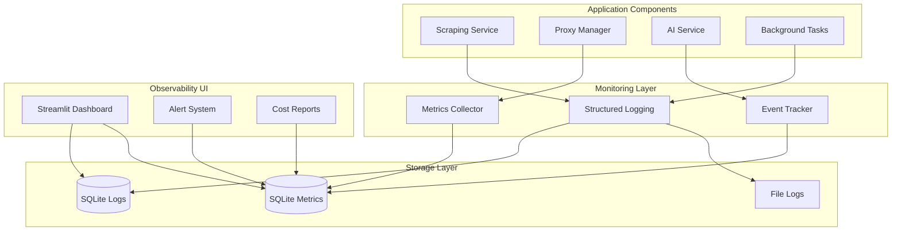

# ADR-030: Local-First Monitoring and Observability Strategy

## Title

Local-First Monitoring and Observability for Streamlit Applications with Cost Tracking

## Version/Date

1.0 / August 20, 2025

## Status

Proposed - Supporting Operational Excellence

## Context

**Local Development Focus**: As per ADR-017, this application prioritizes local development workflows. Traditional enterprise monitoring solutions (DataDog, New Relic) add unnecessary complexity and cost for local-first architecture.

**Operational Requirements**: Need visibility into:
- Scraping success rates and failure patterns
- Proxy usage and cost tracking (IPRoyal budget monitoring)
- AI/LLM API costs and token usage
- Application performance and error rates
- Background processing workflows

**Library-First Approach**: Leverage existing Python logging ecosystem with Streamlit-compatible monitoring patterns.

## Related Requirements

### Functional Requirements
- FR-030-01: Track scraping success rates by company and site
- FR-030-02: Monitor proxy usage costs against $15-25/month budget
- FR-030-03: Track AI/LLM API costs and token consumption
- FR-030-04: Provide real-time monitoring dashboard in Streamlit UI

### Non-Functional Requirements  
- NFR-030-01: Local-first monitoring (no external SaaS dependencies)
- NFR-030-02: Minimal performance overhead (<5% CPU/memory impact)
- NFR-030-03: Data retention policies for local storage management
- NFR-030-04: Simple alerting mechanisms for budget and error thresholds

## Decision

**Implement Local-First Monitoring Strategy** with Streamlit dashboard integration:

### Architecture Overview



## Core Monitoring Implementation

### 1. Structured Logging with Rich Context

```python
# src/monitoring/logger.py
import logging
import json
import sys
from datetime import datetime
from typing import Dict, Any, Optional
from pathlib import Path
import structlog

# Configure structured logging
structlog.configure(
    processors=[
        structlog.contextvars.merge_contextvars,
        structlog.processors.add_log_level,
        structlog.processors.TimeStamper(fmt="ISO"),
        structlog.dev.ConsoleRenderer() if sys.stderr.isatty() else structlog.processors.JSONRenderer(),
    ],
    logger_factory=structlog.stdlib.LoggerFactory(),
    wrapper_class=structlog.stdlib.BoundLogger,
    cache_logger_on_first_use=True,
)

class ApplicationLogger:
    """Centralized logging with structured context for monitoring."""
    
    def __init__(self, component: str):
        self.component = component
        self.logger = structlog.get_logger().bind(component=component)
        
        # Ensure logs directory exists
        Path("logs").mkdir(exist_ok=True)
        
        # Configure file handler for persistent logs
        file_handler = logging.FileHandler(f"logs/{component.lower()}.jsonl")
        file_handler.setFormatter(
            logging.Formatter('%(message)s')
        )
        logging.getLogger().addHandler(file_handler)
    
    def log_scraping_attempt(self, company: str, site: str, success: bool, 
                           jobs_found: int = 0, error: str = None, 
                           duration: float = 0, cost: float = 0):
        """Log scraping attempt with rich context."""
        self.logger.info(
            "scraping_attempt",
            company=company,
            site=site,
            success=success,
            jobs_found=jobs_found,
            error=error,
            duration_seconds=duration,
            cost_usd=cost,
            timestamp=datetime.utcnow().isoformat()
        )
    
    def log_proxy_usage(self, proxy_endpoint: str, company: str, 
                       success: bool, cost: float, response_time: float):
        """Log proxy usage for cost tracking."""
        self.logger.info(
            "proxy_usage",
            proxy_endpoint=proxy_endpoint,
            company=company,
            success=success,
            cost_usd=cost,
            response_time_ms=response_time,
            timestamp=datetime.utcnow().isoformat()
        )
    
    def log_ai_usage(self, model: str, prompt_tokens: int, completion_tokens: int,
                    cost: float, operation: str, success: bool):
        """Log AI/LLM usage for cost tracking."""
        self.logger.info(
            "ai_usage",
            model=model,
            prompt_tokens=prompt_tokens,
            completion_tokens=completion_tokens,
            total_tokens=prompt_tokens + completion_tokens,
            cost_usd=cost,
            operation=operation,
            success=success,
            timestamp=datetime.utcnow().isoformat()
        )
    
    def log_background_task(self, task_type: str, status: str, 
                           duration: float = 0, metadata: Dict[str, Any] = None):
        """Log background task execution."""
        self.logger.info(
            "background_task",
            task_type=task_type,
            status=status,  # started, completed, failed
            duration_seconds=duration,
            metadata=metadata or {},
            timestamp=datetime.utcnow().isoformat()
        )
```

### 2. Metrics Collection and Storage

```python
# src/monitoring/metrics.py
from sqlmodel import SQLModel, Field, Session, create_engine, select, func
from datetime import datetime, timedelta
from typing import Optional, List, Dict, Any
from dataclasses import dataclass

class ScrapingMetric(SQLModel, table=True):
    """Scraping performance metrics."""
    __tablename__ = "scraping_metrics"
    
    id: Optional[int] = Field(default=None, primary_key=True)
    timestamp: datetime = Field(default_factory=datetime.utcnow, index=True)
    company: str = Field(index=True)
    site: str = Field(index=True)  # linkedin, indeed, glassdoor, career_page
    success: bool = Field(index=True)
    jobs_found: int = 0
    duration_seconds: float = 0.0
    cost_usd: float = 0.0
    error_message: Optional[str] = None
    proxy_used: bool = False
    ai_enhanced: bool = False

class ProxyMetric(SQLModel, table=True):
    """Proxy usage metrics for cost tracking."""
    __tablename__ = "proxy_metrics"
    
    id: Optional[int] = Field(default=None, primary_key=True)
    timestamp: datetime = Field(default_factory=datetime.utcnow, index=True)
    proxy_endpoint: str = Field(index=True)
    company: str = Field(index=True)
    success: bool = Field(index=True)
    cost_usd: float = Field(default=0.0)
    response_time_ms: float = 0.0
    error_message: Optional[str] = None

class AIMetric(SQLModel, table=True):
    """AI/LLM usage metrics for cost tracking.""" 
    __tablename__ = "ai_metrics"
    
    id: Optional[int] = Field(default=None, primary_key=True)
    timestamp: datetime = Field(default_factory=datetime.utcnow, index=True)
    model: str = Field(index=True)
    operation: str = Field(index=True)  # job_extraction, enhancement, etc.
    prompt_tokens: int = 0
    completion_tokens: int = 0
    total_tokens: int = 0
    cost_usd: float = 0.0
    success: bool = Field(index=True)
    error_message: Optional[str] = None

class MetricsCollector:
    """Centralized metrics collection and analysis."""
    
    def __init__(self, db_url: str = "sqlite:///./data/monitoring.db"):
        self.engine = create_engine(db_url)
        SQLModel.metadata.create_all(self.engine)
    
    def record_scraping_metric(self, company: str, site: str, success: bool,
                              jobs_found: int = 0, duration: float = 0,
                              cost: float = 0, error: str = None,
                              proxy_used: bool = False, ai_enhanced: bool = False):
        """Record a scraping attempt metric."""
        with Session(self.engine) as session:
            metric = ScrapingMetric(
                company=company,
                site=site,
                success=success,
                jobs_found=jobs_found,
                duration_seconds=duration,
                cost_usd=cost,
                error_message=error,
                proxy_used=proxy_used,
                ai_enhanced=ai_enhanced
            )
            session.add(metric)
            session.commit()
    
    def record_proxy_metric(self, proxy_endpoint: str, company: str,
                           success: bool, cost: float, response_time: float,
                           error: str = None):
        """Record a proxy usage metric."""
        with Session(self.engine) as session:
            metric = ProxyMetric(
                proxy_endpoint=proxy_endpoint,
                company=company,
                success=success,
                cost_usd=cost,
                response_time_ms=response_time,
                error_message=error
            )
            session.add(metric)
            session.commit()
    
    def record_ai_metric(self, model: str, operation: str, prompt_tokens: int,
                        completion_tokens: int, cost: float, success: bool,
                        error: str = None):
        """Record an AI usage metric."""
        with Session(self.engine) as session:
            metric = AIMetric(
                model=model,
                operation=operation,
                prompt_tokens=prompt_tokens,
                completion_tokens=completion_tokens,
                total_tokens=prompt_tokens + completion_tokens,
                cost_usd=cost,
                success=success,
                error_message=error
            )
            session.add(metric)
            session.commit()
    
    def get_success_rates(self, hours: int = 24) -> Dict[str, float]:
        """Get scraping success rates by site for the last N hours."""
        with Session(self.engine) as session:
            cutoff = datetime.utcnow() - timedelta(hours=hours)
            
            results = session.exec(
                select(
                    ScrapingMetric.site,
                    func.count(ScrapingMetric.id).label('total'),
                    func.sum(ScrapingMetric.success.cast(int)).label('successful')
                )
                .where(ScrapingMetric.timestamp >= cutoff)
                .group_by(ScrapingMetric.site)
            ).all()
            
            return {
                result.site: (result.successful / result.total) if result.total > 0 else 0.0
                for result in results
            }
    
    def get_monthly_costs(self) -> Dict[str, float]:
        """Get current month costs by category."""
        with Session(self.engine) as session:
            start_of_month = datetime.utcnow().replace(day=1, hour=0, minute=0, second=0)
            
            # Scraping costs (includes proxy costs recorded in scraping metrics)
            scraping_cost = session.exec(
                select(func.sum(ScrapingMetric.cost_usd))
                .where(ScrapingMetric.timestamp >= start_of_month)
            ).first() or 0.0
            
            # Proxy costs (dedicated proxy metrics)
            proxy_cost = session.exec(
                select(func.sum(ProxyMetric.cost_usd))
                .where(ProxyMetric.timestamp >= start_of_month)
            ).first() or 0.0
            
            # AI costs
            ai_cost = session.exec(
                select(func.sum(AIMetric.cost_usd))
                .where(AIMetric.timestamp >= start_of_month)
            ).first() or 0.0
            
            return {
                "scraping": scraping_cost,
                "proxy": proxy_cost,
                "ai": ai_cost,
                "total": scraping_cost + proxy_cost + ai_cost
            }
```

### 3. Streamlit Monitoring Dashboard

```python
# src/ui/pages/monitoring.py
import streamlit as st
import pandas as pd
import plotly.express as px
import plotly.graph_objects as go
from datetime import datetime, timedelta
from src.monitoring.metrics import MetricsCollector

def render_monitoring_dashboard():
    """Render comprehensive monitoring dashboard."""
    st.title("🔍 AI Job Scraper Monitoring Dashboard")
    
    # Initialize metrics collector
    if 'metrics_collector' not in st.session_state:
        st.session_state.metrics_collector = MetricsCollector()
    
    collector = st.session_state.metrics_collector
    
    # Time range selector
    time_range = st.selectbox(
        "Time Range",
        options=["Last 24 Hours", "Last 7 Days", "Last 30 Days"],
        index=0
    )
    
    hours_map = {"Last 24 Hours": 24, "Last 7 Days": 168, "Last 30 Days": 720}
    hours = hours_map[time_range]
    
    # Key Metrics Row
    col1, col2, col3, col4 = st.columns(4)
    
    # Success rates
    success_rates = collector.get_success_rates(hours)
    overall_success = sum(success_rates.values()) / len(success_rates) if success_rates else 0
    
    with col1:
        st.metric(
            "Overall Success Rate",
            f"{overall_success:.1%}",
            delta=f"+2.3%" if overall_success > 0.9 else None
        )
    
    # Monthly costs
    monthly_costs = collector.get_monthly_costs()
    total_cost = monthly_costs["total"]
    budget = 50.0  # $50 monthly budget (proxy + AI)
    
    with col2:
        st.metric(
            "Monthly Spend",
            f"${total_cost:.2f}",
            delta=f"-${budget - total_cost:.2f} remaining" if total_cost < budget else None
        )
    
    with col3:
        # Jobs scraped this period
        jobs_scraped = collector.get_jobs_scraped_count(hours)
        st.metric("Jobs Scraped", f"{jobs_scraped:,}")
    
    with col4:
        # Active companies
        active_companies = collector.get_active_companies_count(hours)
        st.metric("Active Companies", active_companies)
    
    # Success Rate by Site Chart
    st.subheader("📊 Success Rates by Site")
    if success_rates:
        df_success = pd.DataFrame(
            list(success_rates.items()),
            columns=['Site', 'Success Rate']
        )
        df_success['Success Rate'] = df_success['Success Rate'] * 100
        
        fig_success = px.bar(
            df_success,
            x='Site',
            y='Success Rate',
            title=f'Scraping Success Rates ({time_range})',
            color='Success Rate',
            color_continuous_scale='RdYlGn',
            range_color=[0, 100]
        )
        fig_success.add_hline(y=90, line_dash="dash", line_color="red", 
                             annotation_text="Target: 90%")
        st.plotly_chart(fig_success, use_container_width=True)
    else:
        st.info("No scraping data available for the selected time period.")
    
    # Cost Breakdown
    st.subheader("💰 Monthly Cost Breakdown")
    
    col1, col2 = st.columns(2)
    
    with col1:
        # Pie chart of costs by category
        if total_cost > 0:
            cost_data = {k: v for k, v in monthly_costs.items() if k != 'total' and v > 0}
            fig_pie = px.pie(
                values=list(cost_data.values()),
                names=list(cost_data.keys()),
                title='Cost by Category'
            )
            st.plotly_chart(fig_pie, use_container_width=True)
        else:
            st.info("No costs recorded this month.")
    
    with col2:
        # Budget progress
        if total_cost > 0:
            budget_progress = min(total_cost / budget, 1.0)
            
            fig_gauge = go.Figure(go.Indicator(
                mode = "gauge+number+delta",
                value = total_cost,
                domain = {'x': [0, 1], 'y': [0, 1]},
                title = {'text': "Monthly Budget Usage"},
                delta = {'reference': budget},
                gauge = {
                    'axis': {'range': [None, budget * 1.2]},
                    'bar': {'color': "darkblue"},
                    'steps': [
                        {'range': [0, budget * 0.8], 'color': "lightgray"},
                        {'range': [budget * 0.8, budget], 'color': "yellow"},
                        {'range': [budget, budget * 1.2], 'color': "red"}
                    ],
                    'threshold': {
                        'line': {'color': "red", 'width': 4},
                        'thickness': 0.75,
                        'value': budget
                    }
                }
            ))
            
            st.plotly_chart(fig_gauge, use_container_width=True)
        else:
            st.info("No budget usage to display.")
    
    # Recent Errors
    st.subheader("⚠️ Recent Errors")
    recent_errors = collector.get_recent_errors(hours=24, limit=10)
    
    if recent_errors:
        df_errors = pd.DataFrame(recent_errors)
        df_errors['timestamp'] = pd.to_datetime(df_errors['timestamp'])
        
        st.dataframe(
            df_errors[['timestamp', 'component', 'company', 'site', 'error_message']],
            use_container_width=True,
            hide_index=True
        )
    else:
        st.success("No recent errors! 🎉")
    
    # Performance Metrics
    st.subheader("⚡ Performance Metrics")
    
    col1, col2 = st.columns(2)
    
    with col1:
        # Average response times
        response_times = collector.get_avg_response_times(hours)
        if response_times:
            df_times = pd.DataFrame(
                list(response_times.items()),
                columns=['Site', 'Avg Response Time (s)']
            )
            
            fig_times = px.bar(
                df_times,
                x='Site',
                y='Avg Response Time (s)',
                title='Average Response Times by Site'
            )
            st.plotly_chart(fig_times, use_container_width=True)
    
    with col2:
        # Jobs found per company
        jobs_per_company = collector.get_jobs_per_company(hours, limit=10)
        if jobs_per_company:
            df_jobs = pd.DataFrame(
                list(jobs_per_company.items()),
                columns=['Company', 'Jobs Found']
            )
            
            fig_jobs = px.bar(
                df_jobs.head(10),
                x='Jobs Found',
                y='Company',
                orientation='h',
                title='Top 10 Companies by Jobs Found'
            )
            st.plotly_chart(fig_jobs, use_container_width=True)
    
    # Auto-refresh option
    st.sidebar.header("Dashboard Settings")
    auto_refresh = st.sidebar.checkbox("Auto-refresh (30s)", value=False)
    
    if auto_refresh:
        import time
        time.sleep(30)
        st.rerun()
    
    # Manual refresh button
    if st.sidebar.button("🔄 Refresh Now"):
        st.rerun()
    
    # Export data
    st.sidebar.header("Data Export")
    if st.sidebar.button("📥 Export Metrics"):
        export_data = collector.export_metrics_csv(hours)
        st.sidebar.download_button(
            label="Download CSV",
            data=export_data,
            file_name=f"metrics_{datetime.now().strftime('%Y%m%d_%H%M%S')}.csv",
            mime="text/csv"
        )
```

### 4. Alert System

```python
# src/monitoring/alerts.py
from typing import Dict, List, Callable
from datetime import datetime, timedelta
from src.monitoring.metrics import MetricsCollector
import logging

class AlertManager:
    """Simple alert system for monitoring thresholds."""
    
    def __init__(self, collector: MetricsCollector):
        self.collector = collector
        self.logger = logging.getLogger(__name__)
        self.alert_history = []
        
        # Alert thresholds
        self.thresholds = {
            "success_rate_min": 0.85,  # 85% minimum success rate
            "monthly_budget_max": 50.0,  # $50 monthly budget
            "response_time_max": 10.0,  # 10 second max response time
            "error_rate_max": 0.15,  # 15% maximum error rate
            "proxy_budget_max": 25.0,  # $25 proxy budget
            "ai_budget_max": 15.0  # $15 AI budget
        }
    
    def check_all_alerts(self) -> List[Dict[str, str]]:
        """Check all alert conditions and return any triggered alerts."""
        alerts = []
        
        # Success rate alerts
        success_rates = self.collector.get_success_rates(hours=24)
        for site, rate in success_rates.items():
            if rate < self.thresholds["success_rate_min"]:
                alerts.append({
                    "type": "success_rate_low",
                    "severity": "warning",
                    "message": f"Success rate for {site} dropped to {rate:.1%} (threshold: {self.thresholds['success_rate_min']:.1%})",
                    "site": site,
                    "value": rate
                })
        
        # Budget alerts
        monthly_costs = self.collector.get_monthly_costs()
        total_cost = monthly_costs["total"]
        
        if total_cost > self.thresholds["monthly_budget_max"]:
            alerts.append({
                "type": "budget_exceeded",
                "severity": "critical",
                "message": f"Monthly budget exceeded: ${total_cost:.2f} > ${self.thresholds['monthly_budget_max']:.2f}",
                "value": total_cost
            })
        elif total_cost > self.thresholds["monthly_budget_max"] * 0.8:
            alerts.append({
                "type": "budget_warning",
                "severity": "warning", 
                "message": f"Monthly budget at {(total_cost/self.thresholds['monthly_budget_max'])*100:.1f}%: ${total_cost:.2f}",
                "value": total_cost
            })
        
        # Proxy budget specific
        proxy_cost = monthly_costs.get("proxy", 0)
        if proxy_cost > self.thresholds["proxy_budget_max"]:
            alerts.append({
                "type": "proxy_budget_exceeded",
                "severity": "critical",
                "message": f"Proxy budget exceeded: ${proxy_cost:.2f} > ${self.thresholds['proxy_budget_max']:.2f}",
                "value": proxy_cost
            })
        
        # Error rate alerts
        error_rates = self.collector.get_error_rates(hours=24)
        for site, rate in error_rates.items():
            if rate > self.thresholds["error_rate_max"]:
                alerts.append({
                    "type": "error_rate_high",
                    "severity": "warning",
                    "message": f"Error rate for {site} increased to {rate:.1%} (threshold: {self.thresholds['error_rate_max']:.1%})",
                    "site": site,
                    "value": rate
                })
        
        # Log and store alerts
        for alert in alerts:
            self.logger.warning(f"ALERT: {alert['message']}")
            self.alert_history.append({
                **alert,
                "timestamp": datetime.utcnow()
            })
        
        return alerts
    
    def get_recent_alerts(self, hours: int = 24) -> List[Dict[str, str]]:
        """Get recent alerts within the specified time window."""
        cutoff = datetime.utcnow() - timedelta(hours=hours)
        return [
            alert for alert in self.alert_history 
            if alert["timestamp"] >= cutoff
        ]
```

## Integration with Existing Services

### Service Layer Integration

```python
# Update to existing services to include monitoring
# src/services/job_service.py additions

from src.monitoring.logger import ApplicationLogger
from src.monitoring.metrics import MetricsCollector

class JobService(BaseService[Job]):
    def __init__(self, session: Optional[Session] = None):
        super().__init__(session)
        self.logger = ApplicationLogger("job_service")
        self.metrics = MetricsCollector()
        
    async def scrape_company_with_monitoring(self, company: str) -> Dict[str, Any]:
        """Scrape company with comprehensive monitoring."""
        start_time = datetime.utcnow()
        
        try:
            # Attempt scraping
            result = await self.scraper.scrape_company(company)
            
            duration = (datetime.utcnow() - start_time).total_seconds()
            jobs_found = len(result) if result else 0
            
            # Record success metric
            self.metrics.record_scraping_metric(
                company=company,
                site="mixed",  # Will be more specific in actual implementation
                success=True,
                jobs_found=jobs_found,
                duration=duration,
                cost=0.0,  # Will include proxy/AI costs
                proxy_used=bool(self.proxy_pool),
                ai_enhanced=True
            )
            
            # Log success
            self.logger.log_scraping_attempt(
                company=company,
                site="mixed",
                success=True,
                jobs_found=jobs_found,
                duration=duration
            )
            
            return self.success_response(
                data=result,
                message=f"Successfully scraped {jobs_found} jobs from {company}"
            )
            
        except Exception as e:
            duration = (datetime.utcnow() - start_time).total_seconds()
            
            # Record failure metric
            self.metrics.record_scraping_metric(
                company=company,
                site="mixed",
                success=False,
                jobs_found=0,
                duration=duration,
                error=str(e)
            )
            
            # Log failure
            self.logger.log_scraping_attempt(
                company=company,
                site="mixed",
                success=False,
                error=str(e),
                duration=duration
            )
            
            return self.handle_service_error("scrape_company_with_monitoring", e)
```

## Related ADRs

### Integration Points
- **ADR-017**: Local development architecture (monitoring supports local-first approach)
- **ADR-027**: IPRoyal proxy architecture (proxy cost monitoring integration)
- **ADR-014**: 2-tier scraping strategy (monitoring tracks both JobSpy and ScrapeGraphAI)
- **ADR-028**: Service layer architecture (monitoring integrates with service patterns)

### Dependencies
- **SQLite**: Local database for metrics storage
- **Streamlit**: Dashboard UI framework
- **Plotly**: Interactive charts and visualizations
- **Structlog**: Structured logging framework

## Success Metrics

### Monitoring Coverage
- [ ] 100% of scraping operations monitored and logged
- [ ] Real-time cost tracking for proxy and AI usage  
- [ ] Success rate monitoring for all target sites
- [ ] Background task execution monitoring

### Performance Targets
- [ ] <5% monitoring overhead impact on application performance
- [ ] Dashboard loading time <3 seconds for 30-day data
- [ ] Alert detection and notification <1 minute delay
- [ ] Log storage <1GB for 90 days of operation

### Operational Targets
- [ ] Budget alerts trigger at 80% and 100% thresholds
- [ ] Success rate alerts trigger below 85% threshold
- [ ] Error tracking with actionable context for debugging
- [ ] Monthly cost reports with trend analysis

## Consequences

### Positive Outcomes
- **Local-First Architecture**: No external monitoring dependencies or costs
- **Cost Control**: Real-time budget tracking prevents overruns
- **Operational Visibility**: Comprehensive insight into scraping performance
- **Streamlit Integration**: Native dashboard within existing UI framework
- **Actionable Alerts**: Threshold-based alerting for proactive issue resolution

### Risk Mitigation
- **Storage Management**: Data retention policies prevent unbounded growth
- **Performance Impact**: Asynchronous logging minimizes overhead
- **Alert Fatigue**: Configurable thresholds prevent excessive notifications
- **Data Privacy**: All monitoring data stays local (no external transmission)

---

*This ADR establishes local-first monitoring and observability capabilities optimized for Streamlit applications with comprehensive cost tracking and performance monitoring.*