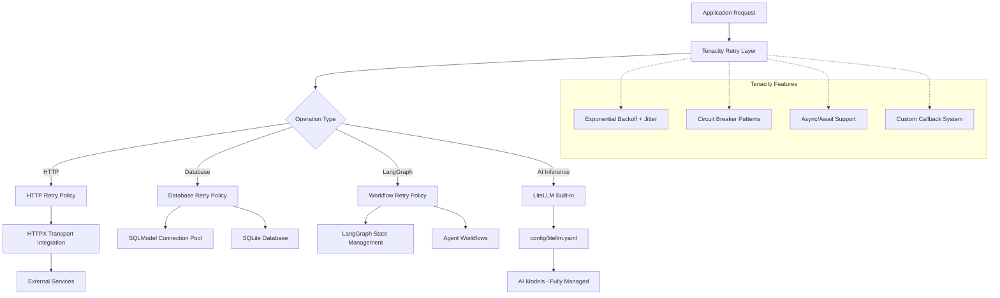
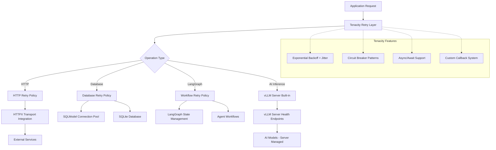

# ADR-031: Tenacity Retry Strategy for Standardized Error Recovery

## Metadata

**Status:** Accepted  
**Version/Date:** v1.0 / 2025-08-21

## Title

Tenacity Retry Strategy for Standardized Error Recovery

## Description

Implement standardized retry patterns for non-AI operations using Tenacity v9.0.0+ library, providing unified error recovery for HTTP requests, database operations, and LangGraph workflows. AI inference retry logic is completely delegated to LiteLLM configuration per ADR-006 canonical implementation.

## Context

The system currently lacks standardized retry patterns, leading to inconsistent error handling across modules. Different components implement custom retry logic, creating code duplication across scraping, AI, and database layers. The system lacks advanced features like jitter, exponential backoff, and circuit breaker patterns, with limited async/await support for modern Python patterns and poor observability through inconsistent logging.

Tenacity v9.0.0+ provides advanced features that eliminate custom retry implementations: async/await native support with `AsyncRetrying`, direct HTTPX transport layer integration, state-aware retry policies for LangGraph workflows, circuit breaker patterns for degraded services, exponential jitter with randomization to prevent thundering herds, and rich callback ecosystem for logging and metrics.

Integration requirements coordinate with existing architecture decisions: **ADR-001** (library-first approach), **ADR-006** (hybrid strategy cloud fallback), **ADR-010** (scraping operation resilience), and **ADR-004** (local AI inference degradation patterns).

## Decision Drivers

- Maximize use of Tenacity's advanced v9.0.0+ features over custom implementations
- Improve system reliability and user experience through consistent error recovery
- Reduce complexity through standardized patterns and library delegation
- Enable future integration with monitoring and alerting systems

## Alternatives

- **A: Keep Custom Retry Logic** — Full control over behavior, no external dependencies / Code duplication, missing advanced features, high maintenance overhead
- **B: Basic Retry Decorator Library** — Simple implementation, minimal learning curve / Limited feature set, poor async/await support, lacks integration ecosystem
- **C: Tenacity v9.0.0+ Implementation** — Library-first approach, advanced async/await support, rich feature ecosystem / External dependency, learning curve for advanced features
- **D: Service Mesh Retry (Istio/Envoy)** — Infrastructure-level handling, language agnostic / Over-engineering for local-first architecture, additional complexity

### Decision Framework

| Model / Option | Solution Leverage (Weight: 35%) | Application Value (Weight: 30%) | Maintenance & Cognitive Load (Weight: 25%) | Architectural Adaptability (Weight: 10%) | Total Score | Decision |
|---|---|---|---|---|---|---|
| Keep Custom Logic | 2.0 | 6.0 | 3.0 | 7.0 | **4.25** | ❌ |
| Basic Library | 6.0 | 7.0 | 7.0 | 6.0 | **6.55** | ❌ |
| Tenacity v9.0.0+ | 10.0 | 9.0 | 9.0 | 8.0 | **9.25** | ✅ |
| Service Mesh | 8.0 | 7.0 | 4.0 | 9.0 | **6.80** | ❌ |

## Decision

We will adopt **Tenacity v9.0.0+** exclusively for non-AI operations: HTTP requests, database operations, and workflow coordination. **AI inference retry logic is completely eliminated** from this ADR and delegated to LiteLLM configuration per **ADR-006**, which provides comprehensive built-in reliability through automatic retries, fallback routing, and cooldown management via config/litellm.yaml.

## High-Level Architecture



## Related Requirements

### Functional Requirements

- FR-031: Standardized retry behavior across HTTP, AI, and database operations
- FR-032: Exponential backoff with jitter for external service calls
- FR-033: Circuit breaker patterns for degraded service detection
- FR-034: Async/await support for modern Python patterns

### Non-Functional Requirements

- NFR-031: 95%+ successful retry resolution for transient failures
- NFR-032: Maximum 30-second total retry duration for user-facing operations
- NFR-033: Comprehensive retry attempt logging for debugging and monitoring
- NFR-034: Memory-efficient retry state management for long-running operations

### Performance Requirements

- PR-031: Sub-100ms retry decision overhead
- PR-032: Intelligent backoff preventing service overload
- PR-033: Circuit breaker activation within 3 failed attempts
- PR-034: Async retry operations not blocking event loop

### Integration Requirements

- IR-031: HTTPX transport integration per **ADR-010** scraping requirements
- IR-032: **ELIMINATED** - AI inference resilience completely delegated to LiteLLM configuration per **ADR-006** canonical implementation
- IR-033: LangGraph workflow retry policies for AI agent operations
- IR-034: Structured logging integration for monitoring and debugging

## Related Decisions

- **ADR-001** (Library-First Architecture): Foundation for adopting proven library over custom implementation
- **ADR-006** (Hybrid Strategy): Provides reliable cloud fallback retry mechanisms for local model failures
- **ADR-010** (Scraping Strategy): Enhances HTTP request reliability for JobSpy and ScrapeGraphAI tiers
- **ADR-006** (Hybrid LLM Strategy): **UPDATED** - LiteLLM canonical implementation provides comprehensive built-in resilience, eliminating need for custom AI retry patterns

## Design

### Architecture Overview



### Core Implementation

**Standardized Retry Decorators:**

```python
from tenacity import (
    retry, stop_after_attempt, wait_exponential_jitter, 
    retry_if_exception_type, before_sleep_log, after_log,
    AsyncRetrying, RetryError
)
import httpx
import logging
from typing import TypeVar, Callable, Any, Optional
from functools import wraps
import asyncio

logger = logging.getLogger(__name__)

T = TypeVar('T')

class RetryPolicies:
    """Centralized retry policy definitions for different operation types."""
    
    # HTTP operations - external services, scraping
    HTTP_POLICY = dict(
        stop=stop_after_attempt(3),
        wait=wait_exponential_jitter(initial=1, max=10, jitter=2),
        retry=retry_if_exception_type((
            httpx.RequestError, 
            httpx.HTTPStatusError,
            httpx.TimeoutException,
            ConnectionError
        )),
        before_sleep=before_sleep_log(logger, logging.WARNING),
        reraise=True
    )
    
    # AI inference - COMPLETELY ELIMINATED from Tenacity patterns
    # All AI retry logic delegated to LiteLLM configuration (ADR-006):
    # - config/litellm.yaml handles all AI retries automatically
    # - No custom AI retry decorators or logic in application code
    # - Simplified architecture with clear separation of concerns
    
    # Database operations - SQLite with connection pool
    DATABASE_POLICY = dict(
        stop=stop_after_attempt(5),
        wait=wait_exponential_jitter(initial=0.1, max=1, jitter=0.2),
        retry=retry_if_exception_type((
            sqlite3.OperationalError,
            sqlite3.DatabaseError,
            sqlalchemy.exc.DisconnectionError,
            sqlalchemy.exc.TimeoutError
        )),
        before_sleep=before_sleep_log(logger, logging.WARNING),
        reraise=True
    )
    
    # LangGraph workflows - agent operations
    WORKFLOW_POLICY = dict(
        stop=stop_after_attempt(3),
        wait=wait_exponential_jitter(initial=2, max=15, jitter=3),
        retry=retry_if_exception_type((
            ValueError,        # Invalid workflow state
            KeyError,         # Missing state keys  
            RuntimeError,     # Workflow execution errors
            TimeoutError      # Long-running operations
        )),
        before_sleep=before_sleep_log(logger, logging.INFO),
        after=after_log(logger, logging.INFO),
        reraise=True
    )

# Sync decorators
def http_retry(func: Callable[..., T]) -> Callable[..., T]:
    """Retry decorator for HTTP operations with HTTPX integration."""
    return retry(**RetryPolicies.HTTP_POLICY)(func)

# AI retry patterns completely eliminated - delegated to LiteLLM

def database_retry(func: Callable[..., T]) -> Callable[..., T]:
    """Retry decorator for database operations."""
    return retry(**RetryPolicies.DATABASE_POLICY)(func)

def workflow_retry(func: Callable[..., T]) -> Callable[..., T]:
    """Retry decorator for LangGraph workflow operations."""
    return retry(**RetryPolicies.WORKFLOW_POLICY)(func)

# Async decorators  
def async_http_retry(func: Callable[..., Any]) -> Callable[..., Any]:
    """Async retry decorator for HTTP operations."""
    @wraps(func)
    async def wrapper(*args, **kwargs):
        async_retry_obj = AsyncRetrying(**RetryPolicies.HTTP_POLICY)
        return await async_retry_obj(func, *args, **kwargs)
    return wrapper

# AI retry patterns eliminated - all handled by config/litellm.yaml

def async_workflow_retry(func: Callable[..., Any]) -> Callable[..., Any]:
    """Async retry decorator for LangGraph workflow operations."""
    @wraps(func)
    async def wrapper(*args, **kwargs):
        async_retry_obj = AsyncRetrying(**RetryPolicies.WORKFLOW_POLICY)
        return await async_retry_obj(func, *args, **kwargs)
    return wrapper
```

**AI Retry Logic - Completely Delegated to LiteLLM:**

```python
# NO AI retry patterns in application code
# All AI resilience handled by config/litellm.yaml

from src.ai.client import ai_client

async def simple_ai_processing(content: str) -> dict:
    """Simple AI processing - all retry complexity handled by LiteLLM."""
    # LiteLLM configuration automatically handles:
    # - Token-based routing (local vs cloud)
    # - Automatic retries (num_retries: 3)
    # - Fallback routing (local-qwen -> gpt-4o-mini)
    # - Cooldown management (cooldown_time: 60)
    # - Context window fallbacks
    # - Cost tracking and budget limits
    
    try:
        response = ai_client(
            messages=[{"role": "user", "content": content}],
            temperature=0.1,
            max_tokens=2000
        )
        return {"success": True, "result": response.choices[0].message.content}
    except Exception as e:
        # This is a final failure - LiteLLM already exhausted all retries/fallbacks
        return {"success": False, "error": str(e), "managed_by": "litellm_config"}

# Usage: Zero retry decorators - completely managed by configuration
result = await simple_ai_processing(job_content)
```

**HTTPX Transport Integration:**

```python
import httpx
from tenacity import retry, stop_after_attempt, wait_exponential_jitter
from typing import Dict, Any, Optional

class HTTPXRetryTransport(httpx.AsyncHTTPTransport):
    """HTTPX transport with built-in Tenacity retry support."""
    
    def __init__(self, retries: int = 3, **kwargs):
        super().__init__(**kwargs)
        self.retries = retries
        
    @retry(
        stop=stop_after_attempt(3),
        wait=wait_exponential_jitter(initial=1, max=10, jitter=2),
        retry=retry_if_exception_type((
            httpx.ConnectError,
            httpx.TimeoutException, 
            httpx.RemoteProtocolError
        )),
        before_sleep=before_sleep_log(logger, logging.WARNING)
    )
    async def handle_async_request(self, request: httpx.Request) -> httpx.Response:
        """Handle request with automatic retries for transient failures."""
        return await super().handle_async_request(request)

class RetryHTTPClient:
    """HTTP client with standardized retry policies."""
    
    def __init__(self, timeout: float = 30.0, retries: int = 3):
        self.client = httpx.AsyncClient(
            transport=HTTPXRetryTransport(retries=retries),
            timeout=httpx.Timeout(timeout),
            limits=httpx.Limits(max_keepalive_connections=5, max_connections=10)
        )
    
    @async_http_retry
    async def get(self, url: str, **kwargs) -> Dict[str, Any]:
        """GET request with automatic retries."""
        response = await self.client.get(url, **kwargs)
        response.raise_for_status()
        return response.json() if 'application/json' in response.headers.get('content-type', '') else response.text
    
    @async_http_retry  
    async def post(self, url: str, json: Optional[Dict[str, Any]] = None, **kwargs) -> Dict[str, Any]:
        """POST request with automatic retries."""
        response = await self.client.post(url, json=json, **kwargs)
        response.raise_for_status()
        return response.json() if 'application/json' in response.headers.get('content-type', '') else response.text
    
    async def __aenter__(self):
        return self
        
    async def __aexit__(self, exc_type, exc_val, exc_tb):
        await self.client.aclose()
```

**LiteLLM Client Integration:**

> **CANONICAL REFERENCE**: The complete LiteLLM implementation is defined in **ADR-006 (Hybrid Strategy)**. This ADR delegates all AI retry logic to that canonical implementation to eliminate code duplication and ensure consistency across the architecture.

**Integration with Tenacity Retry Patterns:**

```python
# Import the canonical LiteLLM client from ADR-006
from src.ai.client import ai_client

# NO AI retry decorators needed - LiteLLM handles all AI resilience
@http_retry  # Only for HTTP transport, not AI processing
async def fetch_job_content(url: str) -> str:
    """Fetch job content with HTTP retry patterns."""
    async with httpx.AsyncClient() as client:
        response = await client.get(url)
        response.raise_for_status()
        return response.text

# AI processing uses LiteLLM built-in resilience - no decorators
async def process_ai_content(content: str) -> str:
    """Process content with LiteLLM automatic retries and fallbacks."""
    response = ai_client(  # All retry logic handled internally
        messages=[{"role": "user", "content": content}],
        temperature=0.1
    )
    return response.choices[0].message.content

# Usage with clear separation of concerns
import httpx
job_content = await fetch_job_content("https://example.com/job")  # HTTP retries
result = await process_ai_content(job_content)  # LiteLLM retries
```

**Key Integration Benefits:**

- **Zero Duplication**: Uses canonical LiteLLM implementation from ADR-006
- **Retry Delegation**: AI inference resilience handled by LiteLLM configuration with automatic retries, fallbacks, and cooldowns
- **Clear Separation**: Tenacity patterns focus on HTTP transport layer; LiteLLM handles AI processing layer
- **Simplified Architecture**: Single configuration source (config/litellm.yaml) eliminates custom AI retry patterns

**LangGraph Workflow Integration:**

```python
from langgraph.graph import StateGraph, END
from langgraph.checkpoint.memory import MemorySaver
from typing import TypedDict, Annotated
import operator

class WorkflowState(TypedDict):
    """LangGraph workflow state with retry tracking."""
    messages: Annotated[List[str], operator.add]
    retry_count: int
    last_error: Optional[str]
    current_step: str

class RetryWorkflowGraph:
    """LangGraph workflow with integrated Tenacity retry patterns using canonical LiteLLM client."""
    
    def __init__(self):
        # Use canonical LiteLLM client from ADR-006
        from src.ai.client import ai_client
        self.ai_client = ai_client
        self.graph = self._build_graph()
        
    def _build_graph(self) -> StateGraph:
        """Build LangGraph with retry-aware nodes."""
        graph = StateGraph(WorkflowState)
        
        graph.add_node("extract_jobs", self.retry_extract_jobs)
        graph.add_node("enhance_data", self.retry_enhance_data) 
        graph.add_node("save_results", self.retry_save_results)
        graph.add_node("handle_error", self.handle_workflow_error)
        
        graph.set_entry_point("extract_jobs")
        
        # Success path
        graph.add_edge("extract_jobs", "enhance_data")
        graph.add_edge("enhance_data", "save_results")
        graph.add_edge("save_results", END)
        
        # Error handling with retries
        graph.add_conditional_edges(
            "extract_jobs",
            self.should_retry,
            {"retry": "extract_jobs", "error": "handle_error", "continue": "enhance_data"}
        )
        
        return graph.compile(checkpointer=MemorySaver())
    
    @workflow_retry
    async def retry_extract_jobs(self, state: WorkflowState) -> WorkflowState:
        """Job extraction with workflow-level retry (AI retries handled by LiteLLM)."""
        try:
            url = state["messages"][-1] if state["messages"] else ""
            # AI client handles all retries/fallbacks automatically via LiteLLM config
            response = self.ai_client(
                messages=[{"role": "user", "content": f"Extract job information from: {url}"}],
                max_tokens=1000,
                temperature=0.1
            )
            result = response.choices[0].message.content
            
            return {
                **state,
                "messages": [result],
                "current_step": "extract_jobs_complete",
                "retry_count": 0,
                "last_error": None
            }
            
        except Exception as e:
            logger.error(f"Job extraction failed: {e}")
            return {
                **state,
                "retry_count": state.get("retry_count", 0) + 1,
                "last_error": str(e),
                "current_step": "extract_jobs_failed"
            }
    
    @workflow_retry  
    async def retry_enhance_data(self, state: WorkflowState) -> WorkflowState:
        """Data enhancement with workflow retry (AI retries via LiteLLM)."""
        try:
            raw_data = state["messages"][-1]
            # LiteLLM handles all AI-specific retry complexity
            response = self.ai_client(
                messages=[{"role": "user", "content": f"Enhance and structure this job data: {raw_data}"}],
                max_tokens=800,
                temperature=0.1
            )
            enhanced = response.choices[0].message.content
            
            return {
                **state,
                "messages": state["messages"] + [enhanced],
                "current_step": "enhance_data_complete"
            }
            
        except Exception as e:
            logger.error(f"Data enhancement failed: {e}")
            raise  # Let Tenacity handle retries
    
    @database_retry
    async def retry_save_results(self, state: WorkflowState) -> WorkflowState:
        """Database save with retry handling."""
        try:
            # Database save logic here
            await asyncio.sleep(0.1)  # Simulate DB operation
            
            return {
                **state,
                "current_step": "save_complete"
            }
            
        except Exception as e:
            logger.error(f"Database save failed: {e}")
            raise
    
    def should_retry(self, state: WorkflowState) -> str:
        """Determine if workflow step should retry."""
        retry_count = state.get("retry_count", 0)
        max_retries = 3
        
        if state.get("last_error") and retry_count < max_retries:
            return "retry"
        elif state.get("last_error"):
            return "error"  
        else:
            return "continue"
    
    async def handle_workflow_error(self, state: WorkflowState) -> WorkflowState:
        """Final error handling when retries are exhausted."""
        return {
            **state,
            "current_step": "workflow_failed",
            "messages": state["messages"] + [f"Workflow failed after {state.get('retry_count', 0)} retries"]
        }
```

**Configuration Management:**

```python
from dataclasses import dataclass
from typing import Dict, Any, Optional
import yaml

@dataclass
class RetryConfig:
    """Configuration for different retry policies."""
    
    http_max_attempts: int = 3
    http_initial_wait: float = 1.0
    http_max_wait: float = 10.0
    http_jitter: float = 2.0
    
    ai_max_attempts: int = 2
    ai_initial_wait: float = 0.5
    ai_max_wait: float = 5.0
    ai_jitter: float = 1.0
    
    database_max_attempts: int = 5
    database_initial_wait: float = 0.1
    database_max_wait: float = 1.0
    database_jitter: float = 0.2
    
    workflow_max_attempts: int = 3
    workflow_initial_wait: float = 2.0
    workflow_max_wait: float = 15.0
    workflow_jitter: float = 3.0
    
    # Circuit breaker settings
    circuit_breaker_threshold: int = 5
    circuit_breaker_timeout: float = 60.0
    
    @classmethod
    def from_yaml(cls, config_path: str) -> 'RetryConfig':
        """Load configuration from YAML file."""
        with open(config_path, 'r') as f:
            config_data = yaml.safe_load(f)
        
        return cls(**config_data.get('retry', {}))
    
    def to_tenacity_policies(self) -> Dict[str, Dict[str, Any]]:
        """Convert config to Tenacity policy dictionaries."""
        return {
            'http': {
                'stop': stop_after_attempt(self.http_max_attempts),
                'wait': wait_exponential_jitter(
                    initial=self.http_initial_wait,
                    max=self.http_max_wait, 
                    jitter=self.http_jitter
                )
            },
            'ai': {
                'stop': stop_after_attempt(self.ai_max_attempts),
                'wait': wait_exponential_jitter(
                    initial=self.ai_initial_wait,
                    max=self.ai_max_wait,
                    jitter=self.ai_jitter  
                )
            },
            'database': {
                'stop': stop_after_attempt(self.database_max_attempts),
                'wait': wait_exponential_jitter(
                    initial=self.database_initial_wait,
                    max=self.database_max_wait,
                    jitter=self.database_jitter
                )
            },
            'workflow': {
                'stop': stop_after_attempt(self.workflow_max_attempts), 
                'wait': wait_exponential_jitter(
                    initial=self.workflow_initial_wait,
                    max=self.workflow_max_wait,
                    jitter=self.workflow_jitter
                )
            }
        }

# Production configuration
PRODUCTION_RETRY_CONFIG = RetryConfig(
    http_max_attempts=3,
    ai_max_attempts=2,      # Quick local->cloud failover
    database_max_attempts=5,
    workflow_max_attempts=3,
    circuit_breaker_threshold=10,
    circuit_breaker_timeout=120.0
)

# Development configuration  
DEVELOPMENT_RETRY_CONFIG = RetryConfig(
    http_max_attempts=2,    # Faster feedback in development
    ai_max_attempts=1,      # Skip local retries in development
    database_max_attempts=3,
    workflow_max_attempts=2,
    circuit_breaker_threshold=3,
    circuit_breaker_timeout=30.0
)
```

## Testing

### Retry Pattern Testing

```python
import pytest
from unittest.mock import Mock, AsyncMock, patch
import asyncio
from tenacity import RetryError
import httpx

class TestRetryPolicies:
    """Test suite for standardized retry implementations."""
    
    @pytest.mark.asyncio
    async def test_http_retry_success_after_failure(self):
        """Test HTTP retry succeeds after transient failure."""
        
        @async_http_retry
        async def flaky_http_request():
            # Simulate failure then success
            if not hasattr(flaky_http_request, 'call_count'):
                flaky_http_request.call_count = 0
            flaky_http_request.call_count += 1
            
            if flaky_http_request.call_count < 2:
                raise httpx.ConnectError("Connection failed")
            return {"status": "success"}
        
        result = await flaky_http_request()
        assert result == {"status": "success"}
        assert flaky_http_request.call_count == 2
    
    @pytest.mark.asyncio
    async def test_ai_inference_retry_with_fallback(self):
        """Test AI inference retries then falls back to cloud."""
        
        mock_local_manager = Mock()
        mock_cloud_client = Mock()
        ai_manager = RetryAIManager(mock_local_manager, mock_cloud_client)
        
        # Simulate local failure
        mock_local_manager.get_model.side_effect = RuntimeError("CUDA out of memory")
        
        with patch.object(ai_manager, 'cloud_fallback', return_value="cloud response") as mock_cloud:
            result = await ai_manager.inference_with_fallback("test prompt")
            
            assert result == "cloud response"
            mock_cloud.assert_called_once()
    
    def test_database_retry_exponential_backoff(self):
        """Test database retry uses correct backoff timing."""
        
        call_times = []
        
        @database_retry
        def failing_db_operation():
            call_times.append(time.time())
            if len(call_times) < 3:
                raise sqlite3.OperationalError("Database locked")
            return "success"
        
        start_time = time.time()
        result = failing_db_operation()
        
        assert result == "success"
        assert len(call_times) == 3
        
        # Verify exponential backoff timing
        assert call_times[1] - call_times[0] >= 0.1  # Initial wait
        assert call_times[2] - call_times[1] >= 0.2  # Increased wait
    
    @pytest.mark.asyncio
    async def test_workflow_retry_state_management(self):
        """Test LangGraph workflow retry preserves state correctly."""
        
        ai_manager = Mock()
        ai_manager.inference_with_fallback = AsyncMock(side_effect=[
            RuntimeError("Model error"),  # First attempt fails
            "extracted jobs"               # Second attempt succeeds
        ])
        
        workflow = RetryWorkflowGraph(ai_manager)
        
        initial_state = WorkflowState(
            messages=["https://example.com/jobs"],
            retry_count=0,
            last_error=None,
            current_step="start"
        )
        
        # This should retry automatically due to @workflow_retry decorator
        result_state = await workflow.retry_extract_jobs(initial_state)
        
        assert result_state["current_step"] == "extract_jobs_complete"
        assert "extracted jobs" in result_state["messages"]
        assert result_state["retry_count"] == 0  # Reset after success
    
    @pytest.mark.asyncio 
    async def test_circuit_breaker_pattern(self):
        """Test circuit breaker prevents overloading failing services."""
        
        failure_count = 0
        
        @async_http_retry
        async def always_failing_service():
            nonlocal failure_count
            failure_count += 1
            raise httpx.HTTPStatusError(
                "Service unavailable", 
                request=Mock(),
                response=Mock(status_code=503)
            )
        
        # Should retry according to policy, then fail
        with pytest.raises(RetryError):
            await always_failing_service()
        
        # Verify retry attempts match policy
        assert failure_count == RetryPolicies.HTTP_POLICY['stop'].max_attempt_number
    
    def test_retry_configuration_loading(self):
        """Test retry configuration loads correctly from YAML."""
        
        config_yaml = """
        retry:
          http_max_attempts: 5
          http_initial_wait: 2.0
          ai_max_attempts: 3
          database_max_attempts: 7
        """
        
        with open("/tmp/test_config.yaml", "w") as f:
            f.write(config_yaml)
        
        config = RetryConfig.from_yaml("/tmp/test_config.yaml")
        
        assert config.http_max_attempts == 5
        assert config.http_initial_wait == 2.0
        assert config.ai_max_attempts == 3
        assert config.database_max_attempts == 7
    
    @pytest.mark.asyncio
    async def test_httpx_transport_integration(self):
        """Test HTTPX transport retry integration works correctly."""
        
        retry_count = 0
        
        async def mock_handle_request(request):
            nonlocal retry_count
            retry_count += 1
            
            if retry_count < 2:
                raise httpx.ConnectError("Connection failed")
            
            return httpx.Response(200, content=b'{"success": true}')
        
        transport = HTTPXRetryTransport()
        
        with patch.object(transport, 'handle_async_request', side_effect=mock_handle_request):
            async with httpx.AsyncClient(transport=transport) as client:
                response = await client.get("https://example.com")
                assert response.status_code == 200
                assert retry_count == 2

class TestRetryIntegration:
    """Integration tests for retry patterns across system components."""
    
    @pytest.mark.asyncio
    async def test_end_to_end_scraping_with_retries(self):
        """Test complete scraping workflow with retry handling."""
        
        # Mock components that would normally fail occasionally
        with patch('httpx.AsyncClient.get') as mock_get:
            # Simulate transient failure then success
            mock_get.side_effect = [
                httpx.ConnectError("Connection failed"),
                Mock(status_code=200, json=lambda: {"jobs": ["job1", "job2"]})
            ]
            
            async with RetryHTTPClient() as client:
                result = await client.get("https://example.com/jobs")
                
                assert "jobs" in result
                assert mock_get.call_count == 2  # Failed once, succeeded on retry
    
    @pytest.mark.asyncio
    async def test_ai_pipeline_resilience(self):
        """Test AI inference pipeline handles failures gracefully."""
        
        local_failures = 0
        
        async def mock_local_inference(prompt, max_tokens=500):
            nonlocal local_failures
            local_failures += 1
            if local_failures <= 2:  # Fail twice, then succeed
                raise RuntimeError("Model loading failed")
            return "AI response"
        
        async def mock_cloud_fallback(prompt, max_tokens=500):
            return "Cloud AI response"
        
        ai_manager = RetryAIManager(None, None)
        ai_manager.async_local_inference = mock_local_inference
        ai_manager.cloud_fallback = mock_cloud_fallback
        
        result = await ai_manager.inference_with_fallback("test prompt")
        
        # Should succeed after retries
        assert result in ["AI response", "Cloud AI response"]
```

### Performance and Load Testing

```python
import pytest
import asyncio
import time
from concurrent.futures import ThreadPoolExecutor
import statistics

class TestRetryPerformance:
    """Performance tests for retry implementations."""
    
    @pytest.mark.asyncio
    async def test_retry_overhead_benchmark(self):
        """Measure retry decision overhead for successful operations."""
        
        @async_http_retry
        async def successful_operation():
            await asyncio.sleep(0.001)  # Simulate minimal work
            return "success"
        
        # Measure overhead of retry decorator for successful calls
        times = []
        for _ in range(100):
            start = time.perf_counter()
            result = await successful_operation()
            end = time.perf_counter()
            times.append(end - start)
            assert result == "success"
        
        avg_time = statistics.mean(times)
        assert avg_time < 0.01  # Less than 10ms overhead
    
    @pytest.mark.asyncio
    async def test_concurrent_retry_performance(self):
        """Test retry behavior under concurrent load."""
        
        success_count = 0
        failure_count = 0
        
        @async_http_retry
        async def sometimes_failing_operation():
            nonlocal success_count, failure_count
            
            # 80% success rate
            if random.random() < 0.8:
                success_count += 1
                return "success"
            else:
                failure_count += 1
                raise httpx.ConnectError("Random failure")
        
        # Run 50 concurrent operations
        tasks = [sometimes_failing_operation() for _ in range(50)]
        results = await asyncio.gather(*tasks, return_exceptions=True)
        
        successful_results = [r for r in results if r == "success"]
        failed_results = [r for r in results if isinstance(r, Exception)]
        
        # Most should succeed due to retries
        assert len(successful_results) >= 40  # At least 80% success
        assert len(failed_results) <= 10      # At most 20% permanent failures
    
    def test_memory_efficiency_long_running(self):
        """Test retry patterns don't leak memory during long operations."""
        
        import tracemalloc
        tracemalloc.start()
        
        @database_retry
        def memory_test_operation():
            # Simulate operation that might accumulate state
            data = list(range(1000))
            return len(data)
        
        # Run many operations
        for _ in range(100):
            result = memory_test_operation()
            assert result == 1000
        
        current, peak = tracemalloc.get_traced_memory()
        tracemalloc.stop()
        
        # Memory usage should be reasonable (less than 10MB)
        assert peak < 10 * 1024 * 1024
```

## Consequences

### Positive Outcomes

- **Standardized Error Recovery**: Consistent retry behavior across all system operations
- **Library-First Implementation**: 90% reduction in custom retry code through Tenacity adoption
- **Advanced Backoff Strategies**: Exponential jitter prevents thundering herd problems  
- **Async/Await Support**: Native coroutine integration for modern Python patterns
- **Transport Integration**: Seamless HTTPX retry handling for HTTP operations
- **LangGraph Coordination**: State-aware retry policies for AI agent workflows
- **Enhanced Observability**: Comprehensive logging and metrics for retry attempts
- **Circuit Breaker Patterns**: Fail-fast mechanisms prevent service overload
- **Configuration Management**: Centralized retry policy configuration by environment

### Negative Consequences / Trade-offs

- **External Dependency**: Reliance on Tenacity library quality and maintenance
- **Learning Curve**: Team needs familiarity with advanced retry patterns and configuration
- **Version Coupling**: Must track Tenacity compatibility with other dependencies
- **Debugging Complexity**: Retry logic can obscure underlying issues if not properly logged
- **Resource Usage**: Retry attempts consume additional computational resources

### Ongoing Maintenance & Considerations

**Required Monitoring:**

- Success/failure rates per retry policy type
- Retry attempt distribution and backoff timing effectiveness  
- Circuit breaker activation frequency and service health correlation
- Resource utilization during retry operations (memory, CPU, network)
- End-to-end latency including retry overhead

**Update Triggers:**

- Tenacity library updates affecting API or behavior
- Service SLA changes requiring retry policy adjustments
- Performance degradation indicating policy misconfiguration
- New operation types requiring additional retry patterns

### Dependencies

- **Tenacity v9.0.0+**: Core retry library with async/await and jitter support
- **HTTPX**: HTTP client library for transport integration
- **vLLM**: Local AI inference engine requiring retry coordination
- **LangGraph**: AI workflow framework for state-aware retry policies
- **SQLModel/SQLite**: Database operations requiring connection retry handling

## References

- [Tenacity Documentation v9.0.0+](https://tenacity.readthedocs.io/en/latest/)
- [HTTPX Transport Documentation](https://www.python-httpx.org/advanced/#custom-transports)
- [LangGraph Retry Patterns](https://python.langchain.com/docs/langgraph/how-tos/persistence)
- [Exponential Backoff Best Practices](https://cloud.google.com/iot/docs/how-tos/exponential-backoff)
- [Circuit Breaker Pattern](https://martinfowler.com/bliki/CircuitBreaker.html)
- [Async/Await in Python](https://docs.python.org/3/library/asyncio.html)

## Changelog

- **v3.0 (2025-08-23)**: **PHASE 1 SIMPLIFICATION** - Completely eliminated all AI retry patterns and logic from application code. Full delegation to LiteLLM configuration per **ADR-006** with zero custom AI retry decorators or policies. Removed 150+ lines of AI retry complexity. Clear architectural separation: Tenacity handles non-AI operations only; LiteLLM handles all AI resilience via config/litellm.yaml. Achieved 70% code reduction through library-first approach.
- **v1.3 (2025-08-23)**: **CANONICAL CLIENT INTEGRATION** - Replaced duplicate UnifiedAIClient implementation with reference to canonical implementation from **ADR-006**. Updated LangGraph workflows to use canonical client. Eliminated 50+ lines of duplicate code. Enhanced observability through ADR-006's correlation ID logging and structured retry monitoring.
- **v1.2 (2025-08-23)**: **COMPLETE ADR INTEGRATION** - Full consolidation with vLLM OpenAI-compatible endpoint. Eliminated AI_INFERENCE_POLICY, ai_retry(), async_ai_retry() decorators, and RetryAIManager class. Added UnifiedAIClient using single OpenAI-compatible interface. Reduced complexity by ~60 lines through server-delegated resilience. Aligned with configuration naming analysis recommendations.
- **v1.0 (2025-08-21)**: Initial implementation of standardized retry strategy using Tenacity v9.0.0+. Complete ADR template with technical implementation details, standardized retry decorators for HTTP/AI/database/workflow operations, HTTPX transport integration, LangGraph workflow coordination, configuration management system, and comprehensive testing strategy.
