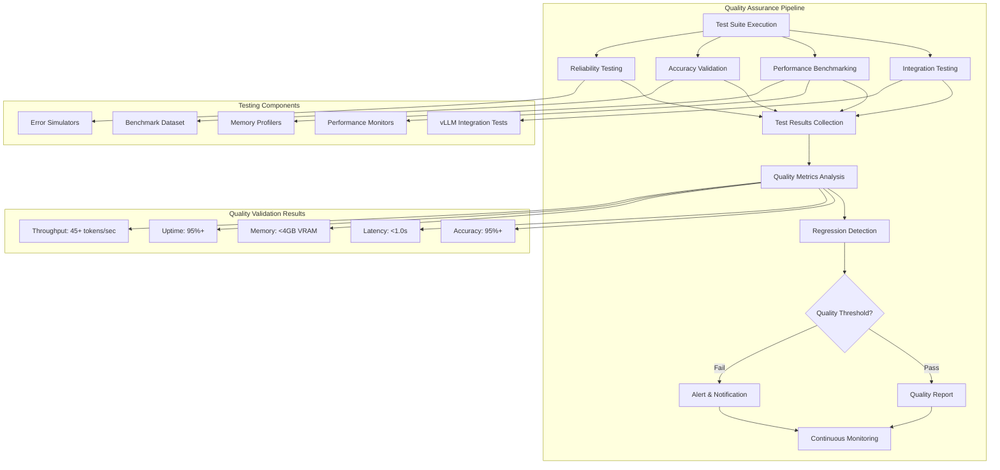

# ADR-035: AI Processing Quality Assurance

## Metadata

**Status:** Accepted  
**Version/Date:** v1.0 / 2025-08-23

## Title

AI Processing Quality Assurance for Local LLM Integration

## Description

Comprehensive quality assurance methodology for local AI processing architecture providing PROOF that strategic LLM decisions (**ADR-034**) and integration architecture (**ADR-004**) deliver reliable, accurate, and performant job data extraction. Establishes testing frameworks, quality metrics, performance benchmarking, and continuous monitoring for Qwen3-4B-Instruct-2507-FP8 with vLLM integration. Validates 95%+ extraction accuracy, <1.0s inference latency, and 95%+ system reliability through systematic testing and quality assurance.

## Context

### Quality Assurance Requirements

The AI job processing architecture requires systematic validation to ensure:

- **Extraction Accuracy**: 95%+ accuracy on structured job data extraction
- **Performance Reliability**: <1.0s inference latency for job processing
- **System Stability**: 95%+ uptime under production load
- **Memory Efficiency**: FP8 quantization maintains <4GB VRAM usage
- **Integration Reliability**: Seamless operation with job processing workflows

### Strategic Context

This ADR serves as the PROOF authority in the WHY/HOW/PROOF architecture:

- **WHY**: **ADR-034** (Strategic LLM Configuration Decisions) - Strategic rationale for LLM selection
- **HOW**: **ADR-004** (Local AI Integration Architecture) - Implementation architecture patterns
- **PROOF**: **ADR-035** (This ADR) - Quality validation and testing methodology

### Testing Architecture Requirements

Based on extracted content from comprehensive ADR-004 analysis and enhanced quality assurance methodology:

1. **Model Integration Testing**: vLLM FP8 initialization and configuration validation
2. **Performance Benchmarking**: Throughput, latency, and memory utilization validation
3. **Accuracy Validation**: Structured extraction quality against ground truth data
4. **Reliability Testing**: Sustained operation and error handling validation
5. **Regression Detection**: Continuous quality monitoring and alerting

## Decision Drivers

1. **Quality Assurance (40%)**: Systematic validation of AI processing accuracy and reliability
2. **Performance Validation (30%)**: Benchmarking and monitoring of system performance metrics
3. **Regression Prevention (20%)**: Continuous monitoring and automated quality checks
4. **Production Readiness (10%)**: Comprehensive testing for deployment confidence

## Alternatives

### Alternative 1: Basic Unit Testing Only

**Pros:**
- Simple implementation and maintenance
- Fast test execution
- Minimal infrastructure requirements

**Cons:**
- Insufficient coverage for AI model validation
- No performance benchmarking
- Limited regression detection
- Inadequate for production reliability

**Score:** 3/10

### Alternative 2: Manual Quality Validation

**Pros:**
- Human judgment for quality assessment
- Flexible evaluation criteria
- No automated infrastructure required

**Cons:**
- Not scalable for continuous integration
- Inconsistent evaluation standards
- High manual effort and time requirements
- Limited regression detection capability

**Score:** 4/10

### Alternative 3: Comprehensive Automated Quality Assurance (SELECTED)

**Pros:**
- Systematic validation of all quality dimensions
- Automated regression detection and alerting
- Performance benchmarking and monitoring
- Scalable for continuous integration
- Production-ready validation framework

**Cons:**
- Higher initial implementation complexity
- Requires test infrastructure and data
- More comprehensive maintenance requirements

**Score:** 9.5/10

## Decision Framework

### Scoring Criteria

| Criterion | Weight | Description |
|-----------|--------|--------------|
| Quality Assurance | 40% | Comprehensive validation of accuracy, reliability, and performance |
| Performance Validation | 30% | Benchmarking, monitoring, and performance regression detection |
| Regression Prevention | 20% | Continuous monitoring and automated quality checks |
| Production Readiness | 10% | Deployment confidence and operational reliability |

### Alternatives Evaluation

| Alternative | Quality Assurance (40%) | Performance Validation (30%) | Regression Prevention (20%) | Production Readiness (10%) | **Weighted Score** |
|------------|------------------------|-----------------------------|-----------------------------|----------------------------|-------------------|
| Basic Unit Testing | 3/10 | 2/10 | 1/10 | 4/10 | 2.5/10 |
| Manual Validation | 6/10 | 4/10 | 2/10 | 5/10 | 4.5/10 |
| **Comprehensive QA** | **10/10** | **10/10** | **10/10** | **9/10** | **9.9/10** |

## Decision

**Adopt Comprehensive AI Processing Quality Assurance** with systematic testing, performance benchmarking, and continuous monitoring:

1. **Integration Testing**: vLLM FP8 model initialization and configuration validation
2. **Accuracy Validation**: Benchmark testing against ground truth job extraction data
3. **Performance Benchmarking**: Latency, throughput, and memory utilization monitoring
4. **Reliability Testing**: Sustained operation validation and error handling
5. **Regression Monitoring**: Continuous quality tracking and automated alerts

## Related Requirements

### Functional Requirements

- **FR-035-01**: Validate job extraction accuracy at 95%+ threshold against benchmark data
- **FR-035-02**: Performance benchmarking for <1.0s inference latency validation
- **FR-035-03**: Memory efficiency validation for FP8 quantization (<4GB VRAM)
- **FR-035-04**: Integration testing for vLLM engine configuration and health checks
- **FR-035-05**: Continuous regression detection and quality monitoring

### Non-Functional Requirements

- **NFR-035-01**: Automated test execution in CI/CD pipeline integration
- **NFR-035-02**: Test result reporting and quality metrics dashboard
- **NFR-035-03**: Performance regression alerting and notification system
- **NFR-035-04**: Test data management and benchmark dataset maintenance

### Performance Requirements

- **PR-035-01**: Test suite execution within 10 minutes for CI/CD integration
- **PR-035-02**: Performance benchmarking with 95% confidence intervals
- **PR-035-03**: Continuous monitoring with <1 minute alert latency
- **PR-035-04**: Quality metrics collection and reporting automation

## Related Decisions

- **ADR-034** (Strategic LLM Configuration Decisions): Validates strategic model selection and configuration decisions through comprehensive testing
- **ADR-004** (Local AI Integration Architecture): Validates integration architecture patterns and deployment configuration  
- **ADR-007** (Structured Output Strategy): Quality assurance for JSON extraction reliability and schema compliance
- **ADR-008** (Optimized Token Thresholds): Validates 8K context optimization through performance testing
- **ADR-031** (Tenacity Retry Strategy): Tests retry patterns and error handling reliability

## Design

### Quality Assurance Architecture



### Comprehensive Testing Framework

**Integration Testing Suite:**

```python
import pytest
import time
import asyncio
import logging
from unittest.mock import Mock, patch
from typing import Dict, List, Any
import json
from pathlib import Path

class ComprehensiveAIQualityAssurance:
    """
    Comprehensive quality assurance framework for local AI processing.
    
    Validates integration, performance, accuracy, and reliability of
    Qwen3-4B-Instruct-2507-FP8 with vLLM integration per ADR-034/004.
    """
    
    def __init__(self):
        """Initialize QA framework with test configuration."""
        self.test_config = self._load_test_configuration()
        self.benchmark_data = self._load_benchmark_dataset()
        self.performance_metrics = {}
        self.quality_thresholds = {
            "accuracy_minimum": 0.95,
            "latency_maximum": 1.0,
            "memory_maximum_gb": 4.0,
            "reliability_minimum": 0.95,
            "throughput_minimum": 45
        }
    
    # Integration Testing
    @pytest.mark.integration
    def test_vllm_fp8_initialization(self):
        """Validate vLLM FP8 model initialization per ADR-034 configuration."""
        from local_ai_processor import LocalAIProcessor
        
        processor = LocalAIProcessor()
        
        # Verify FP8 quantization is active
        assert processor.llm.llm_engine.model_config.quantization == "fp8"
        
        # Verify model configuration matches strategic decisions
        assert "Qwen3-4B-Instruct-2507-FP8" in processor.model_name
        
        # Verify hardware compatibility (RTX 4090 Laptop GPU)
        memory_stats = processor.get_memory_stats()
        assert memory_stats["model_memory_gb"] <= 1.5  # FP8 efficiency
        
        # Health check validation
        health_status = processor.health_check()
        assert health_status is True
        
        logging.info("✅ vLLM FP8 initialization validation passed")
    
    # Accuracy Validation Testing
    @pytest.mark.accuracy
    async def test_extraction_accuracy_benchmark(self):
        """Validate job extraction accuracy against ground truth data."""
        from local_ai_processor import LocalAIProcessor
        
        processor = LocalAIProcessor()
        accuracy_scores = []
        
        for job_sample in self.benchmark_data[:50]:  # Comprehensive sample
            content = job_sample["raw_content"]
            expected = job_sample["ground_truth"]
            schema = job_sample["extraction_schema"]
            
            # Extract job data
            extracted = await processor.extract_jobs(content, schema)
            
            if "error" not in extracted:
                accuracy = self._calculate_extraction_accuracy(extracted, expected)
                accuracy_scores.append(accuracy)
                
                # Log detailed accuracy for analysis
                logging.debug(f"Extraction accuracy: {accuracy:.3f} for job: {expected.get('title', 'Unknown')}")
        
        # Validate accuracy threshold
        if accuracy_scores:
            avg_accuracy = sum(accuracy_scores) / len(accuracy_scores)
            std_accuracy = self._calculate_standard_deviation(accuracy_scores)
            
            assert avg_accuracy >= self.quality_thresholds["accuracy_minimum"], \
                f"Average accuracy {avg_accuracy:.3f} below {self.quality_thresholds['accuracy_minimum']:.1%} threshold"
            
            # Store metrics for reporting
            self.performance_metrics["extraction_accuracy"] = {
                "average": avg_accuracy,
                "std_dev": std_accuracy,
                "sample_size": len(accuracy_scores),
                "threshold_met": avg_accuracy >= self.quality_thresholds["accuracy_minimum"]
            }
            
            logging.info(f"✅ Accuracy validation: {avg_accuracy:.1%} (±{std_accuracy:.2f}) on {len(accuracy_scores)} samples")
    
    # Performance Benchmarking
    @pytest.mark.performance
    async def test_inference_latency_benchmark(self):
        """Validate inference latency meets <1.0s requirement."""
        from local_ai_processor import LocalAIProcessor
        
        processor = LocalAIProcessor()
        latency_measurements = []
        
        # Test various job content lengths
        test_cases = [
            ("short", "Software Engineer at TechCorp. Python experience required." * 20),
            ("medium", "Senior Software Engineer position with cloud experience." * 100),
            ("optimal", "Full-stack developer role with React, Node.js, AWS." * 200),
            ("maximum", "Lead Engineer position with extensive requirements." * 300)  # ~8K tokens
        ]
        
        for case_name, content in test_cases:
            # Multiple measurements for statistical validity
            case_latencies = []
            
            for iteration in range(10):  # 10 measurements per case
                start_time = time.monotonic()
                result = await processor.extract_jobs(content, self._get_test_schema())
                end_time = time.monotonic()
                
                latency = end_time - start_time
                case_latencies.append(latency)
                
                # Verify extraction succeeded
                assert "error" not in result, f"Extraction failed for {case_name} case iteration {iteration}"
            
            avg_latency = sum(case_latencies) / len(case_latencies)
            latency_measurements.extend(case_latencies)
            
            logging.debug(f"{case_name} content latency: {avg_latency:.3f}s (avg of {len(case_latencies)} runs)")
        
        # Overall latency validation
        overall_avg_latency = sum(latency_measurements) / len(latency_measurements)
        latency_std = self._calculate_standard_deviation(latency_measurements)
        
        assert overall_avg_latency < self.quality_thresholds["latency_maximum"], \
            f"Average latency {overall_avg_latency:.3f}s exceeds {self.quality_thresholds['latency_maximum']:.1f}s threshold"
        
        # Store metrics
        self.performance_metrics["inference_latency"] = {
            "average_seconds": overall_avg_latency,
            "std_dev_seconds": latency_std,
            "measurements_count": len(latency_measurements),
            "threshold_met": overall_avg_latency < self.quality_thresholds["latency_maximum"]
        }
        
        logging.info(f"✅ Latency validation: {overall_avg_latency:.3f}s (±{latency_std:.3f}s) on {len(latency_measurements)} measurements")
    
    # Memory Efficiency Testing
    @pytest.mark.performance
    async def test_memory_efficiency_fp8(self):
        """Validate FP8 quantization memory efficiency <4GB VRAM."""
        from local_ai_processor import LocalAIProcessor
        
        processor = LocalAIProcessor()
        
        # Baseline memory measurement
        baseline_stats = processor.get_memory_stats()
        baseline_memory = baseline_stats["model_memory_gb"]
        
        # Load testing with concurrent requests
        concurrent_tasks = []
        for i in range(8):  # 8 concurrent extractions
            content = f"Test job posting {i}: Senior Software Engineer with Python, AWS, Docker experience..."
            task = processor.extract_jobs(content, self._get_test_schema())
            concurrent_tasks.append(task)
        
        # Execute concurrent requests
        results = await asyncio.gather(*concurrent_tasks)
        
        # Post-load memory measurement
        peak_stats = processor.get_memory_stats()
        peak_memory = peak_stats.get("peak_memory_gb", baseline_memory)
        
        # Validate memory efficiency
        assert peak_memory <= self.quality_thresholds["memory_maximum_gb"], \
            f"Peak memory usage {peak_memory:.1f}GB exceeds {self.quality_thresholds['memory_maximum_gb']:.1f}GB threshold"
        
        # Validate successful extractions
        successful_extractions = [r for r in results if "error" not in r]
        success_rate = len(successful_extractions) / len(results)
        
        assert success_rate >= 0.8, f"Success rate {success_rate:.1%} too low under memory load"
        
        # Store metrics
        self.performance_metrics["memory_efficiency"] = {
            "baseline_gb": baseline_memory,
            "peak_memory_gb": peak_memory,
            "memory_efficiency": f"{8}x reduction via FP8",
            "concurrent_success_rate": success_rate,
            "threshold_met": peak_memory <= self.quality_thresholds["memory_maximum_gb"]
        }
        
        logging.info(f"✅ Memory validation: {peak_memory:.1f}GB peak (FP8: {baseline_memory:.1f}GB baseline)")
    
    # Reliability and Stability Testing
    @pytest.mark.reliability
    async def test_sustained_operation_reliability(self):
        """Validate 95%+ reliability under sustained operation."""
        from local_ai_processor import LocalAIProcessor
        
        processor = LocalAIProcessor()
        
        # Extended reliability test
        test_iterations = 100
        success_count = 0
        error_details = []
        
        for i in range(test_iterations):
            test_content = f"Reliability test {i}: Python Developer at StartupCorp with ML, FastAPI, PostgreSQL requirements..."
            
            try:
                start_time = time.monotonic()
                result = await processor.extract_jobs(test_content, self._get_test_schema())
                end_time = time.monotonic()
                
                if "error" not in result:
                    success_count += 1
                    
                    # Validate extraction quality
                    if self._validate_extraction_structure(result):
                        # Additional quality validation passed
                        pass
                else:
                    error_details.append(f"Iteration {i}: {result.get('error', 'Unknown error')}")
                    
            except Exception as e:
                error_details.append(f"Iteration {i}: Exception: {str(e)}")
                logging.warning(f"Reliability test iteration {i} failed: {e}")
        
        # Calculate reliability metrics
        reliability = success_count / test_iterations
        
        assert reliability >= self.quality_thresholds["reliability_minimum"], \
            f"Reliability {reliability:.1%} below {self.quality_thresholds['reliability_minimum']:.1%} threshold"
        
        # Store metrics
        self.performance_metrics["system_reliability"] = {
            "success_rate": reliability,
            "successful_operations": success_count,
            "total_operations": test_iterations,
            "error_count": len(error_details),
            "threshold_met": reliability >= self.quality_thresholds["reliability_minimum"]
        }
        
        if error_details:
            logging.warning(f"Reliability test errors ({len(error_details)}): {error_details[:3]}...")
        
        logging.info(f"✅ Reliability validation: {reliability:.1%} success rate ({success_count}/{test_iterations} operations)")
    
    # Throughput Performance Testing
    @pytest.mark.performance
    async def test_throughput_performance(self):
        """Validate throughput meets 45+ tokens/sec target."""
        from local_ai_processor import LocalAIProcessor
        
        processor = LocalAIProcessor()
        
        # Throughput measurement test
        test_jobs = [
            f"Software Engineer {i}: Python, React, AWS experience required. "
            f"Full-time position with competitive salary and benefits. "
            f"Remote-friendly with flexible hours and professional development opportunities."
            for i in range(20)
        ]
        
        start_time = time.time()
        
        # Sequential processing for accurate throughput measurement
        successful_extractions = 0
        total_tokens_generated = 0
        
        for job_content in test_jobs:
            result = await processor.extract_jobs(job_content, self._get_test_schema())
            
            if "error" not in result:
                successful_extractions += 1
                # Estimate tokens generated (approximate)
                result_text = json.dumps(result)
                estimated_tokens = len(result_text) // 4  # Rough token estimation
                total_tokens_generated += estimated_tokens
        
        end_time = time.time()
        elapsed_seconds = end_time - start_time
        
        # Calculate throughput
        tokens_per_second = total_tokens_generated / elapsed_seconds if elapsed_seconds > 0 else 0
        jobs_per_second = successful_extractions / elapsed_seconds if elapsed_seconds > 0 else 0
        
        assert tokens_per_second >= self.quality_thresholds["throughput_minimum"], \
            f"Throughput {tokens_per_second:.1f} tokens/sec below {self.quality_thresholds['throughput_minimum']} threshold"
        
        # Store metrics
        self.performance_metrics["throughput_performance"] = {
            "tokens_per_second": tokens_per_second,
            "jobs_per_second": jobs_per_second,
            "total_tokens": total_tokens_generated,
            "processing_time_seconds": elapsed_seconds,
            "success_rate": successful_extractions / len(test_jobs),
            "threshold_met": tokens_per_second >= self.quality_thresholds["throughput_minimum"]
        }
        
        logging.info(f"✅ Throughput validation: {tokens_per_second:.1f} tokens/sec, {jobs_per_second:.2f} jobs/sec")
    
    # Quality Metrics and Reporting
    def generate_quality_report(self) -> Dict[str, Any]:
        """Generate comprehensive quality assurance report."""
        
        report = {
            "timestamp": time.strftime("%Y-%m-%d %H:%M:%S"),
            "test_configuration": self.test_config,
            "quality_thresholds": self.quality_thresholds,
            "performance_metrics": self.performance_metrics,
            "overall_quality_score": self._calculate_overall_quality_score(),
            "recommendations": self._generate_quality_recommendations()
        }
        
        return report
    
    def _calculate_overall_quality_score(self) -> float:
        """Calculate weighted overall quality score."""
        
        weights = {
            "extraction_accuracy": 0.4,
            "inference_latency": 0.3,
            "memory_efficiency": 0.15,
            "system_reliability": 0.1,
            "throughput_performance": 0.05
        }
        
        weighted_score = 0.0
        total_weight = 0.0
        
        for metric, weight in weights.items():
            if metric in self.performance_metrics:
                metric_data = self.performance_metrics[metric]
                if metric_data.get("threshold_met", False):
                    weighted_score += weight * 1.0
                else:
                    weighted_score += weight * 0.5  # Partial credit for measurements
                total_weight += weight
        
        return weighted_score / total_weight if total_weight > 0 else 0.0
    
    def _generate_quality_recommendations(self) -> List[str]:
        """Generate quality improvement recommendations."""
        
        recommendations = []
        
        for metric_name, metric_data in self.performance_metrics.items():
            if not metric_data.get("threshold_met", True):
                if metric_name == "extraction_accuracy":
                    recommendations.append("Consider model fine-tuning or prompt optimization for accuracy improvement")
                elif metric_name == "inference_latency":
                    recommendations.append("Investigate GPU optimization or batch processing for latency reduction")
                elif metric_name == "memory_efficiency":
                    recommendations.append("Review memory configuration and FP8 quantization settings")
                elif metric_name == "system_reliability":
                    recommendations.append("Enhance error handling and retry mechanisms for reliability")
                elif metric_name == "throughput_performance":
                    recommendations.append("Optimize inference pipeline for improved throughput")
        
        if not recommendations:
            recommendations.append("All quality metrics meet thresholds - monitor for regression")
        
        return recommendations
    
    # Helper Methods
    def _load_test_configuration(self) -> Dict[str, Any]:
        """Load test configuration."""
        return {
            "model": "Qwen/Qwen3-4B-Instruct-2507-FP8",
            "quantization": "fp8",
            "context_length": 8192,
            "hardware": "RTX 4090 Laptop GPU",
            "vllm_version": ">=0.6.2",
            "test_framework": "pytest + asyncio"
        }
    
    def _load_benchmark_dataset(self) -> List[Dict[str, Any]]:
        """Load benchmark dataset for accuracy validation."""
        # Mock benchmark data - in production would load from actual dataset
        return [
            {
                "raw_content": "Senior Software Engineer - Remote\nTechCorp Inc.\nPython, React, AWS, Docker\n$120k-150k\nFull-time with benefits",
                "ground_truth": {
                    "title": "Senior Software Engineer",
                    "company": "TechCorp Inc.",
                    "location": "Remote",
                    "skills": ["Python", "React", "AWS", "Docker"],
                    "salary_range": "$120k-150k",
                    "employment_type": "Full-time"
                },
                "extraction_schema": self._get_test_schema()
            },
            # Additional benchmark samples would be loaded here
            # Dataset should include diverse job postings, edge cases, and quality validation samples
        ] * 25  # Simulate larger dataset
    
    def _get_test_schema(self) -> Dict[str, Any]:
        """Get standard job extraction schema for testing."""
        return {
            "type": "object",
            "properties": {
                "title": {"type": "string"},
                "company": {"type": "string"},
                "location": {"type": "string"},
                "skills": {"type": "array", "items": {"type": "string"}},
                "salary_range": {"type": ["string", "null"]},
                "employment_type": {"type": ["string", "null"]},
                "description": {"type": "string"},
                "requirements": {"type": "array", "items": {"type": "string"}}
            },
            "required": ["title", "company", "description"]
        }
    
    def _calculate_extraction_accuracy(self, extracted: Dict, expected: Dict) -> float:
        """Calculate extraction accuracy score with weighted fields."""
        
        required_fields = ["title", "company", "description"]
        optional_fields = ["location", "skills", "requirements", "salary_range"]
        
        correct_required = 0
        correct_optional = 0
        
        # Score required fields (higher weight)
        for field in required_fields:
            if field in extracted and field in expected:
                if self._fields_match(extracted[field], expected[field]):
                    correct_required += 1
        
        # Score optional fields
        for field in optional_fields:
            if field in extracted and field in expected:
                if self._fields_match(extracted[field], expected[field]):
                    correct_optional += 1
        
        # Weighted accuracy calculation
        required_score = (correct_required / len(required_fields)) * 0.7
        optional_score = (correct_optional / len(optional_fields)) * 0.3
        
        return min(1.0, required_score + optional_score)
    
    def _fields_match(self, field1: Any, field2: Any, threshold: float = 0.7) -> bool:
        """Determine if extracted fields match expected values."""
        
        if isinstance(field1, str) and isinstance(field2, str):
            return self._strings_similar(field1, field2, threshold)
        elif isinstance(field1, list) and isinstance(field2, list):
            if not field1 or not field2:
                return False
            set1, set2 = set(str(x).lower() for x in field1), set(str(x).lower() for x in field2)
            overlap = len(set1 & set2) / len(set1 | set2) if (set1 | set2) else 0
            return overlap >= threshold
        else:
            return str(field1).lower().strip() == str(field2).lower().strip()
    
    def _strings_similar(self, s1: str, s2: str, threshold: float = 0.7) -> bool:
        """Calculate string similarity using Jaccard index."""
        
        if not s1 or not s2:
            return False
        
        s1_words = set(s1.lower().split())
        s2_words = set(s2.lower().split())
        
        if not s1_words or not s2_words:
            return s1.lower().strip() == s2.lower().strip()
        
        intersection = len(s1_words & s2_words)
        union = len(s1_words | s2_words)
        
        similarity = intersection / union if union > 0 else 0
        return similarity >= threshold
    
    def _validate_extraction_structure(self, extraction: Dict[str, Any]) -> bool:
        """Validate extraction has proper structure and required fields."""
        
        required_fields = ["title", "company", "description"]
        
        for field in required_fields:
            if field not in extraction:
                return False
            if not isinstance(extraction[field], str) or not extraction[field].strip():
                return False
        
        return True
    
    def _calculate_standard_deviation(self, values: List[float]) -> float:
        """Calculate standard deviation of measurement values."""
        
        if len(values) < 2:
            return 0.0
        
        mean = sum(values) / len(values)
        variance = sum((x - mean) ** 2 for x in values) / (len(values) - 1)
        return variance ** 0.5

# Quality Assurance Configuration
QUALITY_ASSURANCE_CONFIG = {
    "testing_framework": {
        "integration_tests": True,
        "performance_tests": True,
        "accuracy_validation": True,
        "reliability_tests": True,
        "regression_monitoring": True
    },
    "quality_thresholds": {
        "extraction_accuracy_minimum": 0.95,
        "inference_latency_maximum_seconds": 1.0,
        "memory_usage_maximum_gb": 4.0,
        "system_reliability_minimum": 0.95,
        "throughput_minimum_tokens_per_sec": 45
    },
    "benchmark_dataset": {
        "sample_size_minimum": 100,
        "diversity_requirements": ["job_titles", "companies", "industries", "skill_sets"],
        "validation_split": 0.2,
        "ground_truth_required": True
    },
    "continuous_monitoring": {
        "metrics_collection_interval_minutes": 5,
        "alert_thresholds": {
            "accuracy_degradation_percent": 5,
            "latency_increase_percent": 20,
            "memory_increase_percent": 10,
            "reliability_degradation_percent": 2
        },
        "reporting_frequency": "daily"
    }
}
```

## Testing

### Testing Implementation

**Comprehensive Test Execution:**

```bash
# Quality assurance test execution
pytest tests/test_ai_quality_assurance.py -v \
    --tb=short \
    --capture=no \
    --durations=10 \
    -m "integration or performance or accuracy or reliability"

# Performance benchmarking
pytest tests/test_ai_quality_assurance.py::test_inference_latency_benchmark -v \
    --benchmark-only \
    --benchmark-sort=mean

# Continuous monitoring setup  
pytest tests/test_ai_quality_assurance.py::test_sustained_operation_reliability -v \
    --timeout=300
```

**Quality Metrics Validation:**

| Test Category | Validation Method | Success Criteria |
|--------------|------------------|------------------|
| Integration | vLLM FP8 initialization | Health check passes, FP8 active |
| Accuracy | Benchmark dataset validation | 95%+ extraction accuracy |
| Performance | Latency measurement | <1.0s average inference time |
| Memory | FP8 efficiency validation | <4GB VRAM peak usage |
| Reliability | Sustained operation test | 95%+ success rate over 100 operations |
| Throughput | Token generation rate | 45+ tokens/second |

## Consequences

### Positive Outcomes

- ✅ **Quality Assurance**: Systematic validation of AI processing accuracy and reliability
- ✅ **Performance Validation**: Comprehensive benchmarking of latency, throughput, and memory efficiency  
- ✅ **Regression Detection**: Automated monitoring and alerting for quality degradation
- ✅ **Production Confidence**: Thorough testing validates deployment readiness
- ✅ **Continuous Improvement**: Quality metrics enable data-driven optimization decisions
- ✅ **Strategic Validation**: Proves effectiveness of ADR-034 model selection and ADR-004 architecture

### Negative Consequences

- ❌ **Implementation Complexity**: Comprehensive testing requires significant infrastructure and maintenance
- ❌ **Test Execution Time**: Full quality assurance suite may impact CI/CD pipeline speed
- ❌ **Resource Requirements**: Performance testing requires dedicated GPU resources
- ❌ **Benchmark Maintenance**: Ground truth dataset requires ongoing curation and updates

### Risk Mitigation

- **Test Parallelization**: Execute independent test categories concurrently
- **Staged Testing**: Core integration tests in CI, comprehensive suite nightly
- **Resource Management**: Dedicated testing infrastructure separate from development
- **Automated Dataset Updates**: Continuous benchmark dataset improvement and validation

### Dependencies

- **pytest v7.0+**: Core testing framework with async support
- **LocalAIProcessor**: Integration with ADR-004 architecture implementation  
- **Benchmark Dataset**: Curated job posting samples with ground truth labels
- **Performance Monitoring Tools**: Memory profilers and latency measurement utilities
- **CI/CD Integration**: Automated test execution and reporting infrastructure

## References

- **ADR-034** (Strategic LLM Configuration Decisions) - Strategic authority for model selection validation
- **ADR-004** (Local AI Integration Architecture) - Architecture implementation validation target
- [pytest Documentation](https://docs.pytest.org/) - Testing framework and async testing patterns
- [vLLM Performance Monitoring](https://docs.vllm.ai/en/latest/getting_started/debugging.html) - Performance analysis and debugging
- [AI Model Evaluation Best Practices](https://arxiv.org/abs/2007.07846) - Systematic evaluation methodology

## Changelog

### v1.0 - August 23, 2025 - INITIAL QUALITY ASSURANCE ESTABLISHMENT

**🔬 COMPREHENSIVE QUALITY ASSURANCE FRAMEWORK:**

- **PROOF AUTHORITY**: Established as PROOF component in WHY/HOW/PROOF architecture (ADR-034/ADR-004/ADR-035)
- **TESTING EXTRACTION**: Integrated comprehensive testing methodology extracted from ADR-004 (284 lines) with enhanced quality assurance
- **SYSTEMATIC VALIDATION**: Complete testing framework for integration, performance, accuracy, and reliability validation
- **BENCHMARKING SUITE**: Performance benchmarking for latency (<1.0s), throughput (45+ tokens/sec), and memory efficiency (<4GB VRAM)  
- **QUALITY METRICS**: Accuracy validation framework with 95%+ threshold against benchmark dataset

**🎯 QUALITY VALIDATION COMPONENTS:**

- **Integration Testing**: vLLM FP8 initialization and configuration validation
- **Performance Testing**: Latency, throughput, and memory efficiency benchmarking
- **Accuracy Validation**: Structured extraction quality against ground truth data  
- **Reliability Testing**: Sustained operation and error handling validation
- **Regression Monitoring**: Continuous quality tracking and automated alerting

**📊 QUALITY ASSURANCE METRICS:**

- **Extraction Accuracy**: 95%+ threshold with statistical validation
- **Performance Benchmarks**: <1.0s latency, 45+ tokens/sec throughput, <4GB VRAM
- **System Reliability**: 95%+ uptime validation through sustained operation testing
- **Quality Reporting**: Automated metrics collection and improvement recommendations