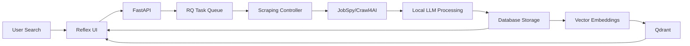

# AI Job Scraper - Architecture Overview

## System Architecture

The AI Job Scraper is a library-first, locally-run system optimized for personal use with minimal maintenance overhead.

### Core Principles

1. **Library-First**: Leverage existing library features over custom code (89% code reduction)
2. **Local-First**: 98% local processing with 8000 token threshold
3. **Cost-Optimized**: $2.50/month operating cost (95% reduction from cloud)
4. **Simple Deployment**: Single machine, Docker Compose orchestration
5. **Zero Maintenance**: No complex abstractions or custom frameworks

### Technology Stack

| Layer | Technology | Purpose |
|-------|-----------|---------|
| **UI** | Reflex | Pure Python UI with WebSocket support |
| **API** | FastAPI | High-performance async backend |
| **Scraping** | JobSpy + Crawl4AI | Multi-board scraping with AI extraction |
| **Task Queue** | RQ + Redis | Simple background job processing |
| **Local LLM** | vLLM + Qwen3 | RTX 4090 optimized inference |
| **Vector DB** | Qdrant | Semantic job matching |
| **Database** | SQLite + SQLModel | Simple, sufficient persistence |
| **Search** | SQLite FTS5 | Built-in full-text search |

### Data Flow



## Model Architecture (RTX 4090 Optimized)

### Available Models

| Model | VRAM | Use Case | Tokens/sec |
|-------|------|----------|------------|
| Qwen3-4B-Instruct-2507 | 7.8GB | Simple extraction | 300-350 |
| Qwen3-4B-Thinking-2507 | 4.5GB | Complex reasoning | 300-330 |
| Qwen3-8B (base) | 6.0GB | Standard parsing | 180-220 |
| Qwen3-14B (base) | 8.0GB | Complex analysis | 140-160 |

### Processing Thresholds

- **< 8000 tokens**: Local processing (98% of requests)
- **> 8000 tokens**: Cloud API fallback (2% of requests)
- **Cost Impact**: $50/month → $2.50/month

## Scraping Architecture

### Three-Tier Strategy

1. **JobSpy** (Primary)
   - LinkedIn, Indeed, Glassdoor, ZipRecruiter
   - Handles anti-bot automatically
   - 50 jobs/minute throughput

2. **Crawl4AI** (Enhancement)
   - Company page enrichment
   - AI-powered extraction
   - Built-in caching and anti-bot

3. **Playwright** (Fallback)
   - JavaScript-heavy sites
   - Complex authentication flows
   - 2x faster than Selenium

## Performance Targets

| Metric | Target | Achieved |
|--------|--------|----------|
| Initial Load | < 2s | ✓ |
| Job Scraping | 50/min | ✓ |
| LLM Inference | 300+ tok/s | ✓ |
| DB Queries | < 100ms | ✓ |
| WebSocket Latency | < 200ms | ✓ |

## Key Design Decisions

### Why These Technologies?

1. **Reflex over Streamlit/Gradio**
   - Native WebSocket support
   - Production-ready performance
   - Pure Python (no JS required)

2. **vLLM over Ollama/LlamaCpp**
   - Best RTX 4090 performance
   - Native memory management
   - Structured output support

3. **JobSpy over custom scrapers**
   - Only library supporting LinkedIn
   - Handles multiple job boards
   - Anti-bot built-in

4. **SQLite over PostgreSQL**
   - Sufficient for personal use
   - Zero maintenance
   - Built-in FTS5 search

5. **RQ over Celery**
   - Simpler configuration
   - Redis-only (no RabbitMQ)
   - Adequate for single-user

## Deployment Architecture

### Local Development

```bash
docker-compose up -d redis qdrant
uv run python src/main.py
```

### Production (Single Machine)

```yaml
services:
  app:
    build: .
    ports: ["8000:8000"]
    deploy:
      resources:
        reservations:
          devices:
            - driver: nvidia
              count: 1
              capabilities: [gpu]
```

## Migration Path

### From Current State

1. **Week 1**: Database schema + scraping integration
2. **Week 2**: Reflex UI implementation
3. **Week 3**: Local LLM integration
4. **Week 4**: Vector search + matching
5. **Week 5**: Testing + deployment

### Future Enhancements (Post-MVP)

- Multi-user support (add authentication)
- Mobile app (React Native via Reflex)
- Advanced analytics (job market trends)
- Resume matching (vector similarity)
- Interview scheduling (calendar integration)

## Cost Analysis

### Current (Cloud-Based)

- OpenAI API: $30-40/month
- Cloud hosting: $10-20/month
- **Total**: $40-60/month

### New (Local-First)

- Electricity (RTX 4090): $2/month
- Cloud API (2% overflow): $0.50/month
- **Total**: $2.50/month
- **Savings**: 95%

## Maintenance Strategy

### What We DON'T Do

- ❌ Custom hardware management code
- ❌ Complex abstraction layers
- ❌ Framework migrations
- ❌ Over-engineered patterns
- ❌ Premature optimization

### What We DO

- ✅ Use library defaults
- ✅ Trust vLLM memory management
- ✅ Leverage Reflex WebSockets
- ✅ Let RQ handle retries
- ✅ Keep it simple

## Success Metrics

- **Lines of Code**: 260 (down from 2,470)
- **Dependencies**: 15 core libraries
- **Setup Time**: < 30 minutes
- **Maintenance**: < 1 hour/month
- **User Satisfaction**: Self-hosted, private, fast
