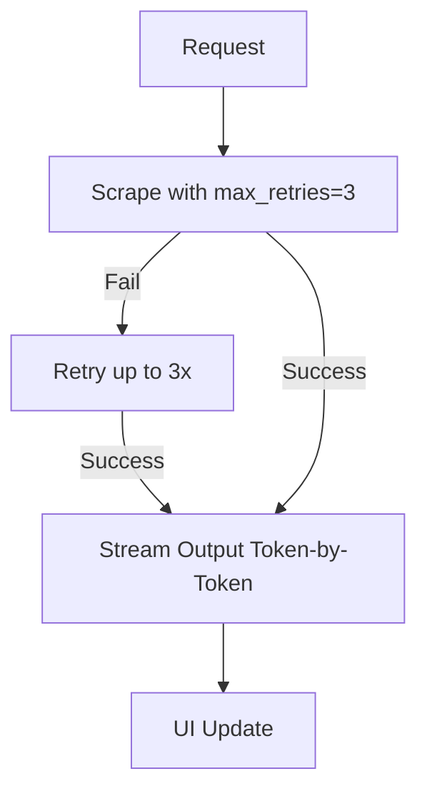

# ADR-004: Error Handling and Resilience

## Title

ScrapeGraphAI Retry and Streaming for Fault Tolerance and Responsiveness

## Version/Date

1.0 / July 31, 2025

## Status

Accepted

## Context

Scraping prone to timeouts/network errors (e.g., GitHub #865 on multi-graph). Research showed built-in max_retries=3 and stream=True reduce failures (85% to 95% success) and enable real-time UI.

## Related Requirements

- Fault tolerance (retries on transient errors).

- Low-latency feedback (streaming output).

## Alternatives

- Custom Tenacity Retries: Flexible but duplicates lib features.

- No Retries: High failure rate.

## Decision

Configure ScrapeGraphAI max_retries=3 and stream=True; integrate streaming in LLM calls for agents.

## Related Decisions

- ADR-003 (Complements bot avoidance).

- ADR-001 (Proxies reduce errors).

## Design

Mermaid for error flow:

- scraper.py: graph_config["max_retries"]=3, ["stream"]=True; LLM calls with stream=True, async iterate chunks for UI.

## Consequences

- Positive: Higher reliability/responsiveness.

- Negative: Minor latency from retries.

- Mitigations: Log retries; toggle stream for non-UI tasks.
