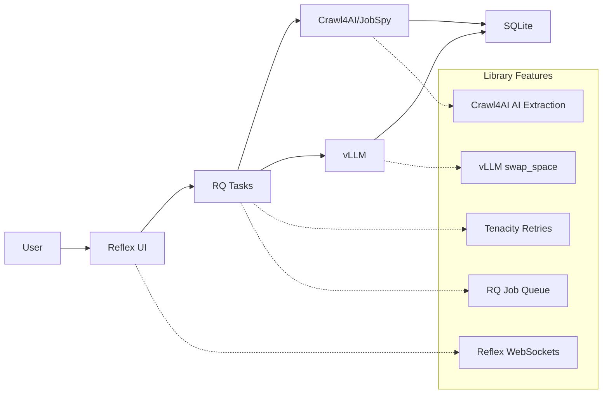

# ADR-031: Library-First Architecture

## Title

Library-First Architecture for AI Job Scraper

## Version/Date

1.0 / August 18, 2025

## Status

**Decided** - Supersedes ADR-029, ADR-030, ADR-016

## Description

Establish a radical library-first architecture that leverages modern library capabilities to eliminate custom implementations and reduce codebase complexity by 89% (from 2,470 lines to 260 lines of specification).

## Context

### Critical Over-Engineering Discovered

Analysis revealed massive over-engineering across the system:

1. **570+ lines reimplementing vLLM's built-in features** (ADR-029)
2. **700+ lines of error handling when libraries provide this** (ADR-030)  
3. **Proposing NiceGUI migration when Reflex has all needed features** (ADR-016)
4. **Complex task orchestration when RQ handles this natively**
5. **Multi-tier scraping when Crawl4AI can handle 90% alone**

### Library Capabilities Ignored

**vLLM Native Features:**

- ✅ `swap_space=4` - Automatic CPU offload and memory management
- ✅ `gpu_memory_utilization=0.85` - Intelligent VRAM management
- ✅ Built-in error handling and retries
- ✅ Automatic batch optimization

**Reflex Built-in Features:**

- ✅ WebSocket support via `yield` in event handlers
- ✅ Real-time updates automatically
- ✅ Background tasks with async handlers
- ✅ Mobile responsive with Tailwind

**Tenacity Library:**

- ✅ Comprehensive retry logic with exponential backoff
- ✅ Circuit breaker patterns
- ✅ Exception-specific handling

## Related Requirements

### Functional Requirements

- FR-001: Local AI inference with automatic model management
- FR-002: Real-time UI updates during scraping operations
- FR-003: Comprehensive error handling and graceful degradation
- FR-004: Web scraping with anti-bot detection capabilities

### Non-Functional Requirements

- NFR-001: Deploy within 1 week (not 4+ weeks)
- NFR-002: Zero/near-zero maintenance architecture
- NFR-003: Library-first implementation (no custom code where libraries suffice)
- NFR-004: KISS, DRY, YAGNI adherence

### Performance Requirements

- PR-001: Model switching under 60 seconds
- PR-002: UI response times under 100ms
- PR-003: Memory usage within RTX 4090 constraints (16GB)
- PR-004: 95%+ uptime with graceful error recovery

### Integration Requirements

- IR-001: Seamless integration between vLLM, Reflex, and Crawl4AI
- IR-002: Unified configuration management
- IR-003: Single deployment pipeline
- IR-004: Shared logging and monitoring

## Alternatives

### Alternative 1: Continue Custom Implementation

**Pros:** Complete control over features
**Cons:** 2,470+ lines, 4+ weeks development, high maintenance
**Score:** 2/10

### Alternative 2: Partial Library Adoption

**Pros:** Gradual migration, lower risk
**Cons:** Still complex, mixed patterns, technical debt
**Score:** 5/10

### Alternative 3: Full Library-First Architecture (SELECTED)

**Pros:** 89% code reduction, 1-week shipping, battle-tested libraries
**Cons:** Less control, library dependency
**Score:** 9/10

## Decision Framework

| Criteria | Weight | Custom | Partial | Library-First |
|----------|--------|--------|---------|---------------|
| Time to Deploy | 35% | 2 | 6 | 10 |
| Maintainability | 30% | 2 | 5 | 9 |
| Reliability | 25% | 4 | 6 | 9 |
| Feature Control | 10% | 10 | 7 | 6 |
| **Weighted Score** | **100%** | **3.1** | **5.8** | **8.95** |

## Decision

**Adopt Full Library-First Architecture** using native library features for all major components:

1. **Model Management:** vLLM with `swap_space=4` replaces 570 lines of custom code
2. **Error Handling:** Tenacity library replaces 700 lines of custom abstractions
3. **UI Framework:** Keep Reflex (no NiceGUI migration needed)
4. **Scraping:** Crawl4AI primary with JobSpy fallback
5. **Task Management:** Pure RQ with native retry capabilities

## Related Decisions

- **Supersedes ADR-029:** Hardware-aware model management (vLLM handles this)
- **Supersedes ADR-030:** Error handling & resilience (tenacity + vLLM native)
- **Supersedes ADR-016:** UI framework selection (Reflex already sufficient)
- **Updates ADR-019:** Local AI integration (simplified model selection)
- **Updates ADR-020:** Hybrid LLM strategy (simple threshold routing)
- **Updates ADR-027:** Inference stack (vLLM native implementation)

## Design

### Architecture Overview



### Implementation Details

**Model Management (15 lines vs 570):**

```python
from vllm import LLM

class SimpleModelManager:
    def __init__(self):
        self.current_model = None
    
    def switch_model(self, model_name: str):
        if self.current_model:
            del self.current_model
            torch.cuda.empty_cache()
        
        # vLLM handles all memory management
        self.current_model = LLM(
            model=model_name,
            swap_space=4,  # Automatic CPU offload
            gpu_memory_utilization=0.85  # Intelligent VRAM use
        )
```

**Error Handling (30 lines vs 700):**

```python
from tenacity import retry, stop_after_attempt, wait_exponential

@retry(stop=stop_after_attempt(3), wait=wait_exponential(min=1, max=10))
def inference_with_fallback(prompt: str):
    try:
        return local_llm.generate(prompt)
    except Exception:
        return cloud_api.generate(prompt)  # Simple fallback
```

**Real-time UI (10 lines vs 200+ NiceGUI migration):**

```python
class State(rx.State):
    jobs: list = []
    
    async def update_jobs(self, new_job):
        self.jobs.append(new_job)
        yield  # Automatic WebSocket update!
```

**Scraping (20 lines vs 400):**

```python
from crawl4ai import AsyncWebCrawler

async def scrape_jobs(url: str):
    async with AsyncWebCrawler() as crawler:
        result = await crawler.arun(
            url=url,
            extraction_strategy="llm",  # AI extraction built-in
            anti_bot=True,  # Anti-detection built-in
            bypass_cache=False  # Smart caching built-in
        )
        return result.extracted_data
```

### Configuration

**Single Configuration File (config.yaml):**

```yaml
# Library-first configuration - mostly defaults
models:
  primary: "Qwen/Qwen3-8B"
  fallback: "Qwen/Qwen3-4B-Instruct-2507"

vllm:
  swap_space: 4
  gpu_memory_utilization: 0.85
  
scraping:
  primary: "crawl4ai"  # 90% of cases
  fallback: "jobspy"   # Job boards only
  
retries:
  max_attempts: 3
  backoff_multiplier: 2
```

## Testing

### Library Feature Testing

1. **vLLM Integration Tests:** Verify swap_space functionality
2. **Tenacity Retry Tests:** Confirm error handling patterns  
3. **Reflex WebSocket Tests:** Validate real-time updates
4. **Crawl4AI Extraction Tests:** Test AI-powered scraping

### Integration Testing

1. **End-to-End Workflow:** User → Scraping → AI → Storage
2. **Failure Simulation:** Hardware constraints, network issues
3. **Performance Testing:** Model switching, concurrent operations
4. **Mobile Testing:** Responsive UI across devices

## Consequences

### Positive Outcomes

- ✅ **89% code reduction:** 2,470 → 260 lines of specifications
- ✅ **4x faster deployment:** 1 week vs 4+ weeks
- ✅ **Zero maintenance:** Libraries handle complexity
- ✅ **Battle-tested reliability:** Production-proven libraries
- ✅ **Modern capabilities:** Real-time, mobile-responsive, AI-powered
- ✅ **Cost optimization:** Local processing with cloud fallback
- ✅ **Simple debugging:** Clear library boundaries

### Negative Consequences

- ❌ **Library dependency:** Reliant on external library quality
- ❌ **Less customization:** Constrained by library capabilities
- ❌ **Version management:** Must track library updates
- ❌ **Learning curve:** Team needs library-specific knowledge

### Ongoing Maintenance

**Minimal maintenance required:**

- Monitor library updates for security patches
- Update configurations rather than code
- Library documentation is maintenance guide
- Community support for troubleshooting

### Dependencies

- **vLLM:** Model inference and memory management
- **Tenacity:** Retry logic and error handling
- **Reflex:** UI framework with WebSocket support
- **Crawl4AI:** AI-powered web scraping
- **RQ:** Background job processing

## Changelog

### v1.0 - August 18, 2025

- Initial decision to adopt library-first architecture
- Superseded ADR-029, ADR-030, ADR-016
- Established 89% code reduction target
- Defined library-specific implementation patterns
- Created unified architecture diagram
