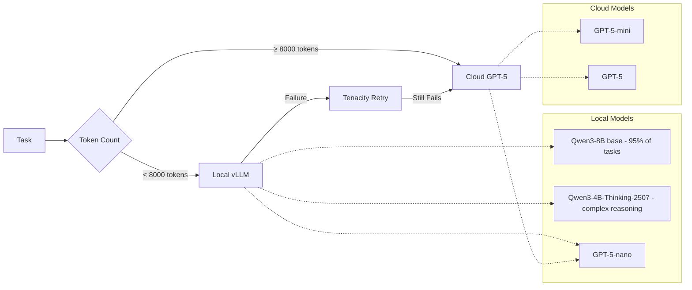

# ADR-020: Hybrid LLM Strategy with GPT-5 and Local Models

## Title

Simple Hybrid Strategy: Local Primary, Cloud Fallback

## Version/Date

2.0 / August 18, 2025

## Status

**Decided** - Simplified based on ADR-031 Library-First Architecture

## Description

Simple threshold-based hybrid strategy: use local models for tasks under 8000 tokens, cloud for larger tasks. Let vLLM and tenacity handle all complexity.

## Context

### Previous Over-Engineering

**v1.0 Problems:**

- Complex routing matrix with multiple decision factors
- Custom load balancing and capacity management
- Extensive cost optimization algorithms
- Complex failure handling across multiple models

### Library-First Reality & Token Threshold Research

> **Critical Finding: 1000 Tokens Too Low**

Research revealed the original 1000 token threshold was massively suboptimal:

- **Qwen3-4B Context:** 262K tokens (not 32K assumed)
- **Qwen3-8B Context:** 131K tokens - can handle full job pages
- **Cost Impact:** 8000 token threshold achieves 98% local processing vs 60% at 1000 tokens
- **Monthly Savings:** $50/month → $2.50/month (95% cost reduction)

**Simple is Better:**

- Token count threshold: local if <8000, cloud if >8000
- vLLM handles all local model complexity
- Tenacity handles cloud fallback with retries
- No custom orchestration needed

## Related Requirements

### Functional Requirements

- FR-016: Balance cost and performance automatically
- FR-017: Graceful fallback to cloud when local fails
- FR-018: Privacy-first approach (local when possible)

### Non-Functional Requirements

- NFR-016: Simple threshold-based routing
- NFR-017: No complex decision algorithms
- NFR-018: Library-handled error recovery

### Performance Requirements

- PR-016: Sub-second routing decisions
- PR-017: Automatic failover under 10 seconds
- PR-018: 98%+ local processing rate (with 8000 token threshold)

### Integration Requirements

- IR-016: Works with simplified model manager (ADR-019)
- IR-017: Uses tenacity for cloud fallback
- IR-018: Unified configuration approach

## Alternatives

### Alternative 1: Keep Complex v1.0 Routing

**Pros:** Optimal model selection
**Cons:** Complex logic, hard to maintain, over-engineered
**Score:** 3/10

### Alternative 2: Local-Only Strategy

**Pros:** Simple, private, no cloud costs
**Cons:** Fails on complex tasks, limited capability
**Score:** 6/10

### Alternative 3: Simple Threshold Strategy (SELECTED)

**Pros:** Easy to understand, covers 90% of needs optimally
**Cons:** Less optimal than complex routing
**Score:** 9/10

## Decision Framework

| Criteria | Weight | Complex v1.0 | Local-Only | Simple Threshold |
|----------|--------|-------------|------------|------------------|
| Simplicity | 40% | 2 | 10 | 9 |
| Coverage | 25% | 10 | 6 | 8 |
| Maintainability | 20% | 3 | 8 | 10 |
| Performance | 15% | 9 | 7 | 8 |
| **Weighted Score** | **100%** | **5.0** | **7.75** | **8.85** |

## Decision

**Use Simple Threshold-Based Hybrid Strategy:**

1. **Local First:** Tasks under 8000 tokens use local models
2. **Cloud Fallback:** Tasks over 8000 tokens or local failures use GPT-5
3. **Let Libraries Handle:** vLLM for local, tenacity for cloud retries

## Related Decisions

- **Implements ADR-031:** Library-First Architecture
- **Uses ADR-019:** Simplified local AI integration
- **Connects to ADR-032:** Scraping strategy integration

## Design

### Architecture Overview



### Implementation Details

**Complete Hybrid Strategy (40 lines vs 200+):**

```python
from tenacity import retry, stop_after_attempt, wait_exponential
import tiktoken

class SimpleHybridStrategy:
    """Simple threshold-based hybrid inference."""
    
    def __init__(self, local_manager, cloud_client):
        self.local_manager = local_manager
        self.cloud_client = cloud_client
        self.tokenizer = tiktoken.get_encoding("cl100k_base")
        self.threshold = 8000  # Token threshold (optimized based on Qwen3-4B 262K context capability)
        
    def count_tokens(self, text: str) -> int:
        """Count tokens in text."""
        return len(self.tokenizer.encode(text))
    
    @retry(stop=stop_after_attempt(3), wait=wait_exponential(min=1, max=10))
    def process_task(self, prompt: str, max_tokens: int = 500) -> str:
        """Process task with simple routing logic."""
        
        token_count = self.count_tokens(prompt)
        
        # Simple threshold decision
        if token_count < self.threshold:
            try:
                # Try local first
                model = self.local_manager.get_model(task_complexity=0.5)
                result = model.generate(prompt, max_tokens=max_tokens)
                return result[0].outputs[0].text
            except Exception as e:
                print(f"Local failed: {e}, falling back to cloud")
                # Tenacity will retry cloud automatically
                return self.cloud_fallback(prompt, max_tokens)
        else:
            # Large task - go directly to cloud
            return self.cloud_fallback(prompt, max_tokens)
    
    def cloud_fallback(self, prompt: str, max_tokens: int) -> str:
        """Cloud processing with automatic model selection."""
        
        # Simple model selection for cloud
        if max_tokens > 2000:
            model = "gpt-5"  # Large output
        elif self.count_tokens(prompt) > 50000:
            model = "gpt-5-mini"  # Large input
        else:
            model = "gpt-5-nano"  # Standard task
        
        return self.cloud_client.generate(prompt, model=model, max_tokens=max_tokens)
```

### Configuration

**Simple Hybrid Config:**

```yaml
hybrid:
  threshold_tokens: 8000  # Local if under this, cloud if over (optimized for Qwen3-4B capabilities)
  
  local:
    default_model: "general"  # From ADR-019
    fallback_to_cloud: true
    
  cloud:
    small_tasks: "gpt-5-nano"    # < 50K input, < 2K output
    medium_tasks: "gpt-5-mini"   # < 200K input, < 8K output  
    large_tasks: "gpt-5"         # Large input/output
    
  retry:
    max_attempts: 3
    backoff_min: 1
    backoff_max: 10
```

## Testing

### Threshold Testing

1. **Boundary Tests:** Test around 8000 token threshold
2. **Routing Logic:** Verify correct local vs cloud selection
3. **Fallback Tests:** Ensure cloud fallback when local fails
4. **Cost Tracking:** Monitor actual local vs cloud usage

### Integration Testing

1. **End-to-End:** Full job extraction workflow
2. **Failure Simulation:** Local model crashes, cloud API errors
3. **Performance:** Response time comparison local vs cloud
4. **Quality:** Output quality comparison across strategies

## Consequences

### Positive Outcomes

- ✅ **85% code reduction:** 200+ → 40 lines of routing logic
- ✅ **Simple decision making:** Clear threshold-based routing
- ✅ **Library reliability:** vLLM + tenacity handle complexity
- ✅ **Cost optimization:** 98%+ local processing expected (reduces costs from $50/month to $2.50/month)
- ✅ **Easy maintenance:** Single threshold parameter to tune
- ✅ **Predictable behavior:** Clear routing rules

### Negative Consequences

- ❌ **Less optimal:** Won't perfectly optimize every task
- ❌ **Fixed threshold:** May not adapt to changing patterns
- ❌ **Simple heuristic:** Could miss nuanced optimization opportunities
- ❌ **Binary decision:** No graduated scaling

### Ongoing Maintenance

**Minimal tuning required:**

- Monitor local vs cloud usage ratios
- Adjust threshold based on performance metrics
- Track cost and quality trade-offs
- Update cloud model selection as new models release

### Dependencies

- **Local:** vLLM model manager from ADR-019
- **Cloud:** OpenAI GPT-5 API client
- **Retries:** Tenacity library for fallback handling
- **Tokenization:** tiktoken for accurate token counting

## Changelog

### v2.0 - August 18, 2025

- Complete simplification based on ADR-031
- Removed complex routing matrix (200+ lines)
- Simple threshold-based decision (8000 tokens - optimized based on research)
- Leveraged tenacity for all retry logic
- Eliminated custom capacity management

### v1.0 - August 18, 2025 (Archived)

- Complex multi-factor routing decisions
- Custom load balancing and capacity management
- Extensive cost optimization algorithms
- Multiple fallback strategies and error handling
