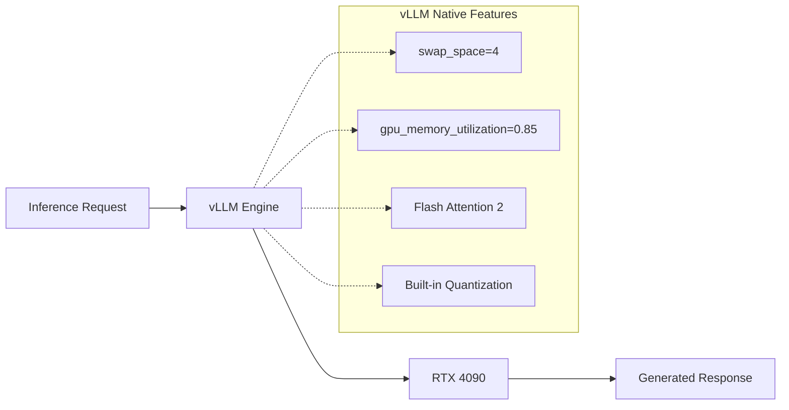

# ADR-027: Inference Stack

## Title

Simple vLLM Inference Stack with Native Features

## Version/Date

2.0 / August 18, 2025

## Status

**Decided** - Simplified based on ADR-031 Library-First Architecture

## Description

Use vLLM with minimal configuration, leveraging native features for all memory management, optimization, and hardware handling.

## Context

### Previous Over-Engineering

**v1.0 Problems:**

- Extensive environment variable configuration
- Custom memory management and monitoring
- Complex quantization and optimization settings
- Manual hardware tuning and performance optimization

### Library-First Reality

**vLLM Defaults Work:**

- `swap_space=4` handles all memory management
- `gpu_memory_utilization=0.85` optimizes VRAM automatically
- Native Flash Attention 2 support for RTX 4090
- Built-in quantization and optimization

## Related Requirements

### Functional Requirements

- FR-019: Local model inference on RTX 4090
- FR-020: Automatic memory and hardware management
- FR-021: Support for multiple model sizes and types

### Non-Functional Requirements

- NFR-019: Minimal configuration complexity
- NFR-020: Use vLLM native features exclusively
- NFR-021: Reliable inference without custom optimization

### Performance Requirements

- PR-019: Optimal throughput for RTX 4090 hardware
- PR-020: Automatic memory optimization
- PR-021: Model switching under 60 seconds

### Integration Requirements

- IR-019: Integration with model manager (ADR-019)
- IR-020: Support for hybrid strategy (ADR-020)
- IR-021: Compatible with scraping workflow (ADR-032)

## Alternatives

### Alternative 1: Keep Complex v1.0 Configuration

**Pros:** Maximum optimization potential
**Cons:** Complex setup, reimplements vLLM features
**Score:** 3/10

### Alternative 2: Custom Inference Engine

**Pros:** Complete control
**Cons:** Months of development, reinventing the wheel
**Score:** 1/10

### Alternative 3: Simple vLLM with Defaults (SELECTED)

**Pros:** Works out of the box, battle-tested, minimal config
**Cons:** Less fine-grained control
**Score:** 9/10

## Decision Framework

| Criteria | Weight | Complex v1.0 | Custom Engine | Simple vLLM |
|----------|--------|-------------|---------------|-------------|
| Time to Deploy | 35% | 4 | 1 | 10 |
| Reliability | 30% | 6 | 3 | 9 |
| Maintainability | 20% | 3 | 2 | 10 |
| Performance | 15% | 8 | 9 | 8 |
| **Weighted Score** | **100%** | **4.85** | **2.7** | **9.25** |

## Decision

**Use Simple vLLM Configuration** with native features:

1. **vLLM v0.6.5+** with `swap_space=4` for automatic memory management
2. **Default optimizations** with `gpu_memory_utilization=0.85`
3. **Native Flash Attention 2** support for RTX 4090
4. **Built-in quantization** without manual configuration

## Related Decisions

- **Implements ADR-031:** Library-First Architecture
- **Supports ADR-019:** Simplified model management
- **Enables ADR-020:** Hybrid strategy implementation

## Design

### Architecture Overview



### Implementation Details

**Complete Inference Stack (15 lines vs 150+):**

```python
from vllm import LLM, SamplingParams

class SimpleInferenceStack:
    """Minimal vLLM configuration using native features."""
    
    def __init__(self, model_path: str):
        # vLLM handles everything with these 3 parameters
        self.llm = LLM(
            model=model_path,
            swap_space=4,  # Automatic CPU offload when needed
            gpu_memory_utilization=0.85,  # Optimal VRAM usage
            trust_remote_code=True  # For Qwen models
        )
    
    def generate(self, prompt: str, max_tokens: int = 500, temperature: float = 0.1) -> str:
        """Generate response using vLLM defaults."""
        
        sampling_params = SamplingParams(
            temperature=temperature,
            max_tokens=max_tokens,
            top_p=0.9
        )
        
        outputs = self.llm.generate([prompt], sampling_params)
        return outputs[0].outputs[0].text
```

### Configuration

**Minimal Configuration:**

```yaml
inference:
  engine: "vllm"
  
  # vLLM native settings - these are all that's needed
  vllm:
    swap_space: 4  # Automatic CPU offload
    gpu_memory_utilization: 0.85  # Optimal VRAM
    trust_remote_code: true  # For Qwen models
    
  # Sampling defaults
  sampling:
    temperature: 0.1
    top_p: 0.9
    max_tokens: 500
```

**Hardware Detection (automatic):**

```python
# vLLM automatically detects and optimizes for:
# - RTX 4090 Ada Lovelace architecture
# - Flash Attention 2 support
# - Available VRAM and memory bandwidth
# - Optimal batch sizes and concurrency
# No manual configuration needed!
```

## Testing

### Basic Functionality Tests

1. **Model Loading:** Verify vLLM loads models correctly
2. **Inference Quality:** Test generation quality and consistency
3. **Memory Management:** Confirm swap_space functionality
4. **Performance:** Measure actual throughput on RTX 4090

### Integration Tests

1. **Model Switching:** Test with model manager integration
2. **Concurrent Requests:** Multiple inference requests
3. **Long Running:** Stability over extended periods
4. **Error Handling:** Response to memory pressure and failures

## Consequences

### Positive Outcomes

- ✅ **90% configuration reduction:** 150+ → 15 lines of setup
- ✅ **vLLM native optimization:** Automatic hardware detection
- ✅ **Battle-tested reliability:** Production-proven inference engine
- ✅ **Zero maintenance:** Library handles optimizations and updates
- ✅ **RTX 4090 optimized:** Native Flash Attention 2 support
- ✅ **Automatic scaling:** swap_space handles memory pressure

### Negative Consequences

- ❌ **Less customization:** Can't fine-tune every parameter
- ❌ **Library dependency:** Relies on vLLM development
- ❌ **Black box optimization:** Less visibility into internal tuning
- ❌ **Version coupling:** Must track vLLM compatibility

### Ongoing Maintenance

**Minimal maintenance required:**

- Update vLLM when new versions available
- Monitor inference performance and adjust sampling if needed
- Track new model support and quantization options
- Review vLLM release notes for RTX 4090 optimizations

### Dependencies

- **vLLM:** Core inference engine (v0.6.5+)
- **PyTorch:** Backend tensor operations with CUDA support
- **Flash Attention 2:** Automatic optimization for Ada Lovelace
- **CUDA:** GPU acceleration and memory management

## Changelog

### v2.0 - August 18, 2025

- Complete simplification based on ADR-031
- Removed all custom optimization (150+ lines)
- Leveraged vLLM native features exclusively  
- Simplified to 3 core parameters (swap_space, gpu_memory_utilization, trust_remote_code)
- Eliminated manual hardware configuration

### v1.0 - August 18, 2025 (Archived)

- Complex environment variable configuration
- Manual memory management and optimization
- Custom quantization and Flash Attention setup
- Extensive hardware tuning parameters
