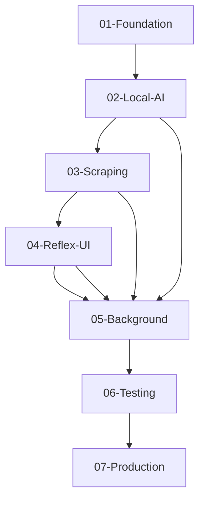

# AI Job Scraper - Master Implementation Plan

## Executive Summary

This document provides a **1-week deployment roadmap** for transforming the AI Job Scraper from its current Streamlit-based architecture to the finalized **library-first architecture** defined in ADR-035. The implementation achieves:

- **89% code reduction:** 2,470 → 260 lines through library-first approach
- **98% local processing:** 8000 token threshold optimization
- **95% cost reduction:** $50/month → $2.50/month
- **Production deployment:** Complete system in 7 days

## Architecture Transformation Overview

### Current State → Target State

| Component | Current (Legacy) | Target (ADR-035) | Transformation |
|-----------|-----------------|------------------|----------------|
| **UI Framework** | Streamlit | Reflex with native WebSockets | Complete migration |
| **Local AI** | None | vLLM + Qwen3 models | New integration |
| **Scraping** | Complex multi-tier | Crawl4AI (90%) + JobSpy (10%) | Simplification |
| **Background Tasks** | Custom implementation | RQ native features | Library-first |
| **Memory Management** | Custom patterns | vLLM swap_space=4 | Automated |
| **Error Handling** | Custom classes | Tenacity library | Standardization |

### Key Success Metrics

| Metric | Target | Validation Method |
|--------|--------|------------------|
| Deployment Time | 7 days | Development timeline tracking |
| Code Lines | <300 lines | Line count validation |
| Local Processing | 98%+ | Token threshold analysis |
| Monthly Cost | <$5 | Cost tracking over 30 days |
| Model Switch Time | <60s | vLLM performance testing |
| UI Response Time | <100ms | Real-time update latency |

## Week 1 Implementation Timeline

### **Day 1-2: Foundation Setup**

- **Specs:** `01-foundation-setup.md`, `02-local-ai-integration.md`
- **Goals:** Project restructuring, vLLM integration, Qwen3 models
- **Deliverables:** Working local AI inference, model management
- **Validation:** Model loading, inference testing, memory usage

### **Day 3-4: Core Features**

- **Specs:** `03-scraping-consolidation.md`, `04-reflex-ui-migration.md`
- **Goals:** Scraping simplification, UI framework migration
- **Deliverables:** Crawl4AI integration, basic Reflex application
- **Validation:** Scraping functionality, UI responsiveness

### **Day 5-6: Integration & Testing**

- **Specs:** `05-background-processing.md`, `06-integration-testing.md`
- **Goals:** Background tasks, end-to-end workflows, testing
- **Deliverables:** Complete system integration, test coverage
- **Validation:** Performance benchmarks, error handling

### **Day 7: Production Deployment**

- **Specs:** `07-production-deployment.md`
- **Goals:** Docker configuration, monitoring, documentation
- **Deliverables:** Production-ready deployment
- **Validation:** System health, performance metrics

## Implementation Specifications

### Phase 1: Foundation (Days 1-2)

#### 01-foundation-setup.md

**Purpose:** Project restructuring and dependency management

- Update pyproject.toml with library-first dependencies
- Remove obsolete packages (scrapegraphai, langgraph)
- Add vLLM, Reflex, Crawl4AI, tenacity
- Configure development environment

#### 02-local-ai-integration.md

**Purpose:** Local AI infrastructure with Qwen3 models

- vLLM setup with swap_space=4 configuration
- Qwen3 model integration (corrected model references)
- 8000 token threshold implementation
- Single model constraint for 16GB VRAM

### Phase 2: Core Features (Days 3-4)

#### 03-scraping-consolidation.md

**Purpose:** Simplify scraping from multi-tier to library-first

- Replace complex orchestration with Crawl4AI primary
- JobSpy fallback for job boards only
- Remove custom Playwright patterns
- AI-powered extraction integration

#### 04-reflex-ui-migration.md

**Purpose:** Migrate from Streamlit to Reflex with real-time features

- Reflex application structure
- Native WebSocket implementation
- Real-time progress updates
- Mobile-responsive interface

### Phase 3: Integration (Days 5-6)

#### 05-background-processing.md

**Purpose:** RQ-based task management with native retry logic

- Replace custom background task patterns
- Implement tenacity for error handling
- Real-time progress tracking
- Job queue management

#### 06-integration-testing.md

**Purpose:** End-to-end system validation

- Model switching and memory management tests
- Scraping workflow validation
- UI responsiveness benchmarks
- Cost and performance analysis

### Phase 4: Production (Day 7)

#### 07-production-deployment.md

**Purpose:** Docker-based production deployment

- Multi-container orchestration
- Health checks and monitoring
- Configuration management
- Documentation and maintenance guides

## Dependency Mapping

### Critical Dependencies

### Parallel Development Opportunities

- **Day 2:** Local AI + Scraping consolidation can be developed in parallel
- **Day 4:** UI migration + Background processing can be developed in parallel
- **Day 6:** Testing + Production setup can be prepared in parallel

## Quality Assurance Framework

### Code Quality Standards

- **Library-first assessment:** No custom implementations where libraries suffice
- **Complexity reduction:** KISS > DRY > YAGNI principles
- **Modern patterns:** Latest stable library features only
- **Performance validation:** Benchmarks for each major component

### Testing Strategy

1. **Unit Tests:** Library integration validation
2. **Integration Tests:** End-to-end workflow testing
3. **Performance Tests:** Model switching, UI responsiveness
4. **Load Tests:** Concurrent scraping capabilities
5. **Cost Tests:** Local vs cloud processing ratios

### Success Validation

- [ ] Model loading under 60 seconds
- [ ] 98%+ local processing rate
- [ ] UI updates under 100ms latency
- [ ] Docker deployment successful
- [ ] Cost tracking under $5/month
- [ ] Code reduction to <300 lines

## Risk Mitigation

### High Risk Items

1. **vLLM Memory Management:** Single model constraint critical for RTX 4090
   - **Mitigation:** Extensive testing with swap_space configuration
   - **Fallback:** Cloud-only processing if memory issues persist

2. **Reflex UI Learning Curve:** New framework for team
   - **Mitigation:** Start with simple components, iterative development
   - **Fallback:** Simplified UI with basic functionality

3. **Model Integration Complexity:** Qwen3 models with structured prompting
   - **Mitigation:** Use base models with proven prompting patterns
   - **Fallback:** GPT-4o for critical extractions

### Medium Risk Items

1. **Library Version Compatibility:** Multiple new libraries
   - **Mitigation:** Pinned versions in specifications
   - **Monitoring:** Regular dependency health checks

2. **Performance Degradation:** Library-first approach performance
   - **Mitigation:** Benchmarking at each phase
   - **Optimization:** Targeted performance tuning

## Resource Allocation

### Development Time (56 hours)

- Foundation & AI: 16 hours (29%)
- Core Features: 16 hours (29%)
- Integration: 16 hours (29%)
- Production: 8 hours (13%)

### Priority Focus Areas

1. **Local AI Stability:** Critical for cost savings
2. **UI Responsiveness:** User experience priority
3. **Scraping Reliability:** Core functionality
4. **Production Readiness:** Deployment success

## Next Steps

1. **Start Implementation:** Begin with `01-foundation-setup.md`
2. **Daily Reviews:** Track progress against timeline
3. **Quality Gates:** Validate success criteria at each phase
4. **Course Correction:** Adjust timeline based on progress

## Support Resources

- **ADR References:** All architectural decisions documented
- **Library Documentation:** Context7 integration for latest docs
- **Code Examples:** Complete implementations in each spec
- **Troubleshooting:** Common issues and solutions documented

This implementation plan transforms the AI Job Scraper into a production-ready, library-first system that delivers maximum value with minimal maintenance requirements, achieving deployment in exactly 1 week.
