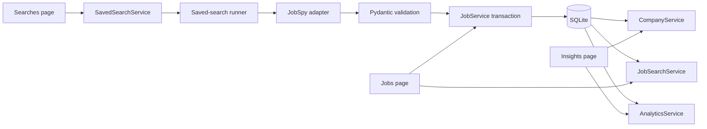

# How Job Tracker is structured

**Content type:** Conceptual

Job Tracker has one Streamlit interface, one application database boundary, and one collection configuration. This page explains where each contract belongs.

## Application flow

Labeled `st.page_link` controls expose **Jobs**, **Searches**, and **Insights** over hidden native Streamlit routing. This avoids the framework's inaccessible responsive drawer while preserving direct URLs. Every page calls services that share the engine and session helpers in `src/database.py`.



## Interface ownership

The interface keeps one implementation per task:

| File | Owns |
| --- | --- |
| `src/main.py` | Page configuration and top navigation |
| `src/ui/design.py` | Visual tokens, responsive CSS, reduced motion, and presentation helpers |
| `src/ui/pages/jobs.py` | Workflow filters and job review mutations |
| `src/ui/pages/searches.py` | Saved-search forms and manual runs |
| `src/ui/pages/insights.py` | Read-only workflow, salary, trend, and company summaries |

The application does not use a second component framework, custom browser detection, URL-state adapters, page-level service caches, or a parallel sidebar shell.

## Service ownership

Each mutable concept has one owner:

| Component | Owns | Does not own |
| --- | --- | --- |
| `src/database.py` | Engine creation, session scope, commit, and rollback | Business queries |
| `SavedSearchService` | Search definitions and latest run health | Persisted jobs |
| `JobSpyScraper` | Provider parameters and row conversion | Database transactions |
| `JobService` | Job queries, workflow state, deduplication, and scrape persistence | UI state |
| `CompanyService` | Read-only company facets derived from jobs | Scrape configuration |
| `JobSearchService` | Literal multi-term job search | Connections or result caches |
| `AnalyticsService` | Personal-scale job aggregates | A second analytics database |
| `CostMonitor` | Typed operational cost events and monthly budget health | Connections or UI alerts |

## Job workflow contract

Every job has one typed `ApplicationStage` value:

1. `Inbox`
2. `Saved`
3. `Applied`
4. `Interviews`
5. `Closed`

The database enforces the same values with a check constraint. Stars and notes remain independent fields.

Alembic revision `8f4b2c91a3d7` maps the former stage values before adding the constraint. It maps `New` to `Inbox`, `Interested` to `Saved`, and `Rejected` to `Closed`. `Applied` stays `Applied`.

The same revision normalizes legacy null salary values and safely adopts any former service-owned cost table. Invalid legacy timestamps, ownership, or costs stop before schema DDL; legacy metadata remains readable as JSON objects. Migration provenance ensures downgrade preserves a cost table that existed before the revision.

Follow-up revision `c91e7a4d2b6f` repairs databases already stamped by the draft migration. It imports the retired sibling `costs.db` once without changing that file, remaps colliding identifiers instead of overwriting canonical rows, and records the source-to-target identifier mapping for safe retries. It normalizes already-adopted cost metadata to JSON objects and losslessly converts two-element finite, integral numeric salary pairs to integer-or-null JSON. Any unsafe salary shape aborts the revision before mutation with the affected row and raw value so it can be repaired and retried. The revision then enforces the required salary column. SQLite migrations use native non-legacy transaction control so an interrupted schema change rolls back before retry.

The follow-up downgrade is deliberately forward-only and does not delete imported history, provenance, or repaired salary data. Re-upgrading is idempotent.

## Saved-search lifecycle

A saved search is the only collection configuration. It stores the query, location, sites, remote flag, job type, result limit, and enabled state.

The runner records one finite status:

1. Record `running` before provider work starts
2. Replace the lease timestamp with the completion time and record `succeeded` with jobs seen and inserted after a successful response
3. Replace the lease timestamp with the completion time and record `failed` with an error after a provider or persistence failure
4. Replace the lease timestamp with the completion time and record `cancelled` if task cancellation interrupts the run

The contract also supports `never` and `partial`. Deleting or disabling a saved search never deletes persisted jobs.

## Persistence rules

Job upserts and the saved search's terminal run health share one transaction. A failure between those writes rolls back every job and company mutation from that result, so a run cannot leave durable jobs behind while still reporting `running`.

The service enforces these rules:

- A job needs a title, company, and direct or listing URL
- The direct application URL wins when both URLs exist
- The URL identifies an existing job
- A repeated row updates provider-owned fields and preserves stage, star, notes, and archive state
- A company exists only when a valid job references it
- Company totals and latest-posted dates are aggregate query results

## Search and analytics

Search and analytics query the same committed state as the rest of the application. Neither service creates an engine or stores a duplicate cache.

Search matches every whitespace-separated term across title, description, company, and location. It returns detached `Job` data transfer objects, so UI code never depends on a live session.

Analytics computes job trends, company counts, and salary summaries with SQLAlchemy. Add another engine only after measured workload evidence justifies its lifecycle and consistency cost.

## Verify the boundaries

Run the architecture gates:

```bash
uv run --locked alembic check
uv run --locked pytest -q
uv run --locked ruff check .
```

ADR-037 records the interface decision. ADR-041 records the data-boundary decision.
