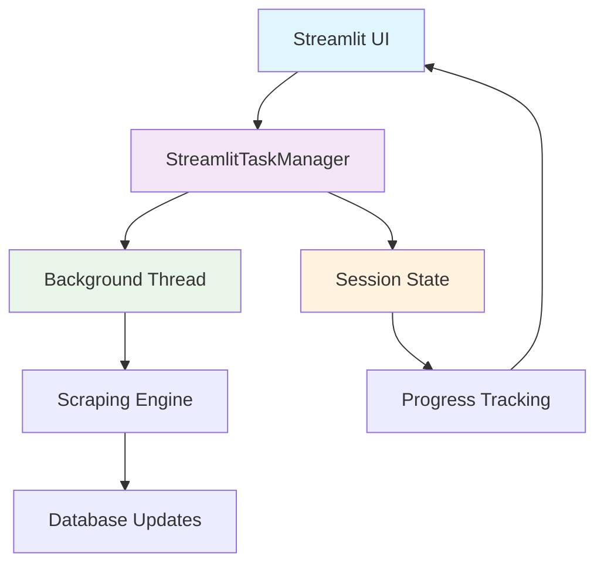

# 🚀 Scraping Integration Guide

This guide provides technical implementation details for integrating the background scraping dashboard into the AI Job Scraper application.

## 🏗️ Architecture Overview

The scraping integration consists of two primary components that work together to provide real-time background job scraping with a responsive UI.



## 📁 Implementation Files

### Background Task Manager (`src/ui/utils/background_tasks.py`)

**Core Components:**

```python
@dataclass
class CompanyProgress:
    """Individual company scraping progress tracking."""
    status: str = "pending"
    jobs_found: int = 0
    error: Optional[str] = None

@dataclass 
class ScrapeProgress:
    """Overall scraping operation progress."""
    overall_progress: float = 0.0
    current_stage: str = "Initializing..."
    companies: Dict[str, CompanyProgress] = field(default_factory=dict)
    is_complete: bool = False
    start_time: Optional[datetime] = None
    end_time: Optional[datetime] = None
```

**Key Features:**

- **Real-time progress updates** through session state synchronization

- **Background threading** with proper daemon thread management  

- **Error handling and recovery** mechanisms

- **Session state integration** for UI responsiveness

- **Task ID verification** to prevent race conditions

### Scraping Dashboard (`src/ui/pages/scraping.py`)

**UI Components:**

- **Control Panel**: Start/Stop/Reset scraping operations

- **Progress Display**: Real-time progress bars and status indicators

- **Company Status Grid**: Individual company progress tracking

- **Recent Activity**: Last run statistics and metrics

- **Debug Panel**: Development information and logs

## 🎯 Core Features

### ✅ Required Implementation

| Feature | Implementation | Location |
|---------|---------------|----------|
| Start Scraping Button | `StreamlitTaskManager.start_background_scraping()` | `scraping.py:42` |
| Active UI Section | `st.session_state.get("scraping_active", False)` | `scraping.py:67` |  
| Progress Bar | `st.progress(progress_data.overall_progress / 100.0)` | `scraping.py:89` |
| Company Status | Iterator through `st.session_state.progress_data` | `scraping.py:105` |
| Real-time Updates | Non-blocking UI updates via `st.rerun()` | `background_tasks.py:156` |

### ✅ Enhanced Features

- **Stop Functionality**: User-controlled operation termination

- **Progress Reset**: Dashboard cleanup between operations  

- **Error Recovery**: Graceful handling of scraping failures

- **Active Company Detection**: Database-driven company selection

- **Session Persistence**: Progress tracking across UI interactions

- **Auto-refresh**: Responsive real-time updates

## 🔧 Integration Methods

### Method 1: Standalone Page (Recommended)

Update `src/main.py` to include page navigation:

```python
import streamlit as st
from src.ui.components.sidebar import render_sidebar
from src.ui.pages.jobs import render_jobs_page
from src.ui.pages.scraping import render_scraping_page
from src.ui.state.app_state import StateManager
from src.ui.styles.theme import load_theme

def main() -> None:
    """Main application entry point with multi-page support."""
    st.set_page_config(
        page_title="AI Job Tracker",
        layout="wide", 
        initial_sidebar_state="expanded",
        menu_items={
            "About": "AI-powered job tracker for managing your job search efficiently."
        },
    )

    load_theme()
    StateManager()

    # Page navigation
    page = st.sidebar.selectbox(
        "📄 Navigate",
        ["Jobs Dashboard", "Scraping Dashboard"],
        index=0
    )

    render_sidebar()

    # Route to selected page
    if page == "Jobs Dashboard":
        render_jobs_page()
    elif page == "Scraping Dashboard":
        render_scraping_page()

if __name__ == "__main__":
    main()
```

### Method 2: Tabbed Integration

Add scraping as a tab within the existing jobs page:

```python

# In src/ui/pages/jobs.py
def render_jobs_page() -> None:
    """Enhanced jobs page with scraping tab."""
    st.header("🎯 AI Job Tracker Dashboard")
    
    # Create tab navigation
    tab1, tab2 = st.tabs(["📋 Job Management", "🚀 Scraping Control"])
    
    with tab1:
        # Existing job management functionality
        render_job_filters()
        render_job_display() 
        
    with tab2:
        # Import and render scraping dashboard
        from src.ui.pages.scraping import render_scraping_page
        render_scraping_page()
```

### Method 3: Sidebar Integration

Add scraping controls to the main sidebar:

```python

# In src/ui/components/sidebar.py
def render_sidebar() -> None:
    """Enhanced sidebar with scraping controls."""
    state_manager = StateManager()

    with st.sidebar:
        _render_search_filters(state_manager)
        st.divider()
        _render_view_settings(state_manager) 
        st.divider()
        _render_scraping_controls()  # New section
        st.divider()
        _render_company_management()

def _render_scraping_controls():
    """Compact scraping controls for sidebar."""
    from src.ui.utils.background_tasks import StreamlitTaskManager
    
    st.markdown("### 🔍 Scraping")
    
    is_scraping = StreamlitTaskManager.is_scraping_active()
    
    col1, col2 = st.columns(2)
    
    with col1:
        if st.button("🚀 Start", disabled=is_scraping, use_container_width=True):
            StreamlitTaskManager.start_background_scraping()
            st.rerun()
    
    with col2:
        if st.button("⏹️ Stop", disabled=not is_scraping, use_container_width=True):
            StreamlitTaskManager.stop_scraping()
            st.rerun()
    
    # Show compact progress if active
    if is_scraping:
        progress_data = StreamlitTaskManager.get_progress_data()
        st.progress(progress_data.overall_progress / 100.0)
        st.caption(f"Stage: {progress_data.current_stage}")
```

## 💻 Usage Examples

### Starting Scraping Operations

```python
from src.ui.utils.background_tasks import StreamlitTaskManager

# Check current status
if StreamlitTaskManager.is_scraping_active():
    st.info("🔄 Scraping already in progress...")
else:
    # Start new scraping operation
    task_id = StreamlitTaskManager.start_background_scraping()
    st.success(f"✅ Scraping started (Task ID: {task_id})")
```

### Real-time Progress Monitoring

```python

# Get live progress data
progress_data = StreamlitTaskManager.get_progress_data()

# Display overall progress
st.progress(progress_data.overall_progress / 100.0)
st.text(f"🔄 {progress_data.current_stage}")

# Show company-specific progress
for company_name, company_progress in progress_data.companies.items():
    status_icon = "✅" if company_progress.status == "completed" else "🔄"
    st.text(f"{status_icon} {company_name}: {company_progress.status}")
    
    if company_progress.error:
        st.error(f"❌ Error: {company_progress.error}")
```

### Operation Control

```python

# Stop active scraping
if st.button("⏹️ Stop Scraping"):
    if StreamlitTaskManager.stop_scraping():
        st.warning("⏹️ Scraping operation stopped")
    else:
        st.error("❌ Failed to stop scraping")

# Reset progress data
if st.button("🔄 Reset Progress"):
    StreamlitTaskManager.reset_progress()
    st.info("🧹 Progress data cleared")
```

## 🔧 Technical Implementation

### Session State Management

The implementation leverages Streamlit's session state for persistence:

```python

# Core session state variables
session_state = {
    "scraping_active": False,           # Operation status flag
    "progress_data": ScrapeProgress(),  # Detailed progress information
    "task_id": None,                   # Unique operation identifier
    "scraping_thread": None,           # Background thread reference
}

# Thread-safe updates
def update_progress(task_id: str, progress: ScrapeProgress) -> None:
    """Thread-safe progress updates."""
    if st.session_state.get("task_id") == task_id:
        st.session_state.progress_data = progress
```

### Background Threading Architecture

```python
import threading
import time
from typing import Optional

class StreamlitTaskManager:
    """Thread-safe background task management for Streamlit."""
    
    @classmethod
    def start_background_scraping(cls) -> str:
        """Start async scraping in background thread."""
        if cls.is_scraping_active():
            return st.session_state.get("task_id", "")
        
        # Generate unique task ID
        task_id = f"scrape_{int(time.time())}"
        
        # Initialize session state
        st.session_state.scraping_active = True
        st.session_state.task_id = task_id
        st.session_state.progress_data = ScrapeProgress(
            current_stage="Starting background scraping...",
            start_time=datetime.now()
        )
        
        # Start daemon thread
        thread = threading.Thread(
            target=cls._background_scrape_worker,
            args=(task_id,),
            daemon=True  # Automatic cleanup on app exit
        )
        thread.start()
        st.session_state.scraping_thread = thread
        
        return task_id
    
    @classmethod
    def _background_scrape_worker(cls, task_id: str) -> None:
        """Background worker function."""
        try:
            # Import scraping modules
            from scraper import scrape_all, update_db
            import asyncio
            
            # Update progress: Starting
            cls._update_progress(task_id, ScrapeProgress(
                overall_progress=5.0,
                current_stage="Initializing scraping engine..."
            ))
            
            # Execute scraping operation
            jobs_df = asyncio.run(scrape_all())
            
            # Update progress: Processing
            cls._update_progress(task_id, ScrapeProgress(
                overall_progress=80.0,
                current_stage="Updating database..."
            ))
            
            # Update database
            update_db(jobs_df)
            
            # Complete operation
            cls._update_progress(task_id, ScrapeProgress(
                overall_progress=100.0,
                current_stage="✅ Scraping completed successfully!",
                is_complete=True,
                end_time=datetime.now()
            ))
            
        except Exception as e:
            # Handle errors gracefully
            cls._update_progress(task_id, ScrapeProgress(
                overall_progress=0.0,
                current_stage=f"❌ Error: {str(e)}",
                is_complete=True,
                end_time=datetime.now()
            ))
        finally:
            # Cleanup session state
            time.sleep(2)  # Allow UI to show final status
            if st.session_state.get("task_id") == task_id:
                st.session_state.scraping_active = False
    
    @classmethod
    def _update_progress(cls, task_id: str, progress: ScrapeProgress) -> None:
        """Thread-safe progress updates."""
        if st.session_state.get("task_id") == task_id:
            st.session_state.progress_data = progress
```

### Error Handling Strategy

```python
class ScrapeError(Exception):
    """Custom exception for scraping operations."""
    pass

def handle_scraping_error(error: Exception, task_id: str) -> None:
    """Centralized error handling for scraping operations."""
    logger.error(f"Scraping error in task {task_id}: {error}")
    
    error_progress = ScrapeProgress(
        overall_progress=0.0,
        current_stage=f"❌ Error: {str(error)}",
        is_complete=True,
        end_time=datetime.now()
    )
    
    StreamlitTaskManager._update_progress(task_id, error_progress)
    
    # Send error notification (future enhancement)
    # notify_error(error, task_id)
```

## 📊 Performance Considerations

### Resource Management

- **Memory Usage**: Background threads are daemon threads for automatic cleanup

- **CPU Impact**: Scraping operations run at lower priority to maintain UI responsiveness  

- **Network Efficiency**: Inherits existing rate limiting and caching from scraper engine

### Optimization Strategies

```python

# Efficient progress updates (avoid excessive redraws)
@lru_cache(maxsize=1)
def get_cached_progress() -> ScrapeProgress:
    """Cached progress to reduce state access overhead."""
    return st.session_state.get("progress_data", ScrapeProgress())

# Selective UI updates
def should_update_ui(last_update: datetime) -> bool:
    """Throttle UI updates to prevent excessive redraws."""
    return (datetime.now() - last_update).total_seconds() > 0.5
```

## 🔒 Security & Safety

### Thread Safety

- **Session State Isolation**: Each task uses unique IDs to prevent conflicts

- **Race Condition Prevention**: Task ID verification before state updates

- **Resource Cleanup**: Daemon threads prevent hanging processes

### Error Recovery

```python
def safe_scraping_operation():
    """Wrapper for safe scraping with comprehensive error handling."""
    try:
        # Validate system state
        if not validate_system_requirements():
            raise ScrapeError("System requirements not met")
        
        # Execute with timeout
        with timeout(300):  # 5-minute maximum execution
            return perform_scraping()
            
    except TimeoutError:
        raise ScrapeError("Scraping operation timed out")
    except DatabaseError as e:
        raise ScrapeError(f"Database error: {e}")
    except NetworkError as e:
        raise ScrapeError(f"Network error: {e}")
    except Exception as e:
        raise ScrapeError(f"Unexpected error: {e}")
```

## 🧪 Testing Integration

### Unit Testing

```python
import pytest
from unittest.mock import Mock, patch
from src.ui.utils.background_tasks import StreamlitTaskManager

@pytest.fixture
def mock_session_state():
    """Mock Streamlit session state for testing."""
    return {
        "scraping_active": False,
        "task_id": None,
        "progress_data": ScrapeProgress(),
        "scraping_thread": None
    }

def test_start_background_scraping(mock_session_state):
    """Test background scraping initiation."""
    with patch('streamlit.session_state', mock_session_state):
        task_id = StreamlitTaskManager.start_background_scraping()
        
        assert task_id.startswith("scrape_")
        assert mock_session_state["scraping_active"] is True
        assert mock_session_state["task_id"] == task_id

def test_progress_updates(mock_session_state):
    """Test thread-safe progress updates."""
    task_id = "test_task_123"
    mock_session_state["task_id"] = task_id
    
    test_progress = ScrapeProgress(
        overall_progress=50.0,
        current_stage="Testing progress update"
    )
    
    with patch('streamlit.session_state', mock_session_state):
        StreamlitTaskManager._update_progress(task_id, test_progress)
        
        assert mock_session_state["progress_data"].overall_progress == 50.0
        assert "Testing" in mock_session_state["progress_data"].current_stage
```

### Integration Testing

```python
@pytest.mark.asyncio
async def test_full_scraping_workflow():
    """Test complete scraping workflow integration."""
    # Start scraping operation
    task_id = StreamlitTaskManager.start_background_scraping()
    
    # Wait for initialization
    await asyncio.sleep(1)
    
    # Verify active state
    assert StreamlitTaskManager.is_scraping_active()
    
    # Monitor progress updates
    progress_updates = []
    for _ in range(10):
        progress = StreamlitTaskManager.get_progress_data()
        progress_updates.append(progress.overall_progress)
        await asyncio.sleep(2)
        
        if progress.is_complete:
            break
    
    # Verify progress advancement
    assert len(progress_updates) > 1
    assert progress_updates[-1] >= progress_updates[0]
    
    # Verify completion
    final_progress = StreamlitTaskManager.get_progress_data()
    assert final_progress.is_complete
```

## 🚀 Deployment Considerations

### Environment Configuration

```bash

# Production environment variables
STREAMLIT_SERVER_HEADLESS=true
STREAMLIT_SERVER_ENABLE_CORS=false
STREAMLIT_SERVER_MAX_UPLOAD_SIZE=1
STREAMLIT_BROWSER_GATHER_USAGE_STATS=false

# Background processing configuration  
SCRAPING_TIMEOUT=300          # 5-minute timeout
MAX_CONCURRENT_SCRAPES=1      # Single operation limit
PROGRESS_UPDATE_INTERVAL=0.5  # UI update frequency
```

### Docker Configuration

```dockerfile

# Dockerfile additions for scraping integration
FROM python:3.12-slim

# Install system dependencies for background processing
RUN apt-get update && apt-get install -y \
    supervisor \
    && rm -rf /var/lib/apt/lists/*

# Copy supervisord configuration for process management
COPY supervisord.conf /etc/supervisor/conf.d/supervisord.conf

# Set up application
WORKDIR /app
COPY . .
RUN pip install -r requirements.txt

# Expose Streamlit port
EXPOSE 8501

# Start with supervisor for process management
CMD ["/usr/bin/supervisord", "-c", "/etc/supervisor/conf.d/supervisord.conf"]
```

## 📈 Monitoring & Analytics

### Performance Metrics

```python
def collect_scraping_metrics(task_id: str, duration: float, jobs_found: int):
    """Collect performance metrics for analysis."""
    metrics = {
        "task_id": task_id,
        "duration": duration,
        "jobs_found": jobs_found,
        "timestamp": datetime.now(),
        "success": True
    }
    
    # Log for analysis
    logger.info(f"📊 Scraping Metrics: {metrics}")
    
    # Store in database (future enhancement)
    # store_metrics(metrics)
```

### Health Monitoring

```python
def get_scraping_health_status() -> dict:
    """Health check for scraping system."""
    return {
        "active_operations": 1 if StreamlitTaskManager.is_scraping_active() else 0,
        "last_successful_run": get_last_success_timestamp(),
        "average_duration": get_average_duration(),
        "error_rate": get_error_rate(),
        "system_resources": get_resource_usage()
    }
```

## 🔮 Future Enhancements

### Planned Features

1. **Scheduled Scraping**: Cron-like functionality for automated runs
2. **Progress Persistence**: Survive application restarts  
3. **Multi-user Support**: User-specific scraping sessions
4. **Advanced Notifications**: Email/Slack integration
5. **Historical Analytics**: Scraping performance trends
6. **Selective Company Scraping**: Fine-grained control

### Implementation Roadmap

```python

# Future: Scheduled scraping with APScheduler
from apscheduler.schedulers.background import BackgroundScheduler

class ScheduledScraper:
    """Future implementation for scheduled scraping operations."""
    
    def __init__(self):
        self.scheduler = BackgroundScheduler()
        
    def schedule_daily_scrape(self, hour: int = 9):
        """Schedule daily scraping at specified hour."""
        self.scheduler.add_job(
            func=StreamlitTaskManager.start_background_scraping,
            trigger="cron",
            hour=hour,
            id="daily_scrape"
        )
        
    def start_scheduler(self):
        """Start the scheduled scraping system."""
        self.scheduler.start()
```

This comprehensive integration guide provides all the technical details needed to implement and extend the background scraping functionality. For questions or additional implementation support, refer to the main [Developer Guide](developer-guide.md) or open an issue on GitHub.
