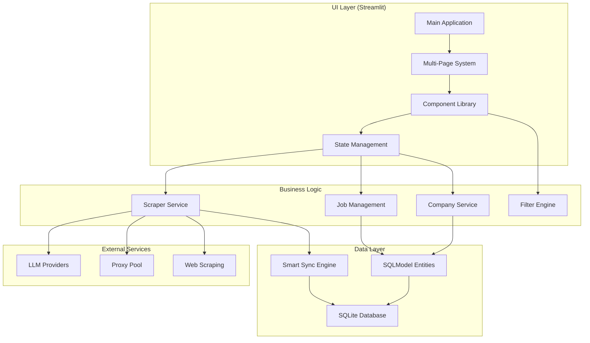

# Technical Architecture & Component Design

> *Last Updated: August 2025*

## 🏗️ System Architecture Overview



## 🎯 Component-Based Architecture

### **Core UI Components Structure**

```text
src/ui/
├── pages/
│   ├── dashboard.py          # Main landing page
│   ├── jobs.py               # Job browsing & filtering
│   ├── companies.py          # Company management
│   ├── scraping.py           # Real-time scraping dashboard
│   └── settings.py           # Configuration & preferences
├── components/
│   ├── __init__.py
│   ├── cards/
│   │   ├── job_card.py       # Individual job display
│   │   ├── company_card.py   # Company status card
│   │   └── stats_card.py     # Dashboard metrics
│   ├── forms/
│   │   ├── add_company.py    # Company addition form
│   │   ├── job_filter.py     # Advanced filtering panel
│   │   └── settings_panel.py # Configuration forms
│   ├── layouts/
│   │   ├── grid.py           # Pinterest-style job grid
│   │   ├── modal.py          # Job detail overlay
│   │   └── sidebar.py        # Navigation & quick filters
│   ├── progress/
│   │   ├── scraping_progress.py  # Multi-level progress
│   │   ├── company_progress.py   # Individual company status
│   │   └── batch_progress.py     # Parallel processing
│   └── widgets/
│       ├── search_bar.py     # Smart search with suggestions
│       ├── filter_chips.py   # Active filter display
│       └── theme_toggle.py   # Light/dark mode switch
├── state/
│   ├── __init__.py
│   ├── app_state.py          # Global application state
│   ├── session_state.py      # Session management utilities
│   └── cache_manager.py      # Performance caching
├── styles/
│   ├── __init__.py
│   ├── themes.py             # Light/dark theme definitions
│   ├── animations.py         # CSS animations & transitions
│   └── components.css        # Component-specific styles
└── utils/
    ├── __init__.py
    ├── background_tasks.py   # Non-blocking operations
    ├── formatters.py         # Data display formatting
    └── validators.py         # Input validation
```

## 🔄 State Management Architecture

### **Centralized State Pattern**

```python

# src/ui/state/app_state.py
@dataclass
class AppState:
    """Global application state management."""
    
    # Core Data
    jobs: list[JobSQL] = field(default_factory=list)
    companies: list[CompanySQL] = field(default_factory=list)
    
    # UI State
    current_page: str = "dashboard"
    active_filters: dict[str, Any] = field(default_factory=dict)
    selected_jobs: set[int] = field(default_factory=set)
    
    # Scraping State
    scraping_active: bool = False
    progress_data: dict[str, ProgressInfo] = field(default_factory=dict)
    
    # Settings
    theme: str = "auto"
    llm_provider: str = "openai"
    max_jobs_per_company: int = 50

class StateManager:
    """Singleton state manager with reactive updates."""
    
    @staticmethod
    def get_state() -> AppState:
        """Get current application state."""
        if "app_state" not in st.session_state:
            st.session_state.app_state = AppState()
        return st.session_state.app_state
    
    @staticmethod
    def update_jobs(jobs: list[JobSQL]) -> None:
        """Update jobs with reactive UI refresh."""
        state = StateManager.get_state()
        state.jobs = jobs
        st.rerun()
    
    @staticmethod
    def set_scraping_progress(company: str, progress: float) -> None:
        """Update scraping progress with live updates."""
        state = StateManager.get_state()
        state.progress_data[company] = ProgressInfo(
            progress=progress, 
            timestamp=datetime.now()
        )
        st.rerun()
```

### **Session State Integration**

```python

# src/ui/state/session_state.py
class SessionStateKeys:
    """Standardized session state keys."""
    APP_STATE = "app_state"
    FILTER_STATE = "filter_state"
    SCRAPING_STATE = "scraping_state"
    UI_PREFERENCES = "ui_preferences"

def initialize_session_state() -> None:
    """Initialize all required session state variables."""
    defaults = {
        SessionStateKeys.APP_STATE: AppState(),
        SessionStateKeys.FILTER_STATE: FilterState(),
        SessionStateKeys.SCRAPING_STATE: ScrapingState(),
        SessionStateKeys.UI_PREFERENCES: UIPreferences()
    }
    
    for key, default_value in defaults.items():
        if key not in st.session_state:
            st.session_state[key] = default_value
```

## 🔌 Enhanced Database Architecture

### **Optimized Models with Relationships**

```python

# src/models.py (Enhanced)
class CompanySQL(SQLModel, table=True):
    """Enhanced company model with metrics."""
    
    id: int | None = Field(default=None, primary_key=True)
    name: str = Field(unique=True, index=True)
    url: str
    active: bool = True
    created_at: datetime = Field(default_factory=datetime.now)
    last_scraped: datetime | None = None
    scrape_count: int = 0
    success_rate: float = 1.0
    
    # Computed properties
    @property
    def job_count(self) -> int:
        """Get current job count for this company."""
        # Implementation via database query

class JobSQL(SQLModel, table=True):
    """Enhanced job model with smart sync support."""
    
    id: int | None = Field(default=None, primary_key=True)
    company_id: int = Field(foreign_key="companysql.id", index=True)
    title: str = Field(index=True)
    description: str
    link: str = Field(unique=True, index=True)
    location: str = Field(index=True)
    posted_date: datetime | None = Field(index=True)
    salary: tuple[int | None, int | None] = Field(
        default=(None, None), sa_column=Column(JSON)
    )
    favorite: bool = False
    notes: str = ""
    
    # Smart sync fields
    created_at: datetime = Field(default_factory=datetime.now)
    updated_at: datetime = Field(default_factory=datetime.now)
    scraped_at: datetime = Field(default_factory=datetime.now)
    content_hash: str = Field(index=True)  # For change detection
    
    # Application tracking
    application_status: str = "not_applied"  # not_applied, applied, interviewed, rejected, offered
    application_date: datetime | None = None

class SyncLogSQL(SQLModel, table=True):
    """Track synchronization operations."""
    
    id: int | None = Field(default=None, primary_key=True)
    sync_session_id: str = Field(index=True)
    operation: str  # insert, update, delete
    table_name: str
    record_id: int
    changes: dict = Field(sa_column=Column(JSON))
    timestamp: datetime = Field(default_factory=datetime.now)
```

### **Smart Synchronization Engine**

```python

# src/services/database_sync.py
class SmartSyncEngine:
    """Intelligent database synchronization with change tracking."""
    
    def __init__(self, session: Session):
        self.session = session
        self.sync_session_id = str(uuid4())
    
    async def sync_scraped_jobs(
        self, 
        company_id: int, 
        scraped_jobs: list[dict]
    ) -> SyncResult:
        """Intelligently sync scraped jobs with existing database."""
        
        # 1. Generate content hashes for comparison
        job_hashes = {
            self._generate_content_hash(job): job 
            for job in scraped_jobs
        }
        
        # 2. Get existing jobs for this company
        existing_jobs = self.session.exec(
            select(JobSQL).where(JobSQL.company_id == company_id)
        ).all()
        
        existing_hashes = {job.content_hash: job for job in existing_jobs}
        
        # 3. Determine operations
        operations = self._analyze_sync_operations(
            job_hashes, existing_hashes
        )
        
        # 4. Execute sync operations
        return await self._execute_sync_operations(
            operations, company_id
        )
    
    def _generate_content_hash(self, job_data: dict) -> str:
        """Generate hash from job content for change detection."""
        content_fields = {
            "title": job_data.get("title", ""),
            "description": job_data.get("description", "")[:500],  # First 500 chars
            "location": job_data.get("location", ""),
            "salary": job_data.get("salary", "")
        }
        content_str = json.dumps(content_fields, sort_keys=True)
        return hashlib.md5(content_str.encode()).hexdigest()
```

## ⚡ Background Task Architecture

### **Non-Blocking Scraping System**

```python

# src/ui/utils/background_tasks.py
class BackgroundTaskManager:
    """Manage long-running tasks without blocking UI."""
    
    def __init__(self):
        self.active_tasks: dict[str, TaskInfo] = {}
        self.task_queue = asyncio.Queue()
    
    async def start_scraping_task(
        self, 
        company_ids: list[int],
        progress_callback: Callable[[str, float], None]
    ) -> str:
        """Start non-blocking scraping task."""
        
        task_id = str(uuid4())
        
        # Create task coroutine
        task_coro = self._execute_scraping_workflow(
            company_ids, progress_callback
        )
        
        # Start background task
        task = asyncio.create_task(task_coro)
        
        self.active_tasks[task_id] = TaskInfo(
            id=task_id,
            task=task,
            status="running",
            started_at=datetime.now()
        )
        
        return task_id
    
    async def _execute_scraping_workflow(
        self,
        company_ids: list[int],
        progress_callback: Callable[[str, float], None]
    ) -> None:
        """Execute the scraping workflow with progress updates."""
        
        for i, company_id in enumerate(company_ids):
            # Update overall progress
            overall_progress = (i / len(company_ids)) * 100
            progress_callback("overall", overall_progress)
            
            # Get company info
            company = self.session.get(CompanySQL, company_id)
            
            # Execute company scraping
            await self._scrape_company_with_progress(
                company, progress_callback
            )
            
        # Final completion
        progress_callback("overall", 100.0)

# Integration with Streamlit
class StreamlitTaskManager:
    """Streamlit-specific task management."""
    
    @staticmethod
    def start_background_scraping(company_ids: list[int]) -> None:
        """Start scraping with Streamlit integration."""
        
        # Progress callback that updates session state
        def update_progress(component: str, progress: float) -> None:
            state = StateManager.get_state()
            state.progress_data[component] = ProgressInfo(
                progress=progress,
                timestamp=datetime.now()
            )
            # Trigger UI update
            st.rerun()
        
        # Start background task
        task_manager = BackgroundTaskManager()
        task_id = asyncio.create_task(
            task_manager.start_scraping_task(
                company_ids, update_progress
            )
        )
        
        # Store task reference in session state
        st.session_state.active_scraping_task = task_id
```

## 🎨 Modern UI Component Architecture

### **Pinterest-Style Grid Component**

```python

# src/ui/components/layouts/grid.py
def render_job_grid(
    jobs: list[JobSQL], 
    columns: int = 3,
    enable_infinite_scroll: bool = True
) -> None:
    """Render Pinterest-style job grid with smooth animations."""
    
    # Configure grid layout
    grid_css = f"""
    <style>
    .job-grid {{
        display: grid;
        grid-template-columns: repeat({columns}, 1fr);
        gap: 1.5rem;
        padding: 1rem;
    }}
    
    .job-card {{
        background: var(--surface-color);
        border-radius: 12px;
        padding: 1.5rem;
        box-shadow: 0 2px 8px rgba(0,0,0,0.1);
        transition: all 0.3s cubic-bezier(0.4, 0, 0.2, 1);
        cursor: pointer;
    }}
    
    .job-card:hover {{
        transform: translateY(-4px);
        box-shadow: 0 8px 24px rgba(0,0,0,0.15);
    }}
    
    .job-card-header {{
        display: flex;
        justify-content: space-between;
        align-items: flex-start;
        margin-bottom: 1rem;
    }}
    
    .favorite-btn {{
        background: none;
        border: none;
        font-size: 1.2rem;
        transition: transform 0.2s ease;
    }}
    
    .favorite-btn:hover {{
        transform: scale(1.2);
    }}
    </style>
    """
    
    st.markdown(grid_css, unsafe_allow_html=True)
    
    # Implement infinite scroll with pagination
    if enable_infinite_scroll:
        jobs_to_show = _handle_infinite_scroll(jobs)
    else:
        jobs_to_show = jobs
    
    # Render grid
    for i in range(0, len(jobs_to_show), columns):
        cols = st.columns(columns)
        for j, col in enumerate(cols):
            if i + j < len(jobs_to_show):
                with col:
                    _render_job_card(jobs_to_show[i + j])

def _render_job_card(job: JobSQL) -> None:
    """Render individual job card with interactions."""
    
    # Card container with click handler
    card_container = st.container()
    
    with card_container:
        # Header with title and favorite button
        header_col1, header_col2 = st.columns([4, 1])
        
        with header_col1:
            st.markdown(f"**{job.title}**")
            st.caption(f"{job.company} • {job.location}")
        
        with header_col2:
            # Favorite toggle with animation
            favorite_icon = "❤️" if job.favorite else "🤍"
            if st.button(favorite_icon, key=f"fav_{job.id}"):
                _toggle_job_favorite(job.id)
        
        # Salary display
        if job.salary and any(job.salary):
            salary_text = format_salary_range(job.salary)
            st.markdown(f"💰 {salary_text}")
        
        # Posted date
        if job.posted_date:
            days_ago = (datetime.now() - job.posted_date).days
            st.caption(f"Posted {days_ago} days ago")
        
        # Quick actions
        action_col1, action_col2 = st.columns(2)
        
        with action_col1:
            if st.button("View Details", key=f"view_{job.id}"):
                _show_job_modal(job)
        
        with action_col2:
            if st.button("Apply", key=f"apply_{job.id}"):
                st.link_button("Apply Now", job.link)
```

### **Real-Time Progress Dashboard**

```python

# src/ui/components/progress/scraping_progress.py
def render_scraping_dashboard() -> None:
    """Render multi-level progress dashboard."""
    
    state = StateManager.get_state()
    
    if not state.scraping_active:
        st.info("No active scraping sessions")
        return
    
    # Overall progress
    st.markdown("### 🚀 Scraping Progress")
    
    overall_progress = _calculate_overall_progress(state.progress_data)
    progress_bar = st.progress(overall_progress / 100)
    
    # Real-time stats
    stats_col1, stats_col2, stats_col3 = st.columns(3)
    
    with stats_col1:
        active_companies = len([
            p for p in state.progress_data.values() 
            if p.progress < 100
        ])
        st.metric("Active Companies", active_companies)
    
    with stats_col2:
        total_jobs_found = sum(p.jobs_found for p in state.progress_data.values())
        st.metric("Jobs Found", total_jobs_found)
    
    with stats_col3:
        avg_speed = _calculate_scraping_speed(state.progress_data)
        st.metric("Speed", f"{avg_speed:.1f} jobs/min")
    
    # Company-level progress
    st.markdown("### 📊 Company Progress")
    
    for company_name, progress_info in state.progress_data.items():
        _render_company_progress(company_name, progress_info)
    
    # Batch processing status
    if hasattr(state, 'batch_progress'):
        st.markdown("### ⚙️ Batch Processing")
        _render_batch_progress(state.batch_progress)

def _render_company_progress(
    company_name: str, 
    progress_info: ProgressInfo
) -> None:
    """Render individual company progress with animations."""
    
    progress_container = st.container()
    
    with progress_container:
        # Company header
        header_col1, header_col2, header_col3 = st.columns([3, 1, 1])
        
        with header_col1:
            status_icon = "✅" if progress_info.progress >= 100 else "🔄"
            st.markdown(f"{status_icon} **{company_name}**")
        
        with header_col2:
            st.caption(f"{progress_info.jobs_found} jobs")
        
        with header_col3:
            st.caption(f"{progress_info.progress:.0f}%")
        
        # Progress bar with color coding
        if progress_info.progress >= 100:
            st.success("Complete", icon="✅")
        elif progress_info.progress > 0:
            progress_bar = st.progress(progress_info.progress / 100)
        else:
            st.info("Starting...", icon="⏳")
        
        # Error handling
        if progress_info.error:
            st.error(f"Error: {progress_info.error}", icon="⚠️")
            if st.button(f"Retry {company_name}", key=f"retry_{company_name}"):
                _retry_company_scraping(company_name)
```

## 🔧 Configuration & Settings Architecture

### **Layered Configuration System**

```python

# src/config/settings.py
class UISettings(BaseSettings):
    """UI-specific configuration."""
    
    theme: str = "auto"
    grid_columns: int = 3
    jobs_per_page: int = 50
    enable_animations: bool = True
    progress_update_interval: int = 1000  # milliseconds
    
class ScrapingSettings(BaseSettings):
    """Scraping configuration."""
    
    max_jobs_per_company: int = 50
    concurrent_companies: int = 3
    batch_size: int = 10
    retry_attempts: int = 3
    proxy_rotation: bool = True
    
class ExportSettings(BaseSettings):
    """Export preferences."""
    
    default_format: str = "csv"
    include_notes: bool = True
    include_favorites_only: bool = False
    date_format: str = "%Y-%m-%d"

class AppConfig:
    """Centralized configuration management."""
    
    def __init__(self):
        self.ui = UISettings()
        self.scraping = ScrapingSettings()
        self.export = ExportSettings()
    
    def save_to_session_state(self) -> None:
        """Persist configuration to session state."""
        st.session_state.app_config = self
    
    @classmethod
    def load_from_session_state(cls) -> "AppConfig":
        """Load configuration from session state."""
        if "app_config" not in st.session_state:
            st.session_state.app_config = cls()
        return st.session_state.app_config
```

## 📈 Performance Optimization Architecture

### **Caching Strategy**

```python

# src/ui/state/cache_manager.py
class CacheManager:
    """Intelligent caching for performance optimization."""
    
    @staticmethod
    @st.cache_data(ttl=300)  # 5 minute cache
    def get_job_stats() -> dict[str, int]:
        """Cache job statistics for dashboard."""
        with get_session() as session:
            total_jobs = session.exec(select(func.count(JobSQL.id))).one()
            favorites = session.exec(
                select(func.count(JobSQL.id)).where(JobSQL.favorite == True)
            ).one()
            companies = session.exec(select(func.count(CompanySQL.id))).one()
            
            return {
                "total_jobs": total_jobs,
                "favorites": favorites,
                "companies": companies
            }
    
    @staticmethod
    @st.cache_data(ttl=60)  # 1 minute cache
    def get_filtered_jobs(filters: dict) -> list[JobSQL]:
        """Cache filtered job results."""
        # Implementation with optimized queries
        
    @staticmethod
    def invalidate_job_cache() -> None:
        """Clear job-related caches after updates."""
        CacheManager.get_job_stats.clear()
        CacheManager.get_filtered_jobs.clear()
```

### **Database Query Optimization**

```python

# src/services/query_optimizer.py
class QueryOptimizer:
    """Optimized database queries with indexing."""
    
    @staticmethod
    def get_jobs_with_filters(
        filters: dict,
        limit: int = 50,
        offset: int = 0
    ) -> list[JobSQL]:
        """Optimized job filtering with indexes."""
        
        query = select(JobSQL)
        
        # Apply filters with indexed columns
        if filters.get("company"):
            query = query.where(JobSQL.company_id.in_(filters["company"]))
        
        if filters.get("salary_min"):
            # Use JSON functions for salary filtering
            query = query.where(
                func.json_extract(JobSQL.salary, "$[0]") >= filters["salary_min"]
            )
        
        if filters.get("posted_after"):
            query = query.where(JobSQL.posted_date >= filters["posted_after"])
        
        if filters.get("search_term"):
            # Full-text search on indexed fields
            search_term = f"%{filters['search_term']}%"
            query = query.where(
                or_(
                    JobSQL.title.like(search_term),
                    JobSQL.description.like(search_term),
                    JobSQL.location.like(search_term)
                )
            )
        
        # Order by relevance and date
        query = query.order_by(
            JobSQL.posted_date.desc(),
            JobSQL.created_at.desc()
        )
        
        # Apply pagination
        query = query.offset(offset).limit(limit)
        
        return query
```

## 🔄 Migration & Deployment Architecture

### **Database Migration System**

```python

# src/migrations/migration_manager.py
class MigrationManager:
    """Handle database schema migrations."""
    
    def __init__(self, engine: Engine):
        self.engine = engine
        
    def run_migrations(self) -> None:
        """Execute pending migrations."""
        current_version = self._get_current_version()
        target_version = self._get_target_version()
        
        if current_version < target_version:
            self._execute_migrations(current_version, target_version)
    
    def _execute_migrations(self, from_version: int, to_version: int) -> None:
        """Execute migrations between versions."""
        migrations = [
            (1, self._migration_001_add_foreign_keys),
            (2, self._migration_002_add_sync_fields),
            (3, self._migration_003_add_application_tracking),
        ]
        
        for version, migration_func in migrations:
            if from_version < version <= to_version:
                migration_func()
                self._update_version(version)
```

This technical architecture provides a robust foundation for the modernized AI job scraper, emphasizing component reusability, performance optimization, and maintainable code structure while supporting all UI requirements identified in the research phase.
