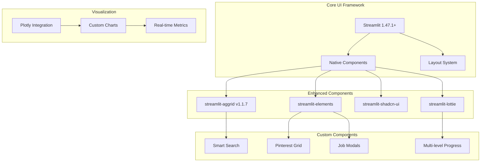

# UI Implementation Plan - Modern Streamlit Components

> *Last Updated: August 2025*

## 🎯 Implementation Overview

Transform the basic Streamlit interface into a modern, component-based UI system that delivers exceptional user experience while maintaining Streamlit's simplicity. Focus on Pinterest-style layouts, real-time progress tracking, and smooth interactions.

## 🧩 Component Library Strategy

### **Modern Streamlit Ecosystem Integration**



## 📱 Page Architecture & Navigation

### **Multi-Page Application Structure**

```python

# src/ui/main.py
import streamlit as st
from src.ui.pages import dashboard, jobs, companies, scraping, settings
from src.ui.state import StateManager, initialize_session_state
from src.ui.components.layouts.sidebar import render_navigation

def main():
    """Main application entry point with modern page routing."""
    
    # Configure page
    st.set_page_config(
        page_title="AI Job Scraper",
        page_icon="🔍",
        layout="wide",
        initial_sidebar_state="expanded"
    )
    
    # Initialize session state
    initialize_session_state()
    
    # Load custom CSS and themes
    load_custom_styles()
    
    # Render navigation
    current_page = render_navigation()
    
    # Route to appropriate page
    page_map = {
        "Dashboard": dashboard.render,
        "Jobs": jobs.render,
        "Companies": companies.render,
        "Scraping": scraping.render,
        "Settings": settings.render
    }
    
    if current_page in page_map:
        page_map[current_page]()
    else:
        dashboard.render()  # Default fallback

def load_custom_styles():
    """Load custom CSS for modern UI components."""
    
    css = """
    <style>
    /* Modern theme variables */
    :root {
        --primary-color: #1f77b4;
        --secondary-color: #ff7f0e;
        --success-color: #2ca02c;
        --warning-color: #ff9800;
        --error-color: #d62728;
        --surface-color: #ffffff;
        --surface-dark: #1e1e1e;
        --text-primary: #333333;
        --text-secondary: #666666;
        --border-radius: 8px;
        --box-shadow: 0 2px 8px rgba(0,0,0,0.1);
        --transition: all 0.3s cubic-bezier(0.4, 0, 0.2, 1);
    }
    
    /* Dark theme overrides */
    [data-theme="dark"] {
        --surface-color: #1e1e1e;
        --text-primary: #ffffff;
        --text-secondary: #cccccc;
        --box-shadow: 0 2px 8px rgba(0,0,0,0.3);
    }
    
    /* Hide Streamlit default elements */
    #MainMenu {visibility: hidden;}
    footer {visibility: hidden;}
    header {visibility: hidden;}
    
    /* Modern card styling */
    .stContainer > div {
        background: var(--surface-color);
        border-radius: var(--border-radius);
        box-shadow: var(--box-shadow);
        transition: var(--transition);
    }
    
    /* Smooth animations */
    .stButton > button {
        transition: var(--transition);
        border-radius: var(--border-radius);
    }
    
    .stButton > button:hover {
        transform: translateY(-2px);
        box-shadow: 0 4px 12px rgba(0,0,0,0.15);
    }
    
    /* Progress bar styling */
    .stProgress > div > div {
        background: linear-gradient(90deg, var(--primary-color), var(--secondary-color));
        border-radius: var(--border-radius);
    }
    
    /* Grid layout utilities */
    .job-grid {
        display: grid;
        gap: 1.5rem;
        padding: 1rem;
    }
    
    .job-card {
        background: var(--surface-color);
        border-radius: var(--border-radius);
        padding: 1.5rem;
        box-shadow: var(--box-shadow);
        transition: var(--transition);
        cursor: pointer;
        border: 1px solid rgba(0,0,0,0.1);
    }
    
    .job-card:hover {
        transform: translateY(-4px);
        box-shadow: 0 8px 24px rgba(0,0,0,0.15);
    }
    
    /* Responsive grid */
    @media (min-width: 768px) {
        .job-grid { grid-template-columns: repeat(2, 1fr); }
    }
    
    @media (min-width: 1200px) {
        .job-grid { grid-template-columns: repeat(3, 1fr); }
    }
    
    @media (min-width: 1600px) {
        .job-grid { grid-template-columns: repeat(4, 1fr); }
    }
    </style>
    """
    
    st.markdown(css, unsafe_allow_html=True)
```

## 🏠 Dashboard Implementation

### **Modern Dashboard with Stats Cards**

```python

# src/ui/pages/dashboard.py
import streamlit as st
import plotly.express as px
from src.ui.components.cards import render_stats_card, render_activity_feed
from src.ui.components.charts import render_job_trends, render_company_performance
from src.services.optimized_queries import OptimizedJobQueries

def render():
    """Render modern dashboard with real-time statistics."""
    
    st.title("🎯 Job Hunt Dashboard")
    
    # Hero stats section
    render_hero_stats()
    
    # Charts and analytics
    col1, col2 = st.columns([2, 1])
    
    with col1:
        render_job_trends_chart()
        render_recent_jobs_grid()
    
    with col2:
        render_activity_feed()
        render_quick_actions()

def render_hero_stats():
    """Render animated statistics cards."""
    
    # Get cached statistics
    stats = OptimizedJobQueries.get_job_statistics()
    
    # Create responsive columns
    col1, col2, col3, col4 = st.columns(4)
    
    with col1:
        render_stats_card(
            title="Total Jobs",
            value=stats["total_jobs"],
            delta=f"+{stats.get('jobs_today', 0)} today",
            icon="📊",
            color="primary"
        )
    
    with col2:
        render_stats_card(
            title="Favorites",
            value=stats["favorites"],
            delta=f"{(stats['favorites']/stats['total_jobs']*100):.1f}% of total",
            icon="❤️",
            color="secondary"
        )
    
    with col3:
        render_stats_card(
            title="This Week",
            value=stats["recent_jobs"],
            delta="Fresh opportunities",
            icon="🚀",
            color="success"
        )
    
    with col4:
        render_stats_card(
            title="Companies",
            value=stats["active_companies"],
            delta="Active sources",
            icon="🏢",
            color="info"
        )

def render_job_trends_chart():
    """Render interactive job posting trends."""
    
    st.subheader("📈 Job Posting Trends")
    
    # Get trend data
    trend_data = OptimizedJobQueries.get_job_trends(days=30)
    
    if trend_data:
        # Create Plotly chart
        fig = px.line(
            trend_data,
            x="date",
            y="job_count",
            color="company",
            title="Jobs Posted Over Time",
            hover_data=["company", "job_count"]
        )
        
        fig.update_layout(
            showlegend=True,
            height=400,
            margin=dict(l=0, r=0, t=40, b=0)
        )
        
        st.plotly_chart(fig, use_container_width=True)
    else:
        st.info("No trend data available yet. Start scraping to see trends!")

def render_recent_jobs_grid():
    """Render recent jobs in a Pinterest-style grid."""
    
    st.subheader("🔥 Latest Opportunities")
    
    # Get recent jobs
    recent_jobs = OptimizedJobQueries.get_filtered_jobs(
        filters={"days": 7},
        limit=6,
        sort_by="posted_date"
    )[0]
    
    if recent_jobs:
        # Render in responsive grid
        cols_per_row = 3
        for i in range(0, len(recent_jobs), cols_per_row):
            cols = st.columns(cols_per_row)
            for j, col in enumerate(cols):
                if i + j < len(recent_jobs):
                    with col:
                        render_compact_job_card(recent_jobs[i + j])
    else:
        st.info("No recent jobs found. Check your company settings!")
```

## 💼 Advanced Job Browser

### **Pinterest-Style Job Grid with Filtering**

```python

# src/ui/pages/jobs.py
import streamlit as st
from streamlit_aggrid import AgGrid, GridOptionsBuilder
from src.ui.components.forms.job_filter import render_advanced_filters
from src.ui.components.layouts.grid import render_job_grid
from src.ui.components.modals.job_detail import show_job_modal
from src.services.optimized_queries import OptimizedJobQueries

def render():
    """Render advanced job browser with filtering and search."""
    
    st.title("💼 Job Browser")
    
    # Search and filter section
    render_search_and_filters()
    
    # View toggle (Grid vs List)
    view_mode = render_view_toggle()
    
    # Results section
    if view_mode == "grid":
        render_grid_view()
    else:
        render_list_view()

def render_search_and_filters():
    """Render smart search bar and filter panel."""
    
    # Search bar with suggestions
    search_col, filter_col = st.columns([3, 1])
    
    with search_col:
        search_term = st.text_input(
            "",
            placeholder="🔍 Search jobs, companies, or skills...",
            key="job_search",
            help="Search across job titles, descriptions, companies, and locations"
        )
        
        # Smart search suggestions
        if search_term and len(search_term) >= 2:
            suggestions = get_search_suggestions(search_term)
            if suggestions:
                st.caption("💡 " + " • ".join(suggestions[:3]))
    
    with filter_col:
        if st.button("🎛️ Advanced Filters", use_container_width=True):
            st.session_state.show_filters = not st.session_state.get("show_filters", False)
    
    # Expandable filter panel
    if st.session_state.get("show_filters", False):
        with st.expander("🎯 Filter Options", expanded=True):
            filters = render_advanced_filters()
            st.session_state.current_filters = filters

def render_view_toggle():
    """Render view mode toggle (Grid/List)."""
    
    col1, col2, col3 = st.columns([1, 1, 4])
    
    with col1:
        grid_active = st.button("📱 Grid", use_container_width=True)
    
    with col2:
        list_active = st.button("📋 List", use_container_width=True)
    
    # Determine active view
    if grid_active:
        st.session_state.view_mode = "grid"
    elif list_active:
        st.session_state.view_mode = "list"
    
    return st.session_state.get("view_mode", "grid")

def render_grid_view():
    """Render Pinterest-style job grid."""
    
    # Get filtered jobs
    filters = st.session_state.get("current_filters", {})
    search_term = st.session_state.get("job_search", "")
    
    if search_term:
        filters["search_term"] = search_term
    
    # Pagination controls
    page_size = 12
    current_page = st.session_state.get("current_page", 0)
    
    jobs, total_count = OptimizedJobQueries.get_filtered_jobs(
        filters=filters,
        limit=page_size,
        offset=current_page * page_size
    )
    
    # Results header
    col1, col2 = st.columns([3, 1])
    
    with col1:
        st.caption(f"Found {total_count} jobs")
        if filters:
            active_filters = [f for f, v in filters.items() if v]
            if active_filters:
                st.caption(f"🎯 Active filters: {', '.join(active_filters)}")
    
    with col2:
        sort_option = st.selectbox(
            "Sort by",
            ["Most Recent", "Company", "Salary (High)", "Relevance"],
            key="sort_option"
        )
    
    # Render job grid
    if jobs:
        render_job_grid(jobs, enable_infinite_scroll=True)
        
        # Pagination
        render_pagination(current_page, total_count, page_size)
    else:
        render_empty_state(filters)

def render_list_view():
    """Render jobs in a data table format using AgGrid."""
    
    # Get filtered jobs
    filters = st.session_state.get("current_filters", {})
    search_term = st.session_state.get("job_search", "")
    
    if search_term:
        filters["search_term"] = search_term
    
    jobs, total_count = OptimizedJobQueries.get_filtered_jobs(
        filters=filters,
        limit=100  # More for table view
    )
    
    if jobs:
        # Prepare data for AgGrid
        job_data = [
            {
                "Title": job.title,
                "Company": job.company.name if hasattr(job, 'company') else "Unknown",
                "Location": job.location,
                "Salary": format_salary_range(job.salary),
                "Posted": format_relative_date(job.posted_date),
                "Favorite": "❤️" if job.favorite else "🤍",
                "Status": job.application_status.replace("_", " ").title(),
                "Link": job.link
            }
            for job in jobs
        ]
        
        # Configure AgGrid
        gb = GridOptionsBuilder.from_dataframe(pd.DataFrame(job_data))
        gb.configure_pagination(paginationAutoPageSize=True)
        gb.configure_selection("single", use_checkbox=False)
        gb.configure_column("Link", hide=True)
        gb.configure_column("Favorite", width=80)
        gb.configure_column("Title", width=300)
        gb.configure_column("Company", width=200)
        
        grid_options = gb.build()
        
        # Render grid
        grid_response = AgGrid(
            job_data,
            gridOptions=grid_options,
            height=600,
            width="100%",
            theme="material"
        )
        
        # Handle selection
        if grid_response["selected_rows"]:
            selected_job = next(
                job for job in jobs 
                if job.link == grid_response["selected_rows"][0]["Link"]
            )
            show_job_modal(selected_job)
    else:
        render_empty_state(filters)
```

## 🏢 Company Management Interface

### **Modern Company Cards with Status Indicators**

```python

# src/ui/pages/companies.py
import streamlit as st
from src.ui.components.cards.company_card import render_company_card
from src.ui.components.forms.add_company import render_add_company_form
from src.ui.components.modals.company_test import show_company_test_modal
from src.services.company_service import CompanyService

def render():
    """Render modern company management interface."""
    
    st.title("🏢 Company Management")
    
    # Header with quick actions
    render_company_header()
    
    # Company grid
    render_company_grid()
    
    # Add company form (collapsible)
    render_add_company_section()

def render_company_header():
    """Render header with company statistics and actions."""
    
    col1, col2, col3, col4 = st.columns([2, 1, 1, 1])
    
    with col1:
        company_stats = CompanyService.get_company_statistics()
        st.metric(
            "Active Companies",
            company_stats["active_count"],
            delta=f"{company_stats['success_rate']:.1f}% success rate"
        )
    
    with col2:
        if st.button("➕ Add Company", use_container_width=True):
            st.session_state.show_add_company = True
    
    with col3:
        if st.button("🔄 Test All", use_container_width=True):
            test_all_companies()
    
    with col4:
        if st.button("📊 Analytics", use_container_width=True):
            st.session_state.show_analytics = True

def render_company_grid():
    """Render companies in a responsive grid layout."""
    
    companies = CompanyService.get_all_companies()
    
    if not companies:
        render_empty_company_state()
        return
    
    # Responsive columns based on screen size
    cols_per_row = min(3, len(companies))
    
    for i in range(0, len(companies), cols_per_row):
        cols = st.columns(cols_per_row)
        
        for j, col in enumerate(cols):
            if i + j < len(companies):
                with col:
                    render_company_card(companies[i + j])

def render_empty_company_state():
    """Render empty state with call-to-action."""
    
    st.markdown("""
    <div style="text-align: center; padding: 4rem 2rem;">
        <h2>🏢 No Companies Added Yet</h2>
        <p>Start by adding companies you're interested in working for.</p>
        <p>We'll automatically find their careers pages and scrape job opportunities.</p>
    </div>
    """, unsafe_allow_html=True)
    
    if st.button("➕ Add Your First Company", use_container_width=True):
        st.session_state.show_add_company = True

# Company Card Component

# src/ui/components/cards/company_card.py
def render_company_card(company: CompanySQL):
    """Render individual company card with status and actions."""
    
    card_container = st.container()
    
    with card_container:
        # Company header
        header_col1, header_col2 = st.columns([3, 1])
        
        with header_col1:
            # Company name with status indicator
            status_icon = get_company_status_icon(company)
            st.markdown(f"{status_icon} **{company.name}**")
            
            # Company metrics
            job_count = CompanyService.get_job_count(company.id)
            last_scraped = format_relative_date(company.last_scraped)
            st.caption(f"{job_count} jobs • Last scraped {last_scraped}")
        
        with header_col2:
            # Active toggle
            if st.toggle("Active", value=company.active, key=f"active_{company.id}"):
                CompanyService.update_company(company.id, {"active": True})
            else:
                CompanyService.update_company(company.id, {"active": False})
        
        # Company URL
        st.caption(f"🔗 {company.url}")
        
        # Success rate progress bar
        if company.scrape_count > 0:
            st.progress(
                company.success_rate, 
                text=f"Success Rate: {company.success_rate:.1f}%"
            )
        
        # Action buttons
        action_col1, action_col2, action_col3 = st.columns(3)
        
        with action_col1:
            if st.button("🧪 Test", key=f"test_{company.id}"):
                show_company_test_modal(company)
        
        with action_col2:
            if st.button("📊 Jobs", key=f"jobs_{company.id}"):
                navigate_to_company_jobs(company.id)
        
        with action_col3:
            if st.button("⚙️ Edit", key=f"edit_{company.id}"):
                show_edit_company_modal(company)

def get_company_status_icon(company: CompanySQL) -> str:
    """Get status icon based on company health."""
    
    if not company.active:
        return "⏸️"  # Paused
    elif company.success_rate > 0.8:
        return "✅"  # Healthy
    elif company.success_rate > 0.5:
        return "⚠️"  # Warning
    else:
        return "❌"  # Error
```

## 🚀 Real-Time Scraping Dashboard

### **Multi-Level Progress Tracking**

```python

# src/ui/pages/scraping.py
import streamlit as st
import time
from streamlit_lottie import st_lottie
from src.ui.components.progress import render_scraping_progress
from src.ui.utils.background_tasks import StreamlitTaskManager
from src.services.scraper_service import ScraperService

def render():
    """Render real-time scraping dashboard."""
    
    st.title("🚀 Scraping Control Center")
    
    # Scraping controls
    render_scraping_controls()
    
    # Live progress dashboard
    render_live_progress()
    
    # Recent scraping history
    render_scraping_history()

def render_scraping_controls():
    """Render scraping start/stop controls."""
    
    col1, col2, col3, col4 = st.columns([2, 1, 1, 1])
    
    with col1:
        # Company selection
        companies = CompanyService.get_active_companies()
        selected_companies = st.multiselect(
            "Companies to Scrape",
            options=[c.id for c in companies],
            format_func=lambda x: next(c.name for c in companies if c.id == x),
            default=[c.id for c in companies],
            help="Select which companies to include in scraping"
        )
    
    with col2:
        # Scraping mode
        scraping_mode = st.selectbox(
            "Mode",
            ["Quick", "Thorough", "Custom"],
            help="Quick: Basic job extraction, Thorough: Detailed analysis"
        )
    
    with col3:
        # Start/Stop button
        is_scraping = st.session_state.get("scraping_active", False)
        
        if is_scraping:
            if st.button("⏹️ Stop", type="secondary", use_container_width=True):
                stop_scraping()
        else:
            if st.button("▶️ Start Scraping", type="primary", use_container_width=True):
                start_scraping(selected_companies, scraping_mode)
    
    with col4:
        # Settings button
        if st.button("⚙️ Settings", use_container_width=True):
            show_scraping_settings()

def render_live_progress():
    """Render real-time progress visualization."""
    
    if not st.session_state.get("scraping_active", False):
        st.info("No active scraping session. Select companies and click 'Start Scraping' to begin.")
        return
    
    # Overall progress section
    st.subheader("📊 Overall Progress")
    
    progress_data = st.session_state.get("progress_data", {})
    
    if progress_data:
        # Calculate overall progress
        overall_progress = calculate_overall_progress(progress_data)
        
        # Progress bar with animation
        progress_bar = st.progress(overall_progress / 100)
        
        # Real-time metrics
        metrics_col1, metrics_col2, metrics_col3, metrics_col4 = st.columns(4)
        
        with metrics_col1:
            active_companies = len([p for p in progress_data.values() if p.progress < 100])
            st.metric("Active", active_companies)
        
        with metrics_col2:
            total_jobs = sum(p.jobs_found for p in progress_data.values())
            st.metric("Jobs Found", total_jobs)
        
        with metrics_col3:
            avg_speed = calculate_scraping_speed(progress_data)
            st.metric("Speed", f"{avg_speed:.1f}/min")
        
        with metrics_col4:
            eta = calculate_eta(progress_data)
            st.metric("ETA", eta)
    
    # Company-level progress
    st.subheader("🏢 Company Progress")
    render_company_progress_grid()
    
    # Batch processing status
    if st.session_state.get("batch_progress"):
        st.subheader("⚙️ Processing Batches")
        render_batch_progress()

def render_company_progress_grid():
    """Render individual company progress cards."""
    
    progress_data = st.session_state.get("progress_data", {})
    
    if not progress_data:
        return
    
    # Arrange in responsive grid
    companies_per_row = min(3, len(progress_data))
    company_items = list(progress_data.items())
    
    for i in range(0, len(company_items), companies_per_row):
        cols = st.columns(companies_per_row)
        
        for j, col in enumerate(cols):
            if i + j < len(company_items):
                company_name, progress_info = company_items[i + j]
                
                with col:
                    render_company_progress_card(company_name, progress_info)

def render_company_progress_card(company_name: str, progress_info):
    """Render individual company progress card."""
    
    card_container = st.container()
    
    with card_container:
        # Company header
        status_icon = "✅" if progress_info.progress >= 100 else "🔄"
        st.markdown(f"{status_icon} **{company_name}**")
        
        # Progress details
        col1, col2 = st.columns([2, 1])
        
        with col1:
            # Progress bar
            if progress_info.progress >= 100:
                st.success("Complete!")
            elif progress_info.progress > 0:
                st.progress(
                    progress_info.progress / 100,
                    text=f"{progress_info.progress:.0f}%"
                )
            else:
                # Loading animation
                st_lottie(
                    load_lottie_animation("loading"),
                    height=40,
                    key=f"loading_{company_name}"
                )
        
        with col2:
            st.metric("Jobs", progress_info.jobs_found)
        
        # Status and timing
        if progress_info.error:
            st.error(f"Error: {progress_info.error}", icon="⚠️")
            if st.button(f"Retry", key=f"retry_{company_name}"):
                retry_company(company_name)
        else:
            elapsed = (datetime.now() - progress_info.start_time).total_seconds()
            st.caption(f"Elapsed: {format_duration(elapsed)}")

def start_scraping(company_ids: list[int], mode: str):
    """Start background scraping with progress tracking."""
    
    # Initialize progress tracking
    st.session_state.scraping_active = True
    st.session_state.progress_data = {}
    st.session_state.scraping_start_time = datetime.now()
    
    # Configure scraping based on mode
    config = get_scraping_config(mode)
    
    # Start background task
    task_id = StreamlitTaskManager.start_background_scraping(
        company_ids=company_ids,
        config=config
    )
    
    st.session_state.active_scraping_task = task_id
    
    # Success message
    st.success(f"Started scraping {len(company_ids)} companies in {mode} mode!")
    
    # Auto-refresh for progress updates
    time.sleep(1)
    st.rerun()
```

## ⚙️ Settings & Configuration

### **Modern Settings Panel with Live Validation**

```python

# src/ui/pages/settings.py
import streamlit as st
from src.ui.components.forms.settings_form import render_settings_form
from src.config.settings import AppConfig

def render():
    """Render comprehensive settings interface."""
    
    st.title("⚙️ Settings & Configuration")
    
    # Settings categories
    tab1, tab2, tab3, tab4 = st.tabs([
        "🔑 API & Providers",
        "🎨 UI & Theme",
        "🚀 Scraping",
        "📊 Export & Data"
    ])
    
    with tab1:
        render_api_settings()
    
    with tab2:
        render_ui_settings()
    
    with tab3:
        render_scraping_settings()
    
    with tab4:
        render_export_settings()

def render_api_settings():
    """Render API keys and provider settings."""
    
    st.subheader("🔑 API Configuration")
    
    # LLM Provider Toggle
    col1, col2 = st.columns(2)
    
    with col1:
        current_provider = st.session_state.get("llm_provider", "openai")
        
        provider = st.radio(
            "LLM Provider",
            ["openai", "groq"],
            index=0 if current_provider == "openai" else 1,
            format_func=lambda x: "OpenAI (GPT-4)" if x == "openai" else "Groq (Llama)"
        )
        
        if provider != current_provider:
            st.session_state.llm_provider = provider
            st.rerun()
    
    with col2:
        # Provider status indicator
        if provider == "openai":
            api_key = st.text_input(
                "OpenAI API Key",
                value=get_masked_api_key("openai"),
                type="password",
                help="Your OpenAI API key for GPT-4 access"
            )
            
            if api_key and api_key != get_masked_api_key("openai"):
                if validate_openai_key(api_key):
                    st.success("✅ API key validated successfully")
                    save_api_key("openai", api_key)
                else:
                    st.error("❌ Invalid API key")
        
        else:  # Groq
            api_key = st.text_input(
                "Groq API Key",
                value=get_masked_api_key("groq"),
                type="password",
                help="Your Groq API key for Llama access"
            )
            
            if api_key and api_key != get_masked_api_key("groq"):
                if validate_groq_key(api_key):
                    st.success("✅ API key validated successfully")
                    save_api_key("groq", api_key)
                else:
                    st.error("❌ Invalid API key")
    
    # Test connection
    if st.button("🧪 Test Connection"):
        test_llm_connection(provider)

def render_ui_settings():
    """Render UI customization options."""
    
    st.subheader("🎨 User Interface")
    
    # Theme selection
    col1, col2 = st.columns(2)
    
    with col1:
        theme = st.selectbox(
            "Theme",
            ["auto", "light", "dark"],
            format_func=lambda x: x.title(),
            help="Choose your preferred theme"
        )
        
        if theme != st.session_state.get("theme", "auto"):
            st.session_state.theme = theme
            update_theme(theme)
    
    with col2:
        # Grid density
        grid_columns = st.slider(
            "Grid Columns",
            min_value=2,
            max_value=5,
            value=st.session_state.get("grid_columns", 3),
            help="Number of columns in job grid view"
        )
        
        if grid_columns != st.session_state.get("grid_columns", 3):
            st.session_state.grid_columns = grid_columns
    
    # Animation preferences
    enable_animations = st.checkbox(
        "Enable Animations",
        value=st.session_state.get("enable_animations", True),
        help="Enable smooth transitions and animations"
    )
    
    # Jobs per page
    jobs_per_page = st.number_input(
        "Jobs per Page",
        min_value=10,
        max_value=100,
        value=st.session_state.get("jobs_per_page", 50),
        step=10,
        help="Number of jobs to display per page"
    )

def render_scraping_settings():
    """Render scraping configuration options."""
    
    st.subheader("🚀 Scraping Configuration")
    
    # Performance settings
    col1, col2 = st.columns(2)
    
    with col1:
        max_jobs_per_company = st.number_input(
            "Max Jobs per Company",
            min_value=10,
            max_value=500,
            value=st.session_state.get("max_jobs_per_company", 50),
            step=10,
            help="Maximum number of jobs to scrape from each company"
        )
        
        concurrent_companies = st.number_input(
            "Concurrent Companies",
            min_value=1,
            max_value=10,
            value=st.session_state.get("concurrent_companies", 3),
            help="Number of companies to scrape simultaneously"
        )
    
    with col2:
        batch_size = st.number_input(
            "Processing Batch Size",
            min_value=5,
            max_value=50,
            value=st.session_state.get("batch_size", 10),
            help="Number of jobs to process in each batch"
        )
        
        retry_attempts = st.number_input(
            "Retry Attempts",
            min_value=1,
            max_value=5,
            value=st.session_state.get("retry_attempts", 3),
            help="Number of retry attempts for failed requests"
        )
    
    # Proxy settings
    st.subheader("🌐 Proxy Configuration")
    
    use_proxies = st.checkbox(
        "Enable Proxy Rotation",
        value=st.session_state.get("use_proxies", True),
        help="Use proxy pool to avoid rate limiting"
    )
    
    if use_proxies:
        proxy_pool_size = st.number_input(
            "Proxy Pool Size",
            min_value=1,
            max_value=20,
            value=st.session_state.get("proxy_pool_size", 5),
            help="Number of proxies in rotation pool"
        )
```

This implementation plan provides a comprehensive blueprint for creating a modern, responsive Streamlit interface that delivers exceptional user experience while maintaining performance and scalability.
