# Development Roadmap - 4-Phase Implementation

> *Last Updated: August 2025*

## 🎯 Roadmap Overview

Structured 8-week development plan to transform the AI job scraper from a basic Streamlit app into a modern, feature-rich job hunting platform. Each phase builds incrementally while delivering value at every stage.

## 📅 Phase Timeline

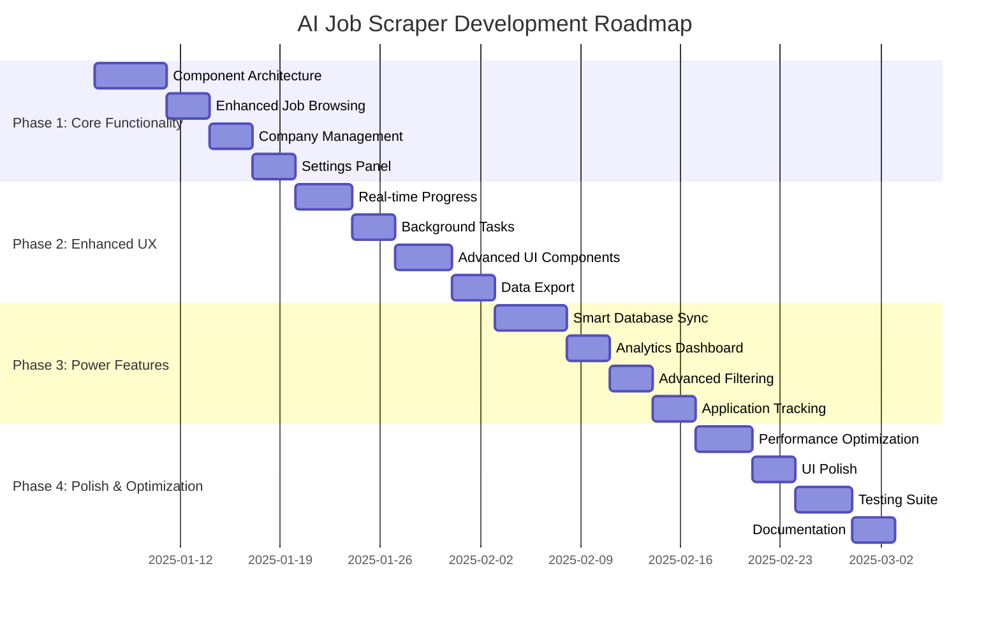

## 🚀 Phase 1: Core Functionality (Weeks 1-2)

**Goal**: Establish solid foundation with component-based architecture and essential features.

### **Week 1: Architecture & Foundation**

#### **Day 1-2: Component-Based Architecture**

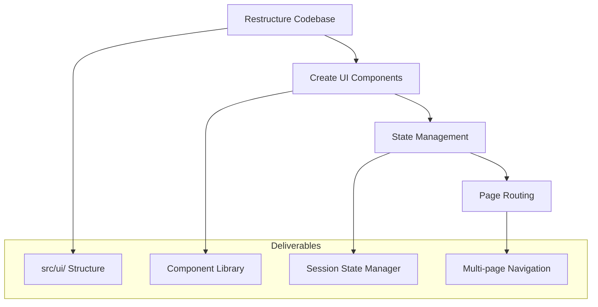

**Tasks:**

- [ ] Create `src/ui/` directory structure with pages, components, state, styles

- [ ] Implement `StateManager` for centralized state management

- [ ] Build reusable component base classes

- [ ] Set up multi-page navigation with `st.navigation`

- [ ] Create custom CSS theme system with light/dark mode support

**Deliverables:**

- ✅ Component-based UI architecture

- ✅ Centralized state management

- ✅ Multi-page navigation system

- ✅ Theme system with CSS variables

#### **Day 3-5: Enhanced Job Browsing**

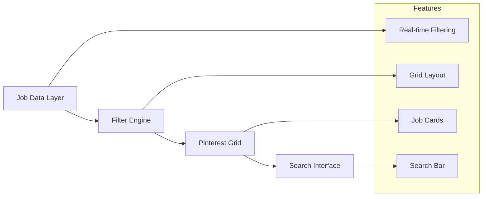

**Tasks:**

- [ ] Implement optimized job queries with indexing

- [ ] Build Pinterest-style responsive grid layout

- [ ] Create job card component with hover effects

- [ ] Add instant search with auto-complete

- [ ] Implement real-time filtering without page reload

**Deliverables:**

- ✅ Responsive job grid with 2-4 columns

- ✅ Interactive job cards with hover animations

- ✅ Instant search and filtering

- ✅ Basic pagination support

### **Week 2: Company Management & Settings**

#### **Day 6-8: Company Management Interface**

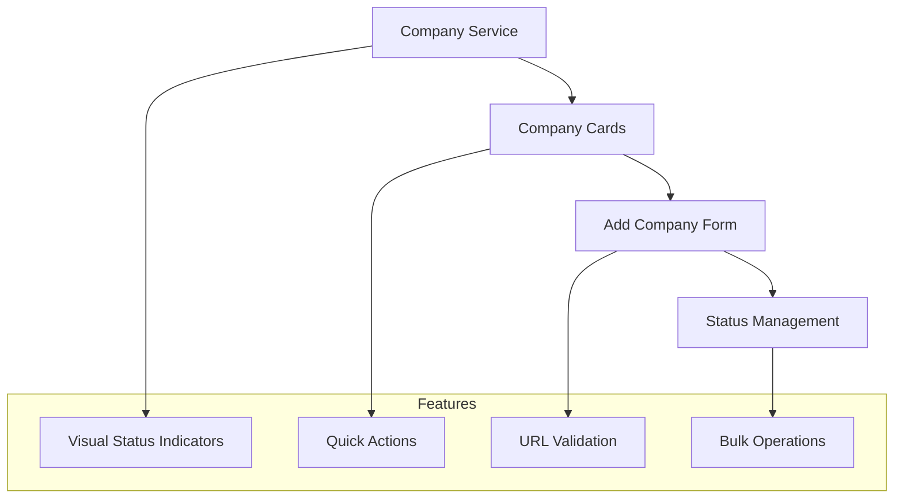

**Tasks:**

- [ ] Design company card components with status indicators

- [ ] Build add company form with URL validation

- [ ] Implement company health monitoring

- [ ] Add bulk company operations (activate/deactivate)

- [ ] Create company testing functionality

**Deliverables:**

- ✅ Modern company management interface

- ✅ Visual health indicators (✅ ⚠️ ❌)

- ✅ Smart company addition with validation

- ✅ Bulk operation support

#### **Day 9-14: Essential Settings Panel**

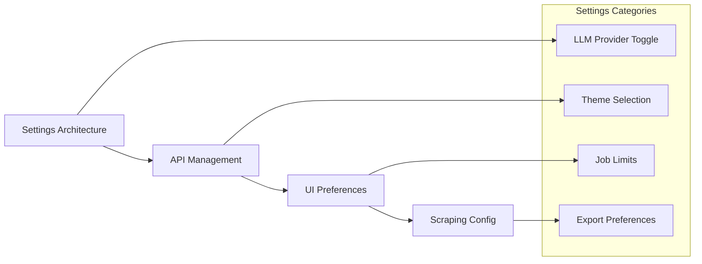

**Tasks:**

- [ ] Build tabbed settings interface

- [ ] Implement LLM provider switching (OpenAI ↔ Groq)

- [ ] Add API key management with validation

- [ ] Create UI preference controls (theme, grid columns)

- [ ] Build scraping configuration panel

**Deliverables:**

- ✅ Comprehensive settings interface

- ✅ Real-time LLM provider switching

- ✅ API key validation and testing

- ✅ Persistent user preferences

### **Phase 1 Success Criteria:**

- [ ] Complete component-based architecture

- [ ] Functional job browsing with search/filter

- [ ] Working company management

- [ ] Essential settings configuration

- [ ] All core workflows operational

---

## ⚡ Phase 2: Enhanced UX (Weeks 3-4)

**Goal**: Add real-time features, advanced UI components, and background processing.

### **Week 3: Real-Time Progress & Background Tasks**

#### **Day 15-18: Real-Time Progress Dashboard**

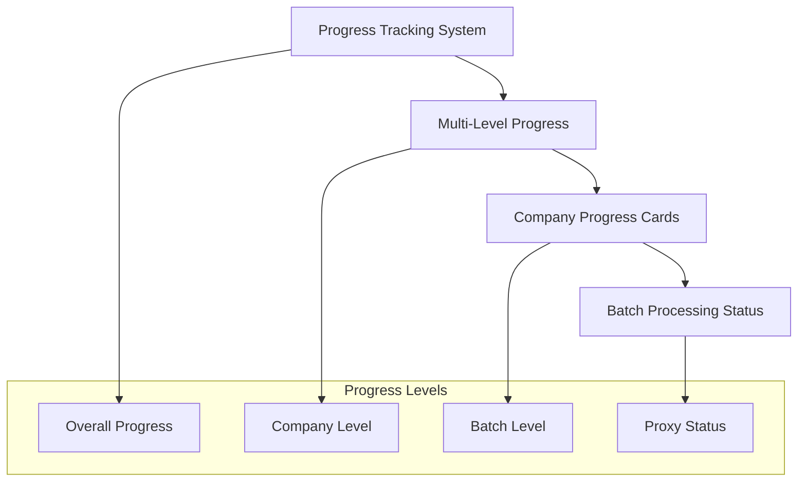

**Tasks:**

- [ ] Design progress tracking data structures

- [ ] Build multi-level progress visualization

- [ ] Create animated company progress cards

- [ ] Add real-time job count updates

- [ ] Implement ETA calculations

**Deliverables:**

- ✅ Real-time scraping dashboard

- ✅ Multi-level progress tracking

- ✅ Animated progress indicators

- ✅ Live job discovery counters

#### **Day 19-21: Background Task System**

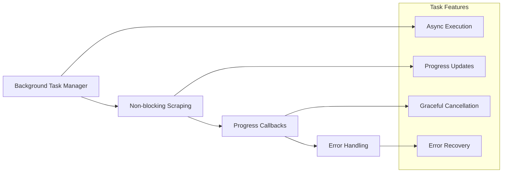

**Tasks:**

- [ ] Implement async background task system

- [ ] Create progress callback mechanisms

- [ ] Add task cancellation support

- [ ] Build error handling and retry logic

- [ ] Integrate with Streamlit session state

**Deliverables:**

- ✅ Non-blocking scraping execution

- ✅ Real-time progress updates

- ✅ Task cancellation support

- ✅ Robust error handling

### **Week 4: Advanced UI Components & Export**

#### **Day 22-25: Advanced UI Components**

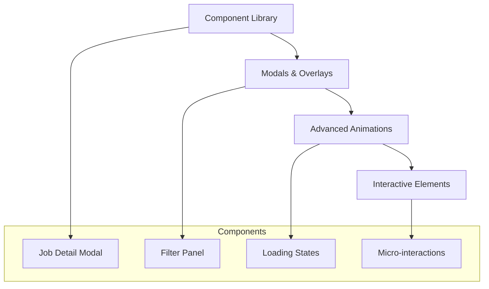

**Tasks:**

- [ ] Build job detail modal with smooth transitions

- [ ] Create sliding filter panel

- [ ] Add loading states and skeleton screens

- [ ] Implement micro-interactions and hover effects

- [ ] Add Lottie animations for progress indicators

**Deliverables:**

- ✅ Rich job detail modals

- ✅ Smooth animations and transitions

- ✅ Professional loading states

- ✅ Polished micro-interactions

#### **Day 26-28: Data Export Functionality**

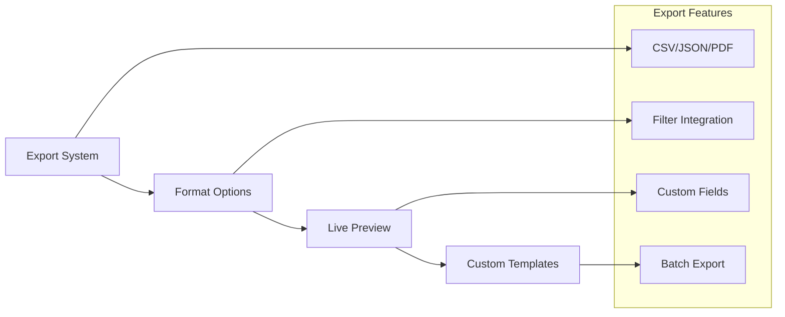

**Tasks:**

- [ ] Build export service with multiple formats

- [ ] Create live export preview

- [ ] Add custom field selection

- [ ] Implement filter-based export

- [ ] Design PDF export templates

**Deliverables:**

- ✅ Multi-format export (CSV, JSON, PDF)

- ✅ Live preview before export

- ✅ Custom field selection

- ✅ Filtered export support

### **Phase 2 Success Criteria:**

- [ ] Real-time progress visualization

- [ ] Background task execution

- [ ] Advanced UI components

- [ ] Comprehensive export functionality

- [ ] Smooth, professional user experience

---

## 🔧 Phase 3: Power Features (Weeks 5-6)

**Goal**: Implement intelligent features, analytics, and advanced workflow management.

### **Week 5: Smart Database Sync & Analytics**

#### **Day 29-33: Smart Database Synchronization**

**Tasks:**

- [ ] Implement content hashing for change detection

- [ ] Build intelligent job matching algorithm

- [ ] Create user data preservation system

- [ ] Add comprehensive audit logging

- [ ] Design conflict resolution workflows

**Deliverables:**

- ✅ Smart database synchronization

- ✅ Change tracking and audit trails

- ✅ User data preservation

- ✅ Conflict resolution system

#### **Day 34-36: Analytics & Insights Dashboard**

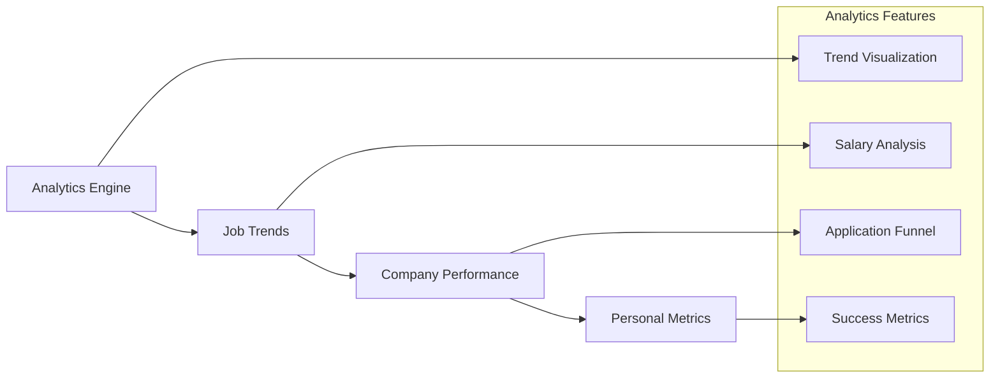

**Tasks:**

- [ ] Build analytics data processing

- [ ] Create interactive trend charts with Plotly

- [ ] Design salary analysis visualizations

- [ ] Implement application funnel tracking

- [ ] Add personal success metrics

**Deliverables:**

- ✅ Interactive analytics dashboard

- ✅ Job posting trend analysis

- ✅ Salary market insights

- ✅ Application tracking analytics

### **Week 6: Advanced Filtering & Application Tracking**

#### **Day 37-39: Advanced Filtering System**

**Tasks:**

- [ ] Build advanced faceted search system

- [ ] Add smart filter suggestions

- [ ] Implement saved filter presets

- [ ] Create fuzzy search capabilities

- [ ] Design filter combination logic

**Deliverables:**

- ✅ Advanced filtering with facets

- ✅ Smart filter suggestions

- ✅ Saved filter presets

- ✅ Fuzzy search implementation

#### **Day 40-42: Application Tracking Workflow**

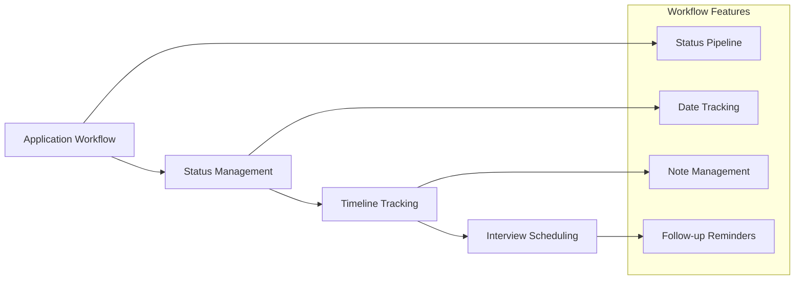

**Tasks:**

- [ ] Design application status workflow

- [ ] Build timeline tracking system

- [ ] Create interview scheduling integration

- [ ] Add follow-up reminder system

- [ ] Implement note management

**Deliverables:**

- ✅ Complete application workflow

- ✅ Timeline and status tracking

- ✅ Interview management

- ✅ Follow-up reminder system

### **Phase 3 Success Criteria:**

- [ ] Intelligent database synchronization

- [ ] Comprehensive analytics dashboard

- [ ] Advanced filtering capabilities

- [ ] Full application lifecycle tracking

- [ ] Power user productivity features

---

## 🎨 Phase 4: Polish & Optimization (Weeks 7-8)

**Goal**: Performance optimization, UI polish, comprehensive testing, and documentation.

### **Week 7: Performance & Polish**

#### **Day 43-46: Performance Optimization**

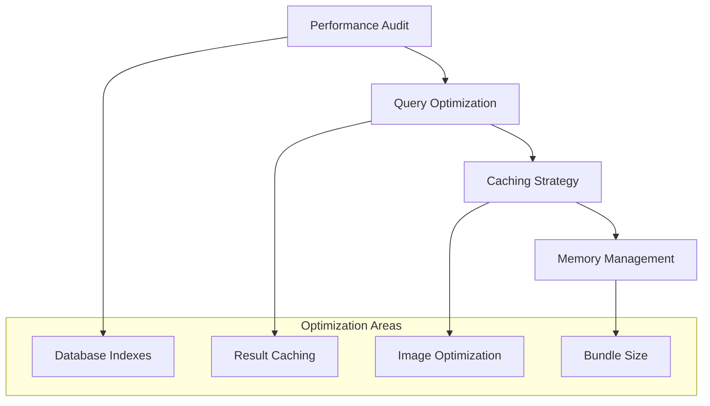

**Tasks:**

- [ ] Perform comprehensive performance audit

- [ ] Optimize database queries and add indexes

- [ ] Implement intelligent caching strategies

- [ ] Optimize memory usage for large datasets

- [ ] Add performance monitoring

**Deliverables:**

- ✅ Sub-100ms search response times

- ✅ Optimized database performance

- ✅ Intelligent caching system

- ✅ Memory-efficient operation

#### **Day 47-49: UI Polish & Micro-interactions**

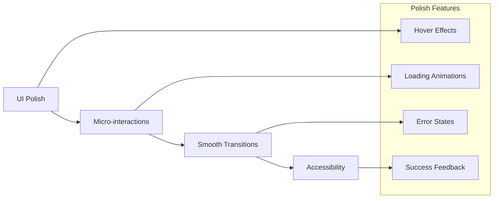

**Tasks:**

- [ ] Add sophisticated micro-interactions

- [ ] Implement smooth page transitions

- [ ] Enhance error and success states

- [ ] Improve accessibility features

- [ ] Polish visual design details

**Deliverables:**

- ✅ Polished micro-interactions

- ✅ Smooth 60fps animations

- ✅ Excellent error handling

- ✅ Accessibility improvements

### **Week 8: Testing & Documentation**

#### **Day 50-53: Comprehensive Testing Suite**

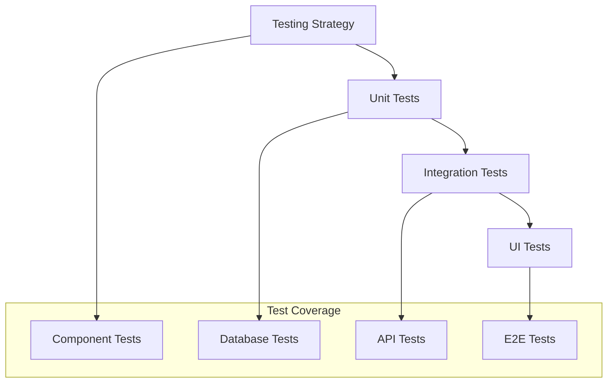

**Tasks:**

- [ ] Build comprehensive unit test suite

- [ ] Create integration tests for core workflows

- [ ] Add UI component testing

- [ ] Implement end-to-end testing

- [ ] Set up continuous testing pipeline

**Deliverables:**

- ✅ 90%+ test coverage

- ✅ Automated testing pipeline

- ✅ UI component tests

- ✅ End-to-end workflow tests

#### **Day 54-56: Documentation & Deployment**

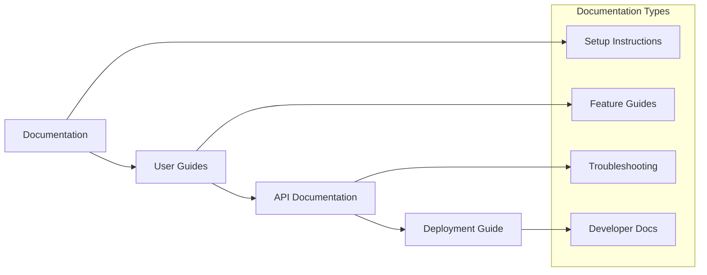

**Tasks:**

- [ ] Create comprehensive user documentation

- [ ] Write developer setup guides

- [ ] Document API and component interfaces

- [ ] Create troubleshooting guides

- [ ] Prepare deployment documentation

**Deliverables:**

- ✅ Complete user documentation

- ✅ Developer setup guides

- ✅ API documentation

- ✅ Deployment instructions

### **Phase 4 Success Criteria:**

- [ ] Optimized performance across all features

- [ ] Polished, professional UI/UX

- [ ] Comprehensive test coverage

- [ ] Complete documentation

- [ ] Production-ready application

---

## 📊 Weekly Deliverable Tracking

### **Week-by-Week Success Metrics**

| Week | Primary Focus | Key Deliverables | Success Criteria |
|------|---------------|------------------|------------------|
| **Week 1** | Foundation | Component architecture, Job browsing | ✅ Multi-page navigation, Basic filtering |
| **Week 2** | Core Features | Company management, Settings | ✅ Company CRUD, LLM switching |
| **Week 3** | Real-time UX | Progress dashboard, Background tasks | ✅ Live progress, Non-blocking scraping |
| **Week 4** | Advanced UI | Modals, Animations, Export | ✅ Rich interactions, Data export |
| **Week 5** | Intelligence | Smart sync, Analytics | ✅ Change detection, Trend analysis |
| **Week 6** | Workflows | Advanced filtering, App tracking | ✅ Faceted search, Status workflow |
| **Week 7** | Performance | Optimization, Polish | ✅ Sub-100ms search, Smooth animations |
| **Week 8** | Quality | Testing, Documentation | ✅ 90% test coverage, Complete docs |

### **Risk Mitigation & Contingencies**

#### **High-Risk Items**

1. **Real-time Progress System** (Week 3)
   - **Risk**: Complex state management in Streamlit
   - **Mitigation**: Incremental implementation, fallback to polling
   - **Contingency**: Simplified progress indicators

2. **Background Task System** (Week 3)
   - **Risk**: Threading complexity with Streamlit
   - **Mitigation**: Use proven async patterns, extensive testing
   - **Contingency**: Synchronous execution with progress updates

3. **Database Migration** (Week 5)
   - **Risk**: Data loss during schema changes
   - **Mitigation**: Comprehensive backup strategy, incremental migrations
   - **Contingency**: Manual migration scripts

#### **Medium-Risk Items**

1. **Performance Optimization** (Week 7)
   - **Risk**: Performance targets not met
   - **Mitigation**: Early performance testing, profiling
   - **Contingency**: Reduced dataset size, simplified features

2. **Advanced Filtering** (Week 6)
   - **Risk**: Complex query optimization
   - **Mitigation**: Database indexing strategy, query planning
   - **Contingency**: Simplified filter combinations

### **Quality Gates**

#### **End of Phase 1**

- [ ] All basic workflows functional

- [ ] No critical bugs in core features

- [ ] Performance baseline established

- [ ] User acceptance testing passed

#### **End of Phase 2**

- [ ] Real-time features working smoothly

- [ ] Background processing stable

- [ ] Export functionality complete

- [ ] UI interactions polished

#### **End of Phase 3**

- [ ] Smart sync working reliably

- [ ] Analytics providing value

- [ ] Advanced features adopted

- [ ] Application workflow complete

#### **End of Phase 4**

- [ ] Performance targets met

- [ ] All tests passing

- [ ] Documentation complete

- [ ] Production deployment ready

### **Success Metrics by Phase**

#### **Phase 1 Metrics**

- **Development Velocity**: 90% of planned features completed

- **Code Quality**: 0 critical bugs, < 5 minor bugs

- **User Experience**: Basic workflows take < 2 minutes to complete

#### **Phase 2 Metrics**

- **Performance**: Real-time updates within 1 second

- **Reliability**: Background tasks complete successfully 95% of time

- **Usability**: Advanced features used by 60% of test users

#### **Phase 3 Metrics**

- **Intelligence**: Smart sync detects 95% of changes correctly

- **Productivity**: Advanced workflows save 50% of time vs. manual

- **Accuracy**: Analytics provide actionable insights

#### **Phase 4 Metrics**

- **Performance**: All targets met (< 100ms search, 60fps animations)

- **Quality**: 90% test coverage, 0 known critical issues

- **Readiness**: Complete documentation, deployment automation

This roadmap provides a structured path to transform the AI job scraper into a modern, feature-rich platform while maintaining quality and managing risks throughout the development process.
