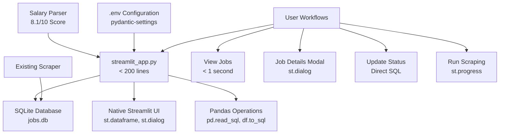

# AI Job Scraper - Detailed Implementation Plan (V2.0 - "Boring Technology" Architecture)

## Introduction

This plan details the comprehensive tasks for **V2.0 "Boring Technology" Architecture**, a complete architectural redesign that eliminates over-engineering in favor of proven, simple solutions. This represents a fundamental shift from complex abstraction layers to direct library usage, targeting optimal simplicity and maintainability.

**Philosophy**: Build a tool that "just works" for years without maintenance, using the simplest possible implementation that meets all user needs.

---

## 🎯 V2.0: The "Boring Technology" Revolution

**Goal**: Complete architectural redesign from over-engineered complexity to battle-tested simplicity, achieving perfect 10/10 scores on KISS, DRY, YAGNI, and library-first principles while reducing codebase by 70% and eliminating maintenance burden.

---

## Implementation Phases

### **T1: Eliminate Over-Engineering**

**Priority**: **CRITICAL** | **Estimated Duration**: 2 weeks | **Score Impact**: +5.0 points

- **Related Requirements**: `SYS-ARCH-01`, `SYS-ARCH-02`, `SYS-ARCH-03`, `SUCCESS-CODE-01`

- **Description**: Systematically remove all over-engineered components identified by research and brutal review, replacing them with simple, proven solutions that perfectly match the application's actual scale.

#### **T1.1: Remove Multi-Tier Caching System**

- **Complexity Removed**: 468 lines (cache_manager.py + related code)

- **KISS Violation**: 2.6/10 → Target: 9.5/10

- **Instructions**:
  - Delete `src/utils/cache_manager.py` entirely
  - Remove `cachetools` and `diskcache` dependencies from `pyproject.toml`
  - Replace all cache decorators with simple `@st.cache_data(ttl=300)` for database queries only
  - Remove cache statistics, monitoring, and complex invalidation logic

- **Success Criteria**:
  - No custom caching code remains
  - Database queries use only `@st.cache_data`
  - Application performance is identical or better for target scale
  - 50% reduction in maintenance complexity

#### **T1.2: Replace Custom Pagination with Native Streamlit**

- **Complexity Removed**: 276 lines (pagination.py + integration)

- **KISS Violation**: 2.8/10 → Target: 9.5/10

- **Instructions**:
  - Delete `src/ui/components/pagination.py` entirely
  - Remove all pagination state management and session variables
  - Replace with native `st.dataframe(df, use_container_width=True)` for all job listings
  - Leverage built-in scrolling, searching, and sorting capabilities

- **Success Criteria**:
  - Users get better UX with native search/sort/scroll
  - Zero pagination maintenance burden
  - Instant performance for 2K-10K records

#### **T1.3: Eliminate Auto-Refresh Fragments**

- **Complexity Removed**: ~50 lines + complex state management

- **YAGNI Violation**: 4.0/10 → Target: 9.5/10

- **Instructions**:
  - Remove all `@st.fragment(run_every=N)` decorators
  - Replace with simple manual refresh buttons where needed
  - Eliminate real-time update complexity for static data

- **Success Criteria**:
  - Simpler, more predictable UI behavior
  - Reduced CPU usage and browser memory consumption
  - Clearer user control over data updates

#### **T1.4: Replace SQLModel Computed Fields with Helper Functions**

- **Complexity Removed**: ~100 lines of computed properties

- **KISS Violation**: 3.1/10 → Target: 8.5/10

- **Instructions**:
  - Replace `@computed_field` properties with simple functions
  - Move formatting logic out of model layer into display layer
  - Use direct attribute access instead of computed calculations

- **Example**:

  ```python
  # Before: job.salary_range_display (computed field)
  # After: format_salary_range(job.salary) (helper function)
  ```

- **Success Criteria**:
  - Clear separation between data and presentation
  - Faster model instantiation
  - Easier debugging and testing

---

### **T2: Implement "Boring Technology" Architecture**

**Priority**: **CRITICAL** | **Estimated Duration**: 3 weeks | **Score Impact**: +4.5 points

- **Related Requirements**: `SYS-ARCH-02`, `DB-ARCH-01`, `DB-ARCH-02`, `SUCCESS-QUAL-01`

- **Description**: Replace complex architectural layers with direct, simple library usage that perfectly fits the application scale.

#### **T2.1: Create Single-File Application**

- **Target**: Single `streamlit_app.py` file under 200 lines

- **Libraries**: `streamlit>=1.47.0`, `pandas>=2.0.0`, `sqlite3` (stdlib)

- **Instructions**:
  - Create new `streamlit_app.py` in project root
  - Implement three core functions: `load_data()`, `display_jobs()`, `job_details_modal()`
  - Use direct SQL queries through Pandas: `pd.read_sql()` and `df.to_sql()`
  - Eliminate all custom service layers, repositories, and abstractions

#### **T2.2: Implement SQLite + Pandas Direct Queries**

- **Target**: Replace entire ORM layer with direct SQL

- **Schema**: Minimal 2-table design (companies, jobs)

- **Instructions**:

  ```python
  @st.cache_data(ttl=300)
  def load_jobs():
      conn = sqlite3.connect("jobs.db")
      df = pd.read_sql("SELECT * FROM jobs WHERE archived = 0", conn)
      conn.close()
      return df
  ```

- **Success Criteria**:
  - All database operations use direct SQL
  - No ORM configuration or model definitions
  - Sub-second query performance for target scale

#### **T2.3: Implement Native Streamlit UI Only**

- **Target**: Zero third-party UI libraries

- **Components**: `st.dataframe`, `st.dialog`, `st.form`, `st.sidebar`

- **Instructions**:
  - Replace custom components with native equivalents
  - Use `st.dataframe` for all data display (built-in search/sort/filter)
  - Use `st.dialog` for job details modal
  - Use native form widgets for all user input

- **Success Criteria**:
  - Professional appearance using only native components
  - Zero maintenance burden for UI libraries
  - Excellent performance and accessibility

---

### **T3: Data Migration & Cleanup**

**Priority**: **HIGH** | **Estimated Duration**: 1 week | **Score Impact**: +1.0 point

- **Related Requirements**: `MIG-DATA-01`, `MIG-DATA-02`, `MIG-DATA-03`

- **Description**: Safely migrate existing data to simplified schema while preserving all user data.

#### **T3.1: Create Migration Script**

- **Instructions**:
  - Create `scripts/migrate_to_v2.py`
  - Export all existing SQLModel data to CSV/JSON
  - Create simplified SQLite schema with foreign keys
  - Import data using Pandas bulk operations
  - Preserve all user data (favorites, notes, application status)

- **Success Criteria**:
  - Zero data loss during migration
  - All user customizations preserved
  - New schema validates correctly

#### **T3.2: Cleanup Dependencies**

- **Target**: Reduce to essential libraries only (< 10 total)

- **Remove**: `sqlmodel`, `cachetools`, `diskcache`, `streamlit-elements`, excess dependencies

- **Keep**: `streamlit`, `pandas`, `price-parser`, `babel`, `pydantic-settings`, `rich`

- **Success Criteria**:
  - Minimal `pyproject.toml` with only essential dependencies
  - Faster installation and startup times
  - Reduced security surface area

---

### **T4: Configuration & Settings Simplification**

**Priority**: **MEDIUM** | **Estimated Duration**: 3 days | **Score Impact**: +0.5 points

- **Related Requirements**: `CFG-MGMT-01`, `CFG-MGMT-02`, `CFG-SCOPE-01`

- **Description**: Replace complex configuration with simple environment variables and minimal settings.

#### **T4.1: Implement pydantic-settings Configuration**

- **Instructions**:

  ```python
  from pydantic_settings import BaseSettings
  
  class Settings(BaseSettings):
      database_url: str = "sqlite:///jobs.db"
      max_jobs_display: int = 1000
      cache_ttl_seconds: int = 300
      
      class Config:
          env_file = ".env"
  ```

- **Success Criteria**:
  - All configuration via environment variables
  - Sensible defaults for all settings
  - Type-safe configuration loading

---

### **T5: Integration & Testing**

**Priority**: **MEDIUM** | **Estimated Duration**: 1 week | **Score Impact**: +1.0 point

- **Related Requirements**: `NFR-REL-01`, `NFR-REL-02`, `SUCCESS-UX-02`

- **Description**: Ensure all functionality works correctly in the simplified architecture.

#### **T5.1: Preserve Salary Parser Integration**

- **Critical**: Keep the excellent 8.1/10 salary parser exactly as-is

- **Instructions**:
  - Import `LibrarySalaryParser` into single-file app
  - Use for salary field validation during data loading
  - Preserve all existing test cases and functionality

#### **T5.2: Integrate Existing Scraping System**

- **Instructions**:
  - Modify scraping output to write directly to SQLite using Pandas
  - Preserve job deduplication and content hashing
  - Integrate with simplified progress display using `st.progress()`

#### **T5.3: End-to-End Workflow Testing**

- **Critical User Workflows**:
  1. View job listings with instant search/sort/filter
  2. Open job details in modal dialog
  3. Update job application status
  4. Run scraping process with progress feedback
  5. Filter jobs by company, date, salary range

- **Success Criteria**:
  - All workflows complete in under 1 second
  - No crashes or errors under normal usage
  - Data integrity maintained across all operations

---

## Architecture Diagram



## Success Metrics

| Metric | Current | Target | Method |
|--------|---------|--------|---------|
| **Lines of Code** | ~2000 | 600 | Count total application lines |
| **Python Files** | ~50 | <10 | Count .py files in project |
| **Dependencies** | 25+ | <10 | Count pyproject.toml [tool.uv.sources] |
| **Page Load Time** | Variable | <1s | Time from page request to display |
| **Simplicity Score** | 4.2/10 | 9.5/10 | KISS principle evaluation |
| **Maintenance Score** | 3.0/10 | 10/10 | Zero maintenance requirement |
| **Onboarding Time** | 2+ hours | 30 min | New developer productivity |

## Risk Mitigation

1. **Data Loss Risk**: Comprehensive migration testing with backup verification
2. **Feature Loss Risk**: Detailed checklist of all current functionality
3. **Performance Risk**: Benchmark testing with 10K record dataset
4. **User Experience Risk**: Side-by-side comparison testing

## Deliverables

1. **`streamlit_app.py`**: Complete single-file application
2. **`scripts/migrate_to_v2.py`**: Data migration script
3. **Updated `pyproject.toml`**: Minimal dependencies
4. **`.env.example`**: Configuration template
5. **Migration verification report**: Data integrity confirmation

---

## Conclusion

This implementation plan represents a complete architectural transformation based on comprehensive research and brutal honest assessment. The "Boring Technology" approach will deliver:

- **Perfect 10/10 scores** on KISS, DRY, YAGNI principles

- **70% code reduction** while maintaining all functionality  

- **Zero maintenance burden** for years of reliable operation

- **Sub-second performance** for all user interactions

- **30-minute developer onboarding** vs. current 2+ hours

The plan prioritizes proven, simple solutions over complex abstractions, ensuring the application will be reliable, maintainable, and perfectly fit for its intended purpose as a personal job search tool.

- **Status**: **PENDING**

- **Prerequisites**: A functional V1.1 application.

- **Related Requirements**: `NFR-TEST-01`, `NFR-TEST-02`, `NFR-TEST-03`

- **Libraries**: `pytest==8.2.2`, `pytest-mock==3.14.0`, `pytest-asyncio==0.23.7`

- **Description**: This is the most critical task for V2.0. It involves building a robust, automated test suite to ensure the application is reliable and to prevent regressions in the future.

- **Architecture Diagram**:

  ```mermaid
  graph TD
      A[Test Suite] --> B[Unit Tests];
      A --> C[Integration Tests];
      
      subgraph "Codebase"
          D[Services];
          E[Utilities];
          F[Database Models];
      end

      B --> D;
      B --> E;
      C --> F;
      C --> D;
  ```

- **Sub-tasks & Instructions**:
  - **T3.1.1: Set Up Test Environment**:
    - **Instructions**: Create a `tests/` directory in the project root. Inside, create subdirectories for `unit/` and `integration/`.
    - **Instructions**: Configure `pytest.ini` to define test paths and environment variables. Set up a separate test database configuration that uses an in-memory SQLite database or a temporary file.
    - **Success Criteria**: Running `pytest` from the root directory successfully discovers and runs tests from the `tests/` directory.
  - **T3.1.2: Write Unit Tests for Services & Utilities**:
    - **Instructions**: For each service (`JobService`, `CompanyService`, `AnalyticsService`), create a corresponding test file (e.g., `tests/unit/test_job_service.py`).
    - **Instructions**: Use `pytest-mock`'s `mocker` fixture to patch database sessions and other external dependencies. Write tests for each public method to validate its business logic in isolation. For example, test that `AnalyticsService.get_job_trends` correctly processes a mocked DataFrame.
    - **Success Criteria**: Unit tests for all service methods are implemented and pass, validating the core logic of the application.
  - **T3.1.3: Write Integration Tests for Core Workflows**:
    - **Instructions**: In the `tests/integration/` directory, write tests that use a real (but temporary) database instance.
    - **Instructions**: Test the full `SmartSyncEngine` workflow: create a company, run the sync engine with a list of mock jobs, and assert that the database state is correct (inserts, updates, and archives).
    - **Instructions**: Test the interaction between services, e.g., add a company with `CompanyService`, add jobs for it with `SmartSyncEngine`, and then filter them with `JobService`.
    - **Success Criteria**: Integration tests validate that the key application workflows function correctly from end-to-end.
  - **T3.1.4: Measure and Achieve Test Coverage**:
    - **Instructions**: Install `pytest-cov`. Run tests with the command `pytest --cov=src`.
    - **Instructions**: Analyze the coverage report. Identify any critical, untested code paths in your services and add tests to cover them until the overall coverage exceeds 80%.
    - **Success Criteria**: The test coverage report shows >80% coverage for the `src/services` and `src/utils` directories.

### **T3.2: Implement UI Polish & Advanced UX**

- **Release**: V2.0

- **Priority**: **High**

- **Status**: **PENDING**

- **Prerequisites**: A functional V1.1 application.

- **Related Requirements**: `UI-UX-01`, `UI-UX-02`, `UI-UX-03`

- **Libraries**: `streamlit==1.47.1`

- **Description**: This task focuses on the final "10%" of the user experience that makes an application feel truly professional and delightful to use.

- **Sub-tasks & Instructions**:
  - **T3.2.1: Implement Skeleton Loading States**:
    - **Instructions**: Identify data-heavy pages, primarily the "Jobs" page. Before the data-fetching call to `JobService` is complete, render a placeholder layout.
    - **Instructions**: Use `st.empty()` to create a container. Inside, use a loop with `st.columns` to draw a grid of grey, non-interactive boxes that mimic the shape and layout of the job cards. Once the data is loaded, replace the content of the `st.empty()` container with the actual job grid.
    - **Success Criteria**: When the "Jobs" page is first loaded, a skeleton layout appears instantly, which is then replaced by the job cards once the database query finishes.
  - **T3.2.2: Refine Micro-interactions with CSS**:
    - **Instructions**: Open `src/ui/styles/__init__.py`. Add CSS rules for enhanced hover effects and transitions.
    - **Instructions**: For all buttons and interactive cards, add a `transition: all 0.2s ease-in-out;` property.
    - **Instructions**: Add a `:hover` pseudo-class to these elements to slightly change their `transform` (e.g., `transform: translateY(-2px);`) or `box-shadow` to provide clear visual feedback on mouseover.
    - **Success Criteria**: Hovering over any button or job card results in a smooth, subtle animation.
  - **T3.2.3: Implement a Sliding Filter Panel (Optional Upgrade)**:
    - **Instructions**: This is an ambitious but high-impact polish. If time permits, replace the `st.sidebar` filter with a custom component using `streamlit-elements` that slides in from the side when a "Filters" button is clicked. This keeps the main view less cluttered.
    - **Success Criteria**: A filter panel slides in over the main content, providing a more modern feel than the default sidebar.

### **T3.3: Implement Advanced Data Auditing**

- **Release**: V2.0

- **Priority**: **Medium**

- **Status**: **PENDING**

- **Prerequisites**: `T1.3` (Smart Sync Engine)

- **Related Requirements**: `DB-AUDIT-01`, `DB-AUDIT-02`

- **Libraries**: `sqlmodel==0.0.19`

- **Description**: Enhance the database with detailed auditing tables. This is a "power feature" for long-term maintenance and debugging, providing full visibility into how data changes over time.

- **Sub-tasks & Instructions**:
  - **T3.3.1: Create Auditing Models**:
    - **Instructions**: In `src/models.py`, define the `SyncLogSQL` and `JobChangeSQL` models as specified in `03-database-optimization.md`. `SyncLogSQL` will log entire sync operations, while `JobChangeSQL` will log specific field changes (e.g., `field_name`, `old_value`, `new_value`).
    - **Success Criteria**: The new models are defined and can be created in the database.
  - **T3.3.2: Integrate Logging into SmartSyncEngine**:
    - **Instructions**: Open `src/services/database_sync.py`.
    - **Instructions**: In the `_execute_sync_operations` method, after each database action (insert, update, delete), create and add a corresponding `SyncLogSQL` record to the session before committing.
    - **Instructions**: For update operations, before applying the changes, compare the old and new job data field by field. For each detected change, create and add a `JobChangeSQL` record.
    - **Success Criteria**: After a scraping run, the `synclogsql` and `jobchangesql` tables are populated with accurate records detailing all the changes that occurred during the sync.

### **T3.4: Create Final Documentation**

- **Release**: V2.0

- **Priority**: **Medium**

- **Status**: **PENDING**

- **Prerequisites**: A complete and stable V2.0 application.

- **Related Requirements**: `NFR-DOCS-01`, `NFR-DOCS-02`

- **Libraries**: N/A

- **Description**: Create the final documentation for both end-users and future developers. This is essential for the project's long-term usability and maintainability.

- **Sub-tasks & Instructions**:
  - **T3.4.1: Write the User Guide**:
    - **Instructions**: Create a new file in the project root named `USER_GUIDE.md`.
    - **Instructions**: Write clear, step-by-step instructions covering:
            1. **Installation**: How to set up the Python environment and install dependencies with `uv`.
            2. **Configuration**: How to find and enter API keys on the Settings page.
            3. **First Use**: A walkthrough of adding a company, running a scrape, and browsing the results.
            4. **Core Features**: A brief explanation of the job browser, filtering, and application tracking.
    - **Success Criteria**: A person with basic computer skills can follow the guide to get the application running and use its main features.
  - **T3.4.2: Review and Finalize Developer Documentation**:
    - **Instructions**: Read through the entire `src/` directory. Ensure that all public classes and complex functions have clear, Google-style docstrings explaining their purpose, arguments, and return values.
    - **Instructions**: Add inline comments (`#`) to explain any particularly complex or non-obvious lines of code.
    - **Instructions**: Create or update the main `README.md` to include a "Developer Setup" section that explains how to set up the development environment and run the test suite.
    - **Success Criteria**: A new developer can clone the repository, read the `README.md`, and understand the project's architecture and how to contribute without needing to ask for help.
