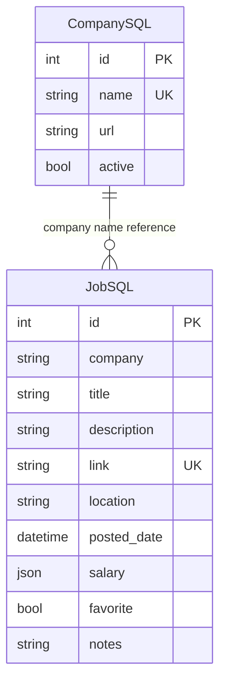
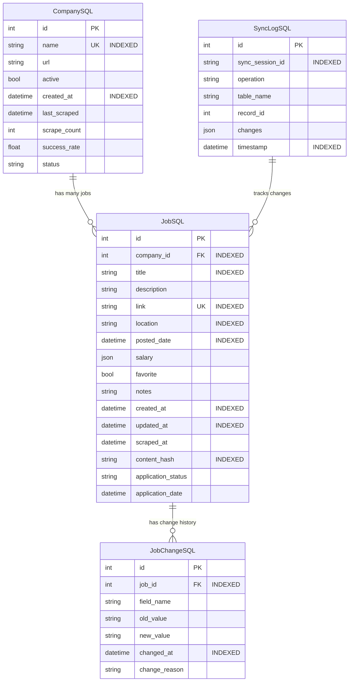

# Database Optimization & Smart Synchronization

> *Last Updated: August 2025*

## 🎯 Database Enhancement Overview

Transform the current basic SQLite database into an intelligent, high-performance system with smart synchronization, change tracking, and optimized queries for handling large-scale job data efficiently.

## 📊 Current State Analysis

### **Existing Schema Assessment**



### **Identified Limitations**

- **No Foreign Key Relationships**: Jobs reference companies by string name instead of ID

- **Missing Indexes**: Slow filtering on location, salary, and date fields

- **No Change Tracking**: Can't detect updates during re-scraping

- **No Audit Trail**: No visibility into sync operations

- **Performance Issues**: Full table scans for common queries

- **Data Duplication Risk**: No intelligent duplicate detection

## 🚀 Enhanced Database Schema

### **Optimized Entity Relationships**



## 🔧 Smart Synchronization Engine

### **Intelligent Job Matching Strategy**

```python

# src/services/smart_sync.py
class SmartSyncEngine:
    """Advanced synchronization with intelligent change detection."""
    
    def __init__(self, session: Session):
        self.session = session
        self.sync_session_id = str(uuid4())
        self.change_tracker = ChangeTracker(session)
    
    async def sync_company_jobs(
        self, 
        company_id: int,
        scraped_jobs: list[dict],
        preserve_user_data: bool = True
    ) -> SyncResult:
        """
        Intelligently sync scraped jobs with existing database.
        
        Features:
        - Content-based change detection
        - Automatic job matching and updates
        - Smart deletion of obsolete jobs
        - Preservation of user favorites and notes
        - Comprehensive audit logging
        """
        
        start_time = datetime.now()
        
        # 1. Prepare scraped job data with content hashes
        prepared_jobs = [
            self._prepare_job_data(job_data, company_id) 
            for job_data in scraped_jobs
        ]
        
        # 2. Get existing jobs for this company
        existing_jobs = self._get_existing_jobs(company_id)
        existing_by_link = {job.link: job for job in existing_jobs}
        existing_by_hash = {job.content_hash: job for job in existing_jobs}
        
        # 3. Analyze sync operations needed
        sync_operations = self._analyze_sync_operations(
            prepared_jobs, existing_by_link, existing_by_hash
        )
        
        # 4. Execute sync operations with transaction safety
        result = await self._execute_sync_operations(
            sync_operations, preserve_user_data
        )
        
        # 5. Log sync session
        await self._log_sync_session(
            company_id, start_time, result
        )
        
        return result

    def _prepare_job_data(self, job_data: dict, company_id: int) -> PreparedJob:
        """Prepare job data with content hash and validation."""
        
        # Extract core content for hashing
        content_fields = {
            "title": job_data.get("title", "").strip(),
            "location": job_data.get("location", "").strip(),
            "description": self._normalize_description(
                job_data.get("description", "")
            ),
            "salary": self._normalize_salary(job_data.get("salary"))
        }
        
        # Generate content hash for change detection
        content_hash = self._generate_content_hash(content_fields)
        
        return PreparedJob(
            company_id=company_id,
            title=content_fields["title"],
            description=job_data.get("description", ""),
            location=content_fields["location"],
            link=job_data.get("link", ""),
            posted_date=self._parse_posted_date(job_data.get("posted_date")),
            salary=content_fields["salary"],
            content_hash=content_hash,
            scraped_at=datetime.now()
        )

    def _analyze_sync_operations(
        self,
        prepared_jobs: list[PreparedJob],
        existing_by_link: dict[str, JobSQL],
        existing_by_hash: dict[str, JobSQL]
    ) -> SyncOperations:
        """Determine what operations are needed for sync."""
        
        operations = SyncOperations()
        
        # Track scraped job links for deletion analysis
        scraped_links = {job.link for job in prepared_jobs}
        
        for prepared_job in prepared_jobs:
            existing_job = existing_by_link.get(prepared_job.link)
            
            if existing_job is None:
                # New job - insert
                operations.inserts.append(prepared_job)
                
            elif existing_job.content_hash != prepared_job.content_hash:
                # Job content changed - update
                operations.updates.append(
                    UpdateOperation(
                        existing_job=existing_job,
                        new_data=prepared_job,
                        changes=self._detect_field_changes(
                            existing_job, prepared_job
                        )
                    )
                )
            else:
                # Job unchanged - just update scraped_at timestamp
                operations.touch_updates.append(existing_job.id)
        
        # Find jobs to delete (no longer on company website)
        for existing_link, existing_job in existing_by_link.items():
            if existing_link not in scraped_links:
                operations.deletes.append(existing_job)
        
        return operations

    async def _execute_sync_operations(
        self, 
        operations: SyncOperations,
        preserve_user_data: bool
    ) -> SyncResult:
        """Execute sync operations with transaction safety."""
        
        result = SyncResult(
            sync_session_id=self.sync_session_id,
            start_time=datetime.now()
        )
        
        try:
            # Insert new jobs
            for job_data in operations.inserts:
                new_job = JobSQL(**job_data.dict())
                self.session.add(new_job)
                result.inserted_count += 1
                
                # Log insert operation
                await self._log_operation("insert", "job", new_job)
            
            # Update changed jobs
            for update_op in operations.updates:
                updated_job = await self._update_job_with_changes(
                    update_op, preserve_user_data
                )
                result.updated_count += 1
                
                # Track field-level changes
                await self.change_tracker.log_field_changes(
                    updated_job.id, update_op.changes
                )
            
            # Touch unchanged jobs (update scraped_at)
            if operations.touch_updates:
                await self._touch_jobs(operations.touch_updates)
                result.touched_count = len(operations.touch_updates)
            
            # Delete obsolete jobs (with user data preservation)
            for job_to_delete in operations.deletes:
                if preserve_user_data and (job_to_delete.favorite or job_to_delete.notes):
                    # Mark as archived instead of deleting
                    job_to_delete.archived = True
                    job_to_delete.archived_at = datetime.now()
                    result.archived_count += 1
                else:
                    # Safe to delete
                    self.session.delete(job_to_delete)
                    result.deleted_count += 1
                
                await self._log_operation("delete", "job", job_to_delete)
            
            # Commit all changes
            self.session.commit()
            
            result.success = True
            result.end_time = datetime.now()
            
        except Exception as e:
            self.session.rollback()
            result.success = False
            result.error = str(e)
            raise
        
        return result
```

## 📈 Performance Optimization

### **Strategic Indexing Plan**

```sql

-- Critical performance indexes
CREATE INDEX IF NOT EXISTS idx_jobs_company_id ON jobsql(company_id);
CREATE INDEX IF NOT EXISTS idx_jobs_posted_date ON jobsql(posted_date DESC);
CREATE INDEX IF NOT EXISTS idx_jobs_location ON jobsql(location);
CREATE INDEX IF NOT EXISTS idx_jobs_title ON jobsql(title);
CREATE INDEX IF NOT EXISTS idx_jobs_content_hash ON jobsql(content_hash);
CREATE INDEX IF NOT EXISTS idx_jobs_scraped_at ON jobsql(scraped_at DESC);
CREATE INDEX IF NOT EXISTS idx_jobs_favorite ON jobsql(favorite) WHERE favorite = 1;

-- Composite indexes for common filter combinations
CREATE INDEX IF NOT EXISTS idx_jobs_company_date ON jobsql(company_id, posted_date DESC);
CREATE INDEX IF NOT EXISTS idx_jobs_location_date ON jobsql(location, posted_date DESC);

-- Full-text search index for job content
CREATE VIRTUAL TABLE IF NOT EXISTS job_search_index USING fts5(
    title, description, location, content=jobsql
);

-- Company performance indexes
CREATE INDEX IF NOT EXISTS idx_companies_active ON companysql(active) WHERE active = 1;
CREATE INDEX IF NOT EXISTS idx_companies_last_scraped ON companysql(last_scraped DESC);

-- Sync logging indexes
CREATE INDEX IF NOT EXISTS idx_sync_session ON synclogsql(sync_session_id);
CREATE INDEX IF NOT EXISTS idx_sync_timestamp ON synclogsql(timestamp DESC);
```

### **Query Optimization Patterns**

```python

# src/services/optimized_queries.py
class OptimizedJobQueries:
    """High-performance job queries with intelligent caching."""
    
    @staticmethod
    def get_filtered_jobs(
        filters: dict,
        limit: int = 50,
        offset: int = 0,
        sort_by: str = "posted_date"
    ) -> tuple[list[JobSQL], int]:
        """
        Optimized job filtering with count estimation.
        
        Features:
        - Uses appropriate indexes for each filter type
        - Estimates total count without full scan
        - Supports complex salary range queries
        - Includes fuzzy search capabilities
        """
        
        # Build base query with joins
        query = select(JobSQL).join(CompanySQL)
        count_query = select(func.count(JobSQL.id)).join(CompanySQL)
        
        # Apply filters with index optimization
        if company_ids := filters.get("company_ids"):
            filter_clause = JobSQL.company_id.in_(company_ids)
            query = query.where(filter_clause)
            count_query = count_query.where(filter_clause)
        
        if date_range := filters.get("date_range"):
            date_filter = JobSQL.posted_date >= date_range["start"]
            if date_range.get("end"):
                date_filter = and_(
                    date_filter,
                    JobSQL.posted_date <= date_range["end"]
                )
            query = query.where(date_filter)
            count_query = count_query.where(date_filter)
        
        if salary_range := filters.get("salary_range"):
            # Optimized salary range query using JSON functions
            salary_filter = and_(
                func.json_extract(JobSQL.salary, "$[0]") >= salary_range["min"],
                func.json_extract(JobSQL.salary, "$[1]") <= salary_range["max"]
            )
            query = query.where(salary_filter)
            count_query = count_query.where(salary_filter)
        
        if location := filters.get("location"):
            location_filter = JobSQL.location.like(f"%{location}%")
            query = query.where(location_filter)
            count_query = count_query.where(location_filter)
        
        if search_term := filters.get("search_term"):
            # Use FTS index for complex searches
            if len(search_term) > 2:
                fts_results = session.exec(
                    text("""
                    SELECT rowid FROM job_search_index 
                    WHERE job_search_index MATCH :search_term
                    LIMIT 1000
                    """),
                    {"search_term": search_term}
                ).all()
                
                if fts_results:
                    job_ids = [r[0] for r in fts_results]
                    search_filter = JobSQL.id.in_(job_ids)
                else:
                    # Fallback to LIKE search
                    search_filter = or_(
                        JobSQL.title.like(f"%{search_term}%"),
                        JobSQL.description.like(f"%{search_term}%")
                    )
            else:
                # Simple LIKE search for short terms
                search_filter = JobSQL.title.like(f"%{search_term}%")
            
            query = query.where(search_filter)
            count_query = count_query.where(search_filter)
        
        if favorites_only := filters.get("favorites_only"):
            favorite_filter = JobSQL.favorite == True
            query = query.where(favorite_filter)
            count_query = count_query.where(favorite_filter)
        
        # Apply sorting with index utilization
        if sort_by == "posted_date":
            query = query.order_by(JobSQL.posted_date.desc())
        elif sort_by == "created_at":
            query = query.order_by(JobSQL.created_at.desc())
        elif sort_by == "salary_desc":
            query = query.order_by(
                func.json_extract(JobSQL.salary, "$[1]").desc()
            )
        elif sort_by == "company":
            query = query.order_by(CompanySQL.name, JobSQL.posted_date.desc())
        
        # Apply pagination
        query = query.offset(offset).limit(limit)
        
        # Execute queries
        with get_session() as session:
            jobs = session.exec(query).all()
            total_count = session.exec(count_query).one()
        
        return jobs, total_count

    @staticmethod
    @st.cache_data(ttl=300)
    def get_job_statistics() -> dict:
        """Cached job statistics for dashboard."""
        
        with get_session() as session:
            # Use efficient aggregation queries
            stats = session.exec(text("""
                SELECT 
                    COUNT(*) as total_jobs,
                    COUNT(CASE WHEN favorite = 1 THEN 1 END) as favorites,
                    COUNT(CASE WHEN posted_date >= date('now', '-7 days') THEN 1 END) as recent_jobs,
                    COUNT(CASE WHEN application_status = 'applied' THEN 1 END) as applied_jobs,
                    COUNT(DISTINCT company_id) as active_companies
                FROM jobsql
                WHERE archived IS NOT 1
            """)).first()
            
            return {
                "total_jobs": stats.total_jobs,
                "favorites": stats.favorites,
                "recent_jobs": stats.recent_jobs,
                "applied_jobs": stats.applied_jobs,
                "active_companies": stats.active_companies
            }
```

## 🔍 Change Tracking & Audit System

### **Comprehensive Change Detection**

```python

# src/services/change_tracker.py
class ChangeTracker:
    """Track and analyze changes in job data over time."""
    
    def __init__(self, session: Session):
        self.session = session
    
    async def log_field_changes(
        self, 
        job_id: int, 
        changes: dict[str, FieldChange]
    ) -> None:
        """Log individual field changes with context."""
        
        for field_name, change in changes.items():
            change_record = JobChangeSQL(
                job_id=job_id,
                field_name=field_name,
                old_value=change.old_value,
                new_value=change.new_value,
                changed_at=datetime.now(),
                change_reason="sync_update"
            )
            
            self.session.add(change_record)
    
    def get_job_change_history(
        self, 
        job_id: int, 
        limit: int = 10
    ) -> list[JobChangeSQL]:
        """Get chronological change history for a job."""
        
        return self.session.exec(
            select(JobChangeSQL)
            .where(JobChangeSQL.job_id == job_id)
            .order_by(JobChangeSQL.changed_at.desc())
            .limit(limit)
        ).all()
    
    def analyze_change_patterns(
        self, 
        company_id: int, 
        days: int = 30
    ) -> ChangeAnalysis:
        """Analyze change patterns for a company over time."""
        
        cutoff_date = datetime.now() - timedelta(days=days)
        
        # Get change statistics
        change_stats = self.session.exec(text("""
            SELECT 
                jc.field_name,
                COUNT(*) as change_count,
                COUNT(DISTINCT jc.job_id) as affected_jobs
            FROM jobchangesql jc
            JOIN jobsql j ON j.id = jc.job_id
            WHERE j.company_id = :company_id 
            AND jc.changed_at >= :cutoff_date
            GROUP BY jc.field_name
            ORDER BY change_count DESC
        """), {
            "company_id": company_id,
            "cutoff_date": cutoff_date
        }).all()
        
        return ChangeAnalysis(
            company_id=company_id,
            period_days=days,
            field_changes=change_stats,
            analysis_date=datetime.now()
        )
```

## 🚨 Data Integrity & Validation

### **Comprehensive Validation System**

```python

# src/services/data_validator.py
class DatabaseValidator:
    """Ensure data integrity and consistency."""
    
    @staticmethod
    def validate_job_data(job_data: dict) -> ValidationResult:
        """Validate job data before insertion."""
        
        errors = []
        warnings = []
        
        # Required field validation
        required_fields = ["title", "company_id", "link"]
        for field in required_fields:
            if not job_data.get(field):
                errors.append(f"Missing required field: {field}")
        
        # URL validation
        if link := job_data.get("link"):
            if not validators.url(link):
                errors.append(f"Invalid job link URL: {link}")
        
        # Salary validation
        if salary := job_data.get("salary"):
            if not DatabaseValidator._validate_salary_format(salary):
                warnings.append(f"Unusual salary format: {salary}")
        
        # Date validation
        if posted_date := job_data.get("posted_date"):
            if not DatabaseValidator._validate_posted_date(posted_date):
                warnings.append(f"Suspicious posted date: {posted_date}")
        
        return ValidationResult(
            valid=len(errors) == 0,
            errors=errors,
            warnings=warnings
        )
    
    @staticmethod
    def detect_duplicates(
        job_data: dict, 
        company_id: int,
        threshold: float = 0.85
    ) -> list[DuplicateMatch]:
        """Detect potential duplicate jobs using fuzzy matching."""
        
        # Get similar jobs from same company
        similar_jobs = session.exec(
            select(JobSQL)
            .where(JobSQL.company_id == company_id)
            .where(JobSQL.title.like(f"%{job_data['title'][:20]}%"))
        ).all()
        
        duplicates = []
        
        for existing_job in similar_jobs:
            similarity_score = DatabaseValidator._calculate_similarity(
                job_data, existing_job
            )
            
            if similarity_score >= threshold:
                duplicates.append(DuplicateMatch(
                    existing_job=existing_job,
                    similarity_score=similarity_score,
                    matching_fields=DatabaseValidator._get_matching_fields(
                        job_data, existing_job
                    )
                ))
        
        return duplicates
    
    @staticmethod
    def _calculate_similarity(job_data: dict, existing_job: JobSQL) -> float:
        """Calculate similarity score between jobs."""
        
        # Title similarity (weighted heavily)
        title_similarity = difflib.SequenceMatcher(
            None, 
            job_data.get("title", "").lower(),
            existing_job.title.lower()
        ).ratio()
        
        # Location similarity
        location_similarity = difflib.SequenceMatcher(
            None,
            job_data.get("location", "").lower(),
            existing_job.location.lower()
        ).ratio()
        
        # Description similarity (first 200 chars)
        desc1 = job_data.get("description", "")[:200].lower()
        desc2 = existing_job.description[:200].lower()
        desc_similarity = difflib.SequenceMatcher(None, desc1, desc2).ratio()
        
        # Weighted average
        return (
            title_similarity * 0.5 +
            location_similarity * 0.2 +
            desc_similarity * 0.3
        )
```

## 📊 Database Migration Strategy

### **Incremental Migration System**

```python

# src/migrations/migration_executor.py
class MigrationExecutor:
    """Execute database migrations safely and incrementally."""
    
    MIGRATIONS = [
        Migration(
            version=1,
            name="add_foreign_keys",
            description="Add proper foreign key relationships",
            sql="""
                -- Add company_id to jobs table
                ALTER TABLE jobsql ADD COLUMN company_id INTEGER;
                
                -- Update company_id based on existing company names
                UPDATE jobsql 
                SET company_id = (
                    SELECT id FROM companysql 
                    WHERE name = jobsql.company
                    LIMIT 1
                );
                
                -- Create foreign key constraint
                CREATE INDEX idx_jobs_company_id ON jobsql(company_id);
            """
        ),
        Migration(
            version=2,
            name="add_tracking_fields",
            description="Add change tracking and sync fields",
            sql="""
                -- Add tracking timestamps
                ALTER TABLE jobsql ADD COLUMN created_at DATETIME DEFAULT CURRENT_TIMESTAMP;
                ALTER TABLE jobsql ADD COLUMN updated_at DATETIME DEFAULT CURRENT_TIMESTAMP;
                ALTER TABLE jobsql ADD COLUMN scraped_at DATETIME DEFAULT CURRENT_TIMESTAMP;
                
                -- Add content hash for change detection
                ALTER TABLE jobsql ADD COLUMN content_hash TEXT;
                CREATE INDEX idx_jobs_content_hash ON jobsql(content_hash);
                
                -- Add application tracking
                ALTER TABLE jobsql ADD COLUMN application_status TEXT DEFAULT 'not_applied';
                ALTER TABLE jobsql ADD COLUMN application_date DATETIME;
                
                -- Add company metrics
                ALTER TABLE companysql ADD COLUMN created_at DATETIME DEFAULT CURRENT_TIMESTAMP;
                ALTER TABLE companysql ADD COLUMN last_scraped DATETIME;
                ALTER TABLE companysql ADD COLUMN scrape_count INTEGER DEFAULT 0;
                ALTER TABLE companysql ADD COLUMN success_rate REAL DEFAULT 1.0;
            """
        ),
        Migration(
            version=3,
            name="create_audit_tables",
            description="Create audit and change tracking tables",
            sql="""
                -- Sync log table
                CREATE TABLE IF NOT EXISTS synclogsql (
                    id INTEGER PRIMARY KEY,
                    sync_session_id TEXT NOT NULL,
                    operation TEXT NOT NULL,
                    table_name TEXT NOT NULL,
                    record_id INTEGER NOT NULL,
                    changes TEXT,  -- JSON
                    timestamp DATETIME DEFAULT CURRENT_TIMESTAMP
                );
                
                CREATE INDEX idx_sync_session ON synclogsql(sync_session_id);
                CREATE INDEX idx_sync_timestamp ON synclogsql(timestamp);
                
                -- Job change history table
                CREATE TABLE IF NOT EXISTS jobchangesql (
                    id INTEGER PRIMARY KEY,
                    job_id INTEGER NOT NULL,
                    field_name TEXT NOT NULL,
                    old_value TEXT,
                    new_value TEXT,
                    changed_at DATETIME DEFAULT CURRENT_TIMESTAMP,
                    change_reason TEXT,
                    FOREIGN KEY (job_id) REFERENCES jobsql(id)
                );
                
                CREATE INDEX idx_job_changes_job_id ON jobchangesql(job_id);
                CREATE INDEX idx_job_changes_date ON jobchangesql(changed_at);
            """
        )
    ]
    
    def execute_pending_migrations(self, engine: Engine) -> MigrationResult:
        """Execute all pending migrations safely."""
        
        current_version = self._get_current_version(engine)
        target_version = max(m.version for m in self.MIGRATIONS)
        
        if current_version >= target_version:
            return MigrationResult(
                success=True,
                message="Database is up to date",
                migrations_applied=[]
            )
        
        applied_migrations = []
        
        try:
            with engine.begin() as conn:
                for migration in self.MIGRATIONS:
                    if migration.version > current_version:
                        # Execute migration
                        conn.execute(text(migration.sql))
                        
                        # Update version
                        self._update_version(conn, migration.version)
                        
                        applied_migrations.append(migration.name)
                        
                        logger.info(f"Applied migration {migration.version}: {migration.name}")
            
            return MigrationResult(
                success=True,
                message=f"Applied {len(applied_migrations)} migrations",
                migrations_applied=applied_migrations
            )
            
        except Exception as e:
            logger.error(f"Migration failed: {e}")
            return MigrationResult(
                success=False,
                message=f"Migration failed: {e}",
                migrations_applied=applied_migrations
            )
```

This database optimization strategy transforms the simple SQLite database into an intelligent, high-performance system capable of handling large-scale job data with smart synchronization, comprehensive change tracking, and optimized query performance.
